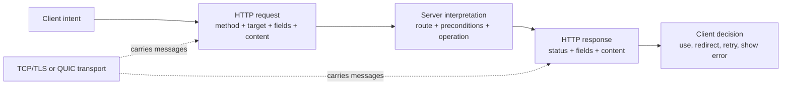

# HTTP messages и semantics: что передают client и server

> [!info] Практический сценарий
> Frontend вызывает `fetch("/orders/42")`. Server отвечает `404 Not Found` с JSON-описанием ошибки. `catch` не выполняется, поэтому разработчик записывает в лог «request успешен», а затем получает ошибку при обработке данных. Чтобы исправить диагноз, нужно разделить три факта: дошёл ли обмен до HTTP, какой outcome сообщил status code и подходит ли representation клиенту.

[[../../MOC|К карте архитектуры]] · [[../02-dns-tcp-tls/02-dns-tcp-tls|Предыдущая глава]] · [[exercises|К упражнениям]]

## Контракт главы

**Условия:** дан raw HTTP/1.1 exchange, запись Chrome DevTools Network, `curl -i/-v` output или объект Fetch `Response`.

**Наблюдаемый результат:** вы можете разобрать request и response на control data, fields и content, восстановить HTTP semantics независимо от transport outcome, выбрать method/status/representation metadata и объяснить последующее действие client.

После главы вы должны уметь:

1. прочитать raw HTTP/1.1 request и самостоятельно составить корректный response;
2. отличить method, request target, protocol version, fields и content;
3. объяснить различие `Content-Type` и `Accept`;
4. выбирать status code по наблюдаемому outcome, а не по удобству frontend;
5. различать safe и idempotent methods;
6. предсказывать поведение redirect и conditional request;
7. объяснять, почему `fetch()` выполняет Promise при `404` и `500`.

### Предварительные знания

Нужны end-to-end карта из [[../01-client-server-request-lifecycle/01-client-server-request-lifecycle|главы 1]] и границы DNS/TCP/TLS из [[../02-dns-tcp-tls/02-dns-tcp-tls|главы 2]]. Предполагается, что secure channel уже установлен. Достаточно уметь запускать Node.js, `curl` и читать строки terminal output.

### Что намеренно не входит в главу

Мы не разбираем cookie sessions, same-origin policy, CORS и CSRF — это глава 4. Freshness, shared cache, `Vary` и cache invalidation относятся к главе 5. Retry policy и idempotency key относятся к главе 6. HTTP/2 frames, HPACK, HTTP/3, QUIC и wire-level framing упомянуты только для отделения transport от общих HTTP semantics.

## Центральный механизм: message сообщает намерение и outcome

После установления channel стороны обмениваются не вызовами функций, а **HTTP messages**:

- request сообщает target, желаемую operation и условия её выполнения;
- response сообщает outcome обработки request и, возможно, переносит representation;
- fields уточняют semantics и интерпретацию content;
- transport переносит bytes или сообщает, что доставку нельзя подтвердить.



Диаграмма показывает две независимые оси. Transport отвечает, были ли переданы protocol data. HTTP semantics отвечает, что означает полученный message. `404` — завершённый HTTP response, а не transport failure. Разрыв TLS до response — transport failure, при котором HTTP status отсутствует.

## 1. Абстрактная message model и HTTP/1.1 запись

RFC 9110 описывает message как сочетание:

1. **control data** — method и target в request либо status code в response;
2. **header fields** — metadata и modifiers;
3. **content** — необязательные данные сообщения;
4. **trailer fields** — необязательные fields после content.

HTTP/1.1 делает эту модель видимой как текстовый head, пустую строку и optional body. В учебных примерах термины **body** и **content** почти совпадают, но не нужно переносить HTTP/1.1 delimiters на все версии HTTP.

### Request

```http
POST /orders?notify=true HTTP/1.1
Host: api.example.com
Accept: application/json
Content-Type: application/json
Content-Length: 29

{"sku":"BOOK-1","quantity":2}
```

Первая строка — **request-line**:

```text
method SP request-target SP protocol-version
```

- `POST` задаёт standard semantics operation;
- `/orders?notify=true` — request target в origin-form: path и query, но не fragment;
- `HTTP/1.1` задаёт wire protocol version этого message;
- `Host` выбирает authority на HTTP/1.1 server;
- пустая строка завершает header section;
- следующие 29 octets — content.

> [!warning] URL fragment не отправляется server
> В `https://api.example.com/orders#payment` часть `#payment` обрабатывает user agent. Она не входит в HTTP request target. Query `?notify=true`, напротив, входит.

### Response

```http
HTTP/1.1 201 Created
Content-Type: application/json; charset=utf-8
Content-Length: 21
Location: /orders/8472

{"id":8472,"ok":true}
```

Первая строка — **status-line**:

```text
protocol-version SP status-code SP reason-phrase
```

- `201` — machine-readable outcome;
- `Created` — необязательная human-readable reason phrase, не отдельный outcome;
- `Location` указывает URI созданного resource;
- `Content-Type` описывает enclosed representation;
- `Content-Length` измеряет message content в octets, а не JavaScript characters.

HTTP field names case-insensitive, но field values подчиняются собственным grammars. `content-type`, `Content-Type` и `CONTENT-TYPE` обозначают одно field name. Это не означает, что произвольные значения fields тоже case-insensitive.

### Где заканчивается message

TCP предоставляет byte stream без границ messages. HTTP/1.1 framing определяет завершение content через rules protocol: например, известный `Content-Length`, chunked transfer coding, semantics response или закрытие connection в допустимом контексте. Нельзя считать, что один TCP `data` event равен одному request, одному header или одному body.

В HTTP/2 и HTTP/3 start-line не передаётся как строка HTTP/1.1. Control data представлена pseudo-fields вроде `:method`, `:path`, `:status`, а messages разбиты на frames. При этом `GET`, `404`, `Content-Type`, conditional semantics и meaning methods остаются HTTP concepts.

## 2. Method — часть protocol contract

Method сообщает желаемую semantics относительно target resource. Он не является именем server function и не гарантирует, как устроен storage.

| Method | Standard intent | Safe | Idempotent |
|---|---|---:|---:|
| `GET` | получить current representation | да | да |
| `HEAD` | получить fields как для `GET`, но без response content | да | да |
| `OPTIONS` | узнать communication options | да | да |
| `POST` | обработать enclosed content по resource-specific semantics | нет | нет по определению |
| `PUT` | создать или заменить state target resource данным representation | нет | да |
| `DELETE` | удалить связь target URI с current functionality | нет | да |
| `PATCH` | применить partial modification, заданную patch document | нет | не гарантируется |

### Safe не означает «без side effects»

Method safe, если client не просит state-changing effect и не отвечает за него. Server может записать access log, обновить metrics или начислить рекламный показ при `GET`; это incidental side effects. Но endpoint `GET /orders/42?do=delete` нарушает declared semantics: crawler, prefetcher или link checker вправе выполнить `GET`.

Standard safe methods: `GET`, `HEAD`, `OPTIONS`, `TRACE`. Safe semantics позволяют user agent и automated tools выполнять retrieval без ожидания запрошенного вредоносного изменения.

### Idempotent относится к intended effect

Method idempotent, если несколько одинаковых requests имеют тот же **intended effect**, что один request.

```text
PUT /profiles/7 {"name":"Ada"}
PUT /profiles/7 {"name":"Ada"}
```

Ожидаемый final state одинаков. Responses при этом могут различаться: первый request способен вернуть `201`, второй — `200` или `204`; logs получат две записи.

`DELETE` также idempotent по intended effect: после первого вызова target перестал быть связан с resource, повторный не удаляет «ещё раз». Первый response может быть `204`, следующий `404` — равенство responses не требуется.

Safe methods idempotent. Обратное неверно: `PUT` и `DELETE` idempotent, но не safe, потому что client просит изменение state.

> [!note] Method и operation — разные уровни
> Конкретная application может спроектировать idempotent operation поверх `POST`, но сам `POST` standard method не становится idempotent. Как безопасно повторять payment с idempotency key, разбирает глава 6.

## 3. Fields и content: metadata не равна данным

Header field изменяет или описывает processing message. Content переносит representation либо application input. Один JSON-like текст не доказывает media type: recipient узнаёт intended format из representation metadata.

### `Content-Type`: что находится в этом message

```http
Content-Type: application/json; charset=utf-8
```

`Content-Type` описывает media type associated representation — обычно enclosed content текущего request или response. Он отвечает на вопрос: **«Как интерпретировать эти bytes?»**

Примеры:

- request `Content-Type: application/json` — body client закодирован как JSON;
- response `Content-Type: text/html; charset=utf-8` — returned representation является HTML text;
- `415 Unsupported Media Type` — server не поддерживает format request content для этой operation.

### `Accept`: какой response предпочитает client

```http
Accept: application/json, text/plain;q=0.5
```

`Accept` в request задаёт preferences для media types будущего response. Он отвечает на вопрос: **«Какие representation formats я предпочитаю получить?»** Значение `q` задаёт относительный weight; отсутствие подходящего representation может привести к `406 Not Acceptable`, хотя server в некоторых случаях вправе проигнорировать preference и отправить другой response.

Сравните:

```http
POST /reports HTTP/1.1
Content-Type: text/csv
Accept: application/json

sku,quantity
BOOK-1,2
```

Client отправляет CSV и просит JSON response. Никакого противоречия нет: fields описывают разные направления и разные data.

### Representation и resource

Resource — не файл и не JSON object, а target абстракции HTTP. Один resource может иметь несколько representations: JSON, HTML, разные languages или encodings. `Content-Type` описывает выбранную representation, а не «тип URL».

## 4. Status code сообщает outcome response

Status code относится к обработке **одного request**. Первая цифра задаёт class, которую client обязан понимать даже для неизвестного конкретного code.

| Class | Значение |
|---|---|
| `1xx` | interim information до final response |
| `2xx` | request принят и успешно обработан согласно semantics |
| `3xx` | user agent нужен следующий шаг или stored representation |
| `4xx` | request-side condition не позволяет выполнить operation |
| `5xx` | server-side failure при обработке apparently valid request |

Один request может получить zero or more interim `1xx` и ровно один final response не из `1xx` class. Reason phrase необязательна; code несёт protocol meaning.

### Практический набор codes

| Situation | Code | Почему |
|---|---:|---|
| `GET` вернул representation | `200 OK` | operation выполнена, content содержит результат |
| resource создан синхронно | `201 Created` | новый resource уже создан; обычно добавить `Location` |
| job только принят | `202 Accepted` | processing ещё не завершён |
| success без response content | `204 No Content` | final outcome есть, representation не отправляется |
| malformed syntax/input envelope | `400 Bad Request` | server не может обработать форму request |
| authentication credentials отсутствуют/неприемлемы | `401 Unauthorized` | требуется authentication challenge; название исторически сбивает с толку |
| identity известна, доступ запрещён | `403 Forbidden` | server понял request и отказывает |
| target resource не найден | `404 Not Found` | server не нашёл current representation или не раскрывает её наличие |
| method известен, но запрещён target | `405 Method Not Allowed` | вернуть `Allow` с разрешёнными methods |
| conflict с current resource state | `409 Conflict` | client может разрешить state conflict и повторить новый request |
| precondition false | `412 Precondition Failed` | `If-Match`/другая precondition защитила operation |
| request content media type не поддерживается | `415 Unsupported Media Type` | проблема в format отправленного content |
| semantics content понятна, но instructions невыполнимы | `422 Unprocessable Content` | syntax/media type приемлемы, application instructions не выполнены |
| server требует conditional request | `428 Precondition Required` | client должен повторить operation с precondition, например `If-Match` |
| неожиданная server failure | `500 Internal Server Error` | specific 4xx/5xx не описывает failure точнее |
| proxy/gateway получил invalid upstream response | `502 Bad Gateway` | failure на upstream boundary |
| service временно недоступен | `503 Service Unavailable` | overload/maintenance; иногда с `Retry-After` |
| proxy/gateway не дождался upstream response | `504 Gateway Timeout` | timeout произошёл на gateway→upstream hop |

Status выбирают по observable protocol outcome, а не по желанию заставить client Promise reject. Возвращать `200 {"error":"not found"}` означает, что generic HTTP tooling видит success и вынужден угадывать application envelope.

## 5. Redirect — новый response и, возможно, новый request

Redirect response не «переносит текущий request внутри server». User agent получает final response с `Location`, принимает policy decision и обычно создаёт следующий request.

| Code | URI change | Что происходит с method при automatic redirect |
|---:|---|---|
| `301` | permanent | historical behavior допускает `POST → GET`; для preservation нужен `308` |
| `302` | temporary | historical behavior допускает `POST → GET`; для preservation нужен `307` |
| `303` | indirect result | следующий retrieval обычно `GET`/`HEAD` |
| `307` | temporary | method и content сохраняются |
| `308` | permanent | method и content сохраняются |

Пример Post/Redirect/Get:

```http
POST /orders HTTP/1.1
Content-Type: application/json

{"sku":"BOOK-1"}
```

```http
HTTP/1.1 303 See Other
Location: /orders/8472
Content-Length: 0
```

User agent затем может выполнить:

```http
GET /orders/8472 HTTP/1.1
Host: api.example.com
```

Так refresh result page не обязан повторять исходный `POST`. `307` здесь означал бы другое: повторить `POST` на новый target.

> [!warning] Redirect меняет security context
> При переходе на другой origin client должен пересмотреть origin-specific и sensitive fields, включая `Authorization` и `Cookie`. Browser/curl policy определяет automatic follow; наличие `3xx` само по себе не доказывает, что follow произошёл.

`304 Not Modified` находится в `3xx`, но не является обычным URI redirect. Он говорит conditional `GET`/`HEAD`: используйте уже stored representation; response `304` не содержит message content.

## 6. Conditional request: выполнить только при условии

Conditional fields превращают operation в проверяемую precondition относительно selected representation.

### Validation: `If-None-Match`

Первый response:

```http
HTTP/1.1 200 OK
ETag: "order-42-v7"
Content-Type: application/json

{"id":42,"status":"paid"}
```

Следующий request:

```http
GET /orders/42 HTTP/1.1
If-None-Match: "order-42-v7"
```

Если validator всё ещё совпадает, server отвечает:

```http
HTTP/1.1 304 Not Modified
ETag: "order-42-v7"
```

Client объединяет metadata `304` с stored response и использует сохранённую representation. `304` без ранее сохранённого response не даёт body «из воздуха». Freshness и cache update algorithm подробно рассматриваются в главе 5.

### Lost-update protection: `If-Match`

```http
PUT /orders/42 HTTP/1.1
If-Match: "order-42-v7"
Content-Type: application/json

{"id":42,"status":"cancelled"}
```

Server выполняет modification только если current validator совпадает. Если другой actor уже создал version 8, precondition false и response обычно `412 Precondition Failed`. Это не transport failure: server понял условие и отказался применять stale change.

Preconditions проверяются после обычных request checks и непосредственно перед processing content/action. Поэтому authentication failure или redirect, обнаруженный раньше significant processing, может иметь precedence.

## 7. HTTP semantics не равна transport

Рассмотрим четыре outcomes одного `GET /orders/42`:

| Observation | Что доказано | Чего не доказано |
|---|---|---|
| TLS connection закрылась до response | final HTTP response не получен | применял ли server operation |
| `HTTP/1.1 404 Not Found` | HTTP exchange дошёл до final response; target не найден по server semantics | что DNS/TCP/TLS были «безошибочны навсегда» |
| `HTTP/1.1 500 Internal Server Error` | server сообщил failure обработки request | что response body можно игнорировать или retry безопасен |
| `HTTP/1.1 200 OK`, затем truncated content | success status получен, но message incomplete | что representation полностью доступна client |

Transport success не означает business success. HTTP error status не означает network failure. И даже полученный status не всегда доказывает complete content.

### Почему `fetch()` не reject на `404` и `500`

Fetch Promise представляет получение `Response`, а не только `2xx`. Если server прислал корректный HTTP response, Promise выполняется; code проверяет `response.ok` (`200–299`) или `response.status`.

```javascript
const response = await fetch("/orders/42");

if (!response.ok) {
  const problem = await response.text();
  throw new Error(`HTTP ${response.status}: ${problem}`);
}

const order = await response.json();
```

Promise reject нужен для failure самого fetch: malformed URL, network error, browser policy block, abort и подобных условий. Browser может скрыть детали ради security, поэтому reject ещё не локализует DNS/TCP/TLS/CORS stage.

`curl` по умолчанию также не превращает `404` в non-zero exit только из-за status. Для scripting можно использовать `--fail` или `--fail-with-body`, но это client policy поверх полученного HTTP response.

## 8. Наблюдение: raw request, raw response и fulfilled `fetch`

Сохраните script как `raw-http-observation.mjs` и запустите `node raw-http-observation.mjs`. Он использует loopback и не требует Internet.

```javascript
import { once } from "node:events";
import { connect, createServer } from "node:net";

const body = JSON.stringify({ error: "order not found" });
const response = [
  "HTTP/1.1 404 Not Found",
  "Content-Type: application/json; charset=utf-8",
  `Content-Length: ${Buffer.byteLength(body)}`,
  "Connection: close",
  "",
  body,
].join("\r\n");

let requestNumber = 0;
const server = createServer((socket) => {
  let request = "";
  let answered = false;
  socket.setEncoding("utf8");
  socket.on("data", (chunk) => {
    request += chunk;
    if (!answered && request.includes("\r\n\r\n")) {
      answered = true;
      requestNumber += 1;
      console.log(`incoming #${requestNumber}:`, JSON.stringify(request));
      socket.end(response);
    }
  });
});

server.listen(0, "127.0.0.1");
await once(server, "listening");
const { port } = server.address();

const rawResponse = await new Promise((resolve, reject) => {
  const socket = connect({ host: "127.0.0.1", port });
  let data = "";
  socket.setEncoding("utf8");
  socket.on("connect", () => {
    socket.write([
      "GET /orders/42 HTTP/1.1",
      `Host: 127.0.0.1:${port}`,
      "Accept: application/json",
      "Connection: close",
      "",
      "",
    ].join("\r\n"));
  });
  socket.on("data", (chunk) => { data += chunk; });
  socket.on("end", () => resolve(data));
  socket.on("error", reject);
});

console.log("raw response:", JSON.stringify(rawResponse));

const fetched = await fetch(`http://127.0.0.1:${port}/orders/42`, {
  headers: { Accept: "application/json" },
});
console.log("fetch result:", {
  fulfilled: true,
  status: fetched.status,
  ok: fetched.ok,
  contentType: fetched.headers.get("content-type"),
  body: await fetched.json(),
});

const closed = once(server, "close");
server.close();
await closed;
```

Ищите три invariants:

1. manual request содержит request-line, fields и пустую строку;
2. server возвращает полноценный `404` response с JSON representation;
3. `fetch` доходит до `await`, возвращает `status: 404`, `ok: false` и не выполняет implicit throw.

В Chrome DevTools откройте Network → request → Headers/Response. Поля **Request Method**, **Status Code**, **Request Headers**, **Response Headers** и body — разные evidence. Опция «view source» полезна для HTTP/1.1-like representation, но DevTools может показывать нормализованную model, а не буквальные bytes transport.

## 9. Границы ответственности

| Участник | Отвечает | Не гарантирует |
|---|---|---|
| Caller/application code | выбирает operation, target, fields/content; интерпретирует `Response` | доставку, server outcome, browser policy |
| User agent / HTTP client | сериализует/кодирует message, следует client redirect/cache/security policy | корректность business request и server data |
| Proxy/gateway | принимает один HTTP hop, может forward/transform/cache по contract | что downstream и upstream — один process или один protocol version |
| Origin/application server | интерпретирует target/method/fields, применяет operation, формирует response | что client использует representation правильно |
| HTTP semantics | определяет meaning methods, fields, statuses и conditional behavior | reliable delivery, encryption, authentication пользователя |
| Transport/security channel | переносит protocol data и даёт transport/TLS properties | meaning `404`, JSON schema или business success |

На каждом proxy hop wire version может различаться: browser общается с edge по HTTP/3, edge — с upstream по HTTP/2 или HTTP/1.1. End-to-end semantics сохраняется настолько, насколько intermediaries соблюдают HTTP rules, но literal framing не обязано совпадать.

## 10. Пять распространённых заблуждений

### Заблуждение 1: «`404` означает, что network request упал»

Нет. Полученный `404` — evidence completed HTTP response. Network/TLS failure обычно не имеет HTTP status code.

### Заблуждение 2: «`fetch` reject означает HTTP error, resolve означает success»

Нет. Resolve означает, что доступен `Response`, включая `404` и `500`. Business/HTTP success проверяется отдельно через `ok`, `status` и application contract.

### Заблуждение 3: «Idempotent request всегда возвращает одинаковый response»

Нет. Одинаковым должен быть intended effect нескольких identical requests. Status, timestamps, logs и representation могут различаться.

### Заблуждение 4: «`Content-Type` говорит server, какой response хочет client»

Нет. `Content-Type` описывает associated representation текущего message. Preference response format обычно выражает `Accept`.

### Заблуждение 5: «HTTP/2 и HTTP/3 имеют другие methods и status semantics»

Нет. Они по-другому кодируют и переносят HTTP messages. `GET`, `PUT`, `404`, fields и conditional semantics остаются общими; меняются framing, multiplexing и transport properties.

## 11. Вопросы для собеседования

1. Разберите `POST /orders HTTP/1.1`: где method, target, version, fields и content? Как определяется граница content?
2. Чем `Content-Type` отличается от `Accept`? Приведите request, где значения намеренно различаются.
3. Почему `GET` safe, хотя server пишет access log?
4. Почему `DELETE` idempotent, если первый response `204`, а второй `404`?
5. Как выбрать между `200`, `201`, `202` и `204`?
6. Чем `400`, `409`, `412`, `415` и `422` сообщают разные исправимые условия?
7. Что произойдёт с `POST` при `303`, `307` и `308` redirect?
8. Почему `304` нельзя использовать как обычный response без stored representation?
9. Что должен сделать frontend после fulfilled `fetch`, прежде чем вызывать `response.json()`?
10. Как отличить HTTP `504` от client-side timeout, при котором response не получен?
11. Какие semantics останутся теми же, если browser→edge использует HTTP/3, а edge→application server — HTTP/1.1?
12. Что доказывает `HTTP/1.1 500`, и чего он не доказывает о повторном выполнении operation?

> [!tip] Критерий сильного ответа
> Называйте observable field/status/event, protocol boundary и следующий client action. Не подменяйте safe словом «без side effects», idempotent — «одинаковый response», а HTTP error — transport failure.

## Свидетельства результата

### 1. Прочитать и составить messages

Без подсказок подпишите части незнакомого raw request и составьте response с подходящими status, representation metadata и framing. Получатель должен однозначно определить outcome и границу content.

### 2. Обосновать semantics

Для предложенной operation выберите method и объясните safe/idempotent properties через intended effect. Для пяти outcomes выберите distinct status codes, указав, какое client decision каждый code позволяет принять.

### 3. Наблюдать client behavior

Через Node.js, `curl` или DevTools покажите отдельно transport evidence, final HTTP status, response fields и content. Для `404` продемонстрируйте, что Fetch Promise fulfilled, а `response.ok === false`. Практика находится в [[exercises|sibling exercises.md]].

## Related Topics

- [[../01-client-server-request-lifecycle/01-client-server-request-lifecycle|Путь HTTPS-запроса от URL до ответа]] — end-to-end роли и last confirmed boundary.
- [[../04-browser-state-and-security/04-browser-state-and-security|Browser state и security]] — cookies, sessions, same-origin policy, CORS и CSRF поверх HTTP semantics.
- `05-http-caching.md` — freshness, validation, shared caches, `Vary` и invalidation.
- `06-reliable-client-server-interaction.md` — partial failure, retry и operation idempotency.
- `07-rest-and-http-api-design.md` — resource modeling и API design поверх HTTP semantics.

## Sources

- [MDN: HTTP messages](https://developer.mozilla.org/en-US/docs/Web/HTTP/Guides/Messages) — HTTP/1.1 message anatomy, request/status lines, fields/content и HTTP/2 pseudo-fields.
- [MDN: Overview of HTTP](https://developer.mozilla.org/en-US/docs/Web/HTTP/Guides/Overview) — client/server/proxy model, application-layer boundaries и HTTP flow.
- [RFC 9110: HTTP Semantics](https://www.rfc-editor.org/rfc/rfc9110.html) — normative semantics methods, fields, status codes, redirects, content negotiation и conditional requests.
- [RFC 6585: Additional HTTP Status Codes](https://www.rfc-editor.org/rfc/rfc6585.html) — `428 Precondition Required` для защиты от lost update.
- [MDN: `Window.fetch()`](https://developer.mozilla.org/en-US/docs/Web/API/Window/fetch) — Promise fulfillment/rejection contract, `Response.ok` и `Response.status`.
- [Fetch Standard](https://fetch.spec.whatwg.org/) — browser fetch algorithm, response model, network errors и redirect processing.
