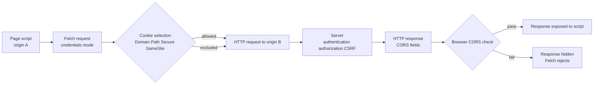

# Browser state и security: cookies, sessions, CORS и CSRF

> [!info] Практический сценарий
> `curl https://api.example.test/profile` возвращает JSON, а `fetch()` с `https://app.example.test` заканчивается `TypeError: Failed to fetch`. После добавления CORS headers script читает response, но session cookie всё равно не отправляется. Когда разработчик разрешает credentials, cross-site form внезапно может изменить email пользователя. Это не одна «ошибка CORS»: здесь пересекаются HTTP state, cookie selection, same-origin read policy и CSRF protection.

[[../../MOC|К карте архитектуры]] · [[../03-http-messages-and-semantics/03-http-messages-and-semantics|Предыдущая глава]] · [[exercises|К упражнениям]]

## Контракт главы

**Условия:** даны page origin, request URL, Fetch options, cookie attributes, CORS request/response fields и server log.

**Наблюдаемый результат:** вы можете независимо ответить на четыре вопроса: был ли request отправлен; выбрал ли browser cookie; разрешил ли server operation; позволил ли browser script прочитать response. Затем вы находите misconfigured boundary и выбираете server-side CSRF defense.

После главы вы должны уметь диагностировать:

1. request работает через `curl`/Postman, но не через browser script;
2. cookie сохранена, но не отправляется или недоступна JavaScript;
3. preflight завершается ошибкой и actual request не уходит;
4. actual request выполнен, но frontend не может прочитать cross-origin response;
5. credentialed CORS использует wildcard или не согласовал credentials;
6. cookie-authenticated API допускает CSRF;
7. bearer token и cookie session сравниваются по реальному transport/storage contract, а не по названию формата.

### Предварительные знания

Нужны origin из [[../01-client-server-request-lifecycle/01-client-server-request-lifecycle|главы 1]], secure channel из [[../02-dns-tcp-tls/02-dns-tcp-tls|главы 2]] и HTTP methods/fields/statuses из [[../03-http-messages-and-semantics/03-http-messages-and-semantics|главы 3]]. Предполагается, что вы различаете HTTP response и Fetch rejection.

### Что намеренно не входит в главу

Мы не строим OAuth/OIDC flow, не разбираем JWT cryptography, CSP, XSS prevention, third-party cookie replacement APIs и browser storage partitioning. Cache behavior `Vary: Origin` обозначен как correctness requirement, а полноценная cache model начинается в главе 5. Retry и idempotency key относятся к главе 6.

## Центральный механизм: browser принимает несколько независимых решений

Browser — не прозрачный HTTP client. Он одновременно хранит state и применяет security policy к page context.



Четыре boundaries нельзя склеивать:

1. **request construction** — method, fields, body, credentials mode;
2. **cookie selection** — browser решает, какие cookies подходят URL и context;
3. **server decision** — authentication, authorization, CSRF и business rules;
4. **response exposure** — browser решает, доступен ли response вызывающему script.

CORS failure может произойти после того, как server уже выполнил operation. Отсутствие cookie может быть вызвано cookie attributes, Fetch credentials mode или browser third-party policy. Status `403` может быть authorization/CSRF response, а browser иногда не раскрывает этот status script из-за CORS.

## 1. Stateless HTTP и stateful application

HTTP не связывает два requests автоматически. Каждый message должен нести достаточно context, чтобы recipient мог его обработать. Connection reuse не создаёт user session: два requests на одном TCP connection могут относиться к разным application concerns, а session может пережить множество connections.

State появляется в components вокруг HTTP:

- browser хранит cookie или другой credential material;
- request переносит identifier/credential;
- server сопоставляет identifier с server-side session record;
- response меняет или завершает session через `Set-Cookie` и server state.

### Cookie session

Типичный login flow:

```http
POST /login HTTP/1.1
Content-Type: application/json

{"email":"ada@example.test","password":"correct horse"}
```

```http
HTTP/1.1 204 No Content
Set-Cookie: __Host-session=Q7f...; Path=/; Secure; HttpOnly; SameSite=Lax
```

Browser сохраняет cookie, если response/context и attributes допустимы. Позднее подходящий request может содержать:

```http
GET /profile HTTP/1.1
Cookie: __Host-session=Q7f...
```

Server извлекает opaque session ID, находит record вроде `{ userId, expiresAt, csrfSecret }` и отдельно выполняет authentication/authorization checks.

Cookie не обязана содержать session: в ней может быть preference или signed data. Session не обязана использовать cookie: identifier можно переносить иначе. Но сочетание opaque cookie + server-side session позволяет server немедленно revoke record и не раскрывать application state client.

> [!warning] Cookie — input, а не доверенный fact
> User контролирует browser storage и может подделать обычное cookie value. Server обязан проверять подпись либо искать unguessable identifier в trusted session store. Наличие `Cookie` не доказывает identity.

## 2. `Set-Cookie` и `Cookie` идут в разных направлениях

`Set-Cookie` — response field с инструкцией user agent сохранить/update/delete cookie. `Cookie` — request field с выбранными name/value pairs.

```http
Set-Cookie: session=abc; Path=/; Secure; HttpOnly; SameSite=Lax
```

```http
Cookie: session=abc; theme=dark
```

Frontend JavaScript не должен вручную копировать `Set-Cookie` в `Cookie`. Browser запрещает script управлять этими fields через Fetch как обычными headers. Он применяет cookie storage и selection rules сам.

### Cookie identity и deletion

Cookie различается не только name. Domain/host scope и Path участвуют в selection. Для удаления server обычно повторно отправляет cookie с тем же name/domain/path и `Max-Age=0` либо past `Expires`:

```http
Set-Cookie: session=; Path=/; Max-Age=0; Secure; HttpOnly; SameSite=Lax
```

Cookie без `Expires`/`Max-Age` называется session cookie, но browser session restore способен продлить её жизнь. Server-side expiration остаётся обязательным security control.

## 3. Attributes: какое свойство защищает каждая

### `Secure`

`Secure` ограничивает отправку cookie secure transport (`https:`; browser делает специальное исключение для localhost). Это снижает риск утечки через plaintext HTTP, но не шифрует value в browser storage и не запрещает JavaScript читать cookie.

### `HttpOnly`

`HttpOnly` запрещает доступ через `document.cookie` и Cookie Store API. Browser всё равно может отправить cookie в `fetch()`/navigation. Это уменьшает возможность кражи session ID через XSS, но не делает XSS безвредным: injected script способен инициировать authenticated actions из trusted origin.

### `SameSite`

`SameSite` управляет отправкой cookie в cross-site context:

- `Strict` — cookie только в same-site requests;
- `Lax` — same-site плюс ограниченные top-level cross-site navigations с safe method;
- `None` — допускает cross-site contexts и требует `Secure`.

Современные browsers обычно применяют Lax-like default, если attribute отсутствует, но точные compatibility/temporary rules нельзя использовать как единственную defense.

`SameSite` — defense in depth против CSRF и tracking, не authorization. Same-site attacker на compromised sibling subdomain может оставаться в site boundary. Legitimate embedded flows могут требовать `None`, но third-party cookie policy всё равно способна blocked storage/send.

### `Domain` и host-only cookie

Без `Domain` cookie host-only: отправляется только host, который её установил. `Domain=example.test` расширяет scope на subdomains. Более широкий scope увеличивает attack surface.

Prefix `__Host-` требует `Secure`, `Path=/` и отсутствие `Domain`. Supporting browser reject несовместимую cookie; это приближает cookie scope к host boundary.

### `Path`

`Path=/account` ограничивает URLs, куда browser прикрепляет cookie. Это routing scope, а не confidentiality boundary: другой path того же origin нельзя считать изолированным security principal.

### Практическая baseline

Для first-party session cookie через HTTPS:

```http
Set-Cookie: __Host-session=<opaque>; Path=/; Secure; HttpOnly; SameSite=Lax
```

`SameSite=Strict` подходит, если product flow переживает отсутствие session при переходе по external link. `SameSite=None; Secure` нужен только для осознанного cross-site flow и требует дополнительных CSRF/privacy решений.

## 4. Origin и site — разные boundaries

**Origin** — tuple `scheme + host + port`. Path не участвует.

| URL A | URL B | Same origin? | Причина |
|---|---|---:|---|
| `https://app.example.test/a` | `https://app.example.test/b` | да | различается только path |
| `https://app.example.test` | `https://api.example.test` | нет | другой host |
| `https://app.example.test` | `https://app.example.test:8443` | нет | другой port |
| `http://app.example.test` | `https://app.example.test` | нет | другая scheme |

**Site** в cookie context — schemeful registrable domain. `https://app.example.test` и `https://api.example.test` обычно same-site, но cross-origin. Port для site comparison несущественен; scheme важна для schemeful same-site.

Следствие: request может одновременно быть:

- cross-origin → Fetch response требует CORS permission;
- same-site → `SameSite=Lax/Strict` cookie может быть eligible;

И наоборот, два origins с одинаковым host, но разной scheme — cross-origin и cross-site в schemeful model.

> [!note] `localhost` и IP в лаборатории
> Registrable-domain examples не переносятся буквально на `127.0.0.1`. Для local lab разные ports дают разные origins, но browser cookie/site special cases и third-party policies могут отличаться. Диагностируйте observed behavior, не выводите production cookie policy только из loopback.

## 5. Same-origin policy: запрет чтения, а не firewall

Same-origin policy (SOP) ограничивает взаимодействие document/script одного origin с resource другого origin. Главная защита: malicious page не должна прочитать mailbox/bank/intranet response, доступный browser пользователя.

Но SOP не запрещает весь cross-origin traffic:

- top-level links и redirects обычно разрешены;
- HTML forms могут отправлять cross-origin writes;
- images, scripts, styles и iframes в определённых условиях могут embedded;
- cross-origin reads через `fetch()`/XHR по умолчанию скрыты от script.

Поэтому server нельзя защищать предположением «attacker не может отправить request». Он часто может отправить form-like request, но не прочитать response. Именно этот разрыв создаёт CSRF risk.

`curl` и Postman не выполняют page-origin SOP/CORS policy, потому что у них нет untrusted web page, origin которой нужно изолировать. Успех `curl` доказывает HTTP reachability/semantics, но не browser readability.

## 6. CORS: server даёт origin разрешение читать response

CORS — HTTP-field protocol между browser и server. Он ослабляет SOP для selected cross-origin reads.

Page `https://app.example.test` отправляет:

```http
GET /profile HTTP/1.1
Host: api.example.test
Origin: https://app.example.test
```

API разрешает этому origin читать response:

```http
HTTP/1.1 200 OK
Access-Control-Allow-Origin: https://app.example.test
Vary: Origin
Content-Type: application/json

{"name":"Ada"}
```

`Access-Control-Allow-Origin` (ACAO) — response field. Request `Origin` не является proof of authorization; non-browser client может поставить произвольное value. Server использует authenticated identity и authorization независимо от CORS allowlist.

Если server динамически отражает allowlisted `Origin`, `Vary: Origin` сообщает caches, что response varies by request origin. Нельзя без validation отражать любой origin, особенно вместе с credentials.

### CORS не делает request same-origin

После successful CORS page origins остаются разными. Browser лишь exposes разрешённый response конкретному requesting context. Cookies/storage/DOM не сливаются, и server authorization не появляется автоматически.

## 7. «Simple» request и preflight

MDN использует термин **simple request** для cross-origin request, который не запускает CORS preflight. Fetch Standard описывает это через CORS-safelisted methods/fields/content types.

Упрощённый checklist:

- method `GET`, `HEAD` или `POST`;
- только CORS-safelisted manually set fields;
- если есть `Content-Type`, то safelisted media type: `application/x-www-form-urlencoded`, `multipart/form-data` или `text/plain` с дополнительными value restrictions;
- нет upload listener/stream conditions, выводящих request из safelist.

Simple не означает safe по HTTP и не означает «разрешён server». Cross-origin `POST` form может изменить state и уйти **без preflight**.

### Preflight exchange

JSON `PUT` с custom field запускает `OPTIONS` до actual request:

```http
OPTIONS /profile HTTP/1.1
Origin: https://app.example.test
Access-Control-Request-Method: PUT
Access-Control-Request-Headers: content-type, x-csrf-token
```

Server разрешает конкретный contract:

```http
HTTP/1.1 204 No Content
Access-Control-Allow-Origin: https://app.example.test
Access-Control-Allow-Methods: PUT
Access-Control-Allow-Headers: Content-Type, X-CSRF-Token
Access-Control-Max-Age: 600
Vary: Origin
```

Только после successful preflight browser отправляет actual `PUT`. Actual response тоже должен пройти CORS check; permission на preflight не заменяет ACAO actual response.

Preflight cache отдельна от обычного HTTP response cache. `Access-Control-Max-Age` уменьшает число `OPTIONS`, но browsers применяют internal caps.

### Диагностический порядок

В DevTools Network:

1. Есть ли `OPTIONS`?
2. Каковы `Origin`, `Access-Control-Request-Method/Headers`?
3. Что вернул preflight: status, ACAO, allowed methods/headers?
4. Появился ли actual request?
5. Есть ли CORS fields на actual response?

Если actual request отсутствует, failure находится на preflight boundary. Если actual request виден в server log, operation могла выполниться даже при последующем CORS rejection.

## 8. Credentials: три согласованных policy

Для cross-origin `fetch`, cookies обычно не включаются без явного credentials mode:

```javascript
fetch("https://api.example.test/profile", {
  credentials: "include",
});
```

Чтобы script получил credentialed response, нужно согласовать:

1. client: `credentials: "include"`;
2. cookie: Domain/Path/Secure/SameSite и browser privacy policy допускают send;
3. server response:

```http
Access-Control-Allow-Origin: https://app.example.test
Access-Control-Allow-Credentials: true
Vary: Origin
```

При credentials ACAO не может быть `*`; нужен explicit origin. `Access-Control-Allow-Credentials` принимает literal `true`, а не `false`.

Preflight request по Fetch contract не содержит credentials. Его response должен заранее разрешить credentialed actual request. Реальные enterprise TLS client-certificate implementations имеют documented deviations, но application cookie не должна ожидаться на `OPTIONS`.

Даже корректные CORS fields не отменяют third-party cookie blocking/partitioning. CORS может разрешить read, а browser privacy policy — не сохранить или не отправить cross-site cookie.

## 9. CSRF: state-changing request от чужого site

CSRF возникает, когда attacker заставляет browser authenticated пользователя выполнить нежелательную operation на trusted site. Attack часто использует **ambient credential** — cookie, которую browser прикрепляет автоматически.

Attacker page может содержать:

```html
<form action="https://bank.example/transfer" method="post">
  <input name="to" value="attacker" />
  <input name="amount" value="1000" />
</form>
<script>document.forms[0].submit()</script>
```

SOP/CORS могут запретить attacker script прочитать response. Деньги всё равно могут быть переведены, если server принимает cookie-authenticated simple form request без anti-CSRF check.

### Почему CORS не является CSRF protection

CORS отвечает: **может ли origin A читать response origin B через browser API?**

CSRF defense отвечает: **почему server должен считать этот state-changing request намеренным действием authenticated user?**

Preflight усложняет некоторые forged requests, но form-compatible simple requests не требуют preflight. Endpoint, принимающий `text/plain` как JSON или меняющий state через `GET`, расширяет CSRF surface.

### Основные defenses

Выбор зависит от architecture; обычно используется несколько layers:

1. **Framework built-in protection** — предпочтительнее самописного parser/crypto.
2. **Synchronizer CSRF token** — server хранит unpredictable token в session; client отправляет его в hidden field/custom header; server сравнивает до mutation.
3. **Signed double-submit token** — stateless вариант связывает token с session через HMAC; naive unsigned equality уязвима к cookie injection.
4. **Origin/Referer validation** — server проверяет expected source origin как дополнительный signal и продумывает policy при отсутствии headers.
5. **Fetch Metadata** — `Sec-Fetch-Site` позволяет отклонять cross-site unsafe requests с fallback для clients без fields.
6. **SameSite cookie** — defense in depth, уменьшающая cross-site cookie send.
7. **User re-authentication/confirmation** — для критических operations.

CSRF token должен быть secret, unpredictable и связан с session. Его нельзя помещать в URL, где он попадёт в history/logs/Referer. XSS может обходить CSRF controls, поэтому XSS prevention остаётся отдельной обязательной задачей.

Server должен проверять CSRF **до** mutation. Response CORS fields после выполнения operation не откатывают side effect.

## 10. Cookie session и bearer token без ложного противопоставления

`Cookie` и `Bearer` описывают transport conventions, а `session` и `JWT` — state/token designs. Это не одна binary choice.

| Design | Где credential | Как отправляется | Основной browser risk |
|---|---|---|---|
| Opaque session ID в `HttpOnly` cookie | browser cookie jar + server session store | browser автоматически для eligible requests | CSRF; XSS может выполнять actions, но не читать HttpOnly value |
| Bearer token в JavaScript memory | page runtime | code ставит `Authorization` | token theft при XSS/runtime compromise; reload/state management |
| Bearer token в `localStorage` | origin storage | code читает и ставит `Authorization` | persistent token theft при XSS |
| JWT в `HttpOnly` cookie | cookie jar; claims внутри token | browser автоматически | CSRF всё ещё возможен; JWT format не меняет cookie behavior |
| Opaque token в `Authorization` | зависит от storage | explicit header | security зависит от storage/attachment policy, не от opacity |

Bearer header обычно не прикрепляется cross-site HTML form автоматически, поэтому классический cookie CSRF path уже. Но если credential хранится в cookie, назвать его JWT недостаточно; browser всё равно auto-sends cookie. Если attacker получил bearer token через XSS, он может использовать его вне browser session.

Сравнивайте:

- кто хранит credential;
- может ли JavaScript его прочитать;
- прикрепляется ли он автоматически;
- как работает revocation/expiration;
- какие origins/sites получают credential;
- какие XSS/CSRF defenses обязательны.

## 11. Наблюдение: request дошёл, response скрыт

Сохраните script как `browser-cors-observation.mjs`, запустите `node browser-cors-observation.mjs` и откройте printed page URL в browser. Internet не нужен.

```javascript
import { once } from "node:events";
import { createServer } from "node:http";

let pageOrigin;
const events = [];

const api = createServer((request, response) => {
  const url = new URL(request.url, "http://api.local");
  const event = {
    method: request.method,
    path: url.pathname,
    origin: request.headers.origin ?? null,
    requestedMethod: request.headers["access-control-request-method"] ?? null,
    requestedHeaders: request.headers["access-control-request-headers"] ?? null,
  };
  events.push(event);
  console.log(JSON.stringify({ event: "api.request", ...event }));

  const cors = url.pathname !== "/blocked";
  const corsFields = cors ? {
    "Access-Control-Allow-Origin": pageOrigin,
    "Vary": "Origin",
  } : {};

  if (request.method === "OPTIONS") {
    response.writeHead(204, {
      ...corsFields,
      "Access-Control-Allow-Methods": "POST",
      "Access-Control-Allow-Headers": "Content-Type, X-Demo",
    });
    response.end();
    return;
  }

  const body = JSON.stringify({ path: url.pathname, reached: true });
  response.writeHead(200, {
    ...corsFields,
    "Content-Type": "application/json",
    "Content-Length": Buffer.byteLength(body),
  });
  response.end(body);
});

api.listen(0, "127.0.0.1");
await once(api, "listening");
const apiOrigin = `http://127.0.0.1:${api.address().port}`;

const html = `<!doctype html>
<meta charset="utf-8">
<title>CORS boundary observation</title>
<pre id="blocked">pending</pre>
<pre id="allowed">pending</pre>
<pre id="preflight">pending</pre>
<script type="module">
const show = (id, value) => {
  document.querySelector(id).textContent = JSON.stringify(value);
};
try {
  await fetch("${apiOrigin}/blocked");
  show("#blocked", { unexpected: "readable" });
} catch (error) {
  show("#blocked", { rejected: error.name });
}
try {
  const response = await fetch("${apiOrigin}/allowed");
  show("#allowed", { status: response.status, body: await response.json() });
} catch (error) {
  show("#allowed", { rejected: error.name });
}
try {
  const response = await fetch("${apiOrigin}/preflight", {
    method: "POST",
    headers: { "Content-Type": "application/json", "X-Demo": "1" },
    body: JSON.stringify({ change: true }),
  });
  show("#preflight", { status: response.status, body: await response.json() });
} catch (error) {
  show("#preflight", { rejected: error.name });
}
document.body.dataset.done = "true";
</script>`;

const page = createServer((request, response) => {
  if (request.url === "/events") {
    const body = JSON.stringify(events);
    response.writeHead(200, { "Content-Type": "application/json", "Content-Length": Buffer.byteLength(body) });
    response.end(body);
    return;
  }
  response.writeHead(200, { "Content-Type": "text/html; charset=utf-8" });
  response.end(html);
});

page.listen(0, "127.0.0.1");
await once(page, "listening");
pageOrigin = `http://127.0.0.1:${page.address().port}`;
console.log(JSON.stringify({ event: "listening", page: pageOrigin, api: apiOrigin }));

const shutdown = () => {
  page.close();
  api.close();
};
process.on("SIGTERM", shutdown);
process.on("SIGINT", shutdown);
```

Ожидаемые invariants на page:

- `blocked` показывает Fetch rejection, хотя terminal содержит `api.request` для `/blocked`;
- `allowed` читает `200` JSON после ACAO check;
- `preflight` создаёт terminal sequence `OPTIONS /preflight` → `POST /preflight`;
- `OPTIONS` содержит requested method/headers, а actual `POST` — нет.

Проверьте blocked API вне browser:

```bash
curl --include <api-origin>/blocked
```

`curl` видит `200` JSON без ACAO, потому что не применяет SOP. Это не значит, что browser «не отправил request».

## 12. Границы ответственности

| Boundary | Кто решает | Evidence |
|---|---|---|
| Cookie stored | browser cookie jar | DevTools Application/Storage, Set-Cookie warnings |
| Cookie selected/sent | browser по URL/context/credentials/privacy policy | request `Cookie` в Network и server log |
| Session authenticated | application server/session store | server auth decision, user/session correlation |
| Operation authorized | application server | permission rule и status |
| CSRF accepted/rejected | server middleware/handler до mutation | token/origin/fetch-metadata validation log |
| CORS preflight | browser + server CORS response | `OPTIONS`, ACR fields, ACA fields |
| Actual response exposed | browser Fetch/CORS algorithm | console error либо доступный `Response` |
| `curl` access | CLI policy | raw HTTP exchange; не browser SOP evidence |

## 13. Пять распространённых заблуждений

### Заблуждение 1: «CORS блокирует request на server»

Не всегда. Simple request или actual request может дойти и изменить state, после чего browser скроет response. Preflight failure действительно может остановить actual request — смотрите Network/server log.

### Заблуждение 2: «Если Postman работает, API настроен правильно»

Postman доказывает reachability и HTTP contract, но не CORS, credentials mode, SameSite или browser privacy policy.

### Заблуждение 3: «`HttpOnly` cookie не отправляется через `fetch`»

`HttpOnly` запрещает JavaScript прочитать value; browser всё равно отправляет eligible cookie. Send контролируют URL scope, `Secure`, `SameSite`, credentials mode и privacy policy.

### Заблуждение 4: «CORS — authorization или CSRF defense»

CORS регулирует script read access. Authorization проверяет права identity. CSRF defense подтверждает допустимый initiation context для state change. Это разные decisions.

### Заблуждение 5: «JWT автоматически решает CSRF»

Format credential ничего не решает без transport contract. JWT в auto-sent cookie остаётся CSRF-relevant; bearer из JS-readable storage меняет threat в сторону token theft/XSS.

## 14. Вопросы для собеседования

1. Чем stateless HTTP отличается от отсутствия application session?
2. Как связаны `Set-Cookie`, `Cookie`, opaque session ID и server-side store?
3. Что по отдельности защищают `Secure`, `HttpOnly` и `SameSite`?
4. Почему `app.example.com` и `api.example.com` могут быть same-site, но cross-origin?
5. Что SOP обычно разрешает для writes/embeds и запрещает для reads?
6. Почему `curl` читает response, который browser скрывает?
7. Какие conditions делают request CORS-safelisted и почему «simple» не означает safe?
8. Как прочитать preflight `OPTIONS` и доказать, ушёл ли actual request?
9. Почему credentialed CORS несовместим с `Access-Control-Allow-Origin: *`?
10. Почему successful preflight не гарантирует, что script прочитает actual response?
11. Как CSRF выполняет operation, не читая response?
12. Какие defenses нужны cookie-authenticated state-changing endpoint?
13. Чем cookie session и bearer token нужно сравнивать вместо лозунга «JWT безопаснее»?
14. Cookie видна в storage, но отсутствует в request: какие boundaries проверить по порядку?
15. Server log показывает `200`, browser показывает CORS error: какие facts одновременно истинны?

## Свидетельства результата

### 1. Классифицировать context

Для пары page/request URLs вычислите origin tuple и schemeful site. Затем предскажите SOP/CORS и SameSite decisions независимо.

### 2. Восстановить browser pipeline

По DevTools Network и server logs разделите: preflight, actual request, cookie send, server outcome и response exposure. Не выводите одно из другого без evidence.

### 3. Спроектировать protection

Для cookie-authenticated mutation выберите SameSite baseline и server-side CSRF validation. Покажите failure response до side effect и объясните, почему CORS allowlist не заменяет authorization. Практика находится в [[exercises|sibling exercises.md]].

## Related Topics

- [[../03-http-messages-and-semantics/03-http-messages-and-semantics|HTTP messages и semantics]] — fields, methods, statuses и Fetch response contract.
- Следующая глава: `05-http-caching.md` — private/shared caches, freshness, validators и `Vary`.
- `06-reliable-client-server-interaction.md` — ambiguous outcomes, retries и idempotency.
- `07-rest-and-http-api-design.md` — authentication/authorization error representations в API contract.

## Sources

- [MDN: Using HTTP cookies](https://developer.mozilla.org/en-US/docs/Web/HTTP/Guides/Cookies) — cookie lifecycle, scope, `Secure`, `HttpOnly`, `SameSite` и prefixes.
- [MDN: Same-origin policy](https://developer.mozilla.org/en-US/docs/Web/Security/Defenses/Same-origin_policy) — origin tuple, cross-origin writes/embeds/reads и isolation boundary.
- [MDN: CORS](https://developer.mozilla.org/en-US/docs/Web/HTTP/Guides/CORS) — CORS fields, safelisted/preflight requests и credentialed response requirements.
- [MDN: Site](https://developer.mozilla.org/en-US/docs/Glossary/Site) — registrable domain, schemeful site и distinction from origin.
- [Fetch Standard](https://fetch.spec.whatwg.org/) — Fetch/CORS algorithm, credentials mode, preflight и response filtering.
- [OWASP CSRF Prevention Cheat Sheet](https://cheatsheetseries.owasp.org/cheatsheets/Cross-Site_Request_Forgery_Prevention_Cheat_Sheet.html) — synchronizer token, signed double-submit, SameSite, Origin и Fetch Metadata defenses.
