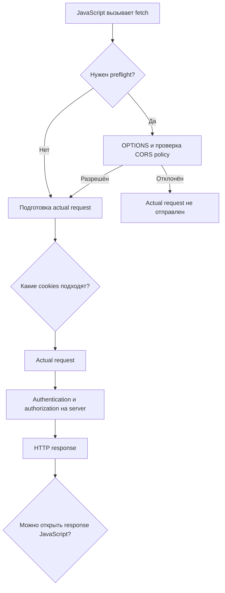

# Состояние браузера и границы безопасности

> [!info] Контекст
> `curl https://api.example.test/profile` возвращает JSON, а `fetch()` со страницы `https://app.example.test` завершается CORS error. После настройки CORS JavaScript получает ответ, но session cookie не отправляется. Затем разработчик включает credentials и обнаруживает, что чужая страница способна инициировать изменение профиля. Это разные решения браузера и сервера, а не одна «ошибка CORS».

[[../../MOC|К карте архитектуры]] · [[../03-http-messages-and-semantics/03-http-messages-and-semantics|К предыдущей главе]] · [[exercises|К упражнениям]]

## Результат главы

По URL страницы и запроса, cookie attributes, параметрам `fetch`, CORS fields и server logs вы сможете независимо определить:

1. сохранит ли браузер cookie и прикрепит ли её к request;
2. требуется ли CORS preflight и будет ли отправлен actual request;
3. откроет ли браузер response вызывающему JavaScript;
4. кого аутентифицировал server и разрешена ли операция;
5. нужна ли защита от CSRF до изменения состояния.

Нужны HTTP methods, fields, statuses и контракт Fetch из [[../03-http-messages-and-semantics/03-http-messages-and-semantics|главы 3]]. OAuth/OIDC, CSP, полная защита от XSS и browser storage partitioning в эту главу не входят.

## Пять независимых решений

Браузер — не прозрачный HTTP-клиент. Один `fetch()` проходит несколько проверок:



Из одного решения нельзя вывести другое:

- успешный preflight не аутентифицирует пользователя;
- отсутствие cookie не означает ошибку CORS;
- отправленный запрос не гарантирует доступ JavaScript к ответу;
- доступный ответ не доказывает authorization;
- запрет чтения ответа не гарантирует, что сервер не изменил состояние.

## HTTP без состояния и сессия приложения

HTTP сам по себе не связывает два запроса с одним пользователем. Приложение добавляет эту связь через credentials и серверное состояние.

Типичная cookie session работает так:

1. клиент отправляет данные для входа;
2. сервер проверяет их и создаёт сессию;
3. ответ содержит непрозрачный идентификатор сессии в `Set-Cookie`;
4. браузер сохраняет cookie и прикрепляет её к подходящим последующим запросам;
5. сервер находит сессию, определяет пользователя и отдельно проверяет права.
```http
HTTP/1.1 204 No Content
Set-Cookie: __Host-session=7f9c...; Path=/; Secure; HttpOnly; SameSite=Lax
```

```http
GET /profile HTTP/1.1
Host: app.example.test
Cookie: __Host-session=7f9c...
```

`Set-Cookie` идёт от сервера к user agent и задаёт правила хранения. `Cookie` идёт в запросе и содержит выбранные браузером пары name/value.

Cookie — недоверенный ввод. Пользователь контролирует свой браузер и может изменить обычное значение. Сервер обязан проверить подпись защищённого значения или найти непредсказуемый идентификатор в доверенном хранилище сессий.

## Как cookie получает область действия

Cookie определяется не только именем. Область host/domain и path участвуют в её идентичности и выборе.

### `Secure`

Cookie отправляется только по защищённому transport, обычно HTTPS. Исключение для localhost существует для разработки. `Secure` не шифрует значение в хранилище браузера и не запрещает JavaScript читать его.

### `HttpOnly`

JavaScript не может прочитать cookie через `document.cookie` или Cookie Store API. Браузер всё равно способен отправить её в HTTP-запросе. Это снижает риск кражи session ID при XSS, но внедрённый скрипт по-прежнему может инициировать действия от доверенного origin.

### `SameSite`

Attribute ограничивает отправку cookie в cross-site context:

- `Strict` — cookie не отправляется с cross-site requests;
- `Lax` — допускает часть переходов верхнего уровня с safe methods;
- `None` — разрешает cross-site use и требует `Secure`.

Если attribute отсутствует, современные браузеры обычно применяют поведение `Lax` по умолчанию. Точные ограничения и исключения зависят от user agent, поэтому чувствительная к безопасности точка API не должна полагаться только на неявный default.

### `Domain` и host-only cookie

Без `Domain` cookie привязана к host, который её установил. `Domain=example.test` расширяет область на subdomains. Более широкая область увеличивает поверхность атаки: скомпрометированный sibling subdomain может влиять на cookies общего domain.

Prefix `__Host-` требует `Secure`, `Path=/` и отсутствие `Domain`. Поддерживающий его браузер отклонит cookie с несовместимыми attributes.

### `Path`

`Path=/account` ограничивает URL paths, к которым браузер прикрепляет cookie. Это область маршрутизации, а не security boundary: код на другом path того же origin нельзя считать изолированным principal.

### Срок жизни и удаление

`Max-Age` задаёт срок в секундах, `Expires` — дату. При наличии обоих `Max-Age` имеет приоритет. Cookie без этих attributes считается session cookie, но восстановление сессии браузером способно продлить её жизнь.

Для удаления сервер повторно устанавливает cookie с теми же именем, path и domain scope и использует `Max-Age=0` или прошедший `Expires`.

### Практическая отправная точка

Для first-party session через HTTPS:

```http
Set-Cookie: __Host-session=<opaque-id>; Path=/; Secure; HttpOnly; SameSite=Lax
```

Это не готовая security policy. Срок жизни, rotation, logout, CSRF protection и реакция на compromised session зависят от приложения.

## `Origin` и `site` отвечают на разные вопросы

**Origin** — tuple `scheme + host + port`.

| URL | Origin относительно `https://app.example.com` |
|---|---|
| `https://app.example.com/profile` | Same-origin |
| `https://app.example.com:8443/profile` | Cross-origin: другой port |
| `http://app.example.com/profile` | Cross-origin: другая scheme |
| `https://api.example.com/profile` | Cross-origin: другой host |

Path в origin не входит.

**Site** использует scheme и registrable domain. `https://app.example.com` и `https://api.example.com` обычно same-site, но cross-origin.

Различие принципиально:

- same-origin policy и CORS сравнивают origins;
- `SameSite` cookie policy сравнивает sites;
- два sibling subdomains могут быть same-site, хотя JavaScript одного не получает свободный доступ к ответу другого.

## Same-origin policy ограничивает взаимодействие, но не служит firewall

Same-origin policy защищает данные одного origin от произвольного чтения скриптом другого origin. Она не запрещает любой cross-origin traffic.

Чужая страница способна инициировать некоторые cross-origin requests через ссылки, формы, изображения и другие механизмы. Браузер может отправить запрос, а затем не открыть ответ вызывающему скрипту.

Отсюда два следствия:

1. CORS error в JavaScript не доказывает, что запрос не дошёл до сервера.
2. Endpoint, меняющий состояние, обязан защищаться от нежелательного cross-site initiation независимо от возможности прочитать ответ.

## CORS разрешает JavaScript читать cross-origin response

CORS — протокол на основе HTTP-полей. Сервер сообщает браузеру, каким origins разрешено получить ответ через browser API.

Для публичного ответа без credentials:

```http
Access-Control-Allow-Origin: *
```

Для конкретного origin:

```http
Access-Control-Allow-Origin: https://app.example.test
Vary: Origin
```

`Vary: Origin` нужен, когда сервер динамически отражает разрешённый origin и ответ проходит через кэш: варианты для разных origins нельзя смешивать.

CORS не делает origins одинаковыми, не создаёт authentication и не заменяет authorization. Он регулирует доступ frontend JavaScript к ответу.

## Когда требуется preflight

Для некоторых cross-origin requests браузер сначала отправляет `OPTIONS`. Fetch Standard определяет условия через CORS-safelisted methods, fields и content types.

Например, JSON `PUT` с custom field требует preflight:

```http
OPTIONS /profile HTTP/1.1
Origin: https://app.example.test
Access-Control-Request-Method: PUT
Access-Control-Request-Headers: content-type,x-csrf-token
```

Сервер разрешает параметры фактического запроса:

```http
HTTP/1.1 204 No Content
Access-Control-Allow-Origin: https://app.example.test
Access-Control-Allow-Methods: PUT
Access-Control-Allow-Headers: Content-Type, X-CSRF-Token
Vary: Origin
```

Только после успешной проверки браузер отправляет `PUT`.

Запрос без preflight часто называют simple request. Типичный cross-origin `POST` формы с `application/x-www-form-urlencoded`, `multipart/form-data` или `text/plain` может быть отправлен сразу. Именно поэтому отсутствие preflight не является защитой от CSRF.

### Как диагностировать preflight

В DevTools и server logs разделяйте два обмена:

1. дошёл ли `OPTIONS`;
2. что ответил сервер;
3. совпали ли разрешённые origin, method и fields;
4. появился ли фактический запрос после `OPTIONS`;
5. содержит ли фактический ответ собственные CORS fields.

Разрешение preflight не гарантирует, что фактический запрос пройдёт authentication или вернёт `2xx`.

## Credentials требуют согласования нескольких политик

У `fetch()` параметр `credentials` управляет участием credentials и обработкой `Set-Cookie`:

- `same-origin` — default; credentials используются только для same-origin requests;
- `include` — запрос может включить credentials и при cross-origin обращении;
- `omit` — credentials не участвуют.

`credentials: \"include\"` лишь разрешает браузеру рассмотреть cookie. Cookie всё равно должна пройти проверки host/domain, path, `Secure`, `SameSite` и privacy policy браузера.

Для credentialed CORS response сервер должен вернуть точный origin и разрешение credentials:

```http
Access-Control-Allow-Origin: https://app.example.test
Access-Control-Allow-Credentials: true
Vary: Origin
```

`Access-Control-Allow-Origin: *` несовместим с открытием credentialed response JavaScript. Блокировка third-party cookies также может остановить отправку или сохранение cookie независимо от корректных CORS fields.

Preflight request по спецификации отправляется без cookies. Он проверяет разрешение параметров будущего запроса, а не пользовательскую сессию.

## Authentication и authorization остаются на сервере

Если запрос содержит session cookie, сервер выполняет минимум два отдельных решения:

1. **Authentication:** соответствует ли credential действующей identity?
2. **Authorization:** имеет ли эта identity право выполнить method над target resource?

CORS allowlist не отвечает ни на один из этих вопросов. `Origin: https://trusted.example` описывает контекст запроса, а не пользователя.

Обычный порядок для изменяющего состояние endpoint:

```text
разобрать запрос
→ проверить сессию
→ проверить authorization
→ проверить CSRF context/token
→ проверить ввод
→ выполнить side effect
→ сформировать ответ
```

Проверка после side effect уже не защищает состояние.

## CSRF: нежелательный запрос с автоматически отправленной credential

CSRF возникает, когда attacker заставляет браузер аутентифицированного пользователя отправить изменяющий состояние запрос к доверенному site. Session cookie является ambient credential: браузер прикрепляет её автоматически, если policy это допускает.

CORS не является полной CSRF-защитой. Он в первую очередь контролирует чтение ответа. Запросы, похожие на отправку HTML form, могут дойти без preflight.

### Защитные механизмы

Обычно применяют несколько слоёв:

- `SameSite=Lax` или `Strict`, если это совместимо с navigation flow;
- непредсказуемый CSRF token, связанный с сессией и проверяемый до side effect;
- проверку `Origin` для изменяющих состояние запросов с явной политикой обработки отсутствующего поля;
- Fetch Metadata (`Sec-Fetch-Site` и связанные поля) как дополнительный сигнал;
- отказ от изменяющего состояние `GET`;
- повторную аутентификацию для особо критичных операций.

SameSite не закрывает все модели угроз. Same-site sibling subdomain не является cross-site, а XSS внутри доверенного origin способна читать доступные tokens и отправлять requests. Поэтому threat model должен называть границу, которую защищает каждый механизм.

## Cookie и bearer token — не взаимоисключающие архитектуры

`Cookie` и `Authorization: Bearer` описывают способ передачи credential. Server-side session и JWT описывают устройство credential/state. Это разные оси.

- JWT внутри автоматически отправляемой cookie остаётся связан с CSRF risk.
- Opaque session ID в `Authorization` header не отправляется браузером автоматически, но хранение credential в JavaScript-readable storage повышает последствия XSS.
- `HttpOnly` cookie затрудняет кражу значения, но не мешает script инициировать authenticated request.

Выбирайте storage и transport после определения XSS, CSRF, revocation и deployment constraints, а не по ярлыку «cookie против JWT».

## Диагностическая матрица

| Наблюдение | Что можно заключить | Что проверить дальше |
|---|---|---|
| Postman работает, browser нет | Endpoint достижим вне browser policy | Origin, preflight, credentials и CORS response fields |
| `OPTIONS` получил ошибку, actual request отсутствует | Preflight не разрешил actual request | Route `OPTIONS` и allowlist method/fields/origin |
| Actual request есть в server log, JavaScript видит CORS error | Request дошёл, response не открыт script | CORS fields actual response и credentials contract |
| Request пришёл без `Cookie` | Browser не прикрепил эту cookie | `credentials`, scope, `Secure`, `SameSite`, privacy policy |
| Cookie пришла, server вернул `401` | Credential передана, но не принята | Session lookup, expiry, signature, rotation |
| Server вернул `403` | HTTP response сформирован после policy decision | Authorization или CSRF reason в server logs |
| Чужая form изменила state, response не читается | SOP/CORS не предотвратили CSRF | SameSite и server-side CSRF validation |

При расследовании всегда сопоставляйте DevTools с server log. Только browser показывает решение об открытии response; только server подтверждает получение request и момент side effect.

## Проверка результата

Для незнакомой пары page URL и request URL без текста главы:

1. вычислите origin и site для обеих сторон;
2. определите, нужен ли preflight;
3. решите, подходит ли cookie по scope, `Secure` и `SameSite`;
4. учтите `credentials` mode и third-party cookie policy;
5. назовите необходимые CORS response fields;
6. отдельно проверьте authentication, authorization и CSRF до side effect.

Перенос: объясните два trace.

- В первом `POST` дошёл до server и изменил state, но JavaScript получил CORS error.
- Во втором успешный preflight не привёл к отправке session cookie.

Ответ должен назвать независимое решение для каждого перехода, а не использовать CORS как универсальное объяснение.

## Related Topics

- [[../01-client-server-request-lifecycle/01-client-server-request-lifecycle|Путь HTTPS-запроса]] — где browser policy находится в полном пути.
- [[../02-dns-tcp-tls/02-dns-tcp-tls|DNS, TCP и TLS]] — какой участок защищает TLS.
- [[../03-http-messages-and-semantics/03-http-messages-and-semantics|HTTP-сообщения и семантика]] — methods, fields, statuses и Fetch response contract.

## Sources

- [MDN: Using HTTP cookies](https://developer.mozilla.org/en-US/docs/Web/HTTP/Guides/Cookies) — cookie lifecycle, scope, `Secure`, `HttpOnly`, `SameSite` и prefixes.
- [MDN: Same-origin policy](https://developer.mozilla.org/en-US/docs/Web/Security/Defenses/Same-origin_policy) — origin tuple и ограничения cross-origin interaction.
- [MDN: CORS](https://developer.mozilla.org/en-US/docs/Web/HTTP/Guides/CORS) — preflight, CORS fields и credentialed responses.
- [MDN: Site](https://developer.mozilla.org/en-US/docs/Glossary/Site) — registrable domain, schemeful site и отличие от origin.
- [Fetch Standard](https://fetch.spec.whatwg.org/) — CORS algorithm, credentials mode, preflight и response filtering.
- [OWASP CSRF Prevention Cheat Sheet](https://cheatsheetseries.owasp.org/cheatsheets/Cross-Site_Request_Forgery_Prevention_Cheat_Sheet.html) — synchronizer token, Origin, Fetch Metadata и SameSite defenses.
