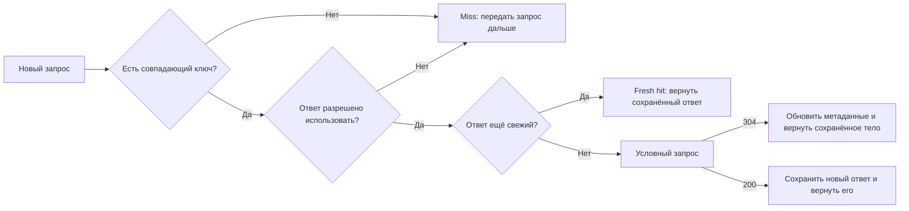

# HTTP caching: кто отвечает на запрос

> [!info] Контекст
> Пользователь обновляет профиль, но продолжает видеть старое имя. В DevTools один ответ помечен как полученный из memory cache, другой содержит `304 Not Modified`, а запрос коллеги вообще не дошёл до приложения: его обслужил CDN. Фраза «сервер вернул старые данные» преждевременна, пока не установлено, какой кэш выбрал ответ и по каким правилам счёл его пригодным.

[[../../MOC|К карте архитектуры]] · [[../04-browser-state-and-security/04-browser-state-and-security|К предыдущей главе]]

## Результат главы

По запросу, сохранённому ответу, его возрасту и HTTP-полям вы сможете:

1. определить, может ли конкретный кэш хранить ответ;
2. построить cache key с учётом `Vary`;
3. предсказать fresh hit, revalidation или miss;
4. назвать участника, который сформировал наблюдаемый ответ;
5. выбрать политику для HTML, персонализированного API и versioned asset.

Нужны методы, статусы, validators и conditional requests из [[../03-http-messages-and-semantics/03-http-messages-and-semantics|главы 3]], а также различие private browser state и shared intermediaries из [[../04-browser-state-and-security/04-browser-state-and-security|главы 4]]. Внутренние алгоритмы CDN и cache eviction в эту главу не входят.

## Кэш повторно использует сохранённый ответ

HTTP-кэш хранит ответы и решает, можно ли использовать сохранённый ответ для нового запроса. Повторное использование способно убрать сетевой обмен целиком или сократить его до проверки актуальности.



Важно различать результат для клиента и работу origin-сервера:

- при **fresh hit** запрос не доходит до origin;
- при **revalidation** origin получает условный запрос и может вернуть `304`;
- при **miss** кэш не находит пригодного ответа и передаёт обычный запрос дальше.

## Где находится кэш

RFC 9111 различает два основных типа.

### Частный кэш

Частный кэш принадлежит одному пользователю. Типичный пример — HTTP-кэш браузера. Он может хранить персонализированный ответ, если политика это разрешает.

`private` не означает «не кэшировать». Директива запрещает хранение в общем кэше, но допускает частный.

### Общий кэш

Общий кэш повторно использует ответы для нескольких пользователей. Примеры:

- CDN;
- кэш в обратном прокси-сервере;
- корпоративный proxy cache.

Ошибка в общей политике может раскрыть персонализированный ответ другому пользователю. Поэтому граница `private`/`shared` влияет не только на производительность, но и на конфиденциальность.

### Управляемый кэш

CDN, reverse proxy и Service Worker могут иметь дополнительные правила, API очистки и собственные ключи. Их поведение не всегда выводится только из стандартных HTTP-полей. Сначала применяйте модель RFC, затем проверяйте документацию и конфигурацию конкретного продукта.

## Решение начинается с ключа кэша

Для обычного `GET` минимальная основа ключа — target URI. На практике кэш также учитывает метод и может добавить значения полей запроса, перечисленных в `Vary`.

Два запроса одного URL не обязательно эквивалентны:

```http
GET /guide HTTP/1.1
Accept-Language: ru
```

```http
GET /guide HTTP/1.1
Accept-Language: en
```

Если сервер выбирает язык по `Accept-Language`, ответ должен сообщить эту зависимость кэшу:

```http
Vary: Accept-Language
```

Тогда у русского и английского вариантов будут разные ключи.

### `Vary` описывает реальную зависимость ответа

Добавляйте в `Vary` только поля запроса, которые действительно меняют представление или политику ответа. Слишком широкое значение создаёт множество вариантов и уменьшает вероятность повторного использования.

Типичные случаи:

```http
Vary: Accept-Encoding
```

```http
Vary: Origin
```

`Vary: Origin` нужен, когда CORS-ответ зависит от конкретного `Origin`. Без него общий кэш способен вернуть CORS-поля, сформированные для другого сайта.

`Vary: Cookie` обычно не является хорошей защитой персонализированного API: число вариантов огромно, а ошибка в ключе опасна. Для ответа конкретному пользователю явно задавайте `Cache-Control: private` или `no-store` в зависимости от допустимости хранения.

> [!warning] Фактический ключ может быть шире HTTP-модели
> Современный браузер способен разделять кэш по top-level site, а CDN — добавить класс устройства, нормализованный query или tenant. Поле `Vary` не раскрывает такие правила продукта. При расследовании проверяйте фактический ключ в документации и телеметрии участника.

## Можно ли сохранить ответ

Наличие `GET` и `200 OK` ещё не гарантирует хранение. Кэш проверяет метод, статус, директивы запроса и ответа, authorization и собственные ограничения.

Наиболее привычный случай — `200 OK` для `GET`, но HTTP допускает хранение некоторых перенаправлений, `404`, `206` и других ответов при выполнении их условий.

Отсутствие `Cache-Control` не означает гарантированный запрет: некоторые ответы могут получить эвристический срок свежести. Для ресурсов приложения лучше задавать политику явно, а не зависеть от эвристики разных реализаций.

## Свежесть: можно ли ответить без origin-сервера

Сохранённый ответ имеет **age** — возраст с момента его формирования. Срок свежести определяет, как долго ответ можно использовать без проверки у origin.

```http
Cache-Control: max-age=300
```

Пока срок не истёк, кэш может вернуть ответ сразу. Затем ответ становится stale, но не обязательно удаляется: валидатор способен снова сделать его пригодным.

Общий кэш может передать текущий возраст:

```http
Age: 120
Cache-Control: public, max-age=300
```

Для получателя остаётся примерно 180 секунд свежести. `Age` не является временем работы backend и не сообщает, сколько ответ пролежит в HTTP-кэше браузера после получения.

### `max-age` и `s-maxage`

`max-age` задаёт срок свежести для частных и общих кэшей:

```http
Cache-Control: max-age=60
```

`s-maxage` переопределяет `max-age` только для общего кэша:

```http
Cache-Control: public, max-age=0, s-maxage=300
```

В этом примере браузер должен проверять актуальность ответа, а общий кэш может пять минут использовать его без origin.

`Expires` задаёт абсолютное время, но при наличии `Cache-Control: max-age` приоритет имеет `max-age`.

## Проверка актуальности сохранённого представления

Stale response можно проверить условным запросом. Для этого сервер заранее передаёт валидатор.

### `ETag` и `If-None-Match`

Первый ответ:

```http
HTTP/1.1 200 OK
ETag: "article-v7"
Cache-Control: public, max-age=60
Content-Type: application/json

{"version":7,"title":"HTTP caching"}
```

После истечения срока свежести кэш отправляет:

```http
GET /article HTTP/1.1
If-None-Match: "article-v7"
```

Если представление не изменилось:

```http
HTTP/1.1 304 Not Modified
ETag: "article-v7"
Cache-Control: public, max-age=60
```

`304` не содержит новое тело представления. Кэш обновляет метаданные сохранённого ответа и возвращает клиенту прежнее тело как актуальное.

Если валидатор изменился, origin возвращает обычный `200` с новым телом и новым `ETag`.

### `Last-Modified` и `If-Modified-Since`

Временной валидатор удобен для файлов:

```http
Last-Modified: Sun, 26 Jul 2026 10:00:00 GMT
```

Повторный запрос содержит `If-Modified-Since`. Механизм ограничен точностью времени и сложнее в распределённой системе. `ETag` позволяет приложению выразить версию непосредственно.

Если запрос содержит и `If-None-Match`, и `If-Modified-Since`, при проверке кэшированного ответа приоритет имеет `If-None-Match`.

## `Cache-Control`: директивы отвечают на разные вопросы

| Директива ответа | Смысл |
|---|---|
| `max-age=N` | После заданного срока свежести ответ становится stale |
| `s-maxage=N` | Срок свежести общего кэша; переопределяет для него `max-age` |
| `no-cache` | Хранить можно, но перед каждым повторным использованием нужна успешная проверка |
| `no-store` | Не сохранять запрос и ответ намеренно и не использовать ответ повторно |
| `private` | Общий кэш не хранит; частный кэш может хранить |
| `public` | Явно разрешает хранение при соблюдении остальных условий |
| `must-revalidate` | Stale response нельзя использовать без успешной проверки |
| `immutable` | Во время срока свежести представление по этому URL не изменится |

Два частых заблуждения:

- `no-cache` не запрещает хранение;
- `private` не означает `no-store`.

Не отправляйте набор противоречивых директив «на всякий случай». Сначала решите, допустимо ли хранение, кто может хранить и когда требуется связь с origin.

## Три базовые политики

### HTML entry point

HTML часто должен быстро узнавать о новом deployment, но может экономить передачу данных через `304`:

```http
Cache-Control: no-cache
ETag: "index-v42"
```

Браузер сохраняет ответ, но проверяет его перед повторным использованием. Если документ не изменился, origin отвечает `304`.

### Персонализированный API

Если хранение в браузере допустимо, но повторное использование общим кэшем запрещено:

```http
Cache-Control: private, no-cache
ETag: "profile-user-42-v8"
```

Для особенно чувствительных данных или ответа, который не должен оставаться в HTTP-кэшах:

```http
Cache-Control: no-store
```

`no-store` не стирает уже сохранённые копии и не заменяет очистку хранилища приложения или управляемого CDN-кэша.

### Asset с content hash

Если изменение содержимого создаёт новый URL:

```text
/assets/app.8f3a91c.js
```

ответ может храниться долго:

```http
Cache-Control: public, max-age=31536000, immutable
```

Инвариант: байты по этому URL не меняются. Новый deployment публикует новое имя файла и обновляет ссылку в HTML. Если перезаписать содержимое по прежнему hash URL, клиенты законно продолжат использовать старую версию.

## Инвалидация не является широковещательной командой

У HTTP нет общего механизма мгновенно удалить один ответ из всех частных и общих кэшей. Стандарт требует инвалидировать target URI после успешного unsafe request, но это затрагивает кэш, который увидел такой обмен, а не все копии в Интернете.

Для управляемого кэша используют API очистки, surrogate keys или versioned URLs. Для HTTP-кэша браузера надёжнее менять URL immutable asset, чем пытаться угадать момент очистки каждого клиента.

Изменение базы данных не уведомляет HTTP-кэш автоматически. Приложение должно связать изменение данных с валидатором, сроком свежести или управляемой инвалидацией.

## Воспроизводимое наблюдение

Сохраните файл как `cache-observation.mjs`:

```javascript
import { createServer } from "node:http";

let version = 1;
const cacheControl = "public, max-age=30";

const page = `<!doctype html>
<button id="load">Load article</button>
<button id="update">Update article</button>
<pre id="output"></pre>
<script>
  load.onclick = async () => {
    const response = await fetch("/article");
    output.textContent = await response.text();
  };

  update.onclick = async () => {
    await fetch("/article", { method: "POST" });
  };
</script>`;

const server = createServer((request, response) => {
  const url = new URL(request.url, "http://localhost");

  if (request.method === "GET" && url.pathname === "/") {
    response.writeHead(200, {
      "content-type": "text/html; charset=utf-8",
      "cache-control": "no-store",
    });
    response.end(page);
    return;
  }

  if (request.method === "GET" && url.pathname === "/article") {
    const etag = `"article-v${version}"`;

    if (request.headers["if-none-match"] === etag) {
      console.log("GET /article -> 304", { etag });
      response.writeHead(304, {
        etag,
        "cache-control": cacheControl,
      });
      response.end();
      return;
    }

    const body = JSON.stringify({ version, title: "HTTP caching" });
    console.log("GET /article -> 200", { etag });
    response.writeHead(200, {
      "content-type": "application/json; charset=utf-8",
      "cache-control": cacheControl,
      etag,
    });
    response.end(body);
    return;
  }

  if (request.method === "POST" && url.pathname === "/article") {
    version += 1;
    console.log("POST /article -> 204", { version });
    response.writeHead(204, { "cache-control": "no-store" });
    response.end();
    return;
  }

  response.writeHead(404, { "cache-control": "no-store" });
  response.end("Not Found");
});

server.listen(3000, "127.0.0.1", () => {
  console.log("http://127.0.0.1:3000");
});
```

Запустите:

```bash
node cache-observation.mjs
```

### Наблюдение через `curl`

Первый запрос возвращает `200`, тело и `ETag`:

```bash
curl --include http://127.0.0.1:3000/article
```

`curl` не реализует HTTP-кэш браузера автоматически. Передайте валидатор явно:

```bash
curl --include \
  --header 'If-None-Match: "article-v1"' \
  http://127.0.0.1:3000/article
```

Сервер вернёт `304` без тела. Затем измените ресурс:

```bash
curl --include --request POST http://127.0.0.1:3000/article
```

Повторите условный запрос со старым `ETag`: теперь ожидается `200`, version `2` и `ETag: "article-v2"`.

### Наблюдение в DevTools

1. Откройте `http://127.0.0.1:3000/`.
2. В Network убедитесь, что **Disable cache** выключен.
3. Нажмите **Load article** дважды в пределах 30 секунд.
4. Сопоставьте Network и журнал терминала: второй вызов может быть обслужен кэшем браузера без новой строки `GET /article` на сервере.
5. Нажмите **Update article**, затем снова **Load article**. Успешный `POST` к тому же URI должен инвалидировать сохранённый `GET`, поэтому браузер запрашивает новую версию.

DevTools может пометить передачу как `(memory cache)`, `(disk cache)` или показать собственное представление размера. Журнал сервера отвечает на более узкий вопрос: дошёл ли конкретный запрос до origin process.

## Диагностика устаревшего ответа

Идите от наблюдаемого ответа к участнику:

1. Кто ответил: HTTP-кэш браузера, Service Worker, CDN, reverse proxy или origin?
2. Каков фактический ключ кэша, включая `Vary` и дополнительные измерения продукта?
3. Был ли ответ вообще разрешён для хранения этим типом кэша?
4. Каковы `Age`, срок свежести и момент, когда ответ стал stale?
5. Был ли отправлен условный запрос и какой валидатор использован?
6. Кто изменил ресурс и какой механизм должен был обновить URL, валидатор или управляемый кэш?

| Симптом | Возможная граница | Проверка |
|---|---|---|
| DevTools показывает memory cache | Частный кэш браузера | Отключить кэш только для эксперимента и сравнить запросы |
| `Age` растёт, журналы приложения пусты | Общий кэш | Проверить поля CDN и ключ кэша |
| `304`, но отображаются неверные байты | Сохранённое тело или ошибочный валидатор | Сравнить `ETag`, представление и варианты |
| Один язык получают все пользователи | Неполный ключ | Проверить `Vary: Accept-Language` |
| Чужие персональные данные | Общее хранение персонализированного ответа | Немедленно отключить повторное использование, проверить `private`/`no-store` и конфигурацию CDN |
| Новый asset не появляется | URL объявлен immutable, но байты перезаписаны | Выпустить новый URL с content hash |

## Проверка результата

Для незнакомого запроса и сохранённого ответа без текста главы:

1. назовите частные и общие кэши, которые могут участвовать;
2. постройте ключ с учётом `Vary`;
3. определите, разрешено ли хранение;
4. вычислите свежесть ответа по `Age` и заданному сроку;
5. предскажите fresh hit, условный запрос или miss;
6. выберите политику для HTML, персонализированного API и asset с content hash;
7. укажите наблюдение, которое подтвердит фактического автора ответа.

Перенос: объясните, почему `no-cache` может уменьшать передачу данных через `304`, почему `private` допускает хранение в браузере и почему очистка одного CDN не очищает частные кэши пользователей.

## Related Topics

- [[../03-http-messages-and-semantics/03-http-messages-and-semantics|HTTP-сообщения и семантика]] — validators, conditional requests и `304`.
- [[../04-browser-state-and-security/04-browser-state-and-security|Состояние браузера и границы безопасности]] — private state, cookies, `Vary: Origin` и риск общего повторного использования.
- Следующая учебная способность — retries, idempotency и решение при неизвестном результате операции.

## Sources

- [RFC 9111: HTTP Caching](https://www.rfc-editor.org/rfc/rfc9111.html) — хранение, ключи, свежесть, проверка актуальности, инвалидация и `Cache-Control`.
- [RFC 9110: HTTP Semantics](https://www.rfc-editor.org/rfc/rfc9110.html) — validators, conditional requests, методы и статусы.
- [RFC 8246: HTTP Immutable Responses](https://www.rfc-editor.org/rfc/rfc8246.html) — директива `immutable` и versioned URLs.
- [MDN: HTTP caching](https://developer.mozilla.org/en-US/docs/Web/HTTP/Guides/Caching) — частные, общие и управляемые кэши, `Age`, `Vary` и практические политики.
- [Chrome DevTools: Network features reference](https://developer.chrome.com/docs/devtools/network/reference) — панель Network и управление кэшем.
