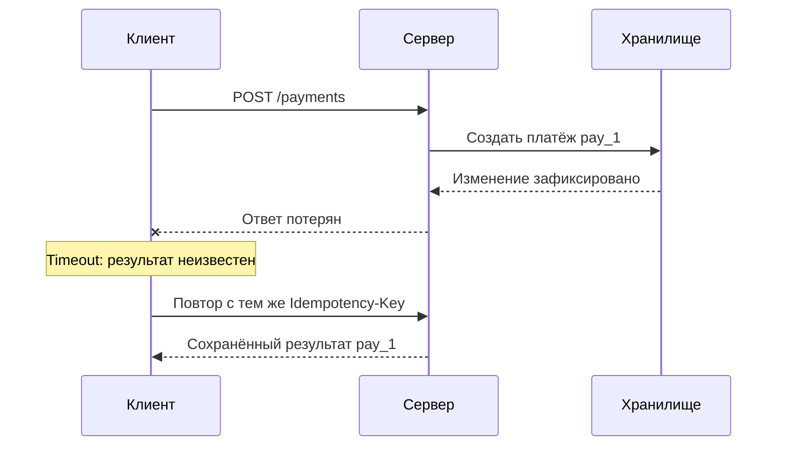

# Надёжное взаимодействие: что делать после timeout

> [!info] Контекст
> Клиент отправляет `POST /payments`, ждёт две секунды и получает timeout. В журнале сервера платёж уже создан, но ответ потерялся при разрыве соединения. Если клиент безусловно повторит `POST`, пользователь может заплатить дважды. Если не повторит, интерфейс останется в неопределённом состоянии. Проблема не в самом timeout, а в отсутствии контракта для неизвестного результата операции.

[[../../MOC|К карте архитектуры]] · [[../05-http-caching/05-http-caching|К предыдущей главе]]

## Результат главы

По методу, моменту сбоя, HTTP-ответу и контракту операции вы сможете:

1. отличить подтверждённый отказ от неизвестного результата;
2. решить, допустима ли повторная попытка;
3. ограничить попытки общим deadline и retry budget;
4. применить exponential backoff, jitter и `Retry-After` без retry storm;
5. спроектировать idempotency key, который не создаёт второй побочный эффект.

Нужны границы сетевого пути из [[../01-client-server-request-lifecycle/01-client-server-request-lifecycle|главы 1]], transport failures из [[../02-dns-tcp-tls/02-dns-tcp-tls|главы 2]] и safe/idempotent semantics из [[../03-http-messages-and-semantics/03-http-messages-and-semantics|главы 3]]. Caching из главы 5 не является скрытым prerequisite.

## Timeout ограничивает ожидание клиента

Timeout сообщает один факт: ожидаемое событие не наступило за отведённое клиентом время. Он не сообщает, что удалённая операция остановлена или отменена.



К моменту timeout возможны разные состояния:

- запрос не покинул клиент;
- байты дошли только до прокси-сервера;
- сервер получил часть тела;
- обработчик начал работу;
- транзакция зафиксирована;
- ответ сформирован, но не дошёл до клиента.

Одно исключение на стороне клиента не различает эти случаи.

## Deadline, timeout и отмена — разные механизмы

**Timeout попытки** ограничивает один сетевой обмен. **Общий deadline** ограничивает всю логическую операцию вместе с повторами и паузами.

```text
общий deadline
├── timeout попытки 1
├── пауза
├── timeout попытки 2
└── запас на обработку результата
```

Если каждая из трёх попыток получает собственные пять секунд, операция может занять гораздо больше ожидаемых пяти секунд. Перед новым запросом нужно вычислять оставшееся время относительно одного абсолютного deadline.

В Node.js сигнал можно создать так:

```javascript
const response = await fetch(url, {
  signal: AbortSignal.timeout(500),
});
```

`AbortSignal.timeout(500)` прерывает ожидание локального `fetch()` примерно через 500 ms. Сигнал не откатывает уже зафиксированную транзакцию базы данных. Даже если transport закроется, сервер может продолжить работу.

Настоящая отмена удалённой операции требует отдельного протокольного контракта: идентификатора операции, команды cancel и правил для состояния, которое уже нельзя отменить.

## Когда результат известен

Диагноз должен опираться на последнюю подтверждённую границу.

| Наблюдение клиента | Что известно об операции |
|---|---|
| DNS failure или явный отказ до соединения | Этот сетевой путь не достиг HTTP-сервера; отдельную параллельную попытку нужно учитывать независимо |
| Получен `400`, `401`, `403` или `422` | Сервер сформировал HTTP-результат; повтор того же запроса без изменения обычно бесполезен |
| Получен `201` с operation ID | Сервер подтвердил создание операции |
| Получен ответ по ключу идемпотентности | Результат логической операции известен согласно контракту |
| Timeout, reset или `502/504` после отправки | Результат операции на upstream может быть неизвестен |
| Клиент отменил `fetch()` | Прекратилось локальное ожидание; результат на сервере не доказан |

`502` и `504` подтверждают ответ gateway, но не обязательно отказ бизнес-операции. Upstream мог выполнить изменение и потерять свой ответ.

## Повтор — новое сетевое действие

Retry не продолжает прежний запрос. Он создаёт новый запрос, который сервер может обработать независимо.

Перед автоматическим повтором ответьте на четыре вопроса:

1. Ошибка выглядит временной?
2. Операцию безопасно выполнить повторно?
3. Есть ли время и retry budget для ещё одной попытки?
4. Не выполняет ли повтор уже другой слой?

RFC 9110 не рекомендует автоматически повторять запрос с неидемпотентным методом, если клиент не знает, что сама операция идемпотентна, или не может доказать, что первый запрос не был применён.

### Метод и операция

`GET`, `PUT` и `DELETE` объявлены идемпотентными методами, но реализация всё равно обязана соблюдать их семантику. `POST` сам по себе не идемпотентен.

Приложение может сделать конкретную операцию поверх `POST` идемпотентной с помощью устойчивого operation ID или ключа идемпотентности. Это свойство серверного контракта, а не магия HTTP-поля.

## Какие результаты можно повторять

Универсального списка retryable statuses нет. Классификатор должен учитывать операцию и контракт сервиса.

| Наблюдение | Автоматический повтор |
|---|---|
| Некорректный запрос, `400`, `401`, `403`, `404`, `422` | Нет без изменения запроса или credentials |
| Конфликт ключа идемпотентности с другим payload | Нет; это ошибка вызывающей стороны |
| `429 Too Many Requests` | Только в пределах лимита и с учётом `Retry-After` |
| `503 Service Unavailable` | Возможен для защищённой операции; учитывать `Retry-After` |
| `502` или `504` | Возможен, но результат upstream может быть неизвестен |
| `500` | Только если контракт классифицирует ошибку как временную и повтор безопасен |
| Timeout, reset, network error | Только для идемпотентной или защищённой операции |
| Ошибка разбора успешного ответа | Не повторять вслепую: операция могла завершиться |

Явный список разрешённых случаев безопаснее правила «повторять все `5xx`». Например, детерминированный bug будет воспроизводиться и только увеличит нагрузку.

## `Retry-After` задаёт нижнюю границу ожидания

Сервер может попросить клиента подождать:

```http
HTTP/1.1 429 Too Many Requests
Retry-After: 5
```

или передать HTTP-date:

```http
Retry-After: Sun, 26 Jul 2026 18:30:00 GMT
```

Поле особенно связано с `503` и может сопровождать `429`. Клиент должен сопоставить его с оставшимся deadline. Если ждать уже некогда, правильный результат — завершить операцию, а не нарушить deadline.

`Retry-After` не выдаёт дополнительный лимит попыток и не доказывает, что исходная операция не выполнилась.

## Backoff и jitter снижают синхронизацию

Немедленный повтор создаёт нагрузку именно тогда, когда зависимый сервис уже испытывает проблему. Exponential backoff увеличивает верхнюю границу паузы:

$$
limit_n = \\min(cap, base \\times 2^n)
$$

При **full jitter** фактическая пауза случайна:

$$
delay_n \\sim U(0, limit_n)
$$

Например, при `base = 100 ms` и `cap = 2 s` верхние границы будут `100`, `200`, `400`, `800`, `1600`, `2000` ms. Случайный выбор внутри диапазона снижает вероятность, что множество клиентов повторят запросы одновременно.

Backoff не заменяет ограничения:

- максимальное число попыток;
- общий deadline;
- timeout одной попытки;
- retry budget;
- ограничение конкурентных запросов.

### Повторы умножаются между слоями

Если пять слоёв независимо делают до трёх попыток, нижний сервис может получить до

$$
3^5 = 243
$$

обращений для одной пользовательской операции. Обычно retry policy размещают в одном слое, у которого достаточно контекста для решения о безопасности и полезности повтора.

### Retry budget

Retry budget ограничивает дополнительную нагрузку. Простейшие формы:

- не больше двух дополнительных попыток на операцию;
- не больше заданной доли повторного трафика относительно обычного;
- token bucket, который разрешает повторы, пока есть tokens.

Когда budget исчерпан, backoff не делает бесконечные повторы приемлемыми.

## Контракт ключа идемпотентности

Клиент создаёт уникальный ключ для **одной логической операции** и использует его во всех повторах этой операции:

```http
POST /payments HTTP/1.1
Idempotency-Key: "550e8400-e29b-41d4-a716-446655440000"
Content-Type: application/json

{"amount":1250,"currency":"USD"}
```

На июль 2026 года `Idempotency-Key` описан в истёкшем Internet-Draft, а не в опубликованном RFC. Поэтому точные статусы, срок хранения и формат ошибок остаются частью контракта приложения и должны быть документированы явно.

Надёжный серверный контракт включает следующие правила.

### 1. Область ключа

Поиск должен учитывать как минимум аутентифицированного пользователя или tenant, метод и target. Одинаковая строка ключа у двух пользователей не должна объединять их операции.

### 2. Отпечаток запроса

Server сохраняет fingerprint существенных параметров: method, target и payload по документированному правилу сравнения.

Пример ниже хеширует точные bytes тела. Поэтому изменение пробелов или порядка JSON keys считается другим request. Если contract должен считать такие payloads эквивалентными, перед hashing нужна одна детерминированная canonical serialization.

```text
тот же key + тот же fingerprint      → та же логическая операция
тот же key + другой fingerprint      → conflict
```

Без проверки fingerprint случайно переиспользованный ключ способен вернуть результат другой операции.

### 3. Состояние выполнения

Запись ключа проходит состояния:

```text
absent → pending → completed
```

- `pending` не позволяет двум конкурентным запросам одновременно выполнить побочный эффект;
- `completed` хранит статус и ответ, которые нужно воспроизвести;
- повтор с тем же fingerprint получает сохранённый результат;
- повтор с другим fingerprint получает conflict.

### 4. Атомарность с побочным эффектом

Критический инвариант:

```text
для одного scoped key существует не больше одного committed payment
```

Запись ключа и бизнес-изменение должны иметь согласованную границу транзакции. Если сначала списать деньги, а потом попытаться сохранить key, crash между действиями оставит сервер без знания о выполненном платеже.

Для локальной базы данных это обычно транзакция с unique constraint. Для внешнего payment provider нужен его собственный idempotency contract или устойчивая state machine; локальная таблица не может атомарно откатить чужую систему.

### 5. Срок хранения

Сервер задаёт срок хранения ключа и результата. Клиент не должен ожидать дедупликацию после этого срока. Удалять запись раньше максимального окна возможных повторов опасно.

## Воспроизводимое наблюдение

Скрипт ниже создаёт платёж, сохраняет результат, уничтожает socket до первого ответа и затем повторяет запрос с тем же ключом. Это демонстрация в памяти: она показывает протокольное поведение, но не даёт crash safety настоящей транзакции базы данных.

Сохраните файл как `reliable-payment.mjs`:

```javascript
import { createHash, randomUUID } from "node:crypto";
import { createServer } from "node:http";
import { setTimeout as delay } from "node:timers/promises";

const payments = new Map();
let nextPaymentId = 1;
let dropFirstCompletedResponse = true;

function fingerprint(method, target, body) {
  return createHash("sha256")
    .update(`${method}\n${target}\n`)
    .update(body)
    .digest("hex");
}

async function readBody(request) {
  const chunks = [];
  for await (const chunk of request) chunks.push(chunk);
  return Buffer.concat(chunks);
}

function sendJson(response, status, payload, headers = {}) {
  response.writeHead(status, {
    "content-type": "application/json; charset=utf-8",
    ...headers,
  });
  response.end(JSON.stringify(payload));
}

const server = createServer(async (request, response) => {
  try {
    const url = new URL(request.url, "http://localhost");

    if (request.method !== "POST" || url.pathname !== "/payments") {
      sendJson(response, 404, { error: "not found" });
      return;
    }

    const key = request.headers["idempotency-key"];
    if (typeof key !== "string" || key.length === 0) {
      sendJson(response, 400, { error: "idempotency key required" });
      return;
    }

    const body = await readBody(request);
    let input;
    try {
      input = JSON.parse(body.toString("utf8"));
    } catch {
      sendJson(response, 400, { error: "invalid JSON" });
      return;
    }

    if (!Number.isSafeInteger(input.amount) || input.amount <= 0 || input.currency !== "USD") {
      sendJson(response, 422, { error: "invalid payment" });
      return;
    }
    const requestFingerprint = fingerprint(request.method, url.pathname, body);
    const existing = payments.get(key);

    if (existing) {
      if (existing.fingerprint !== requestFingerprint) {
        sendJson(response, 409, { error: "key reused with different request" });
        return;
      }

      if (existing.state === "pending") {
        sendJson(
          response,
          409,
          { error: "operation still in progress" },
          { "retry-after": "1" },
        );
        return;
      }

      console.log("server: replay", existing.result);
      sendJson(response, existing.status, existing.result, {
        "idempotency-replayed": "true",
      });
      return;
    }

    const record = { fingerprint: requestFingerprint, state: "pending" };
    payments.set(key, record);

    const result = {
      id: `pay_${nextPaymentId++}`,
      amount: input.amount,
      currency: input.currency,
    };

    Object.assign(record, { state: "completed", status: 201, result });
    console.log("server: committed", result);

    if (dropFirstCompletedResponse) {
      dropFirstCompletedResponse = false;
      console.log("server: drop response after commit");
      request.socket.destroy();
      return;
    }

    sendJson(response, 201, result);
  } catch (error) {
    console.error("server:", error.message);
    if (!response.headersSent) sendJson(response, 500, { error: "internal" });
    else response.destroy();
  }
});

async function createPayment(url, { key, payment }) {
  const deadlineAt = performance.now() + 2_000;
  const maxAttempts = 3;

  for (let attempt = 1; attempt <= maxAttempts; attempt += 1) {
    const remaining = deadlineAt - performance.now();
    if (remaining <= 0) throw new Error("overall deadline exceeded");
    const attemptTimeout = Math.min(500, Math.floor(remaining));
    if (attemptTimeout < 1) throw new Error("overall deadline exceeded");

    let response;
    try {
      response = await fetch(url, {
        method: "POST",
        headers: {
          "content-type": "application/json",
          "idempotency-key": key,
        },
        body: JSON.stringify(payment),
        signal: AbortSignal.timeout(attemptTimeout),
      });
    } catch (error) {
      console.log(`client: attempt ${attempt} failed: ${error.message}`);
      if (attempt === maxAttempts) throw error;

      const limit = Math.min(200, 50 * 2 ** (attempt - 1));
      const pause = Math.floor(Math.random() * limit);
      if (performance.now() + pause >= deadlineAt) {
        throw new Error("not enough deadline for retry");
      }

      console.log(`client: retry in ${pause} ms with the same key`);
      await delay(pause);
      continue;
    }

    const result = await response.json();
    if (!response.ok) {
      throw new Error(`non-retryable HTTP ${response.status}: ${JSON.stringify(result)}`);
    }

    return result;
  }
}

server.listen(0, "127.0.0.1", async () => {
  const address = server.address();
  const url = `http://127.0.0.1:${address.port}/payments`;
  const key = randomUUID();
  const payment = { amount: 1250, currency: "USD" };

  try {
    const result = await createPayment(url, { key, payment });
    console.log("client: final result", result);

    const conflict = await fetch(url, {
      method: "POST",
      headers: {
        "content-type": "application/json",
        "idempotency-key": key,
      },
      body: JSON.stringify({ amount: 9999, currency: "USD" }),
    });

    console.log("client: conflicting reuse", conflict.status, await conflict.json());
  } finally {
    server.close();
  }
});
```

Запустите:

```bash
node reliable-payment.mjs
```

Наблюдаемая последовательность:

1. server фиксирует `pay_1`;
2. первый response теряется;
3. client видит network failure и повторяет request с тем же key;
4. server возвращает сохранённый `pay_1`, не создавая `pay_2`;
5. тот же key с другим amount получает `409`.

Случайная пауза меняется между запусками; invariant payment ID не меняется.

## Что пример намеренно не решает

`Map` в памяти исчезает при перезапуске и не защищает несколько replicas. В production нужны:

- устойчивое хранилище;
- unique constraint на scoped key;
- транзакция или согласованная state machine;
- срок хранения и очистка;
- защита от слишком длинных keys и переполнения хранилища;
- одинаковый поиск на всех replicas;
- запрет сохранять secrets в fingerprint или журналах.

Нельзя выдавать дедупликацию в памяти за exactly-once delivery. Сеть по-прежнему допускает повторы; система делает повторное выполнение одного логического эффекта наблюдаемо идемпотентным.

## Диагностика инцидента с повторами

Для одной логической операции соберите попытки под общим operation ID:

| Поле | Зачем |
|---|---|
| operation ID / idempotency key | Связать повторы одной операции |
| attempt number | Увидеть фактическое число попыток |
| timeout попытки и оставшийся deadline | Найти ошибку лимита |
| method, target, fingerprint | Обнаружить повтор другого запроса |
| последняя подтверждённая граница | Не объявлять неизвестный результат отказом |
| причина повтора и выбранная пауза | Проверить классификатор, backoff и jitter |
| итоговый статус или `unknown` | Не скрывать неопределённость |

Проверяйте:

1. какой слой создал каждый retry;
2. совпадают ли попытки по key и fingerprint;
3. зафиксирован ли побочный эффект до потерянного ответа;
4. не истёк ли срок хранения key;
5. соблюдён ли `Retry-After`;
6. не превышены ли deadline, максимальное число попыток и retry budget.

## Проверка результата

Для незнакомой трассировки без текста главы:

1. разделите подтверждённый отказ и неизвестный результат;
2. укажите, безопасен ли новый запрос по семантике операции;
3. выберите максимальное число попыток, общий deadline и timeout попытки;
4. вычислите верхнюю границу exponential backoff и примените jitter;
5. объясните, как `Retry-After` взаимодействует с deadline;
6. спроектируйте область, fingerprint, состояния и срок хранения ключа;
7. назовите границу транзакции, предотвращающую второй побочный эффект.

Перенос: примените тот же механизм не к платежу, а к созданию заказа или отправке команды внешнему устройству. Простая замена названий недостаточна: укажите новый побочный эффект, его границу транзакции и способ согласовать внешнюю зависимость.

## Related Topics

- [[../01-client-server-request-lifecycle/01-client-server-request-lifecycle|Путь HTTPS-запроса]] — последняя подтверждённая граница.
- [[../02-dns-tcp-tls/02-dns-tcp-tls|DNS, TCP и TLS]] — transport failures и timeout.
- [[../03-http-messages-and-semantics/03-http-messages-and-semantics|HTTP-сообщения и семантика]] — safe и idempotent methods, статусы и `Retry-After`.
- [[../05-http-caching/05-http-caching|HTTP caching]] — `Age` и cache policy не являются retry policy.

## Sources

- [RFC 9110: HTTP Semantics](https://www.rfc-editor.org/rfc/rfc9110.html) — идемпотентные методы, ограничения автоматического retry и `Retry-After`.
- [RFC 6585: Additional HTTP Status Codes](https://www.rfc-editor.org/rfc/rfc6585.html) — `429 Too Many Requests`.
- [Node.js: `AbortSignal`](https://nodejs.org/api/globals.html#class-abortsignal) — `AbortSignal.timeout()` и композиция сигналов отмены.
- [Node.js: Fetch with Undici](https://nodejs.org/en/learn/getting-started/fetch) — Node.js Fetch API.
- [AWS Builders’ Library: Timeouts, retries and backoff with jitter](https://aws.amazon.com/builders-library/timeouts-retries-and-backoff-with-jitter/) — deadlines, умножение повторов, backoff, jitter и token-bucket budget.
- [IETF draft: The Idempotency-Key HTTP Header Field](https://datatracker.ietf.org/doc/draft-ietf-httpapi-idempotency-key-header/) — истёкший Internet-Draft; идея ключа, fingerprint и обработки дублей, но не финальный стандарт.
