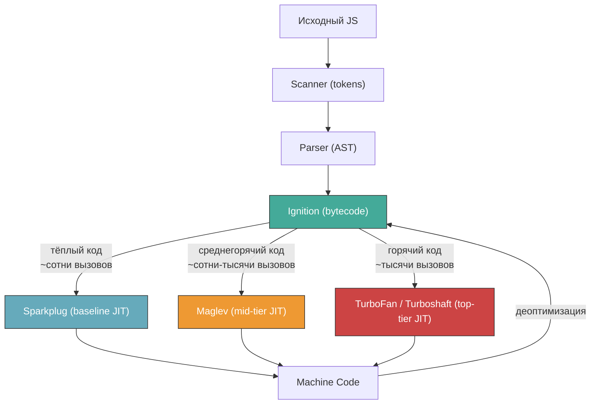
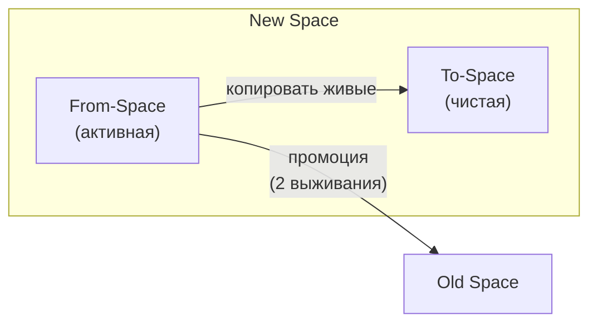
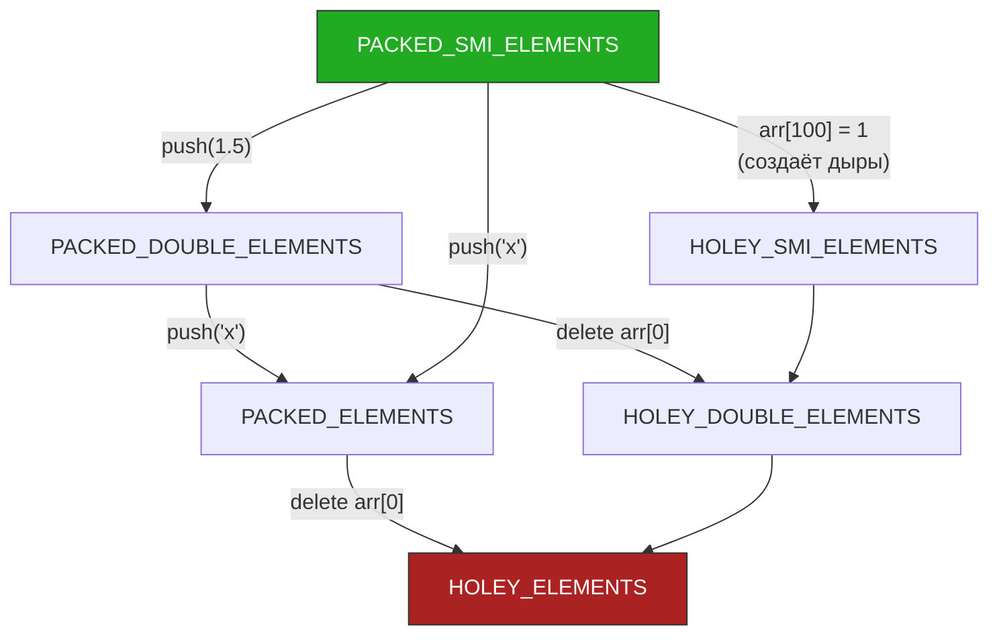

# V8 Engine Internals

> [!info] Context
> Эта глава -- глубокое погружение во внутреннее устройство V8: модель памяти, тиры компиляции, сборку мусора, представление массивов и строк. Материал нужен, чтобы читать блог-посты V8, интерпретировать вывод профайлеров и писать код, дружелюбный к движку. Пререквизит: [[jit-compilation]], где разобраны JIT-концепция, двухуровневый пайплайн (Ignition / TurboFan), Hidden Classes и Inline Caches.

## Overview

V8 -- движок JavaScript и WebAssembly, используемый в Chrome, Node.js, Deno, Bun (частично). За последние два года архитектура значительно изменилась: добавлен промежуточный JIT-тир Maglev, TurboFan перешёл на новый IR (Turboshaft), появился экспериментальный Turbolev, оптимизирована работа с числами и GC.

Глава организована от общей картины к деталям:

1. **Пайплайн компиляции** -- полная 4-уровневая модель
2. **Модель памяти** -- как V8 представляет значения на уровне битов
3. **Сборка мусора (Orinoco)** -- generational GC, параллельность, concurrent marking
4. **Массивы и ElementsKind** -- внутренние типы элементов и необратимые переходы
5. **Строки** -- ConsString, SlicedString и другие внутренние представления
6. **Инструменты** -- флаги Node.js для наблюдения за движком
7. **Анти-паттерны** -- конкретные ошибки и их исправления



> [!important] Ключевое изменение
> В [[jit-compilation]] описана двухуровневая модель (Ignition -> TurboFan). С 2023-2024 годов V8 работает в **четырёхуровневой** модели: Ignition -> Sparkplug -> Maglev -> TurboFan. Каждый тир -- компромисс между скоростью компиляции и качеством генерируемого кода.

---

## 1. Пайплайн компиляции: четыре тира

### 1.1 Ignition -- интерпретатор

Ignition остаётся первым этапом: парсит AST в компактный регистровый байткод и интерпретирует его. Одновременно собирает **type feedback** -- информацию о типах аргументов, частоте вызовов, формах объектов. Этот feedback используется всеми последующими тирами.

Байткод Ignition подробно разобран в [[jit-compilation]]. Здесь важно одно: Ignition -- это не "медленный fallback", а полноценный baseline, который запускается мгновенно и обеспечивает быстрый cold start.

### 1.2 Sparkplug -- baseline JIT

Sparkplug (появился в V8 v9.1 / Chrome 91) -- самый простой JIT-компилятор. Он транслирует байткод Ignition в нативный код **без оптимизаций**: один байткод-инструкция = один фрагмент машинного кода. Компиляция происходит линейным проходом, без построения промежуточного представления (IR).

Зачем нужен тир без оптимизаций? Устранить накладные расходы интерпретации (dispatch loop, декодирование байткода) при минимальных затратах на компиляцию. Sparkplug компилирует за микросекунды.

> [!tip] Практический эффект
> Sparkplug ускоряет "тёплый" код на 5-15% без задержки на компиляцию. Для серверных приложений на Node.js это означает быстрый выход на рабочую скорость после старта.

### 1.3 Maglev -- mid-tier JIT

Maglev -- ключевое нововведение последних лет. Это промежуточный JIT между Sparkplug и TurboFan. Доступен с V8 v11.2 (Chrome 114), **включён по умолчанию в Node.js 22** (апрель 2024).

**Проблема, которую решает Maglev.** До Maglev существовал огромный разрыв: Ignition/Sparkplug генерировали неоптимизированный код, а TurboFan -- высокооптимизированный, но компилировал долго (~10 мс на функцию). Код, который вызывается сотни раз, слишком горяч для интерпретатора, но недостаточно горяч для TurboFan. Этот код работал медленно.

**Как работает Maglev:**
- Использует type feedback от Ignition (как и TurboFan)
- Строит SSA-граф (Static Single Assignment) напрямую из байткода
- Применяет базовые оптимизации: type specialization, register allocation
- Не делает сложные оптимизации (inlining между функциями, escape analysis, range analysis)
- Компилирует за **< 1 мс** (против ~10 мс у TurboFan)
- Генерирует код примерно в **2 раза быстрее** Ignition

```bash
# Проверить, что Maglev активен (Node.js 22+):
node --trace-maglev <file>.js

# Посмотреть граф Maglev:
node --maglev --trace-maglev-graph <file>.js

# Отключить Maglev для сравнения:
node --no-maglev <file>.js
```

**Когда Maglev компилирует функцию:**

```
[marking calculateTotal for optimization to MAGLEV,
  reason: small function, feedback is sufficient]
[completed optimizing calculateTotal (Maglev)]
```

Порог срабатывания Maglev ниже, чем у TurboFan: достаточно нескольких сотен вызовов с устойчивым type feedback. TurboFan подключается позже, когда функция вызывается тысячи раз и type feedback стабилен.

### 1.4 TurboFan и Turboshaft

TurboFan остаётся top-tier оптимизирующим компилятором (подробно в [[jit-compilation]]). Но его внутренняя архитектура изменилась.

**Sea of Nodes -> Turboshaft.** Исторически TurboFan использовал IR под названием Sea of Nodes -- граф, в котором узлы данных и управляющего потока (control flow) перемешаны. Это давало гибкость оптимизациям, но делало компиляцию медленной и код сложным для отладки.

В 2024-2025 годах V8 перешёл на **Turboshaft** -- новый IR на основе CFG (Control Flow Graph). В Turboshaft управляющий поток и данные разделены, что привычнее для компиляторных инженеров и проще для оптимизаций.

Результат: **~2x ускорение компиляции** TurboFan при том же качестве генерируемого кода.

**Turbolev -- следующее поколение (2025+).** Turbolev -- экспериментальный проект, объединяющий архитектуру Maglev (быстрая компиляция из байткода) с бэкендом Turboshaft (качественная генерация машинного кода). Цель: заменить и Maglev, и TurboFan одним тиром с настраиваемым уровнем оптимизации. На момент написания Turbolev находится в активной разработке.

### Сводная таблица тиров

| Тир | Скорость компиляции | Качество кода | Когда срабатывает | Оптимизации |
|---|---|---|---|---|
| Ignition | мгновенно | baseline (интерпретация) | сразу | нет |
| Sparkplug | микросекунды | baseline (нативный) | тёплый код | нет (1:1 трансляция) |
| Maglev | < 1 мс | средний | сотни вызовов | type specialization, register allocation |
| TurboFan | ~10 мс | максимальный | тысячи вызовов | inlining, escape analysis, bounds check elimination, constant folding |

> [!tip] Takeaway
> Четырёхуровневый пайплайн -- это шкала компромиссов: чем дольше V8 компилирует, тем быстрее результат. Maglev закрывает "долину смерти" между интерпретатором и TurboFan, где код вызывался достаточно часто, чтобы быть узким местом, но недостаточно часто для полной оптимизации.

---

## 2. Модель памяти

### 2.1 Tagged Pointers

Каждое значение в V8 -- это 64-битное слово. V8 использует **tagged pointers** для различения чисел и ссылок на объекты в куче без дополнительных метаданных.

**Правило тегирования:**
- Последний бит = `0` -- значение является **SMI** (Small Integer). Целое число хранится прямо в указателе, без аллокации в куче.
- Последний бит = `1` -- значение является **указателем на HeapObject**. Адрес объекта = значение с очищенным последним битом.

```
SMI 42:      0x0000002A00000000   (42 << 32, tag bit = 0)
HeapObject:  0x00007F8B12345679   (pointer | 1, tag bit = 1)
```

**Почему это важно для производительности.** SMI -- числа, которые помещаются в 31 бит (от -2^30 до 2^30 - 1, т.е. примерно +-1 миллиард). Арифметика с SMI не требует аллокации в куче и не создаёт нагрузки на GC. Это самый быстрый тип данных в V8.

```js
// SMI -- быстро, без аллокации
const index = 42;

// HeapNumber -- аллокация в куче
const pi = 3.14159;

// Проверить тип значения:
// node --allow-natives-syntax
%DebugPrint(42);      // → SMI
%DebugPrint(3.14);    // → HeapNumber
%DebugPrint(2 ** 31); // → HeapNumber (не помещается в SMI)
```

> [!warning] Граница SMI
> Число `2147483647` (2^31 - 1) -- это SMI. Число `2147483648` -- уже HeapNumber. Если ваш код работает со счётчиками или ID, которые могут превысить ~2 миллиарда, каждая операция будет создавать объект в куче.

### 2.2 HeapNumber и Mutable Heap Numbers

Когда число не помещается в SMI или является дробным, V8 создаёт **HeapNumber** -- объект в куче, хранящий 64-битное IEEE 754 double.

Проблема: при каждом изменении числа в контексте (замыкании, свойстве объекта) V8 раньше создавал **новый** HeapNumber и перезаписывал указатель. Это создавало лишнюю нагрузку на GC.

**Mutable Heap Numbers (2025).** V8 ввёл оптимизацию: для чисел, хранящихся в контексте замыкания или свойствах объектов, движок может обновлять значение **на месте** (in-place), без создания нового объекта.

```js
// До оптимизации: каждая итерация создаёт новый HeapNumber
function createCounter() {
  let count = 0.1; // HeapNumber в контексте замыкания
  return () => {
    count += 0.1;  // раньше: new HeapNumber каждый раз
    return count;
  };
}

// После оптимизации (V8 2025):
// count обновляется in-place, без аллокации
```

Бенчмарк async-fs показал прирост **~2.5x** на операциях с числами в замыканиях. На практике это ускоряет любой код, где число-аккумулятор живёт в замыкании и обновляется в цикле.

### 2.3 Зоны кучи (Heap Spaces)

V8 делит кучу на несколько зон с разными стратегиями управления памятью:

```
V8 Heap
├── New Space (nursery)        — 1-8 МБ, для короткоживущих объектов
│   ├── Semi-Space (From)      — активная половина
│   └── Semi-Space (To)        — целевая для копирования
├── Old Space                  — объекты, пережившие 2 minor GC
├── Code Space                 — скомпилированный машинный код
├── Map Space                  — объекты Hidden Class (Map)
├── Large Object Space (LO)    — объекты > 512 КБ (не перемещаются)
└── New Large Object Space     — крупные молодые объекты (v7.4+)
```

**New Space** маленький (по умолчанию 1-8 МБ, управляется `--max-semi-space-size`). Это фундаментальное проектное решение: маленький nursery означает частые, но быстрые minor GC. Большинство объектов умирают молодыми (generational hypothesis), поэтому minor GC в основном работает с мёртвыми объектами -- только копирует живые.

**Old Space** растёт по мере необходимости (ограничен `--max-old-space-size`, по умолчанию ~1.5 ГБ на 64-бит). Собирается major GC, который дороже.

**Map Space** хранит Hidden Classes (Maps). Они почти никогда не удаляются -- живут столько, сколько живёт хотя бы один объект с этой формой.

> [!tip] Takeaway
> Понимание зон кучи объясняет, почему: (1) создание множества временных объектов относительно дёшево (nursery), (2) утечки памяти в Old Space критичны (costly GC), (3) гигантские буферы/массивы обрабатываются особо (Large Object Space).

---

## 3. Сборка мусора: Orinoco

Orinoco -- кодовое имя проекта по модернизации GC в V8. Цель: минимизировать паузы на главном потоке, в идеале < 1 мс.

### 3.1 Minor GC (Scavenger)

Собирает New Space. Работает по алгоритму **Cheney's semi-space copying**:

1. Все живые объекты из From-Space копируются в To-Space
2. После копирования From-Space полностью освобождается
3. Роли From/To меняются местами
4. Объекты, пережившие **2 minor GC**, промотируются в Old Space



**Parallel Scavenger.** V8 распараллеливает Scavenger: несколько worker-потоков одновременно копируют объекты. На практике minor GC занимает **~1 мс** и ниже.

```bash
# Наблюдение за GC:
node --trace-gc app.js
```

Пример вывода:

```
[4756:0x5629c80]     42 ms: Scavenge 2.1 (3.0) -> 1.8 (4.0) MB, 0.8 / 0.0 ms
[4756:0x5629c80]     85 ms: Scavenge 2.8 (4.0) -> 2.2 (4.0) MB, 0.6 / 0.0 ms
```

Формат: `Scavenge <до> (<выделено>) -> <после> (<выделено>) MB, <пауза> / <внешняя> ms`.

### 3.2 Major GC (Mark-Compact)

Собирает Old Space. Состоит из трёх фаз:

**Фаза 1: Marking (маркировка).** Обход графа живых объектов от корней (стек, глобальные переменные, handles). V8 использует **три цвета**:
- Белый -- объект не посещён (потенциально мёртв)
- Серый -- объект посещён, но его дочерние объекты ещё не обработаны
- Чёрный -- объект и все его дочерние обработаны (определённо жив)

После маркировки все белые объекты -- мусор.

**Фаза 2: Sweeping (очистка).** Освобождение памяти мёртвых объектов. Память возвращается в free-list для переиспользования.

**Фаза 3: Compacting (уплотнение).** Перемещение живых объектов для устранения фрагментации. Выполняется не всегда -- только когда фрагментация Old Space превышает порог.

```
[4756:0x5629c80]   1520 ms: Mark-Compact 48.3 (52.0) -> 32.1 (40.0) MB, 12.4 / 0.0 ms
```

### 3.3 Concurrent и Incremental стратегии

Основная цель Orinoco -- убрать работу GC с главного потока. V8 использует три техники:

**Incremental Marking.** Вместо одной длинной паузы маркировка разбивается на маленькие шаги, чередующиеся с выполнением JavaScript. Каждый шаг обрабатывает часть графа объектов.

Проблема: пока маркировка идёт инкрементально, JS-код может менять граф объектов. V8 решает это через **write barriers** -- при каждой записи ссылки движок проверяет, не нужно ли пометить новый целевой объект серым.

**Concurrent Marking.** Фоновые потоки обходят граф объектов **одновременно** с выполнением JS на главном потоке. Это самая значительная оптимизация: основная работа маркировки происходит в background, главный поток останавливается лишь для финализации (пара миллисекунд).

**Concurrent Sweeping.** Очистка мёртвых объектов тоже происходит в фоновых потоках, после короткой паузы главного потока.

```mermaid
gantt
    title Major GC: распределение работы
    dateFormat X
    axisFormat %s

    section Главный поток
    JS-код           :a1, 0, 30
    Инкрементальная маркировка (slice) :a2, 30, 32
    JS-код           :a3, 32, 60
    Финализация маркировки :a4, 60, 62
    JS-код           :a5, 62, 100

    section Фоновый поток
    Concurrent маркировка :b1, 10, 60
    Concurrent sweeping   :b2, 62, 90
```



### 3.4 GC Sandbox (2024-2025)

V8 активно развивает **V8 Sandbox** -- механизм аппаратной изоляции кучи V8 от остальной памяти процесса. Цель: даже если атакующий получит возможность произвольной записи внутри кучи V8, он не сможет выйти за её пределы.

Sandbox использует hardware memory protection (Intel MPK и аналоги) для изоляции. Для разработчиков это прозрачно, но влияет на внутреннюю архитектуру: указатели внутри sandbox становятся смещениями (offsets) относительно базы, а не абсолютными адресами.

### 3.5 Conservative Stack Scanning

Исторически V8 использовал **precise stack scanning**: при GC движок точно знал, какие слоты на стеке содержат указатели, а какие -- числа. Это требовало поддержки pointer maps для каждого фрейма.

V8 переходит на **conservative stack scanning**: при сканировании стека каждое значение, которое *выглядит* как указатель в кучу, считается указателем. Это упрощает генерацию кода (не нужно поддерживать pointer maps) и позволяет GC корректно работать с кодом Maglev и Turboshaft без сложной инфраструктуры.

Цена: возможны ложные срабатывания (число на стеке случайно совпадает с адресом объекта), из-за чего мёртвый объект может не быть собран. На практике это пренебрежимо мало.

> [!tip] Takeaway
> Современный GC в V8 -- это не "stop-the-world" пауза. Основная работа (маркировка, очистка) происходит в фоновых потоках. Главный поток останавливается на единицы миллисекунд. Для Node.js-серверов это означает: GC паузы редко являются причиной latency spikes, если вы не создаёте аномально много долгоживущих объектов.

---

## 4. Объекты: Hidden Classes

Hidden Classes (Maps) и Inline Caches подробно разобраны в [[jit-compilation]]. Здесь -- только краткое напоминание и дополнение.

**Hidden Class (Map)** -- внутренняя структура V8, описывающая форму объекта: какие свойства, в каком порядке, с какими атрибутами. Объекты с одинаковой формой разделяют один Map.

**Inline Cache** кэширует результат поиска свойства: "для объектов с Map X свойство `name` находится по смещению 16". Это превращает доступ к свойству из хеш-поиска в одну инструкцию чтения по смещению.

Всё, что ломает Hidden Classes (добавление свойств после конструктора, удаление свойств через `delete`, изменение порядка инициализации), приводит к деоптимизации -- подробности и примеры в [[jit-compilation]].

---

## 5. Массивы: ElementsKind

V8 отслеживает типы элементов массива через внутреннюю метку **ElementsKind**. Это позволяет хранить элементы в компактном формате (unboxed) вместо массива tagged pointers.

### 5.1 Типы элементов

| ElementsKind | Пример | Хранение | Скорость |
|---|---|---|---|
| `PACKED_SMI_ELEMENTS` | `[1, 2, 3]` | unboxed integers | максимальная |
| `PACKED_DOUBLE_ELEMENTS` | `[1.1, 2.2, 3.3]` | unboxed 64-bit doubles | быстрая |
| `PACKED_ELEMENTS` | `[1, 'a', {}]` | tagged pointers | средняя |
| `HOLEY_SMI_ELEMENTS` | `[1, , 3]` | integers + дыры | ниже средней |
| `HOLEY_DOUBLE_ELEMENTS` | `[1.1, , 3.3]` | doubles + дыры | ниже средней |
| `HOLEY_ELEMENTS` | `[1, , 'a']` | tagged + дыры | медленная |

**PACKED** означает: в массиве нет "дыр" (пропущенных индексов). V8 может обращаться к элементам напрямую по индексу.

**HOLEY** означает: есть дыры. V8 при каждом доступе должен проверять, есть ли элемент по индексу, и если нет -- подниматься по prototype chain. Это заметно дороже.

### 5.2 Необратимые переходы

Решётка переходов ElementsKind:



> [!warning] Переходы необратимы
> Массив может перейти только от более специализированного вида к менее специализированному. Обратного пути нет. Если массив стал `HOLEY_ELEMENTS`, он останется таким навсегда, даже если вы заполните все дыры.

### 5.3 Практические примеры

```js
// node --allow-natives-syntax

const a = [1, 2, 3];
%DebugPrint(a);
// → PACKED_SMI_ELEMENTS ← лучший вариант

a.push(4.5);
%DebugPrint(a);
// → PACKED_DOUBLE_ELEMENTS ← одно дробное число "заразило" массив

a.push('hello');
%DebugPrint(a);
// → PACKED_ELEMENTS ← смешанные типы, самый медленный packed
```

**Проблема с `new Array(n)`:**

```js
// Плохо -- создаёт HOLEY массив
const arr = new Array(100);
arr[0] = 1;
%DebugPrint(arr);
// → HOLEY_SMI_ELEMENTS (99 дыр)

// Хорошо -- PACKED массив
const arr2 = [];
for (let i = 0; i < 100; i++) arr2.push(i);
%DebugPrint(arr2);
// → PACKED_SMI_ELEMENTS
```

**Проблема с `Array.from` и map:**

```js
// Array.from с mapper -- оптимизирован в V8, PACKED_DOUBLE_ELEMENTS:
const coords = Array.from({ length: 100 }, (_, i) => i * 0.5);

// Внимание: промежуточные операции могут "заразить" тип
const mixed = [1, 2, 3].map(x => x > 1 ? x : null);
// → PACKED_ELEMENTS (из-за null)
```

> [!tip] Takeaway
> Для числовых массивов в hot path: (1) не смешивайте типы, (2) не создавайте дыры (`delete`, разреженная инициализация), (3) используйте `TypedArray` (Float64Array, Int32Array) если массив гомогенный -- они гарантируют unboxed хранение.

---

## 6. Строки: внутренние представления

V8 реализует строки не как простой массив символов. В зависимости от операции движок выбирает одно из нескольких внутренних представлений.

### 6.1 Типы строк

| Тип | Когда создаётся | Структура | Доступ к символу |
|---|---|---|---|
| `SeqOneByteString` | ASCII / Latin-1 контент | плоский массив байтов | O(1) |
| `SeqTwoByteString` | Unicode (не Latin-1) | плоский массив 2-байтовых символов | O(1) |
| `ConsString` | конкатенация `a + b` | дерево: указатели на left и right | O(n) при доступе |
| `SlicedString` | `str.slice()` | указатель на parent + offset + length | O(1) |
| `ThinString` | после дедупликации | указатель на каноническую копию | O(1) через redirect |
| `ExternalString` | данные из C++ API | указатель на внешний буфер | O(1) |

### 6.2 ConsString: ленивая конкатенация

Когда вы пишете `a + b`, V8 не создаёт новую строку с копированием символов. Вместо этого создаётся **ConsString** -- узел дерева с указателями на `a` и `b`. Это O(1) по памяти и времени.

Проблема появляется, когда вам нужен доступ к конкретному символу или передача строки в API, ожидающий плоский буфер. В этот момент V8 **flatten** ConsString -- рекурсивно обходит дерево и копирует все символы в плоский массив.

```js
// Каждый += создаёт ConsString-узел:
let result = '';
for (let i = 0; i < 10000; i++) {
  result += items[i]; // → дерево ConsString глубиной 10000
}
// При первом чтении символа -- flatten O(n)

// Лучше:
const result = items.join('');
// join() сразу вычисляет итоговую длину и создаёт один плоский буфер
```

### 6.3 SlicedString: дешёвый slice

`str.slice(start, end)` не копирует символы. Создаётся SlicedString -- ссылка на оригинальную строку + смещение + длина. Это O(1).

Побочный эффект: оригинальная строка не может быть собрана GC, пока жив SlicedString. Если вы взяли `slice` от гигантской строки, вся она останется в памяти.

```js
const huge = fetchGiantResponse(); // 10 МБ строка
const token = huge.slice(0, 32);   // SlicedString → удерживает 10 МБ

// Если нужна только маленькая часть:
const token = (' ' + huge.slice(0, 32)).slice(1);
// Трюк: промежуточная конкатенация форсирует flatten → новая маленькая строка
// Более чистый вариант:
const token = String(huge.slice(0, 32));
```

> [!tip] Takeaway
> Конкатенация через `+` в цикле создаёт дерево ConsString -- используйте `join()`. `slice()` не копирует данные -- это дёшево, но удерживает оригинал в памяти.

---

## 7. Инструменты для наблюдения за V8

### 7.1 Флаги Node.js

| Флаг | Что показывает |
|---|---|
| `--trace-opt` | Какие функции оптимизируются (Maglev / TurboFan) |
| `--trace-deopt` | Деоптимизации: причина и функция |
| `--trace-maglev` | Компиляция Maglev |
| `--trace-gc` | Каждый цикл GC: тип, размер, пауза |
| `--trace-gc-verbose` | Подробный GC с разбивкой по фазам |
| `--expose-gc` | Делает `global.gc()` доступным |
| `--allow-natives-syntax` | Доступ к `%DebugPrint()`, `%OptimizeFunctionOnNextCall()` и др. |
| `--max-old-space-size=N` | Лимит Old Space в МБ |
| `--max-semi-space-size=N` | Размер каждого semi-space в МБ |
| `--no-opt` | Отключить все JIT-оптимизации |
| `--no-maglev` | Отключить Maglev |

### 7.2 %DebugPrint

`%DebugPrint(value)` -- самый полезный инструмент для изучения внутренностей. Показывает внутреннее представление значения: тип, Map (Hidden Class), ElementsKind, memory layout.

```bash
node --allow-natives-syntax -e "
const obj = { x: 1, y: 2 };
%DebugPrint(obj);
"
```

Вывод (упрощённо):

```
DebugPrint: 0x2a4e08099a51: [JS_OBJECT_TYPE]
 - map: 0x2a4e08283c29 <Map[16](HOLEY_ELEMENTS)>
 - prototype: 0x2a4e0824a5f9 <Object map = 0x2a4e08283bf9>
 - elements: 0x2a4e08042229 <FixedArray[0]>
 - properties: 0x2a4e08042229 <FixedArray[0]>
 - All own properties (excluding elements):
    0x2a4e08042659: [String] in OldSpace: #x: 1 (const data field 0)
    0x2a4e08042669: [String] in OldSpace: #y: 2 (const data field 1)
 0x2a4e08283c29: [Map] in OldSpace
 - instance_size: 16
 - inobject_properties: 2
 - used_or_unused_instance_size_in_words: 4
```

Ключевая информация: Map-адрес (Hidden Class), количество in-object свойств, ElementsKind.

### 7.3 %OptimizeFunctionOnNextCall

Форсирует оптимизацию функции TurboFan при следующем вызове -- полезно для тестирования:

```js
// node --allow-natives-syntax
function add(a, b) { return a + b; }

// "Прогреть" функцию с определёнными типами:
add(1, 2);
add(3, 4);

// Форсировать оптимизацию:
%OptimizeFunctionOnNextCall(add);
add(5, 6); // этот вызов пройдёт через TurboFan

// Проверить статус:
console.log(%GetOptimizationStatus(add));
```

### 7.4 Heap Snapshots

Chrome DevTools и `node --inspect` позволяют снимать heap snapshots -- полный дамп всех объектов в куче. Это основной инструмент для поиска утечек памяти.

```js
// Программный snapshot через v8 модуля:
const v8 = require('v8');
const fs = require('fs');

const snapshotStream = v8.writeHeapSnapshot();
console.log(`Heap snapshot written to: ${snapshotStream}`);
// Открыть в Chrome DevTools → Memory → Load
```

### 7.5 Чтение вывода --trace-gc

```bash
node --trace-gc server.js
```

```
[20572:0x4b00]    120 ms: Scavenge 4.2 (6.0) -> 3.1 (7.0) MB, 1.2 / 0.0 ms (average mu = 1.000, current mu = 1.000)
[20572:0x4b00]  15234 ms: Mark-Compact 62.3 (70.0) -> 41.2 (65.0) MB, 18.5 / 0.0 ms (average mu = 0.950, current mu = 0.930)
```

Как читать:
- `Scavenge` / `Mark-Compact` -- тип GC
- `4.2 (6.0) -> 3.1 (7.0) MB` -- использование (выделено) до -> после
- `1.2 / 0.0 ms` -- пауза главного потока / внешняя пауза
- `mu` (mutator utilization) -- доля времени, в которое JS-код выполняется (не GC). `mu = 0.95` значит 95% времени -- ваш код, 5% -- GC

> [!important] Красные флаги в --trace-gc
> - Mark-Compact чаще раза в секунду -- возможна утечка в Old Space
> - mu ниже 0.9 -- GC съедает > 10% времени
> - Размер кучи растёт от запуска к запуску -- утечка памяти

> [!tip] Takeaway
> `--trace-gc`, `--trace-opt`, `--trace-deopt` и `%DebugPrint` -- основные инструменты. Научитесь читать их вывод прежде, чем оптимизировать.

---

## 8. Анти-паттерны и исправления

### 8.1 Отравление ElementsKind

```js
// ---- Плохо: null/undefined в числовом массиве ----
const scores = [95, 87, 92, 78];      // PACKED_SMI_ELEMENTS
scores.push(null);                     // → PACKED_ELEMENTS (необратимо!)

// ---- Хорошо: sentinel-значение того же типа ----
const scores = [95, 87, 92, 78];      // PACKED_SMI_ELEMENTS
scores.push(-1);                       // → PACKED_SMI_ELEMENTS (остаётся)
```

```js
// ---- Плохо: разреженная инициализация ----
const matrix = new Array(1000);        // HOLEY_SMI_ELEMENTS
for (let i = 0; i < 1000; i++) {
  matrix[i] = i * 2;                   // дыры уже созданы, HOLEY навсегда
}

// ---- Хорошо: push в пустой массив ----
const matrix = [];                     // PACKED_SMI_ELEMENTS
for (let i = 0; i < 1000; i++) {
  matrix.push(i * 2);                  // PACKED_SMI_ELEMENTS сохраняется
}
```

### 8.2 ConsString в горячем цикле

```js
// ---- Плохо: O(n^2) память + отложенный flatten ----
let html = '';
for (const item of items) {
  html += `<li>${item.name}</li>`;     // дерево ConsString растёт
}

// ---- Хорошо: join собирает за один проход ----
const html = items.map(item => `<li>${item.name}</li>`).join('');
```

### 8.3 Полиморфные функции

```js
// ---- Плохо: функция принимает объекты разных форм ----
function getArea(shape) {
  return shape.width * shape.height;
}

getArea({ width: 10, height: 20 });                // Map #1
getArea({ height: 5, width: 15 });                  // Map #2 (другой порядок!)
getArea({ width: 8, height: 12, color: 'red' });   // Map #3
getArea({ width: 3, height: 7, depth: 2 });        // Map #4
getArea({ height: 4, width: 6, label: 'rect' });   // Map #5 → megamorphic

// ---- Хорошо: единообразная структура ----
function createRect(width, height) {
  return { width, height }; // всегда одинаковый порядок свойств → один Map
}

getArea(createRect(10, 20));
getArea(createRect(5, 15));
getArea(createRect(8, 12)); // → monomorphic, максимальная скорость
```

> [!warning] Порядок свойств имеет значение
> `{ width: 1, height: 2 }` и `{ height: 2, width: 1 }` -- это разные Hidden Classes. Для monomorphic IC все объекты должны создаваться с одинаковым порядком свойств.

### 8.4 Добавление свойств после конструктора

```js
// ---- Плохо: новое свойство создаёт новый Map ----
class User {
  constructor(name) {
    this.name = name;
  }
}
const user = new User('Alice');
user.email = 'alice@test.com'; // → новый Map, IC для User инвалидирован

// ---- Хорошо: все свойства в конструкторе ----
class User {
  constructor(name, email = null) {
    this.name = name;
    this.email = email; // свойство существует с самого начала
  }
}
```

### 8.5 delete оператор

```js
// ---- Плохо: delete ломает Hidden Class и создаёт дыры ----
const config = { host: 'localhost', port: 3000, debug: true };
delete config.debug; // → transitions to slow (dictionary) mode

// ---- Хорошо: установить в undefined ----
config.debug = undefined; // Map не меняется, IC валиден
```

### 8.6 Мегаморфные операции с arguments

```js
// ---- Плохо: утечка arguments в другую функцию ----
function log() {
  console.log(Array.prototype.slice.call(arguments));
  // V8 не может оптимизировать: arguments "утёк"
}

// ---- Хорошо: rest parameters ----
function log(...args) {
  console.log(args); // обычный массив, оптимизируется нормально
}
```

### 8.7 try-catch в горячем коде (исторический паттерн)

В старых версиях V8 (до TurboFan) `try-catch` не оптимизировался. В современном V8 (Node.js 16+) TurboFan корректно обрабатывает try-catch, и выносить его за пределы горячей функции больше не нужно.

```js
// Раньше было "плохо", сейчас -- нормально:
function parseJSON(str) {
  try {
    return JSON.parse(str);
  } catch (e) {
    return null;
  }
}
// TurboFan оптимизирует это нормально
```

> [!tip] Takeaway
> Большинство анти-паттернов сводятся к одному принципу: **будьте предсказуемы для движка**. Одинаковые формы объектов, гомогенные массивы без дыр, стабильные типы аргументов. V8 оптимизирует паттерны, которые повторяются.

---

## Related Topics

- [[jit-compilation|JIT-компиляция: Ignition, TurboFan, Hidden Classes, Inline Caches]]
- [[../01-javascript/MOC|JavaScript]]
- [[../06-algorithms/MOC|Algorithms]]

---

## Sources

1. [Maglev — V8's Fastest Optimizing JIT](https://v8.dev/blog/maglev) — официальный блог V8, 2023
2. [Trash Talk: the Orinoco Garbage Collector](https://v8.dev/blog/trash-talk) — канонический обзор GC
3. [Leaving the Sea of Nodes](https://v8.dev/blog/leaving-the-sea-of-nodes) — Turboshaft, март 2025
4. [Mutable Heap Numbers](https://v8.dev/blog/mutable-heap-number) — оптимизация чисел, февраль 2025
5. [Getting things sorted in V8 — Orinoco](https://v8.dev/blog/orinoco) — Orinoco GC
6. [Orinoco: The Parallel Scavenger](https://v8.dev/blog/orinoco-parallel-scavenger) — параллельный Scavenger
7. [Elements Kinds in V8](https://v8.dev/blog/elements-kinds) — ElementsKind
8. [V8 is Faster and Safer than Ever](https://v8.dev/blog/holiday-season-2023) — обзор улучшений 2023
9. [wingolog.org — The last couple years in V8's garbage collector](https://wingolog.org) — подробный обзор GC, ноябрь 2025
10. [Turbolev — next-gen JIT](https://blog.seokho.dev) — анализ следующего поколения JIT
11. [V8 GC tuning for Node.js](https://blog.platformatic.dev) — практическая настройка GC
12. [Top 8 Recent V8 in Node Updates](https://blog.appsignal.com) — обзор обновлений V8 в Node.js
