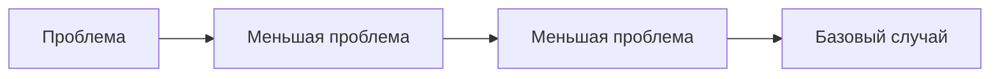

# Рекурсия

[Источник](https://www.youtube.com/watch?v=MWyVg6o3hG0&ab_channel=%D0%9A%D0%BE%D0%B4%D0%B8%D1%80%D1%83%D0%B5%D0%BC)

Рекурсия декомпозирует проблему на меньшие проблемы.



Основная задача использовать что мы можем, все остальное отдаём в более маленькую проблему.
Стараемся сделать так, чтобы каждый переход от большей проблемы к меньшей, давал нам уверенность в том, что мы приближаемся к базовому случаю.

## Структура рекурсии

```js
function RecursionFuncion(n) {
  if (n === 0) {
    return 0;
  }

  return n + RecursionFuncion(n - 1);
}
```

`n` - текущее состояние(current state). Лучше представлять его как нечто неизменяемое, тогда функция будет стремиться к чистой функции.

`return n + RecursionFuncion(n - 1);` - рекурсивный случай (функция перехода) указывает как из более сложного состояния (current state) перейти в более простое

**Суть мышления**:

Функцию стоит представлять как _black box_ - нам передали, что-то сделали с переданными значениями и вернули результат выполнения функций. Функция не зависит ни от чего извне.
Следует стремиться найти рекурсивный случай / функцию перехода / условие перехода.

## Tail recursion optimization

Если компилятор языка поддерживает оптимизацию рекурсии, то мы можем её запустить.

Например

```js
const sum = (n) => {
  if (n === 0) {
    return 0;
  }

  return n + sum(n - 1);
};
```

`return n + sum(n - 1);` - Здесь выполняется рекурсивно ф-ция `sum` и `n +`.

`n + ` - это операция, которая выполняется после того, как `sum(n - 1)` будет завершен.
Это две операции, но если вычисление привести к одной операции, то у компилятора (который умеет это делать), появляется возможность **оптимизировать** эту функцию и превратить её в _итеративный_ вид.

### Оптимизация

```js
const sum = (n, total) => {
  if (n === 0) {
    return total;
  }
  return sum(n - 1, total + n);
};
```

`return sum(n - 1, total + n);` - Нам необходимо переписать функцию так, чтобы рекурсивный вызов был последним действием.

## Examples

### getSum

```js
const getSum = (n) => {
  if (n === 0) {
    return 0;
  }
  return n + getSum(n - 1);
};
```

### getLength

```js
const getLength = (nums, index) => {
  if (index === -1) {
    return 0;
  }

  return 1 + getLength(nums, index - 1);
};

getLength([1, 2, 3, 4], 3);

// Snapshots
// 1 shansphot
//              nums = [1,2,3,4,], index = 3
const getLength = (nums, index) => {
  // index = 3
  if (index === -1) {
    return 0;
  }
  //  1 + getLength([1, 2, 3, 4], 3 - 1)
  return 1 + getLength(nums, index - 1);
  //   snapshot 2 returns 3, result of expression is 4;
};

// 2 snapshot
//              nums = [1,2,3,4], index = 2
const getLength = (nums, index) => {
  // index = 2
  if (index === -1) {
    return 0;
  }

  //  1 + getLength([1, 2, 3, 4], 2 - 1)
  return 1 + getLength(nums, index - 1);
  //   snapshot 3 returns 2, result of expression = 3
};

// 3 snapshot
//              nums = [1,2,3,4], index = 1
const getLength = (nums, index) => {
  // index = 1
  if (index === -1) {
    return 0;
  }

  //  1 + getLength([1, 2, 3, 4], 1 - 1)
  return 1 + getLength(nums, index - 1);
  // snapshot 4 returns 1, result of expression = 2;
};

// 4 snapshot
//              nums = [1,2,3,4], index = 0
const getLength = (nums, index) => {
  // index = 0
  if (index === -1) {
    return 0;
  }

  //  1 + getLength([1, 2, 3, 4], 0 - 1)
  return 1 + getLength(nums, index - 1);
  // snapshot 5 returns 0. result of expression = 1;
};

// 5 snapshot
//              nums = [1,2,3,4], index = 0
const getLength = (nums, index) => {
  // BASE CASE
  // index = -1
  if (index === -1) {
    return 0;
  }

  //  STOP RECURSION
  return 1 + getLength(nums, index - 1);
};
```

```
  getLength([1,2,3,4], 3)
    -> 1 + getLength([1,2,3,4], 2)
      -> 1 + getLength([1,2,3,4], 1)
        -> 1 + getLength([1,2,3,4], 0)
          -> 1 + getLength([1,2,3,4], -1)
            -> 0 // base case

  getLength([1,2,3,4], -1) = 0;
  getLength([1,2,3,4], 0) = 1 + 0 = 1;
  getLength([1,2,3,4], 1) = 1 + 1 = 2;
  getLength([1,2,3,4], 2) = 1 + 2 = 3;
  getLength([1,2,3,4], 2) = 1 + 3 = 4;
```

### getTail

```javascript
const getTail = (nums, index) => {
  if (index === nums.length - 1) {
    return nums[index];
  }

  return getTail(nums, index + 1);
};
getTail([1, 2, 3, 4], 0);
```

```
getTail([1,2,3,4],0)
 -> getTail([1,2,3,4], 1)
  -> getTail([1,2,3,4], 2]
    -> getTail([1,2,3,4], 3]
      -> 4 // BASE CASE
```

### arraysAreEqual

```js
const arraysAreEqual = (first, second, f, s) => {
  if (f === -1 && s === -1) return true;
  if (f === -1 || s === -1) return false;
  if (first[f] !== second[s]) return false;

  return arraysAreEqual(first, second, f - 1, s - 1);
};
```

### getProduct

```js
const getProduct = (nums, index) => {
  if (index === -1) {
    return 1;
  }

  return nums[index] * getProduct(nums, index - 1);
};
```

### getFactorial

```js
const getFactorial = (n) => {
  if (n === 1) {
    return 1;
  }

  return n * getFactorial(n - 1);
};
```

### getPower

```js
const getPower = (base, power) => {
  if (power === 0) {
    return 1;
  }

  if (power & 1) {
    return base * getPower(base, power - 1);
  }

  return base * getPower(base * base, power / 2);
};
```

### getMin

```js
const getMin = (nums, index) => {
  if (index === -1) {
    return Infinity;
  }

  return Math.min(nums[index], getMin(nums, index - 1));
};
```

### exists

```js
const exists = (nums, target, n) => {
  if (n === -1) {
    return false;
  }

  if (nums[n] === target) {
    return true;
  }

  return exists(nums, target, n - 1);
};
```

### getMaxRange

```js
const getMaxRange = (nums, i, j) => {
  if (i > j) {
    return -Infinity;
  }

  return max(getMaxRange(nums, i + 1, j));
};
```

### getScqrtBinarySearch

```js
const getSqrtBinarySearch = (n, lo = 0, hi = n, epsilon = 0.0001) => {
  if (hi - lo < epsilon) {
    return lo;
  }

  const mid = lo + (hi - lo) / 2;

  if (mid * mid <= n) {
    return getSqrtBinarySearch(n, mid, hi, epsilon);
  } else {
    return getSqrtBinarySearch(n, lo, mid, epsilon);
  }
};
```

### isPalindrome

```js
const isPalindrome = (s, i, j) => {
  if (i > j) {
    true;
  }

  return s[i] === s[j] && isPalindrome(s, i + 1, j - 1);
};
```

```js
const getReversed = (nums, i, j) => {
  if (i >= j) {
    return [nums[i]];
  }

  return [...getReversed(nums, i + 1, j), nums[i]];
};
```
