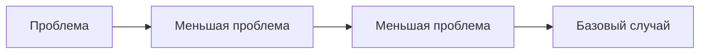

# Рекурсия

[Источник](https://www.youtube.com/watch?v=MWyVg6o3hG0&ab_channel=%D0%9A%D0%BE%D0%B4%D0%B8%D1%80%D1%83%D0%B5%D0%BC)

Рекурсия декомпозирует проблему на меньшие проблемы.



Основная задача использовать что мы можем, все остальное отдаём в более маленькую проблему.
Стараемся сделать так, чтобы каждый переход от большей проблемы к меньшей, давал нам уверенность в том, что мы приближаемся к базовому случаю.

## Структура рекурсии

`n` - текущее состояние(current state). Лучше представлять его как нечто неизменяемое, тогда функция будет стремиться к чистой функции.

`return n + RecursionFuncion(n - 1);` - рекурсивный случай (функция перехода) указывает как из более сложного состояния (current state) перейти в более простое

```js
function RecursionFuncion(n) {
  if (n === 0) {
    return 0;
  }

  return n + RecursionFuncion(n - 1);
}
```

**Суть мышления**:

Функцию стоит представлять как _black box_ - нам передали, что-то сделали с переданными значениями и вернули результат выполнения функций. Функция не зависит ни от чего извне.
Следует стремиться найти рекурсивный случай / функцию перехода / условие перехода.
