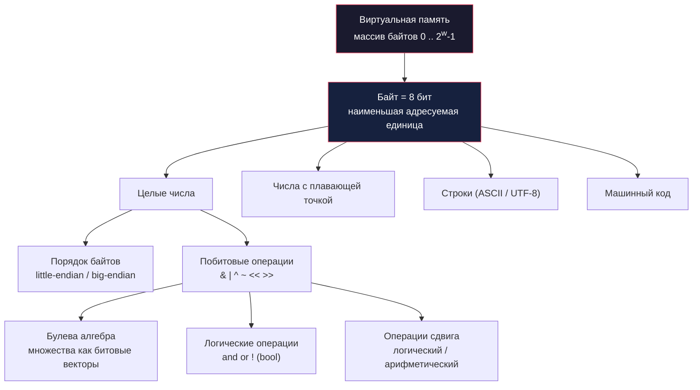

# Глава: CS:APP 2.1 --- Хранение информации

> [!info] Контекст
> Этот раздел --- **язык**, на котором написаны все следующие главы книги. Здесь мы разберём, как компьютер хранит данные на уровне байтов: почему одно и то же число может занимать разное количество памяти, зачем существует порядок байтов, и как побитовые операции позволяют упаковывать, извлекать и трансформировать данные за одну инструкцию.
>
> **Пререквизиты:** [[1.chapter|Глава 1 --- Экскурс в компьютерные системы]], базовое понимание двоичной системы.
>
> **Язык примеров:** Zig --- прямой доступ к памяти и битам, строгая типизация, предсказуемые размеры типов.

---

## Введение: что значит хранить число?

Напиши `const x = 12345` в JavaScript --- и рантайм тихо выделит 8 байт, потому что все числа в JS это IEEE 754 float64. Напиши `const x: i32 = 12345` в Zig --- и компилятор выделит ровно 4 байта. Одно число, разное количество памяти, разный двоичный паттерн.

Но ещё интереснее: если заглянуть в эти байты напрямую, то `12345` в `i32` --- это `39 30 00 00` (на x86), а в `f64` --- что-то вроде `00 00 00 00 80 1C C8 40`. Одно число --- совершенно разные последовательности байтов.

Этот раздел объясняет, **почему** так происходит и **как** это работает. Без этого невозможно понять ни целочисленное переполнение, ни плавающую точку, ни сетевые протоколы.

> [!tip] JS-мост
> Если ты работал с `ArrayBuffer` --- ты уже знаком с моделью «память = массив байтов». А `DataView` --- это по сути `show_bytes` из книги: способ посмотреть на одни и те же байты как на `Int32`, `Float64` или `Uint8`.
> ```javascript
> const buf = new ArrayBuffer(4);
> const view = new DataView(buf);
> view.setInt32(0, 12345, true); // true = little-endian
> // Теперь в buf лежат байты: 39 30 00 00
> ```



---

## Шаг 1: Память --- это просто массив байтов

Представь огромный `Uint8Array` с адресами от 0 до какого-то максимума. Это и есть **виртуальная память** --- абстракция, которую ОС предоставляет каждой программе.

**Байт** --- наименьшая адресуемая единица. Один байт = 8 бит = значение от 0 до 255.

Машина **не знает типов**. Для неё `0xDEADBEEF` --- это просто четыре байта. Число ли это, указатель или кусок строки --- решает программист (и компилятор).

```zig
const std = @import("std");

pub fn main() void {
    const x: u32 = 0xDEADBEEF;

    // Смотрим на переменную как на массив байтов
    const bytes = std.mem.asBytes(&x);
    std.debug.print("u32 как байты: ", .{});
    for (bytes) |b| std.debug.print("{x:0>2} ", .{b});
    std.debug.print("\n", .{});
    // На x86 (little-endian): ef be ad de
}
```

**Адресное пространство** определяется размером слова процессора:

| Размер слова | Макс. адрес | Объём |
|---|---|---|
| 32 бита | `0xFFFFFFFF` | 4 ГБ |
| 64 бита | `0xFFFFFFFFFFFFFFFF` | 16 ЭБ (эксабайт) |

> [!tip] JS-мост
> `ArrayBuffer(16)` --- 16 байт подряд, без типа. `new Uint32Array(buf)` --- интерпретация тех же байтов как четырёх 32-битных чисел. `new Float64Array(buf)` --- как двух 64-битных float. Байты те же, интерпретация разная.

> [!tip] Ключевой вывод
> С точки зрения машины **всё** --- числа, строки, указатели, инструкции --- это просто байты. Смысл придаёт контекст.

---

## Шаг 2: Hex --- компактный язык для байтов

Подробный разбор --- в отдельной заметке: **[[2.1.1 . Шестнадцатеричная система счисления]]**.

### Проблема

Двоичная запись слишком длинная: `11011110101011011011111011101111` --- попробуй прочитать. Десятичная (`3735928559`) не раскладывается на биты в голове. Нужен компромисс.

### Главная идея

**1 hex-цифра = ровно 4 бита.** Это всё, что нужно запомнить.

Число выше --- это просто `0xDEADBEEF`. Четыре символа на байт, каждый символ сразу виден как группа из 4 бит.

> [!tip] JS-мост: ты уже используешь hex
> CSS-цвет `#FF8800` --- это три байта: `FF` (красный = 255), `88` (зелёный = 136), `00` (синий = 0). Hex каждый день.

### Таблица hex-цифр

```
Hex:  0    1    2    3    4    5    6    7
Bin:  0000 0001 0010 0011 0100 0101 0110 0111

Hex:  8    9    A    B    C    D    E    F
Bin:  1000 1001 1010 1011 1100 1101 1110 1111
```

### Перевод степеней двойки в hex

Правило: `2^n` в двоичном --- единица и `n` нулей. Каждые 4 нуля --- один hex-ноль.

- `2^8 = 1_0000_0000` = `0x100`
- `2^12 = 1_0000_0000_0000` = `0x1000`
- `2^16` = `0x10000`

Если `n` не кратно 4, первая группа: `n mod 4 = 1` -> `2`, `= 2` -> `4`, `= 3` -> `8`.
Пример: `2^9 = 2 * 2^8` = `0x200`. `2^14 = 4 * 2^12` = `0x4000`.

### Литералы в Zig

```zig
const hex_val: u16 = 0xC97B;
const bin_val: u8  = 0b11001100;
const dec_val: u32 = 42;
const oct_val: u32 = 0o755; // восьмеричный (пригодится для Unix permissions)
```

> [!tip] Ключевой вывод
> Hex --- это не «другая система счисления», а **компактная запись бит**. Одна цифра = 4 бита = полубайт (nibble). Два hex-символа = один байт.

---

## Шаг 3: Сколько байтов занимает переменная

### Размер слова

**Word size** --- ширина регистров процессора. Определяет:
- максимальный размер виртуального адресного пространства
- «естественный» размер данных для эффективной работы

> [!tip] Почему 64-bit OS может запускать 32-bit программы
> 64-битный процессор поддерживает оба режима. Программа под 32 бита использует 4-байтовые указатели и видит только 4 ГБ --- обратная совместимость.

### Проблема C: платформозависимые размеры

`sizeof(long)` = 4 байта на Windows x64, но 8 байт на Linux x64. Это источник реальных багов при миграции 32 -> 64 бит: структуры данных меняют размер, бинарные файлы перестают читаться, сетевые протоколы ломаются.

### Zig решает эту проблему

В Zig **все** целочисленные типы имеют фиксированный размер. `i32` --- это всегда ровно 4 байта, на любой платформе. Единственное исключение --- `usize` / `isize`, размер которых равен размеру указателя.

| C тип | Zig тип | Байты | Примечание |
|---|---|---|---|
| `char` | `i8` | 1 | |
| `unsigned char` | `u8` | 1 | |
| `short` | `i16` | 2 | |
| `int` | `i32` | 4 | |
| `long` (Linux x64) | `i64` | 8 | В C зависит от платформы! |
| `size_t` | `usize` | 4 или 8 | Единственный платформозависимый |
| `float` | `f32` | 4 | |
| `double` | `f64` | 8 | |
| `char *` / `void *` | `*anyopaque` / `usize` | 4 или 8 | |

### Бонус Zig: произвольная ширина

В отличие от C, Zig позволяет создавать целые числа **любой** ширины: `u3`, `u7`, `i12`, `u128`. Это полезно для побитовых операций и протоколов с нестандартными размерами полей.

### `@sizeOf` --- comptime-проверка

```zig
const std = @import("std");

pub fn main() void {
    std.debug.print("i32:    {} байт\n", .{@sizeOf(i32)});     // 4
    std.debug.print("i64:    {} байт\n", .{@sizeOf(i64)});     // 8
    std.debug.print("f64:    {} байт\n", .{@sizeOf(f64)});     // 8
    std.debug.print("usize:  {} байт\n", .{@sizeOf(usize)});   // 8 на 64-bit
    std.debug.print("*u32:   {} байт\n", .{@sizeOf(*u32)});    // = @sizeOf(usize)
}
```

> [!tip] Ключевой вывод
> Размер типа определяет, сколько байтов занимает объект в памяти. В Zig размеры предсказуемы --- единственное исключение `usize`. В C --- минное поле при переносе между платформами.

---

## Шаг 4: Порядок байтов --- endianness

Более ранний черновик: [[2.1.3. Адресация и порядок следования байтов]].

### Вопрос

Если `i32` занимает 4 байта, в каком порядке они лежат в памяти?

### Аналогия: формат даты

Одна и та же дата: **30 марта 2026**.
- Европа: **30.03.2026** --- маленькая единица (день) первой.
- США: **03/30/2026** --- средняя единица первой.
- ISO: **2026-03-30** --- большая единица (год) первой.

Те же данные, разный порядок записи. Точно так же с байтами в памяти.

### Конкретный пример: `0x01234567` по адресу `0x100`

```
                   Байты числа: 01  23  45  67
                                ^^          ^^
                           старший     младший
                            (MSB)       (LSB)

Big-endian (сетевой порядок):
  Адрес:  0x100  0x101  0x102  0x103
  Байт:    01     23     45     67
           MSB -----------------------> LSB

Little-endian (x86, ARM):
  Адрес:  0x100  0x101  0x102  0x103
  Байт:    67     45     23     01
           LSB -----------------------> MSB
```

**Мнемоника:** little-endian = «маленький конец» (младший байт, LSB) лежит по наименьшему адресу. Как европейский формат даты --- маленькое первым.

> [!tip] Откуда названия
> Термины придумал Дэнни Коэн в 1980 году, отсылая к «Путешествиям Гулливера» Свифта, где лилипуты воевали из-за того, с какого конца разбивать яйцо --- с тупого (big end) или острого (little end). Статья так и называлась: *"On Holy Wars and a Plea for Peace"*.

### Три случая, когда endianness важен

Для большинства программ endianness прозрачен. Но есть **три ситуации**, когда он вылезает:

**1. Сетевые протоколы.** TCP/IP использует big-endian (он же «сетевой порядок»). Если машина little-endian, при отправке и получении многобайтных данных нужна конвертация. Вот почему в `DataView` есть параметр `littleEndian`:

```javascript
// JS: отправляем число по сети в big-endian
const buf = new ArrayBuffer(4);
const view = new DataView(buf);
view.setUint32(0, 0x01234567, false); // false = big-endian
// buf: [01, 23, 45, 67] --- готово к отправке
```

**2. Чтение дизассемблированного кода.** Байты машинных инструкций в дампе памяти расположены в порядке endianness платформы. На x86 нужно мысленно переставлять байты, чтобы увидеть адреса и константы.

**3. Type punning** --- когда одни и те же байты интерпретируются как данные другого типа. Например, смотрим на `f32` как на `u32`, чтобы разобрать знак, экспоненту и мантиссу. Порядок байтов определяет, что именно мы увидим.

### Zig: работа с порядком байтов

```zig
const std = @import("std");
const builtin = @import("builtin");

fn showBytes(label: []const u8, bytes: []const u8) void {
    std.debug.print("{s}: ", .{label});
    for (bytes) |b| std.debug.print("{x:0>2} ", .{b});
    std.debug.print("\n", .{});
}

pub fn main() void {
    // Определяем endianness платформы
    const native = builtin.target.cpu.arch.endian();
    std.debug.print("Endianness: {}\n", .{native});

    // Смотрим на байты числа
    const val: u32 = 0x01234567;
    showBytes("0x01234567", std.mem.asBytes(&val));
    // x86: 67 45 23 01  (little-endian)

    // Byte swap --- переворот порядка
    const swapped = @byteSwap(val); // 0x67452301
    std.debug.print("@byteSwap = 0x{x:0>8}\n", .{swapped});

    // Запись в конкретном порядке
    var buf: [4]u8 = undefined;
    std.mem.writeInt(u32, &buf, val, .big);
    showBytes("big-endian", &buf);    // 01 23 45 67

    std.mem.writeInt(u32, &buf, val, .little);
    showBytes("little-endian", &buf); // 67 45 23 01

    // Чтение обратно
    const read_back = std.mem.readInt(u32, &buf, .little);
    std.debug.print("read_back = 0x{x:0>8}\n", .{read_back}); // 0x01234567
}
```

> [!tip] Ключевой вывод
> Endianness --- это соглашение о порядке байтов многобайтного значения в памяти. Для прикладного кода обычно прозрачен, но при работе с сетью, бинарными форматами или дизассемблером --- критически важен.

---

## Шаг 5: Строки и машинный код --- данные без типов

### Строки: ASCII, null-terminator, Unicode

Ранний черновик: [[2.1.4. Представление строк]].

В C строка --- массив символов, завершённый **нулевым байтом** `0x00` (null-terminator). Каждый ASCII-символ --- один байт:

```
Строка "12345":  31 32 33 34 35 00
                 '1' '2' '3' '4' '5' null
```

**Endianness не влияет на строки** --- каждый символ занимает один байт, а порядок байтов касается только многобайтных значений.

#### Zig: строки

В Zig строковый литерал имеет тип `*const [N:0]u8` --- указатель на массив из `N` байтов с sentinel `0`. Поле `.len` считает **байты**, не символы:

```zig
const std = @import("std");

pub fn main() void {
    const s = "12345"; // тип: *const [5:0]u8
    const bytes: []const u8 = s;

    for (bytes) |b| std.debug.print("{x:0>2} ", .{b});
    std.debug.print("\n", .{});
    // 31 32 33 34 35

    // Null-terminator доступен через sentinel
    std.debug.print("null-terminator: {x:0>2}\n", .{s[5]}); // 00
    std.debug.print("len: {}\n", .{bytes.len}); // 5
}
```

#### JS-ловушка: длина строки

```javascript
"Hello".length     // 5 --- всё ок, ASCII
"Привет".length    // 6 --- НЕ байты! Это UTF-16 code units

new TextEncoder().encode("Привет").length  // 12 --- вот реальные байты (UTF-8)
```

В Zig `"Привет".len` = 12, потому что `.len` считает UTF-8 байты (кириллица = 2 байта на символ). Честнее, чем JS.

### Машинный код: те же байты, другая архитектура = другой смысл

Простая функция:

```zig
fn sum(a: i32, b: i32) i32 {
    return a + b;
}
```

Компилируется в **разные байты** на разных архитектурах:

```
x86-64:  89 f8 01 f0 c3
ARM64:   0b 00 00 8b c0 03 5f d6
RISC-V:  00b50533 00008067
```

Все три делают одно и то же, но **бинарно несовместимы**. Живой пример: при переходе Mac на Apple Silicon (ARM) старые x86-приложения не запускались напрямую --- потребовался Rosetta (транслятор инструкций). Docker-образы тоже привязаны к архитектуре: `linux/amd64` != `linux/arm64`.

> [!tip] Ключевой вывод
> Строки менее чувствительны к архитектуре (побайтовая обработка), а машинный код полностью привязан к ней. Одни и те же байты на разной архитектуре --- бессмыслица.

---

## Шаг 6: Побитовые операции --- булева алгебра на практике

Ранний черновик: [[2.1.6. Введение в булеву алгебру]].

### Сквозной пример: RGB-цвет

CSS-цвет `#FF8800` --- это три значения, упакованных в одно число:

```
0xFF8800 = 1111 1111  1000 1000  0000 0000
           ^^^^^^^^   ^^^^^^^^   ^^^^^^^^
           Red=255    Green=136  Blue=0
```

Как работать с такой упаковкой? Четыре побитовые операции --- AND, OR, XOR, NOT.

### AND (`&`): маскирование --- извлечь часть

Чтобы извлечь красный канал, нужно «выключить» все биты кроме нужных:

```zig
const color: u24 = 0xFF8800;
const red = (color >> 16) & 0xFF; // 0xFF = 255
const green = (color >> 8) & 0xFF; // 0x88 = 136
const blue = color & 0xFF;         // 0x00 = 0
```

AND с маской `0xFF` оставляет только младшие 8 бит, остальное обнуляет.

### OR (`|`): упаковка --- собрать обратно

```zig
const r: u24 = 255;
const g: u24 = 136;
const b: u24 = 0;
const packed = (r << 16) | (g << 8) | b; // 0xFF8800
```

OR «включает» биты на нужных позициях. Поскольку сдвиги развели каналы по разным позициям, пересечений нет.

### XOR (`^`): инвертирование --- негатив цвета

```zig
const negative = color ^ 0xFFFFFF; // 0x0077FF --- инверсия каждого канала
```

XOR с `1` переключает бит: `0` -> `1`, `1` -> `0`. XOR с маской из единиц --- инверсия.

### NOT (`~`): полное дополнение

```zig
const inverted = ~@as(u24, color); // инвертирует ВСЕ 24 бита
```

### Таблицы истинности --- формализация

Теперь, когда понятна практика, вот формальные таблицы:

```
a  b  | a & b  a | b  a ^ b  ~a
0  0  |   0      0      0     1
0  1  |   0      1      1     1
1  0  |   0      1      1     0
1  1  |   1      1      0     0
```

Мнемоника:
- **AND** --- оба должны быть 1 (строгий вахтёр)
- **OR** --- хотя бы один (добрый вахтёр)
- **XOR** --- ровно один (переключатель)
- **NOT** --- наоборот

### Битовые векторы как множества: Unix permissions

`chmod 755` --- это `0o755` = `0b111_101_101`:

```
      owner  group  others
0o755 = rwx    r-x    r-x
        111    101    101
```

Проверить, есть ли право execute у owner:

```zig
const perms: u9 = 0o755;
const owner_exec = perms & 0o100 != 0; // true --- бит установлен
```

Добавить write для group:

```zig
const new_perms = perms | 0o020; // 0o775
```

Убрать write для others:

```zig
const restricted = perms & ~@as(u9, 0o002); // 0o755 (и так не было)
```

Операции с множествами через биты:

| Множественная операция | Побитовая |
|---|---|
| Пересечение A **и** B | `a & b` |
| Объединение A **или** B | `a \| b` |
| Дополнение (не A) | `~a` |
| Разность A без B | `a & ~b` |
| Симметрическая разность | `a ^ b` |

### XOR-своп: интеллектуальный бонус

Свойства XOR: `a ^ a = 0`, `a ^ 0 = a`, коммутативность и ассоциативность. Это позволяет обменять два значения без временной переменной:

```zig
fn inplaceSwap(x: *u32, y: *u32) void {
    x.* ^= y.*; // x = x_orig ^ y_orig
    y.* ^= x.*; // y = y_orig ^ (x_orig ^ y_orig) = x_orig
    x.* ^= y.*; // x = (x_orig ^ y_orig) ^ x_orig = y_orig
}
```

> [!warning] Ловушка: `x == y`
> Если оба указателя ссылаются на **одну и ту же** ячейку памяти, первый шаг `x.* ^= x.*` обнуляет значение. После трёх шагов оба будут нулями. XOR-своп безопасен **только** когда адреса разные.

### Zig: `~` и явный тип

> [!warning] `~@as(u32, 0xFF)` --- зачем `@as`?
> Литерал `0xFF` в Zig имеет тип `comptime_int` (бесконечная точность). Операция `~` над ним даёт `-256`, а не `0xFFFFFF00`. Чтобы получить инверсию в рамках конкретной ширины, нужно указать тип:
> ```zig
> ~@as(u32, 0xFF)  // = 0xFFFFFF00 --- правильно
> ~0xFF             // = -256 (comptime_int) --- не то, что нужно
> ```

> [!info]- bis и bic --- операции Set и Clear
> В книге рассматриваются операции **bis** (bit set) и **bic** (bit clear):
> - `bis(x, m) = x | m` --- установить биты, где `m = 1`
> - `bic(x, m) = x & ~m` --- сбросить биты, где `m = 1`
>
> Через них выражаются OR и XOR:
> - `x | y = bis(x, y)`
> - `x ^ y = bis(bic(x, y), bic(y, x))` --- «биты, которые есть ровно в одном из двух»

> [!tip] Ключевой вывод
> Побитовые операции --- это булева алгебра, применённая к каждому биту числа. На практике это инструмент для упаковки/извлечения данных (RGB, permissions, флаги протоколов) и выполнения теоретико-множественных операций за одну инструкцию.

---

## Шаг 7: Логические операции --- условия, не биты

### Ключевое разграничение

Побитовые операции (`&`, `|`, `^`, `~`) работают **с каждым битом** числа. Логические (`and`, `or`, `!`) работают **со значением целиком** и возвращают `bool`.

Вот пример, где результат **разный**:

```
Побитовое:  0x66 & 0x39 = 0x20    (число, не ноль)
Логическое: (0x66 != 0) and (0x39 != 0) = true  (оба ненулевые)
```

Побитовая операция обработала каждую пару битов и получила `0x20`. Логическая посмотрела на каждый операнд целиком: оба ненулевые, значит `true`.

### В Zig логические операции строго типизированы

| C выражение | Zig эквивалент | Результат |
|---|---|---|
| `!0x41` | `0x41 == 0` | `false` |
| `0x69 && 0x55` | `(0x69 != 0) and (0x55 != 0)` | `true` |
| `0x00 \|\| 0x55` | `(0x00 != 0) or (0x55 != 0)` | `true` |

> [!warning] `~` vs `!` в Zig
> `~` --- побитовое NOT для целых чисел (инвертирует каждый бит).
> `!` --- логическое NOT **только для `bool`**.
> Применение `!` к числу --- ошибка компиляции. Путаница между ними --- частый баг в C.

### Short-circuit evaluation

Логические операторы `and` и `or` вычисляются **лениво**: если результат определён по левому операнду, правый не вычисляется.

```zig
// Защита от деления на ноль
if (b != 0 and @divTrunc(a, b) > 5) {
    // Если b == 0, деление НЕ выполняется
}
```

> [!tip] JS-мост
> В JS `&&`/`||` работают с любыми значениями через truthy/falsy и возвращают один из операндов (не обязательно `bool`): `0 || "default"` = `"default"`. В Zig `and`/`or` принимают **только `bool`** и возвращают **только `bool`**. Строже и безопаснее.

> [!tip] Ключевой вывод
> Побитовые и логические операции --- разные вещи. Побитовые обрабатывают каждый бит, логические --- всё значение целиком. В Zig нет неявного приведения чисел к `bool`, что исключает целый класс ошибок.

---

## Шаг 8: Сдвиги --- умножение и деление степенями двойки

### Главный инсайт

- `x << k` = `x * 2^k` --- сдвиг влево = умножение на степень двойки
- `x >> k` приблизительно `x / 2^k` --- сдвиг вправо = деление (с нюансами)

Это быстрее обычного умножения и деления, и именно поэтому компиляторы часто заменяют `x * 8` на `x << 3`.

### Левый сдвиг (`<<`)

Всегда **логический**: биты сдвигаются влево, справа заполняются нулями:

```
  x       = 10110100
  x << 3  = 10100000  (три правых позиции заполнены нулями)
```

### Правый сдвиг (`>>`)

Тут начинается развилка:

**Логический** (для unsigned) --- слева заполняется нулями:
```
  u8:  10110100 >> 2  = 00101101    (180 / 4 = 45)
```

**Арифметический** (для signed) --- слева заполняется **копией знакового бита**:
```
  i8:  10110100 >> 2  = 11101101    (-76 / 4 = -19)
       ^                ^^
       знаковый бит     «размазан» влево
```

#### Почему арифметический сдвиг «размазывает» знаковый бит?

Интуиция: если мы делим отрицательное число на степень двойки, результат всё ещё отрицательный. Чтобы сохранить знак, нужно заполнять старшие позиции единицами (знаковым битом). Если бы заполнялись нулями, `-76 >> 2` дало бы `45` --- положительное число, что неверно для деления.

```zig
const std = @import("std");

pub fn main() void {
    const u: u8 = 0b10110100; // 180
    const s: i8 = @bitCast(u); // те же биты, но как i8 = -76

    // Тип определяет поведение:
    const logical = u >> 2;    // логический: 0b00101101 = 45
    const arith = s >> 2;      // арифметический: 0b11101101 = -19

    std.debug.print("u8 >> 2 = {}\n", .{logical}); // 45
    std.debug.print("i8 >> 2 = {}\n", .{arith});   // -19
}
```

### JS-мост: `>>` vs `>>>`

В JS есть **два** оператора правого сдвига:
- `>>` --- арифметический (копирует знаковый бит)
- `>>>` --- логический (заполняет нулями)

```javascript
-1 >> 0     // -1    (арифметический, знак сохранён)
-1 >>> 0    // 4294967295  (логический, все 32 бита = 1, читаем как unsigned)
```

В Zig выбор между логическим и арифметическим определяется **типом операнда**: `u8 >> 2` --- логический, `i8 >> 2` --- арифметический. Явно и однозначно.

### Тип правого операнда: `Log2Int`

> [!important] Почему правый операнд `u3` для `u8`?
> Максимальный допустимый сдвиг для `u8` --- это 7 (сдвиг на 8 бит уже запрещён). Числа 0--7 вмещаются в `u3` (3 бита, `log2(8) = 3`). Zig использует тип `Log2Int(T)`:
>
> | Тип значения | Тип сдвига | Диапазон |
> |---|---|---|
> | `u8` / `i8` | `u3` | 0--7 |
> | `u16` / `i16` | `u4` | 0--15 |
> | `u32` / `i32` | `u5` | 0--31 |
> | `u64` / `i64` | `u6` | 0--63 |
>
> Это **не ограничение**, а **защита**: невозможно даже выразить недопустимый сдвиг.

### Сдвиг >= w запрещён

В C сдвиг на количество бит >= ширине типа --- **undefined behavior**. В Zig:
- Comptime-known значение --- **ошибка компиляции**
- Runtime значение --- **паника в debug** (illegal behavior)

```zig
const x: u8 = 42;
// const bad = x << 8;  // Ошибка компиляции: shift amount 8 is too large for u8
```

### Таблица сдвигов для `0b10110100`

Заполни вручную, потом проверь кодом:

```
Исходное значение (u8): 10110100 = 180, как i8 = -76

Операция              Результат       u8     i8
──────────────────────────────────────────────────
<< 3                  10100000        160    -96
>> 2 (u8, логич.)     00101101         45    ---
>> 2 (i8, арифм.)     11101101        ---    -19
<< 1                  01101000        104    104
>> 4 (u8, логич.)     00001011         11    ---
>> 4 (i8, арифм.)     11111011        ---     -5
```

> [!tip] Ключевой вывод
> Левый сдвиг всегда логический (нули справа). Правый --- логический для unsigned (нули слева) и арифметический для signed (копия знакового бита). Zig делает это различие явным через систему типов и запрещает сдвиги на слишком большие значения.

---

## Упражнения

### Упражнение 1: showBytes на Zig

Напиши функцию `showBytes`, которая принимает `anytype` и печатает его побайтовое представление в hex. Проверь на `i32`, `f64`, `bool` и `[4]u8`.

Подсказка: используй `std.mem.asBytes` и `@sizeOf`.

### Упражнение 2: Определение endianness

Напиши программу, которая определяет endianness текущей платформы **без использования** `builtin.target.cpu.arch.endian()`. Подсказка: запиши `u16` значение `0x0102` и посмотри на первый байт.

### Упражнение 3: RGB-упаковка

Реализуй функции:
- `packRgb(r: u8, g: u8, b: u8) -> u24` --- упаковка
- `unpackRed(color: u24) -> u8`, `unpackGreen`, `unpackBlue` --- извлечение
- `invert(color: u24) -> u24` --- инверсия (негатив)

Проверь: `packRgb(255, 136, 0)` должна вернуть `0xFF8800`.

### Упражнение 4: Множества через битовые векторы

Реализуй тип `BitSet8` (обёртка над `u8`), поддерживающий операции:
- `add(elem: u3)` --- добавить элемент (0--7)
- `remove(elem: u3)` --- удалить элемент
- `contains(elem: u3) -> bool` --- проверка принадлежности
- `unionWith(other) -> BitSet8` --- объединение
- `intersectWith(other) -> BitSet8` --- пересечение

### Упражнение 5: XOR-своп с ловушкой (упражнение 2.11 из книги)

Функция `reverseArray` переворачивает массив, используя XOR-своп. Что произойдёт при вызове с массивом нечётной длины? Исправь баг.

### Упражнение 6: Таблица сдвигов (упражнение 2.16 из книги)

Заполни таблицу сдвигов для значения `0xD4` (`u8` и `i8`), операции: `<< 2`, `>> 3` (логический), `>> 3` (арифметический). Проверь ответ программой на Zig.

---

## Anki Cards

> [!tip] Flashcards

**Q:** Что такое байт и сколько значений он может хранить?
**A:** Байт = 8 бит = наименьшая адресуемая единица памяти. Хранит значения 0..255 (256 вариантов, `0x00`--`0xFF`).

---

**Q:** Hex: сколько бит кодирует одна hex-цифра? Пример с CSS-цветом.
**A:** Одна hex-цифра = ровно 4 бита. Пример: `#FF8800` --- три байта: `FF`=255 (red), `88`=136 (green), `00`=0 (blue).

---

**Q:** Endianness: как число `0x01234567` хранится по адресу `0x100` в little-endian?
**A:** `0x100: 67, 0x101: 45, 0x102: 23, 0x103: 01`. Младший байт (LSB = `0x67`) по наименьшему адресу. Аналогия: европейская дата --- маленькое первым (ДД.ММ.ГГГГ).

---

**Q:** Назови три практических случая, когда endianness важен.
**A:** 1) Сетевые протоколы (TCP/IP = big-endian). 2) Дизассемблер (байты инструкций в порядке платформы). 3) Type punning (чтение `float` как `u32` --- порядок байтов определяет результат).

---

**Q:** Как в Zig посмотреть на сырые байты переменной?
**A:** `std.mem.asBytes(&x)` --- возвращает слайс `[]u8`, показывающий байтовое представление `x` в памяти.

---

**Q:** Что возвращает `@sizeOf(T)` в Zig? Чем `usize` отличается от `u64`?
**A:** `@sizeOf(T)` --- количество байтов типа `T` (comptime). `u64` всегда 8 байт. `usize` = размер указателя: 4 байта на 32-bit, 8 на 64-bit. `usize` используется для индексов и адресов.

---

**Q:** Чем отличается `~` от `!` в Zig?
**A:** `~` --- побитовое NOT для целых чисел (инвертирует каждый бит). `!` --- логическое NOT только для `bool`. Применение `!` к числу --- ошибка компиляции.

---

**Q:** Зачем писать `~@as(u32, 0xFF)` а не `~0xFF` в Zig?
**A:** Литерал `0xFF` имеет тип `comptime_int` (бесконечная точность). `~0xFF` = `-256`, а не `0xFFFFFF00`. `@as(u32, 0xFF)` фиксирует ширину 32 бита, и `~` даёт правильное `0xFFFFFF00`.

---

**Q:** Как извлечь красный канал из RGB-цвета `0xFF8800` через сдвиги и маски?
**A:** `(color >> 16) & 0xFF` = `0xFF` = 255. Сдвиг вправо на 16 бит перемещает красный канал в младший байт, маска `0xFF` оставляет только его.

---

**Q:** Как через побитовые операции проверить/добавить/убрать Unix permission?
**A:** Проверить execute у owner: `perms & 0o100 != 0`. Добавить write для group: `perms | 0o020`. Убрать write для others: `perms & ~@as(u9, 0o002)`.

---

**Q:** Побитовые vs логические: чему равны `0x66 & 0x39` и `(0x66 != 0) and (0x39 != 0)`?
**A:** `0x66 & 0x39 = 0x20` (побитовая обработка каждой пары бит). `(0x66 != 0) and (0x39 != 0) = true` (оба ненулевые). Побитовая даёт число, логическая --- `bool`.

---

**Q:** Что такое short-circuit evaluation? Пример.
**A:** Ленивое вычисление: `false and expr` --- `expr` не вычисляется. Пример: `b != 0 and @divTrunc(a, b) > 5` --- если `b == 0`, деление не выполняется.

---

**Q:** Чем `>>` отличается от `>>>` в JavaScript? Аналог в Zig?
**A:** `>>` --- арифметический (копирует знаковый бит). `>>>` --- логический (заполняет нулями). `(-1 >>> 0) = 4294967295`. В Zig тип определяет поведение: `u8 >> 2` = логический, `i8 >> 2` = арифметический.

---

**Q:** В чём разница между арифметическим и логическим правым сдвигом?
**A:** Логический (unsigned): слева заполняется нулями. Арифметический (signed): слева копируется знаковый бит, сохраняя знак числа. Пример: `i8(-76) >> 2 = -19` (единицы слева), `u8(180) >> 2 = 45` (нули слева).

---

**Q:** Log2Int: почему правый операнд сдвига для `u8` имеет тип `u3`?
**A:** Макс. допустимый сдвиг для `u8` --- 7 (на 8 уже нельзя). Числа 0--7 вмещаются в `u3` (`log2(8) = 3`). Zig требует тип `Log2Int(T)` --- невозможно даже выразить недопустимый сдвиг.

---

**Q:** Null-terminator в C/Zig vs длина строки в JS: в чём разница?
**A:** C/Zig: строка заканчивается байтом `0x00` (null-terminator). Длина определяется поиском нуля. Zig: `*const [N:0]u8`, `.len` = байты. JS: `"str".length` = UTF-16 code units (не байты!). `"Привет".length = 6`, но реальных UTF-8 байт = 12.

---

**Q:** Чему равно `"Привет".length` в JS и `"Привет".len` в Zig?
**A:** JS: `.length = 6` (UTF-16 code units, каждая кириллическая буква = 1 code unit). Zig: `.len = 12` (UTF-8 байты, каждая кириллическая буква = 2 байта). Реальный размер в памяти ближе к Zig-ответу.

---

## Related Topics

- [[2.1.1 . Шестнадцатеричная система счисления]] --- подробный разбор hex-системы
- [[2.1.3. Адресация и порядок следования байтов]] --- ранний черновик по endianness
- [[2.1.4. Представление строк]] --- ранний черновик по строкам и ASCII
- [[2.1.6. Введение в булеву алгебру]] --- ранний черновик по булевой алгебре
- [[1.chapter|Глава 1 --- Экскурс в компьютерные системы]] --- предыдущая глава
- [[2.2-overview|Глава 2.2 --- Целочисленные представления]] --- следующий раздел

---

## Sources

- Bryant R., O'Hallaron D. --- *Computer Systems: A Programmer's Perspective*, 3rd Edition, Chapter 2.1
- Zig Language Reference: https://ziglang.org/documentation/master/
- Zig `std.mem` documentation: https://ziglang.org/documentation/master/std/#std.mem
- Zig builtins (`@byteSwap`, `@sizeOf`, `@bitCast`): https://ziglang.org/documentation/master/
- Danny Cohen, "On Holy Wars and a Plea for Peace" (1980): https://www.ietf.org/rfc/ien/ien137.txt
- Unicode Consortium --- UTF-8 encoding: https://www.unicode.org/faq/utf_bom.html
