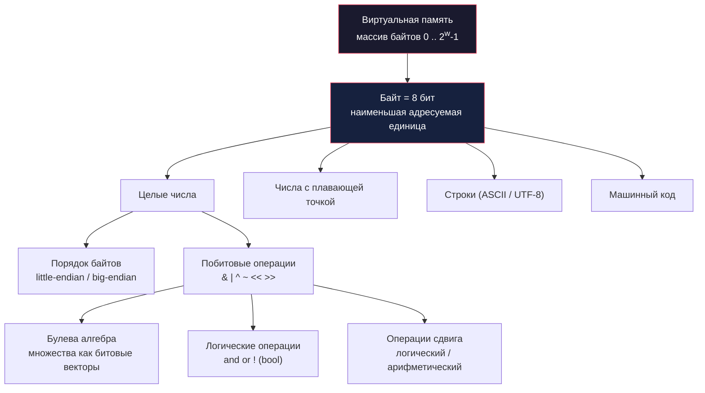

# Глава: CS:APP 2.1 --- Хранение информации

> [!info] Контекст
> Это первый раздел второй главы Брайанта и О'Халларона. Он закладывает фундамент для всего, что будет дальше: представление целых чисел, чисел с плавающей точкой и машинных инструкций. Здесь мы разбираем, **как именно** компьютер хранит данные на уровне байтов, почему порядок этих байтов имеет значение и какие операции с битами доступны программисту.
>
> **Пререквизиты:** [[1.chapter|Глава 1 --- Экскурс в компьютерные системы]], базовое знание двоичной системы.
>
> **Язык примеров:** Zig (вместо C из оригинала). Zig выбран потому, что даёт прямой доступ к памяти и битовым операциям, но при этом строже к типам и безопаснее в работе с указателями.

---

## Обзор

Глава 2.1 отвечает на вопрос: **как последовательность нулей и единиц превращается в числа, строки и программы?** Ответ --- через адресацию, порядок байтов и интерпретацию.



**Ключевые идеи раздела:**

1. Память --- это просто массив байтов. Машина **не знает** типов.
2. Один и тот же набор байтов можно прочитать как целое, как float или как строку --- всё зависит от интерпретации.
3. Порядок байтов (endianness) определяет, как многобайтные значения раскладываются в памяти.
4. Побитовые операции --- это булева алгебра, применённая к каждому биту числа.
5. Сдвиги --- это умножение и деление на степени двойки, но с нюансами для знаковых чисел.

---

## Deep Dive

### 2.1 --- Хранение информации: базовые понятия

Компьютер работает с данными через **виртуальную память** --- абстракцию, которая представляет всю доступную программе память как один огромный массив байтов.

**Байт** (byte) --- это наименьшая адресуемая единица памяти, состоящая из **8 бит**. Каждый байт может хранить значение от `0` до `255` (или от `0x00` до `0xFF`).

**Виртуальное адресное пространство** --- это набор всех возможных адресов. На машине с размером слова `w` бит адреса лежат в диапазоне от `0` до `2^w - 1`:

| Размер слова | Макс. адрес | Объём адресного пространства |
|---|---|---|
| 32 бита | `0xFFFFFFFF` | 4 ГБ |
| 64 бита | `0xFFFFFFFFFFFFFFFF` | 16 ЭБ (эксабайт) |

Каждый программный объект --- переменная, структура, массив --- занимает непрерывный блок байтов в этом пространстве. Машина видит только байты; **тип** --- это интерпретация, которую накладывает компилятор и программист.

```zig
const std = @import("std");

pub fn main() void {
    const x: u32 = 0xDEADBEEF;

    // Те же 4 байта, но увиденные как массив
    const bytes = std.mem.asBytes(&x);
    std.debug.print("u32 как байты: ", .{});
    for (bytes) |b| std.debug.print("{x:0>2} ", .{b});
    std.debug.print("\n", .{});
    // На x86 (little-endian): ef be ad de
}
```

> [!important] Ключевой вывод
> С точки зрения машины **всё** --- числа, строки, указатели, инструкции --- это просто байты. Смысл придаёт контекст.

---

### 2.1.1 --- Шестнадцатеричная система счисления

Подробный разбор --- в отдельной заметке: **[[2.1.1 . Шестнадцатеричная система счисления]]**.

Здесь --- краткое резюме того, что нужно для дальнейших разделов.

**Зачем hex?** Двоичная запись слишком длинная, десятичная --- неудобна для перевода в биты. Шестнадцатеричная система --- компромисс: каждая hex-цифра соответствует ровно **4 битам**.

```
0xC97B = 1100 1001 0111 1011
         C    9    7    B
```

В Zig шестнадцатеричные и двоичные литералы записываются так же, как в C:

```zig
const hex_val: u16 = 0xC97B;
const bin_val: u8  = 0b11001100;
const dec_val: u32 = 42;
```

Степени двойки быстро переводятся в hex:
- `2^n` в двоичном --- единица и `n` нулей
- Каждые 4 нуля --- один hex-ноль: `2^8 = 0x100`, `2^12 = 0x1000`
- Если `n` не кратно 4, первая группа: `n mod 4 = 1 -> 2`, `= 2 -> 4`, `= 3 -> 8`

---

### 2.1.2 --- Размеры данных

**Размер слова** (word size) --- это ширина регистров процессора и шины адреса. Он определяет:
- максимальный размер виртуального адресного пространства
- «естественный» размер данных, с которым процессор работает эффективнее всего

На 32-битной машине слово = 4 байта, адресное пространство = `2^32` = 4 ГБ.
На 64-битной --- слово = 8 байт, пространство = `2^64` = 16 ЭБ.

> [!tip] Почему 64-bit OS может запускать 32-bit программы
> 64-битный процессор поддерживает оба режима. Программа, скомпилированная под 32 бита, использует 4-байтовые указатели и видит только 4 ГБ. Это называется обратная совместимость.

#### Таблица типов: C vs Zig

В C размеры некоторых типов зависят от платформы (например, `long` --- 4 байта на Windows x64, 8 на Linux x64). В Zig типы имеют **фиксированный** размер, что исключает эту путаницу:

| C тип | Знак | Zig тип | Байты (64-bit) |
|---|---|---|---|
| `char` | +/- | `i8` | 1 |
| `unsigned char` | u | `u8` | 1 |
| `short` | +/- | `i16` | 2 |
| `unsigned short` | u | `u16` | 2 |
| `int` | +/- | `i32` | 4 |
| `unsigned int` | u | `u32` | 4 |
| `long` (Linux x64) | +/- | `i64` | 8 |
| `unsigned long` | u | `u64` | 8 |
| `int32_t` | +/- | `i32` | 4 |
| `int64_t` | +/- | `i64` | 8 |
| `size_t` | u | `usize` | 8 |
| `char *` / `void *` | --- | `*anyopaque` / `usize` | 8 |
| `float` | +/- | `f32` | 4 |
| `double` | +/- | `f64` | 8 |

> [!warning] Типы с фиксированным размером
> В C стандарт `<stdint.h>` ввёл `int32_t`, `int64_t` и т.д. именно чтобы избавиться от платформозависимости. В Zig **все** целочисленные типы фиксированы изначально. `i32` --- это всегда ровно 4 байта, на любой платформе. Единственное исключение --- `usize` / `isize`, размер которых равен размеру указателя.

Код для проверки размеров:

```zig
const std = @import("std");

pub fn main() void {
    std.debug.print("i8:     {} байт\n", .{@sizeOf(i8)});
    std.debug.print("u8:     {} байт\n", .{@sizeOf(u8)});
    std.debug.print("i16:    {} байт\n", .{@sizeOf(i16)});
    std.debug.print("i32:    {} байт\n", .{@sizeOf(i32)});
    std.debug.print("i64:    {} байт\n", .{@sizeOf(i64)});
    std.debug.print("f32:    {} байт\n", .{@sizeOf(f32)});
    std.debug.print("f64:    {} байт\n", .{@sizeOf(f64)});
    std.debug.print("usize:  {} байт\n", .{@sizeOf(usize)});  // зависит от платформы
    std.debug.print("*u32:   {} байт\n", .{@sizeOf(*u32)});    // = @sizeOf(usize)
    std.debug.print("*anyopaque: {} байт\n", .{@sizeOf(*anyopaque)});
}
```

> [!tip] Zig: произвольная ширина целых
> В отличие от C, Zig позволяет создавать целые числа **любой** ширины: `u3`, `u7`, `i12`, `u128`. Это полезно для побитовых операций и протоколов с нестандартными размерами полей.

**Ключевой вывод:** размер типа определяет, сколько байтов занимает объект в памяти. В Zig размеры предсказуемы --- исключение только `usize`.

---

### 2.1.3 --- Адресация и порядок следования байтов

Более ранний черновик по этой теме: [[2.1.3. Адресация и порядок следования байтов]].

Когда объект занимает несколько байтов, нужно договориться о двух вещах:
1. **Какой адрес считать адресом объекта?** --- Всегда адрес **наименьшего** байта.
2. **В каком порядке располагать байты?** --- Вот тут начинается endianness.

#### Little-endian vs Big-endian

Рассмотрим значение `0x01234567`, хранящееся по адресу `0x100`:

```
                   Байты числа: 01  23  45  67
                                ^^          ^^
                           старший     младший
                            (MSB)       (LSB)

Big-endian (сетевой порядок):
  Адрес:  0x100  0x101  0x102  0x103
  Байт:    01     23     45     67
           MSB -----------------------> LSB

Little-endian (x86, ARM):
  Адрес:  0x100  0x101  0x102  0x103
  Байт:    67     45     23     01
           LSB -----------------------> MSB
```

**Мнемоника:** little-endian --- «маленький конец» (младший байт) идёт первым, по наименьшему адресу.

> [!tip] Откуда названия
> Термины придумал Дэнни Коэн в 1980 году, отсылая к «Путешествиям Гулливера» Свифта, где лилипуты воевали из-за того, с какого конца разбивать яйцо --- с тупого (big) или острого (little).

#### Когда порядок байтов имеет значение

Для большинства программ endianness невидим. Но есть **три случая**, когда он проявляется:

1. **Сетевые протоколы.** Стандартный сетевой порядок --- big-endian. Если машина little-endian, при отправке и получении многобайтных данных нужна конвертация.

2. **Чтение дизассемблированного кода.** Байты машинных инструкций в дампе памяти расположены в порядке endianness. Нужно мысленно переставлять.

3. **Type punning** --- когда одни и те же байты интерпретируются как данные другого типа (например, смотрим на `float` как на `u32`). Порядок байтов определяет, что именно мы увидим.

#### Zig: аналог `show_bytes` из книги

В книге функция `show_bytes` принимает указатель `unsigned char *` и длину, печатая содержимое памяти побайтно. В Zig то же самое через `std.mem.asBytes`:

```zig
const std = @import("std");
const builtin = @import("builtin");

fn showBytes(label: []const u8, bytes: []const u8) void {
    std.debug.print("{s}: ", .{label});
    for (bytes) |b| std.debug.print("{x:0>2} ", .{b});
    std.debug.print("\n", .{});
}

pub fn main() void {
    // Определяем endianness текущей платформы
    const native_endian = builtin.target.cpu.arch.endian();
    std.debug.print("Endianness: {}\n", .{native_endian});

    // Целое число
    const ival: i32 = 12345;
    showBytes("i32 12345", std.mem.asBytes(&ival));
    // x86 (little-endian): 39 30 00 00

    // Число с плавающей точкой
    const fval: f32 = 12345.0;
    showBytes("f32 12345.0", std.mem.asBytes(&fval));
    // x86: 00 e4 40 46

    // Указатель (его числовое значение)
    const ptr_as_usize: usize = @intFromPtr(&ival);
    showBytes("&ival (pointer)", std.mem.asBytes(&ptr_as_usize));
}
```

> [!tip] Zig строже C
> В C можно было написать `(unsigned char *)&x` для доступа к сырым байтам. В Zig --- `std.mem.asBytes(&x)`. Концепция та же: смотреть на любые данные как на массив байтов, но через типобезопасный API.

#### Явная конвертация endianness

Zig предоставляет встроенные функции для работы с порядком байтов:

```zig
const std = @import("std");

pub fn main() void {
    const val: u32 = 0x01234567;

    // Поменять порядок байтов на обратный
    const swapped = @byteSwap(val); // 0x67452301

    // Записать значение в big-endian формат
    var buf: [4]u8 = undefined;
    std.mem.writeInt(u32, &buf, val, .big);
    // buf = { 0x01, 0x23, 0x45, 0x67 }

    // Прочитать обратно
    const read_back = std.mem.readInt(u32, &buf, .big);
    std.debug.print("read_back = 0x{x:0>8}\n", .{read_back}); // 0x01234567

    // Записать в little-endian
    std.mem.writeInt(u32, &buf, val, .little);
    // buf = { 0x67, 0x45, 0x23, 0x01 }
}
```

**Ключевой вывод:** порядок байтов --- это соглашение о том, как располагать байты многобайтового значения в памяти. Для прикладного кода он обычно прозрачен, но при работе с сетью, бинарными форматами или дизассемблером --- критически важен.

---

### 2.1.4 --- Представление строк

Ранний черновик: [[2.1.4. Представление строк]].

#### Строки в C и ASCII

В C строка --- это массив символов, завершённый **нулевым байтом** `0x00` (null-terminator). Каждый символ кодируется одним байтом по таблице ASCII:

| Символ | Hex-код | Десятичный |
|---|---|---|
| `'0'` | `0x30` | 48 |
| `'1'` | `0x31` | 49 |
| ... | ... | ... |
| `'9'` | `0x39` | 57 |
| `'A'` | `0x41` | 65 |
| `'a'` | `0x61` | 97 |

Важное свойство: коды цифр `'0'`--`'9'` идут подряд, начиная с `0x30`. Это значит, что значение цифры = `код - 0x30`.

#### Строки и endianness

Порядок байтов **не влияет** на строки. Каждый символ --- это один байт, а endianness касается только многобайтовых значений. Строка `"12345"` на любой машине хранится как:

```
31 32 33 34 35 00
```

#### Строки в Zig

В Zig строковый литерал имеет тип `*const [N:0]u8` --- указатель на массив из `N` байтов с null-terminator (sentinel `0`). Его можно неявно привести к `[]const u8` (slice):

```zig
const std = @import("std");

pub fn main() void {
    const s = "12345"; // тип: *const [5:0]u8

    // Как slice
    const bytes: []const u8 = s;

    std.debug.print("Строка '{s}' как байты: ", .{s});
    for (bytes) |b| std.debug.print("{x:0>2} ", .{b});
    std.debug.print("\n", .{});
    // Вывод: 31 32 33 34 35

    // Sentinel (null-terminator) доступен отдельно
    std.debug.print("Null-terminator: {x:0>2}\n", .{s[5]});
    // Вывод: 00

    // Длина slice НЕ включает null-terminator
    std.debug.print("Длина: {}\n", .{bytes.len}); // 5
}
```

#### Unicode и UTF-8

ASCII кодирует только 128 символов. Для остальных языков мира существует **Unicode** --- стандарт, присваивающий каждому символу уникальный код (code point) до `0x10FFFF`.

**UTF-8** --- самая распространённая кодировка Unicode:
- Символы ASCII (0x00--0x7F) кодируются **одним байтом** --- точно так же, как в ASCII
- Остальные символы --- от 2 до 4 байт
- Это значит, что любой ASCII-текст --- валидный UTF-8

```zig
const std = @import("std");

pub fn main() void {
    const s = "Привет"; // UTF-8 в Zig по умолчанию
    std.debug.print("Байт: {}\n", .{s.len}); // 12 (кириллица = 2 байта на символ)

    // Побайтовый вывод
    for (s) |b| std.debug.print("{x:0>2} ", .{b});
    std.debug.print("\n", .{});
    // d0 9f d1 80 d0 b8 d0 b2 d0 b5 d1 82
}
```

**Ключевой вывод:** текстовые данные менее чувствительны к архитектуре, потому что обрабатываются побайтно. Но при работе с Unicode важно помнить, что «символ» может занимать больше одного байта.

---

### 2.1.5 --- Представление программного кода

Машинный код --- это просто **последовательность байтов**, которую процессор интерпретирует как инструкции. Одна и та же функция на C (или Zig), скомпилированная для разных архитектур, даёт **совершенно разные** последовательности байтов.

Например, простая функция:

```zig
fn sum(a: i32, b: i32) i32 {
    return a + b;
}
```

На x86-64 может дать:
```
89 f8 01 f0 c3
```

На ARM64:
```
0b 00 00 8b c0 03 5f d6
```

На RISC-V:
```
00b50533 00008067
```

Все три варианта делают одно и то же, но **бинарно несовместимы**. Программа, скомпилированная для одной архитектуры, не запустится на другой.

В Zig можно получить объектный файл командой:

```bash
zig build-obj sum.zig
```

И затем посмотреть машинный код через `objdump` или `zig objdump`.

> [!important] Ключевая идея
> С точки зрения машины программа --- это просто массив байтов. Тип, смысл и структура --- это интерпретация, которую накладывает программист и компилятор. Один и тот же набор байтов может быть числом, строкой или инструкцией --- зависит только от контекста.

**Ключевой вывод:** машинный код не переносим между архитектурами. Это одна из причин, почему существуют кросс-компиляторы и стандарты бинарных интерфейсов (ABI).

---

### 2.1.6 --- Введение в булеву алгебру

Ранний черновик: [[2.1.6. Введение в булеву алгебру]].

Джордж Буль в 1850-х годах формализовал работу с логическими значениями. Его алгебра оперирует двумя значениями --- `0` (ложь) и `1` (истина) --- и четырьмя базовыми операциями.

#### Таблицы истинности

**NOT** (`~`) --- инверсия:

| a | ~a |
|---|---|
| 0 | 1 |
| 1 | 0 |

**AND** (`&`) --- конъюнкция (оба должны быть 1):

| a | b | a & b |
|---|---|---|
| 0 | 0 | 0 |
| 0 | 1 | 0 |
| 1 | 0 | 0 |
| 1 | 1 | 1 |

**OR** (`|`) --- дизъюнкция (хотя бы один равен 1):

| a | b | a \| b |
|---|---|---|
| 0 | 0 | 0 |
| 0 | 1 | 1 |
| 1 | 0 | 1 |
| 1 | 1 | 1 |

**XOR** (`^`) --- исключающее ИЛИ (ровно один равен 1):

| a | b | a ^ b |
|---|---|---|
| 0 | 0 | 0 |
| 0 | 1 | 1 |
| 1 | 0 | 1 |
| 1 | 1 | 0 |

#### Расширение на битовые векторы

Те же операции применяются к целым числам **поэлементно** --- к каждой паре битов на одинаковых позициях:

```
  a = 0110 1001
  b = 0101 0101

 ~a = 1001 0110
 ~b = 1010 1010

a & b = 0100 0001
a | b = 0111 1101
a ^ b = 0011 1100
```

#### Битовые векторы как множества

Битовый вектор длины `w` можно рассматривать как множество `{0, 1, ..., w-1}`, где бит `i` равен `1`, если элемент `i` принадлежит множеству.

```zig
const a: u8 = 0b01101001; // множество {0, 3, 5, 6}
const b: u8 = 0b01010101; // множество {0, 2, 4, 6}

const intersection = a & b;  // {0, 6}       = 0b01000001
const union_        = a | b;  // {0,2,3,4,5,6} = 0b01111101
const complement_a  = ~a;     // {1,2,4,7}    = 0b10010110
const diff_a_b      = a & ~b; // {3, 5}       = 0b00101000  (разность A\B)
const sym_diff      = a ^ b;  // {2,3,4,5}    = 0b00111100  (симметрическая разность)
```

> [!tip] Нумерация битов
> Бит 0 --- самый правый (LSB), бит 7 --- самый левый (MSB) для `u8`. Число `0b01101001`: бит 0 = 1, бит 1 = 0, бит 2 = 0, бит 3 = 1, бит 4 = 0, бит 5 = 1, бит 6 = 1, бит 7 = 0.

#### Свойства XOR

XOR обладает полезными свойствами:
- `a ^ a = 0` --- XOR с самим собой всегда даёт ноль
- `a ^ 0 = a` --- XOR с нулём не меняет значение
- Коммутативность: `a ^ b = b ^ a`
- Ассоциативность: `(a ^ b) ^ c = a ^ (b ^ c)`

Это позволяет реализовать **обмен без временной переменной**:

```zig
fn inplaceSwap(x: *u32, y: *u32) void {
    x.* ^= y.*; // x = x_orig ^ y_orig
    y.* ^= x.*; // y = y_orig ^ (x_orig ^ y_orig) = x_orig
    x.* ^= y.*; // x = (x_orig ^ y_orig) ^ x_orig = y_orig
}

const std = @import("std");

pub fn main() void {
    var a: u32 = 10;
    var b: u32 = 25;
    inplaceSwap(&a, &b);
    std.debug.print("a={}, b={}\n", .{ a, b }); // a=25, b=10
}
```

> [!warning] Баг при x == y (упражнение 2.11)
> Если передать один и тот же адрес: `x.* ^= x.*` даёт `0`. После трёх шагов оба значения будут нулевыми. XOR-своп безопасен **только** когда `x` и `y` указывают на **разные** ячейки памяти.

**Ключевой вывод:** булева алгебра --- это математический фундамент побитовых операций. Битовые векторы позволяют компактно представлять множества и выполнять теоретико-множественные операции за одну машинную инструкцию.

---

### 2.1.7 --- Побитовые операции в Zig

Zig поддерживает все стандартные побитовые операторы:

| Оператор | Операция | Пример |
|---|---|---|
| `~` | NOT (побитовое отрицание) | `~@as(u32, 0xFF) = 0xFFFFFF00` (нужен явный тип!) |
| `&` | AND (побитовое И) | `0xF0 & 0x0F = 0x00` |
| `\|` | OR (побитовое ИЛИ) | `0xF0 \| 0x0F = 0xFF` |
| `^` | XOR (исключающее ИЛИ) | `0xF0 ^ 0xFF = 0x0F` |

> [!warning] `~` vs `!` в Zig
> В Zig `~` --- побитовое NOT для целых чисел. `!` --- логическое NOT **только для `bool`**. В C оба использовали числовые аргументы, что часто приводило к путанице.

#### Типичные паттерны маскирования

**Маскирование** --- выделение или изменение определённых битов числа:

```zig
const x: u32 = 0x87654321;

// 1. Выделить младший байт (mask = 0xFF)
const lo_byte = x & 0xFF;  // 0x00000021

// 2. Установить все биты младшего байта в 1 (bis = bit set)
const with_ff = x | 0xFF;  // 0x876543FF

// 3. Сбросить все биты младшего байта в 0 (bic = bit clear)
const cleared = x & ~@as(u32, 0xFF);  // 0x87654300

// 4. Инвертировать все биты кроме младшего байта
const inverted = x ^ ~@as(u32, 0xFF);  // 0x789ABC21
```

> [!tip] `@as(u32, 0xFF)` --- зачем?
> В Zig литерал `0xFF` имеет тип `comptime_int`. Оператор `~` для `comptime_int` даёт отрицательное число (бесконечная точность). Чтобы получить `0xFFFFFF00`, нужно явно указать тип: `~@as(u32, 0xFF)`.

#### bis и bic --- операции Set и Clear

В книге рассматриваются операции **bis** (bit set) и **bic** (bit clear), из которых можно выразить OR и XOR:

```zig
fn bis(x: u32, m: u32) u32 {
    return x | m; // установить биты, где m = 1
}

fn bic(x: u32, m: u32) u32 {
    return x & ~m; // сбросить биты, где m = 1
}

// OR через bis: x | y = bis(x, y)
fn boolOr(x: u32, y: u32) u32 {
    return bis(x, y);
}

// XOR через bis и bic: x ^ y = bis(bic(x, y), bic(y, x))
// Логика: XOR = 1 там, где в x есть бит, которого нет в y, ИЛИ наоборот
fn boolXor(x: u32, y: u32) u32 {
    return bis(bic(x, y), bic(y, x));
}
```

**Разбор формулы XOR:**
- `bic(x, y)` --- биты, которые есть в `x`, но не в `y`
- `bic(y, x)` --- биты, которые есть в `y`, но не в `x`
- `bis(...)` --- объединяем --- получаем «ровно в одном из двух» = XOR

**Ключевой вывод:** побитовые операции --- это прямое применение булевой алгебры к каждому биту числа. Маскирование (AND, OR, XOR с маской) --- основной инструмент для работы с отдельными битами и группами битов.

---

### 2.1.8 --- Логические операции в Zig

В C логические операторы (`&&`, `||`, `!`) работают с **любыми** числами, трактуя ненулевое значение как `true`, нулевое как `false`. Результат всегда `0` или `1`.

В Zig логические операторы **работают только с типом `bool`**:

| C выражение | Zig эквивалент | Результат |
|---|---|---|
| `!0x41` | `0x41 == 0` | `false` |
| `!!0x41` | `0x41 != 0` | `true` |
| `0x69 && 0x55` | `(0x69 != 0) and (0x55 != 0)` | `true` |
| `0x69 \|\| 0x55` | `(0x69 != 0) or (0x55 != 0)` | `true` |
| `0x00 \|\| 0x55` | `(0x00 != 0) or (0x55 != 0)` | `true` |

> [!important] Ключевое отличие побитовых и логических операций
> Побитовая: `0x66 & 0x39 = 0x20` (каждая пара битов обрабатывается отдельно).
> Логическая: `(0x66 != 0) and (0x39 != 0) = true` (всё число трактуется как одно логическое значение).
>
> Побитовая операция может дать **любой** результат. Логическая --- только `true` или `false`.

#### Short-circuit evaluation

Логические операторы `and` и `or` вычисляются по **сокращённой схеме** (short-circuit):
- `false and X` --- `X` не вычисляется (результат уже `false`)
- `true or X` --- `X` не вычисляется (результат уже `true`)

Это позволяет писать безопасные проверки:

```zig
const std = @import("std");

fn safeDivide(a: i32, b: i32) void {
    // Аналог C: if (b != 0 && a / b > 5)
    if (b != 0 and @divTrunc(a, b) > 5) {
        std.debug.print("Частное больше 5\n", .{});
    }
}
```

Если `b == 0`, правая часть `and` **не вычисляется**, деления на ноль не происходит.

```zig
// Безопасная разыменовка optional-указателя
fn processOptional(maybe_ptr: ?*u32) void {
    if (maybe_ptr) |ptr| {
        if (ptr.* > 0) {
            std.debug.print("Значение: {}\n", .{ptr.*});
        }
    }
}
```

> [!tip] Zig vs C: идиоматика
> В C часто пишут `if (p && *p > 0)`. В Zig аналогичная конструкция использует `if (opt) |val|` для optional или `if (ptr != null and ...)` для nullable-указателей. Zig заставляет явно разворачивать optional.

**Ключевой вывод:** в Zig нет неявного приведения чисел к `bool`. Логические операции строго типизированы, что устраняет целый класс ошибок, когда программист путает `&` и `&&`.

---

### 2.1.9 --- Операции сдвига в Zig

Операции сдвига перемещают биты числа влево или вправо на заданное количество позиций.

#### Левый сдвиг (`<<`)

Всегда **логический**: биты сдвигаются влево, справа заполняется нулями. Эквивалентен умножению на `2^k`.

```
  x       = 10110100
  x << 3  = 10100000  (три правых позиции заполнены нулями)
```

#### Правый сдвиг (`>>`)

Поведение зависит от **знаковости типа**:

- **Unsigned** (`u8`, `u32`, ...) --- **логический** сдвиг: слева заполняется нулями
- **Signed** (`i8`, `i32`, ...) --- **арифметический** сдвиг: слева заполняется **знаковым битом**

```
  u: u8 = 10110100 (= 180)
  s: i8 = 10110100 (= -76, те же биты, но знаковая интерпретация)

  u >> 2 = 00101101  (логический: нули слева)     = 45
  s >> 2 = 11101101  (арифметический: единицы слева) = -19
```

```zig
const std = @import("std");

pub fn main() void {
    const u: u8 = 0b10110100; // 180
    const s: i8 = @bitCast(u); // те же биты, но как i8 = -76

    // Логический сдвиг (unsigned)
    const logical = u >> 4; // 0b00001011 = 11
    std.debug.print("u8  >> 4 = {b:0>8} = {}\n", .{ logical, logical });

    // Арифметический сдвиг (signed)
    const arith = s >> 4; // 0b11111011 = -5
    std.debug.print("i8  >> 4 = {b:0>8} = {}\n", .{ @as(u8, @bitCast(arith)), arith });

    // Левый сдвиг (одинаков для обоих)
    const left = u << 3; // 0b10100000 (overflow: старшие биты отбрасываются)
    std.debug.print("u8  << 3 = {b:0>8} = {}\n", .{ left, left });
}
```

#### Полная таблица сдвигов (упражнение 2.16)

```
Исходное значение (u8): 10110100

Операция          Результат       Десятичное (u8)  Десятичное (i8)
─────────────────────────────────────────────────────────────────
<< 3              10100000        160              -96
>> 2 (u8, лог.)   00101101        45               ---
>> 2 (i8, арифм.) 11101101        ---              -19
<< 1              01101000        104              104
>> 4 (u8, лог.)   00001011        11               ---
>> 4 (i8, арифм.) 11111011        ---              -5
```

#### Тип операнда сдвига в Zig

> [!warning] Тип правого операнда
> В Zig правый операнд сдвига должен быть типа `Log2Int(T)` --- целое без знака, достаточное для представления всех допустимых значений сдвига:
>
> | Тип значения | Тип сдвига | Допустимые значения |
> |---|---|---|
> | `u8` / `i8` | `u3` | 0--7 |
> | `u16` / `i16` | `u4` | 0--15 |
> | `u32` / `i32` | `u5` | 0--31 |
> | `u64` / `i64` | `u6` | 0--63 |
>
> Если величина сдвига --- переменная большего типа, нужно явное приведение:
> ```zig
> const shift_amount: u32 = 4;
> const result = x >> @intCast(shift_amount);
> ```

> [!warning] Сдвиг >= w --- запрещённое поведение
> В C сдвиг на количество бит, большее или равное ширине типа --- **undefined behavior**. Компилятор может сделать что угодно.
>
> В Zig это **illegal behavior**: в debug-режиме программа паникует с сообщением об ошибке. В release-режиме --- поведение не определено, но Zig стремится отловить это на этапе компиляции (если сдвиг --- comptime-known).
>
> ```zig
> const x: u8 = 42;
> // const bad = x << 8;  // Ошибка компиляции: shift amount 8 is too large for u8
> ```

#### Приоритет операторов

В C выражение `1 << 2 + 3` парсится как `1 << (2 + 3)` = `1 << 5` = `32`, потому что `+` имеет более высокий приоритет, чем `<<`. Это часто удивляет программистов.

В Zig приоритеты аналогичны, но компилятор **требует скобки** в неоднозначных случаях, что снижает вероятность ошибки.

**Ключевой вывод:** левый сдвиг всегда логический; правый сдвиг --- логический для unsigned и арифметический для signed. Zig делает это различие явным через систему типов и запрещает сдвиги на слишком большие значения.

---

## Упражнения

### Упражнение 1: showBytes на Zig

Напиши функцию `showBytes`, которая принимает `anytype` и печатает его побайтовое представление в hex. Проверь на `i32`, `f64`, `bool` и `[4]u8`.

Подсказка: используй `std.mem.asBytes` и `@sizeOf`.

### Упражнение 2: Определение endianness

Напиши программу, которая определяет endianness текущей платформы **без использования** `builtin.target.cpu.arch.endian()`. Подсказка: запиши `u16` значение `0x0102` и посмотри на первый байт.

### Упражнение 3: Множества через битовые векторы

Реализуй тип `BitSet8` (обёртка над `u8`), поддерживающий операции:
- `add(elem: u3)` --- добавить элемент (0--7)
- `remove(elem: u3)` --- удалить элемент
- `contains(elem: u3) -> bool` --- проверка принадлежности
- `unionWith(other) -> BitSet8` --- объединение
- `intersectWith(other) -> BitSet8` --- пересечение
- `print()` --- вывод множества в формате `{0, 3, 5}`

### Упражнение 4: XOR-своп с ловушкой (упражнение 2.11 из книги)

Функция `reverseArray` переворачивает массив, используя XOR-своп:

```zig
fn reverseArray(arr: []u32) void {
    var first: usize = 0;
    var last: usize = arr.len - 1;
    while (first < last) {
        inplaceSwap(&arr[first], &arr[last]);
        first += 1;
        last -= 1;
    }
}
```

- Что произойдёт при вызове с массивом нечётной длины?
- Исправь баг.

### Упражнение 5: Таблица сдвигов (упражнение 2.16 из книги)

Заполни таблицу сдвигов для значения `0xD4` (`u8` и `i8`), операции: `<< 2`, `>> 3` (логический), `>> 3` (арифметический). Проверь ответ программой на Zig.

### Упражнение 6: Маскирование

Напиши функции на Zig:
- `extractByte(x: u32, n: u2) -> u8` --- извлечь байт номер `n` (0 = младший)
- `replaceByte(x: u32, n: u2, b: u8) -> u32` --- заменить байт номер `n` на `b`

Пример: `extractByte(0xAABBCCDD, 1)` должна вернуть `0xCC`.

---

## Anki Cards

> [!tip] Flashcards

**Q:** Что такое байт и сколько в нём бит?
**A:** Байт --- наименьшая адресуемая единица памяти, состоящая из 8 бит. Может хранить значения от 0 до 255 (0x00--0xFF).

---

**Q:** Каков максимальный размер виртуального адресного пространства на 32-битной и 64-битной машине?
**A:** 32 бита: 2^32 = 4 ГБ. 64 бита: 2^64 = 16 ЭБ (эксабайт).

---

**Q:** Что такое виртуальная память? Как её видит программа?
**A:** Виртуальная память --- абстракция, при которой программа видит память как единый непрерывный массив байтов с адресами от 0 до 2^w − 1. Реальная реализация (RAM + диск + MMU ОС) программе не видна.

---

**Q:** Что такое little-endian? Как число `0x01234567` хранится в памяти начиная с адреса `0x100`?
**A:** Little-endian --- порядок, при котором **младший** байт (LSB) хранится по наименьшему адресу. `0x100: 67`, `0x101: 45`, `0x102: 23`, `0x103: 01`.

---

**Q:** Что такое big-endian? Какие системы его используют?
**A:** Big-endian --- порядок, при котором **старший** байт (MSB) хранится по наименьшему адресу. Используется в сетевых протоколах (TCP/IP), старых SPARC и некоторых RISC-архитектурах. x86/ARM используют little-endian.

---

**Q:** Назови три практических случая, когда порядок байтов (endianness) имеет значение.
**A:** 1) Сетевые протоколы (сетевой порядок = big-endian). 2) Чтение дизассемблированного кода. 3) Type punning --- интерпретация байтов одного типа как другого.

---

**Q:** Как в Zig узнать endianness текущей платформы во время компиляции?
**A:** `@import("builtin").target.cpu.arch.endian()` --- возвращает `.little` или `.big`.

---

**Q:** Как в Zig посмотреть на сырые байты переменной любого типа?
**A:** `std.mem.asBytes(&x)` --- возвращает `*[@sizeOf(@TypeOf(x))]u8`, который приводится к `[]const u8`.

---

**Q:** Что возвращает `@sizeOf(T)` в Zig?
**A:** Количество байтов, занимаемых значением типа `T`. Вычисляется на этапе компиляции. Пример: `@sizeOf(u32) = 4`, `@sizeOf(usize) = 8` на 64-bit.

---

**Q:** Что такое `usize` в Zig? Чем отличается от `u64`?
**A:** `usize` --- беззнаковый целый тип, размер которого равен размеру указателя на текущей платформе (4 байта на 32-bit, 8 на 64-bit). `u64` всегда 8 байт. `usize` используется для индексов массивов и адресов.

---

**Q:** Почему порядок байтов не влияет на строки?
**A:** Каждый символ строки --- один байт. Endianness влияет только на многобайтовые значения (int, float, pointer).

---

**Q:** Какие ASCII-коды имеют цифры '0'–'9' и буквы 'a'–'z'?
**A:** Цифры '0'–'9': `0x30`–`0x39`. Буквы 'a'–'z': `0x61`–`0x7A`. 'A'–'Z': `0x41`–`0x5A`. Строка "12345" в байтах: `31 32 33 34 35`.

---

**Q:** Чем отличается `~` от `!` в Zig?
**A:** `~` --- побитовое NOT для целых чисел: инвертирует каждый бит. `!` --- логическое NOT **только для `bool`**. Применение `!` к целому числу --- ошибка компиляции.

---

**Q:** Зачем писать `~@as(u32, 0xFF)` вместо `~0xFF` в Zig?
**A:** Литерал `0xFF` имеет тип `comptime_int` (бесконечная точность). Операция `~` над ним даёт `-256`, а не `0xFFFFFF00`. Явное указание типа `@as(u32, 0xFF)` фиксирует ширину и даёт правильный результат.

---

**Q:** Что делает `a ^ a`? Почему XOR-своп ломается, если оба указателя ссылаются на одну ячейку?
**A:** `a ^ a = 0`. При XOR-свопе с одной и той же ячейкой первый шаг обнуляет значение, и дальше восстановить его невозможно.

---

**Q:** Назови четыре базовые операции маскирования и реализуй каждую для `x: u32` с `mask = 0xFF`.
**A:** Выделить биты: `x & 0xFF`. Установить биты (bis): `x | 0xFF`. Сбросить биты (bic): `x & ~@as(u32, 0xFF)`. Инвертировать биты: `x ^ 0xFF`.

---

**Q:** Что такое bis и bic? Как через них выразить OR и XOR?
**A:** `bis(x, m) = x | m` (bit set). `bic(x, m) = x & ~m` (bit clear). `x | y = bis(x, y)`. `x ^ y = bis(bic(x,y), bic(y,x))`.

---

**Q:** Чем побитовое AND (`&`) отличается от логического AND (`and`) в Zig?
**A:** `&` применяется к каждой паре битов и возвращает число. `and` работает только с `bool` и возвращает `bool`. Пример: `0x66 & 0x39 = 0x20`, но `(0x66 != 0) and (0x39 != 0) = true`.

---

**Q:** Что такое short-circuit evaluation у логических операторов? Приведи пример.
**A:** Правый операнд не вычисляется, если результат уже определён левым. `false and expr` --- `expr` не вычисляется. `true or expr` --- тоже. Пример: `ptr != null and ptr.?.* > 0` --- разыменование не происходит если `ptr == null`.

---

**Q:** В чём разница между логическим и арифметическим правым сдвигом?
**A:** Логический (для unsigned): слева заполняется нулями. Арифметический (для signed): слева заполняется копией знакового бита (сохраняет знак числа).

---

**Q:** Чему равен `@as(i8, @bitCast(@as(u8, 0b10110100))) >> 4`? Объясни.
**A:** `-5`. В двоичном: `0b10110100` как `i8` = `-76`. Арифметический сдвиг вправо на 4: знаковый бит `1` размножается слева → `0b11111011` = `-5`. Это эквивалентно делению на `2^4 = 16` с округлением к −∞: `−76 / 16 = −5` (⌊−4.75⌋ = −5).

---

**Q:** Какой тип должен быть у правого операнда сдвига в Zig для `u32`?
**A:** `u5` (потому что `log2(32) = 5`, допустимые значения 0--31). Zig использует тип `Log2Int(T)` для операнда сдвига.

---

**Q:** Что происходит при сдвиге на величину >= w в Zig и в C?
**A:** В C --- undefined behavior (непредсказуемый результат). В Zig в debug-режиме --- паника (detectable illegal behavior). В release-режиме поведение не определено --- не делай так.

---

**Q:** Как через побитовые операции реализовать теоретико-множественные операции, если множество представлено битовым вектором?
**A:** Пересечение = `a & b`, объединение = `a | b`, дополнение = `~a`, разность A\\B = `a & ~b`, симметрическая разность = `a ^ b`.

---

**Q:** Как в Zig поменять порядок байтов числа (byte swap)?
**A:** `@byteSwap(val)` --- встроенная функция. Также: `std.mem.writeInt(T, &buf, val, .big)` для записи в конкретном порядке и `std.mem.readInt(T, &buf, .big)` для чтения.

---

## Related Topics

- [[2.1.1 . Шестнадцатеричная система счисления]] --- подробный разбор hex-системы
- [[2.1.3. Адресация и порядок следования байтов]] --- ранний черновик по endianness
- [[2.1.4. Представление строк]] --- ранний черновик по строкам и ASCII
- [[2.1.6. Введение в булеву алгебру]] --- ранний черновик по булевой алгебре
- [[1.chapter|Глава 1 --- Экскурс в компьютерные системы]] --- предыдущая глава, раздел "информация = биты + контекст"

---

## Sources

- Bryant R., O'Hallaron D. --- *Computer Systems: A Programmer's Perspective*, 3rd Edition, Chapter 2.1
- Zig Language Reference: https://ziglang.org/documentation/master/
- Zig `std.mem` documentation: https://ziglang.org/documentation/master/std/#std.mem
- Zig `@byteSwap` builtin: https://ziglang.org/documentation/master/#@byteSwap
- Zig `@sizeOf` builtin: https://ziglang.org/documentation/master/#@sizeOf
- Unicode Consortium --- UTF-8 encoding: https://www.unicode.org/faq/utf_bom.html
- Danny Cohen, "On Holy Wars and a Plea for Peace" (1980) --- оригинальная статья о терминах endian: https://www.ietf.org/rfc/ien/ien137.txt
