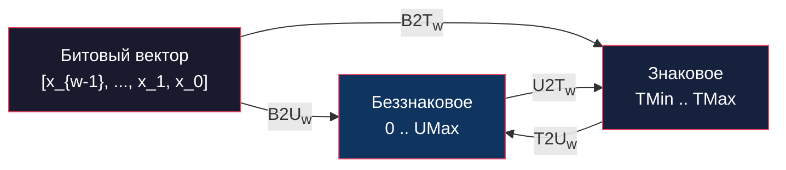
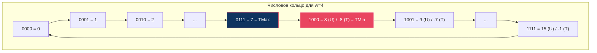

# Глава: CS:APP 2.2 --- Целочисленные представления

> [!info] Контекст
> Второй раздел второй главы Брайанта и О'Халларона отвечает на ключевой вопрос: **как последовательность битов превращается в целое число?** Здесь формализуются два фундаментальных представления --- беззнаковое (unsigned) и дополнение до двух (two's complement), а также правила преобразования между ними. Понимание этих механизмов критически важно для работы с переполнениями, приведениями типов и тонкими багами, которые возникают на стыке signed и unsigned.
>
> **Пререквизиты:** [[2.1-overview|Глава 2.1 --- Хранение информации]] (двоичная система, побитовые операции, байтовое представление).
>
> **Язык примеров:** Zig. Выбран потому, что он поддерживает произвольную битность типов (`i4`, `u7`, `i17`), строго различает signed и unsigned, и превращает многие ошибки C (неявные касты, unsigned underflow) в ошибки компиляции или runtime-паники.

---

## Обзор

Раздел 2.2 строится вокруг **четырёх функций преобразования** между битовыми векторами и целыми числами:



**Ключевые идеи раздела:**

1. **B2U** и **B2T** --- две разные интерпретации одного и того же битового вектора. Биты не меняются, меняется формула.
2. **T2U** и **U2T** --- преобразования, при которых **биты сохраняются**, но числовое значение может измениться (reinterpret cast).
3. **Асимметрия two's complement:** отрицательных значений на одно больше, чем положительных (`|TMin| = TMax + 1`).
4. **Расширение** (extension) добавляет биты слева: нули для unsigned, копию знакового бита для signed.
5. **Усечение** (truncation) отбрасывает старшие биты: `x mod 2^k`.
6. **Неявные приведения** signed <-> unsigned --- главный источник трудноуловимых багов в C. Zig устраняет эту проблему, требуя явных кастов.

---

## Deep Dive

### 2.2.1 --- Таблица терминов и диапазоны целочисленных типов

Прежде чем разбирать формулы, зафиксируем обозначения, которые используются в книге:

| Символ | Значение |
|---|---|
| B2U_w | Bit-to-Unsigned: интерпретация w-битного вектора как беззнакового числа |
| B2T_w | Bit-to-Two's complement: интерпретация как числа в дополнении до двух |
| T2U_w | Two's complement -> Unsigned: преобразование знакового в беззнаковое |
| U2T_w | Unsigned -> Two's complement: преобразование беззнакового в знаковое |
| UMax_w | Максимальное беззнаковое: `2^w - 1` |
| TMin_w | Минимальное знаковое: `-2^(w-1)` |
| TMax_w | Максимальное знаковое: `2^(w-1) - 1` |

#### Диапазоны по ширине слова

| w | UMax | TMin | TMax |
|---|---|---|---|
| 8 | 255 | -128 | 127 |
| 16 | 65 535 | -32 768 | 32 767 |
| 32 | 4 294 967 295 | -2 147 483 648 | 2 147 483 647 |
| 64 | 18 446 744 073 709 551 615 | -9 223 372 036 854 775 808 | 9 223 372 036 854 775 807 |

Обрати внимание: `UMax_w = 2 * TMax_w + 1`. Это не совпадение --- беззнаковый диапазон использует все `2^w` комбинаций для неотрицательных чисел, а two's complement делит их пополам (с перевесом в сторону отрицательных на 1).

#### Проверка в Zig

```zig
const std = @import("std");

pub fn main() void {
    // Zig предоставляет comptime-функции для получения границ диапазонов
    std.debug.print("u8:  max = {}\n", .{std.math.maxInt(u8)});   // 255
    std.debug.print("i8:  min = {}, max = {}\n", .{ std.math.minInt(i8), std.math.maxInt(i8) }); // -128, 127

    std.debug.print("u32: max = {}\n", .{std.math.maxInt(u32)});  // 4294967295
    std.debug.print("i32: min = {}, max = {}\n", .{ std.math.minInt(i32), std.math.maxInt(i32) }); // -2147483648, 2147483647

    std.debug.print("u64: max = {}\n", .{std.math.maxInt(u64)});  // 18446744073709551615
    std.debug.print("i64: min = {}, max = {}\n", .{ std.math.minInt(i64), std.math.maxInt(i64) });

    // Произвольная битность --- уникальная фича Zig
    std.debug.print("u4:  max = {}\n", .{std.math.maxInt(u4)});   // 15
    std.debug.print("i4:  min = {}, max = {}\n", .{ std.math.minInt(i4), std.math.maxInt(i4) }); // -8, 7

    // usize --- размер указателя платформы
    std.debug.print("usize: max = {}\n", .{std.math.maxInt(usize)});
}
```

> [!tip] Для JS-разработчика
> В JavaScript `Number.MAX_SAFE_INTEGER = 2^53 - 1` --- это предел точности float64, а не настоящий целочисленный тип. Все числа в JS --- это IEEE 754 double. В Zig `i32` --- это **настоящие 32 бита**, переполнение --- детектируемая ошибка (паника в debug, undefined behavior в release). Разница фундаментальна: в JS `2147483647 + 1 = 2147483648` (всё ещё точный float), а в Zig `@as(i32, 2147483647) + 1` --- паника.

#### Асимметрия two's complement

Важнейшее свойство, которое вызывает баги:

```
|TMin_w| = TMax_w + 1
```

Для `i8`: `|-128| = 128`, но `TMax_8 = 127`. Значит, **у TMin нет положительного аналога** в том же типе. Это приводит к тому, что `-TMin` **не определён** для знакового типа:

```zig
const std = @import("std");

pub fn main() void {
    const x: i8 = -128; // TMin_8

    // Попытка отрицания --- паника в debug!
    // const y = -x; // runtime panic: integer overflow

    // Безопасная проверка:
    if (x == std.math.minInt(i8)) {
        std.debug.print("TMin не имеет положительного аналога в i8\n", .{});
    }
}
```

**Ключевой вывод:** диапазоны signed и unsigned типов определяются шириной `w`. Асимметрия two's complement (`|TMin| = TMax + 1`) --- источник ошибок с отрицанием и абсолютным значением.

---

### 2.2.2 --- B2U: беззнаковые кодировки

Формула:

```
B2U_w([x_{w-1}, x_{w-2}, ..., x_1, x_0]) = Σ x_i * 2^i   (i от 0 до w-1)
```

Каждый бит `x_i` имеет **положительный вес** `2^i`. Функция B2U_w --- **биекция** (взаимно однозначное соответствие) между множеством битовых векторов длины `w` и множеством целых чисел `{0, 1, ..., 2^w - 1}`.

#### Примеры для w = 4

```
[0001] = 0*8 + 0*4 + 0*2 + 1*1 = 1
[0101] = 0*8 + 1*4 + 0*2 + 1*1 = 5
[1011] = 1*8 + 0*4 + 1*2 + 1*1 = 11
[1111] = 1*8 + 1*4 + 1*2 + 1*1 = 15 = UMax_4
```

#### Визуализация весов в Zig

```zig
const std = @import("std");

pub fn main() void {
    const val: u8 = 0b10110100; // 180

    std.debug.print("Значение: {}\n", .{val}); // 180
    std.debug.print("Двоичное: {b:0>8}\n", .{val}); // 10110100

    // Разложение по весам
    std.debug.print("\nБит | Значение | Вес  | Вклад\n", .{});
    std.debug.print("----|----------|------|------\n", .{});

    var sum: u16 = 0;
    for (0..8) |i| {
        const bit_index: u3 = @intCast(7 - i); // от старшего к младшему
        const bit: u1 = @truncate(val >> bit_index);
        const weight: u16 = @as(u16, 1) << bit_index;
        const contribution = @as(u16, bit) * weight;
        sum += contribution;
        std.debug.print("  {d} |    {d}     | {d:>3}  | {d:>3}\n", .{ bit_index, bit, weight, contribution });
    }
    std.debug.print("----|----------|------|------\n", .{});
    std.debug.print("               Сумма = {}\n", .{sum}); // 180
}
```

Вывод:

```
Бит | Значение | Вес  | Вклад
----|----------|------|------
  7 |    1     | 128  | 128
  6 |    0     |  64  |   0
  5 |    1     |  32  |  32
  4 |    1     |  16  |  16
  3 |    0     |   8  |   0
  2 |    1     |   4  |   4
  1 |    0     |   2  |   0
  0 |    0     |   1  |   0
----|----------|------|------
               Сумма = 180
```

**Ключевой вывод:** в беззнаковой кодировке каждый бит вносит положительный вклад `2^i`. Значение --- простая сумма этих вкладов.

---

### 2.2.3 --- B2T: кодирование дополнения до двух

Формула:

```
B2T_w([x_{w-1}, x_{w-2}, ..., x_1, x_0]) = -x_{w-1} * 2^(w-1) + Σ x_i * 2^i   (i от 0 до w-2)
```

Единственное отличие от B2U: **старший бит** (x_{w-1}) имеет **отрицательный вес** `-2^(w-1)`. Именно поэтому он называется **знаковым битом** (sign bit).

- Если знаковый бит = 0 --- число неотрицательное (вклад старшего бита = 0).
- Если знаковый бит = 1 --- число отрицательное (вклад старшего бита = `-2^(w-1)`).

Функция B2T_w --- тоже **биекция**, но между битовыми векторами длины `w` и множеством `{-2^(w-1), ..., 2^(w-1) - 1}`.

#### Примеры для w = 4

```
[0001] = -0*8 + 0*4 + 0*2 + 1*1 = 1
[0101] = -0*8 + 1*4 + 0*2 + 1*1 = 5
[1011] = -1*8 + 0*4 + 1*2 + 1*1 = -8 + 3 = -5
[1111] = -1*8 + 1*4 + 1*2 + 1*1 = -8 + 7 = -1
[1000] = -1*8 + 0*4 + 0*2 + 0*1 = -8 = TMin_4
[0111] = -0*8 + 1*4 + 1*2 + 1*1 = 7 = TMax_4
```

#### Особые значения

| Значение | Битовый паттерн | Формула |
|---|---|---|
| 0 | `[0000...0]` | все биты = 0 |
| -1 | `[1111...1]` | все биты = 1 |
| TMin | `[1000...0]` | только знаковый бит = 1 |
| TMax | `[0111...1]` | все биты = 1, кроме знакового |

Два важнейших наблюдения:

1. **-1 и UMax имеют одинаковый битовый паттерн** --- все единицы. Разница только в интерпретации.
2. **TMin --- единственное число, у которого знаковый бит = 1, а все остальные = 0.**

#### Проверка в Zig

```zig
const std = @import("std");

pub fn main() void {
    // @bitCast --- реинтерпретация битов без изменения
    // i8(-128) и u8(128) --- одинаковые биты: 10000000
    const tmin: i8 = -128;
    const as_unsigned: u8 = @bitCast(tmin);
    std.debug.print("i8({}) как u8 = {} (биты: {b:0>8})\n", .{ tmin, as_unsigned, as_unsigned });
    // i8(-128) как u8 = 128 (биты: 10000000)

    // i8(-1) и u8(255) --- одинаковые биты: 11111111
    const minus_one: i8 = -1;
    const as_u: u8 = @bitCast(minus_one);
    std.debug.print("i8({}) как u8 = {} (биты: {b:0>8})\n", .{ minus_one, as_u, as_u });
    // i8(-1) как u8 = 255 (биты: 11111111)

    // Произвольная битность: i4
    const x: i4 = @bitCast(@as(u4, 0b1011));
    std.debug.print("u4(0b1011) как i4 = {}\n", .{x}); // -5
    // B2T_4([1011]) = -8 + 2 + 1 = -5
}
```

**Ключевой вывод:** дополнение до двух отличается от беззнаковой кодировки ровно одним моментом --- **знаковый бит имеет отрицательный вес**. Все остальные биты работают одинаково.

---

### 2.2.4 --- T2U и U2T: касты без изменения битов

Преобразования T2U (signed -> unsigned) и U2T (unsigned -> signed) --- это **reinterpret cast**: биты остаются теми же, меняется только формула интерпретации.

#### Формулы

**T2U_w(x)** --- из signed в unsigned:

```
T2U_w(x) = x + 2^w,   если x < 0
            x,          если x >= 0
```

**U2T_w(u)** --- из unsigned в signed:

```
U2T_w(u) = u - 2^w,   если u > TMax_w
            u,          если u <= TMax_w
```

#### Геометрическая интуиция

Можно думать о числовой прямой, свёрнутой в кольцо из `2^w` значений. Unsigned считает от `0` по часовой стрелке до `UMax`. Two's complement --- тот же круг, но нулевая отметка расположена так, что **верхняя половина** (где знаковый бит = 1) интерпретируется как отрицательные числа.



#### Пример: i16(-12345) <-> u16(53191)

```
Биты: 1100 1111 1100 0111 (hex: 0xCFC7)

Как i16 (B2T_16): -32768 + 20423 = -12345
Как u16 (B2U_16): 53191

T2U_16(-12345) = -12345 + 65536 = 53191
U2T_16(53191)  = 53191 - 65536  = -12345
```

#### Реализация в Zig

```zig
const std = @import("std");

pub fn main() void {
    const sx: i16 = -12345;

    // @bitCast --- биты не меняются, тип меняется
    const ux: u16 = @bitCast(sx);
    std.debug.print("i16({}) -> u16 = {} (биты: {b:0>16})\n", .{ sx, ux, ux });
    // i16(-12345) -> u16 = 53191 (биты: 1100111111000111)

    // Обратно
    const back: i16 = @bitCast(ux);
    std.debug.print("u16({}) -> i16 = {}\n", .{ ux, back });
    // u16(53191) -> i16 = -12345
}
```

> [!warning] `@bitCast` vs `@intCast`
> - **`@bitCast`** --- биты не меняются, тип меняется. Используется для signed <-> unsigned reinterpret.
> - **`@intCast`** --- проверяет, что числовое значение вмещается в целевой тип. Если не вмещается --- паника в debug.
>
> ```zig
> const sx: i16 = -12345;
> // const fail: u16 = @intCast(sx); // ПАНИКА: -12345 не вмещается в u16
> const ok: u16 = @bitCast(sx);      // OK: биты сохраняются, значение = 53191
> ```

**Ключевой вывод:** T2U и U2T --- это **переименование**, а не преобразование. Биты остаются теми же. Для отрицательных чисел разница между signed и unsigned значением --- ровно `2^w`.

---

### 2.2.5 --- Знаковые и беззнаковые: сравнение C и Zig

В C при смешении signed и unsigned операндов в одном выражении **signed молча приводится к unsigned**. Это даёт контринтуитивные результаты.

#### Таблица "удивительных" результатов (w = 32)

| Выражение C | Тип | Результат C | Zig |
|---|---|---|---|
| `-1 < 0` | signed | `1` (верно) | `true` |
| `-1 < 0U` | unsigned | **`0` (неверно!)** | ошибка компиляции |
| `2147483647 > -2147483647-1` | signed | `1` (верно) | `true` |
| `2147483647U > -2147483647-1` | unsigned | **`0` (неверно!)** | ошибка компиляции |
| `2147483647 > (int)2147483648U` | signed | `1` (верно) | `true` (с явным кастом) |
| `-1 > -2` | signed | `1` (верно) | `true` |
| `(unsigned)-1 > -2` | unsigned | **`1` (верно, но обе стороны огромны)** | ошибка компиляции |

#### Почему `-1 < 0U` = false в C?

Пошагово:

1. Литерал `-1` имеет тип `int` (signed).
2. Литерал `0U` имеет тип `unsigned int`.
3. При сравнении разных типов C приводит `int` к `unsigned int` (implicit cast).
4. `(unsigned int)(-1) = 4294967295` (T2U_32(-1) = UMax_32).
5. `4294967295 < 0` = `false`.

#### Как Zig предотвращает это

```zig
const std = @import("std");

pub fn main() void {
    const signed_val: i32 = -1;
    const unsigned_val: u32 = 0;

    // Zig НЕ ПОЗВОЛЯЕТ сравнивать signed и unsigned напрямую:
    // const result = signed_val < unsigned_val;
    // Ошибка компиляции: operator '<' not defined for 'i32' and 'u32'

    // Нужен явный выбор, что мы хотим:

    // Вариант 1: привести к signed (безопасно, если unsigned вмещается)
    const cmp_signed = signed_val < @as(i32, @intCast(unsigned_val));
    std.debug.print("-1 < 0 (signed) = {}\n", .{cmp_signed}); // true

    // Вариант 2: привести к unsigned (ПАНИКА при отрицательном значении)
    // const cmp_unsigned = @as(u32, @intCast(signed_val)) < unsigned_val;
    // ПАНИКА: -1 не вмещается в u32
}
```

> [!warning] Главная ловушка C
> `-1 < 0U` = `false`. Это один из самых известных "сюрпризов" C, приводящий к реальным уязвимостям. В Zig такое сравнение просто **не скомпилируется** --- компилятор требует от программиста явного решения, какую семантику он имеет в виду.

**Ключевой вывод:** C молча конвертирует signed в unsigned при смешении типов. Zig запрещает неявные преобразования между signed и unsigned, что устраняет целый класс багов.

---

### 2.2.6 --- Расширение битового представления (extension)

При приведении к **более широкому** типу нужно добавить биты слева. Как именно --- зависит от знаковости:

#### Zero extension (беззнаковые)

Добавляются нули слева. Числовое значение не меняется.

```
u8(200)  = 0xC8     = 1100 1000
u16(200) = 0x00C8   = 0000 0000 1100 1000
                       ^^^^^^^^^ нули
```

#### Sign extension (знаковые)

Знаковый бит **копируется** во все добавленные позиции. Числовое значение не меняется.

```
i8(-56)  = 0xC8     = 1100 1000
i16(-56) = 0xFFC8   = 1111 1111 1100 1000
                       ^^^^^^^^^ копия знакового бита (1)

i8(56)   = 0x38     = 0011 1000
i16(56)  = 0x0038   = 0000 0000 0011 1000
                       ^^^^^^^^^ копия знакового бита (0)
```

#### Почему sign extension сохраняет значение?

Интуиция: добавление копий знакового бита слева не меняет сумму в формуле B2T. Это можно доказать формально, но проще увидеть на примере:

```
B2T_4([1100]) = -8 + 4 = -4
B2T_8([11111100]) = -128 + 64 + 32 + 16 + 8 + 4 = -128 + 124 = -4
```

Каждый новый бит-копия одновременно добавляет `-2^k` (как новый знаковый бит) и `+2^(k-1)` (как позитивный вклад предыдущего знакового бита) --- в итоге они компенсируют друг друга.

#### Zig: автоматическое расширение

```zig
const std = @import("std");

pub fn main() void {
    // Zero extension: u8 -> u16
    const u_narrow: u8 = 200; // 0xC8
    const u_wide: u16 = u_narrow; // неявное расширение, всегда безопасно
    std.debug.print("u8({}) -> u16 = {} (hex: 0x{x:0>4})\n", .{ u_narrow, u_wide, u_wide });
    // u8(200) -> u16 = 200 (hex: 0x00c8)

    // Sign extension: i8 -> i16
    const s_narrow: i8 = -56; // 0xC8
    const s_wide: i16 = s_narrow; // неявное расширение, всегда безопасно
    const s_wide_bits: u16 = @bitCast(s_wide);
    std.debug.print("i8({}) -> i16 = {} (hex: 0x{x:0>4})\n", .{ s_narrow, s_wide, s_wide_bits });
    // i8(-56) -> i16 = -56 (hex: 0xffc8)
}
```

#### Ловушка: порядок extension и unsigned cast

В C при преобразовании `short -> unsigned` на 64-битной системе происходит цепочка:

```
short sx = -12345;         // 0xCFC7 (16 бит)
unsigned uy = sx;          // Шаг 1: sign-ext i16 -> i32: 0xFFFFCFC7
                           // Шаг 2: T2U i32 -> u32: 4294954951
```

Сначала **sign extension** до `int`, потом **reinterpret** в `unsigned`. Порядок имеет значение!

В Zig это требует явных шагов:

```zig
const std = @import("std");

pub fn main() void {
    const sx: i16 = -12345;

    // Шаг 1: sign extension i16 -> i32
    const extended: i32 = sx;
    std.debug.print("i16({}) -> i32 = {} (hex: 0x{x:0>8})\n", .{ sx, extended, @as(u32, @bitCast(extended)) });
    // i16(-12345) -> i32 = -12345 (hex: 0xffffcfc7)

    // Шаг 2: reinterpret i32 -> u32
    const as_unsigned: u32 = @bitCast(extended);
    std.debug.print("i32({}) -> u32 = {}\n", .{ extended, as_unsigned });
    // i32(-12345) -> u32 = 4294954951
}
```

**Ключевой вывод:** zero extension для unsigned, sign extension для signed. В цепочке преобразований порядок (сначала расширение, потом каст знаковости) критически важен.

---

### 2.2.7 --- Усечение чисел (truncation)

При приведении к **более узкому** типу старшие биты отбрасываются.

#### Формула

Для беззнаковых:

```
B2U_k([x_{k-1}, ..., x_0]) = B2U_w([x_{w-1}, ..., x_0]) mod 2^k
```

Проще говоря: `результат = x mod 2^k`, что эквивалентно отбрасыванию старших `w-k` битов.

Для знаковых: сначала усечение битов (как для unsigned), потом интерпретация результата как B2T_k.

#### Примеры

```
u32(53191) -> u16:  53191 mod 65536 = 53191  (53191 < 65536, вмещается)
u32(53191) -> u8:   53191 mod 256   = 199    (0xCFC7 -> 0xC7 = 199)
u32(65540) -> u16:  65540 mod 65536 = 4      (потеря данных!)
```

#### Zig: `@truncate` vs `@intCast`

В Zig есть два способа сузить тип, и они принципиально различаются:

```zig
const std = @import("std");

pub fn main() void {
    const wide: u32 = 53191; // 0x0000CFC7

    // @truncate --- молча отбрасывает старшие биты, НИКОГДА не паникует
    const trunc_u16: u16 = @truncate(wide); // 0xCFC7 = 53191
    const trunc_u8: u8 = @truncate(wide);   // 0xC7 = 199
    std.debug.print("@truncate u32({}) -> u16 = {}\n", .{ wide, trunc_u16 }); // 53191
    std.debug.print("@truncate u32({}) -> u8  = {}\n", .{ wide, trunc_u8 });  // 199

    // @intCast --- проверяет, что значение вмещается. Паника если нет.
    const safe: u16 = @intCast(wide); // OK: 53191 вмещается в u16
    std.debug.print("@intCast  u32({}) -> u16 = {}\n", .{ wide, safe }); // 53191

    // const fail: u8 = @intCast(wide); // ПАНИКА: 53191 не вмещается в u8

    // Усечение со знаковым: биты отбрасываются, потом реинтерпретация
    const signed_wide: i32 = -12345; // 0xFFFFCFC7
    const trunc_s16: i16 = @truncate(signed_wide); // 0xCFC7 -> B2T_16 = -12345
    std.debug.print("@truncate i32({}) -> i16 = {}\n", .{ signed_wide, trunc_s16 }); // -12345
}
```

> [!important] Когда использовать `@truncate`, а когда `@intCast`
> - **`@truncate`** --- когда усечение **намеренное** и потеря данных ожидаема (например, получение младших 8 бит хеша).
> - **`@intCast`** --- когда вы **уверены**, что значение вмещается, и хотите проверку на этапе выполнения (аналог assertion).
> - Третий вариант --- `std.math.cast(T, x)`, возвращает `?T` (optional): `null` если не вмещается.

**Ключевой вывод:** усечение --- это `mod 2^k` для unsigned и потенциальная потеря данных. `@truncate` для намеренного отсечения, `@intCast` для безопасного каста с проверкой.

---

### 2.2.8 --- Практические ловушки: беззнаковые в циклах и длинах

Это самый практически важный раздел. Здесь собраны паттерны, которые вызывают баги в реальном коде из-за свойств unsigned-арифметики.

#### Ловушка 1: обратный цикл с usize

```zig
const std = @import("std");

pub fn main() void {
    const arr = [_]u32{ 10, 20, 30, 40, 50 };

    // БАГОВАННАЯ версия: обратный цикл через usize
    // var i: usize = arr.len - 1;
    // while (i >= 0) : (i -= 1) { // i >= 0 ВСЕГДА true для usize!
    //     std.debug.print("{} ", .{arr[i]});
    //     // При i = 0: i -= 1 = usize.MAX -> паника в debug, бесконечный цикл в release
    // }

    // ПРАВИЛЬНО: Zig-идиома для обратного цикла
    var i: usize = arr.len;
    while (i > 0) {
        i -= 1;
        std.debug.print("{} ", .{arr[i]});
    }
    std.debug.print("\n", .{});
    // 50 40 30 20 10

    // Ещё лучше: std.mem.reverse или итератор
}
```

#### Ловушка 2: while (i <= length - 1) при length = 0

```zig
const std = @import("std");

fn buggySum(arr: []const u32) u64 {
    var sum: u64 = 0;
    var i: usize = 0;
    // БАГ: при arr.len = 0: arr.len - 1 = usize.MAX (unsigned underflow)
    // В debug Zig --- паника. В release --- бесконечный цикл.
    while (i <= arr.len - 1) : (i += 1) {
        sum += arr[i];
    }
    return sum;
}

fn correctSum(arr: []const u32) u64 {
    var sum: u64 = 0;
    for (arr) |val| {
        sum += val;
    }
    return sum;
}

pub fn main() void {
    const empty: []const u32 = &.{};
    // buggySum(empty); // ПАНИКА в debug!
    std.debug.print("correctSum = {}\n", .{correctSum(empty)}); // 0
}
```

#### Ловушка 3: вычитание длин (аналог strlonger из книги)

В книге рассматривается функция на C:

```c
// C --- БАГ: strlen возвращает size_t (unsigned)
int strlonger(char *s, char *t) {
    return strlen(s) - strlen(t) > 0; // всегда >= 0 для unsigned!
}
```

Эквивалент на Zig:

```zig
const std = @import("std");

// БАГОВАННАЯ версия
fn isLongerBug(s: []const u8, t: []const u8) bool {
    return s.len - t.len > 0; // При s.len < t.len -> usize underflow -> паника в debug!
}

// ПРАВИЛЬНАЯ версия
fn isLonger(s: []const u8, t: []const u8) bool {
    return s.len > t.len; // Прямое сравнение --- безопасно
}

pub fn main() void {
    // isLongerBug("abc", "abcdef"); // ПАНИКА: 3 - 6 = underflow для usize
    std.debug.print("isLonger = {}\n", .{isLonger("abc", "abcdef")}); // false
    std.debug.print("isLonger = {}\n", .{isLonger("abcdef", "abc")}); // true
}
```

> [!warning] `usize` --- беззнаковый!
> `0 - 1 = usize.MAX` в беззнаковой арифметике. Zig паникует в debug при unsigned underflow/overflow, но в `ReleaseFast` --- **нет**. Правила:
> 1. Никогда не вычитайте длины --- сравнивайте напрямую.
> 2. Используйте `for (slice)` вместо индексных `while`-циклов.
> 3. Для обратных циклов --- паттерн `while (i > 0) { i -= 1; ... }`.

#### Бонус: произвольная битность Zig для проверки формул

Одна из уникальных особенностей Zig --- поддержка целочисленных типов **произвольной битности**. Это идеально для проверки теоретических формул из книги:

```zig
const std = @import("std");

pub fn main() void {
    // u4 и i4 --- настоящие 4-битные типы
    const val: u4 = 0b1011;
    const as_signed: i4 = @bitCast(val);

    std.debug.print("u4(0b{b:0>4}) = B2U_4 = {}\n", .{ val, val }); // 11
    std.debug.print("i4(0b{b:0>4}) = B2T_4 = {}\n", .{ @as(u4, @bitCast(as_signed)), as_signed }); // -5

    // u3, i3 --- 3-битные типы
    std.debug.print("\nu3 диапазон: 0..{}\n", .{std.math.maxInt(u3)});     // 0..7
    std.debug.print("i3 диапазон: {}..{}\n", .{ std.math.minInt(i3), std.math.maxInt(i3) }); // -4..3

    // Полная таблица для w=4
    std.debug.print("\n--- Таблица для w=4 ---\n", .{});
    std.debug.print("Биты  | B2U | B2T\n", .{});
    std.debug.print("------|-----|----\n", .{});

    for (0..16) |i| {
        const u_val: u4 = @intCast(i);
        const t_val: i4 = @bitCast(u_val);
        std.debug.print("{b:0>4}  |  {d:>2} | {d:>3}\n", .{ u_val, u_val, t_val });
    }
}
```

Вывод:

```
Биты  | B2U | B2T
------|-----|----
0000  |   0 |   0
0001  |   1 |   1
0010  |   2 |   2
0011  |   3 |   3
0100  |   4 |   4
0101  |   5 |   5
0110  |   6 |   6
0111  |   7 |   7
1000  |   8 |  -8
1001  |   9 |  -7
1010  |  10 |  -6
1011  |  11 |  -5
1100  |  12 |  -4
1101  |  13 |  -3
1110  |  14 |  -2
1111  |  15 |  -1
```

Видно, что значения 0--7 совпадают, а начиная с `1000` (когда знаковый бит = 1) пути расходятся: unsigned продолжает расти (8--15), а two's complement уходит в отрицательные (-8 .. -1).

**Ключевой вывод:** беззнаковая арифметика создаёт ловушки при вычитании, обратных циклах и сравнении длин. Zig паникует в debug при underflow/overflow, но полагаться на это нельзя --- пишите код, который **не требует** overflow-проверок.

---

## Упражнения

### Задача 1: Таблица B2T_4 и T2U_4

Напиши программу на Zig, которая для всех значений `u4` (0--15):

1. Выводит битовое представление
2. Вычисляет B2U_4 (это просто значение `u4`)
3. Вычисляет B2T_4 (через `@bitCast` в `i4`)
4. Для отрицательных значений вычисляет T2U **по формуле** (`x + 16`) и проверяет, что результат совпадает с `@bitCast`

Ожидаемый формат вывода:

```
Биты  | B2U | B2T | T2U (формула) | T2U (@bitCast)
------|-----|-----|---------------|---------------
0000  |   0 |   0 |       0       |       0
...
1011  |  11 |  -5 |  -5+16 = 11  |      11
...
```

---

### Задача 2: Ловушка usize

Реализуй функцию `sumFirst(arr: []const u32, n: usize) u64`, которая суммирует первые `n` элементов массива.

1. Сначала напиши **багованную** версию с `while (i <= n - 1)`.
2. Запусти её с `n = 0` --- убедись, что Zig паникует.
3. Исправь: напиши версию, которая работает для любого `n`, включая 0.
4. Добавь проверку, что `n <= arr.len`.

---

### Задача 3: Цепочка преобразований

Для `sx: i16 = -12345` пройди цепочку преобразований, записывая на каждом шаге **битовое представление**, **hex**, и **числовое значение**:

1. `usx: u16 = @bitCast(sx)` --- какие биты? Почему 53191?
2. `x: i32 = sx` --- что происходит с битами? (sign extension) Сколько бит стало?
3. `uy: u32 = @bitCast(@as(i32, sx))` --- что происходит? Почему 4294954951?

Напиши программу, которая выводит все промежуточные значения в decimal, hex и binary.

---

## Anki Cards

> [!tip] Flashcards

**Q:** Какой вес имеет знаковый бит в кодировке дополнения до двух (two's complement)?
**A:** `-2^(w-1)`. Для `i8` --- это `-128`. Все остальные биты имеют положительные веса `2^i`. Формула B2T: `-x_{w-1} * 2^(w-1) + Σ x_i * 2^i`.

---

**Q:** Чему равно B2T_4([1011])? Покажи вычисление.
**A:** `-1*8 + 0*4 + 1*2 + 1*1 = -8 + 2 + 1 = -5`.

---

**Q:** Почему `|TMin| = TMax + 1`?
**A:** `TMin = -2^(w-1)`, `TMax = 2^(w-1) - 1`. Разница = 1. У TMin **нет положительного аналога** в том же типе. Пример: `i8`: `|-128| = 128 > TMax(127)`.

---

**Q:** Какое битовое представление у `-1` в дополнении до двух?
**A:** Все единицы: `[1111...1]`. Для `i32`: `0xFFFFFFFF`. Это совпадает с `UMax` для unsigned того же размера. B2T: `-2^(w-1) + (2^(w-1) - 1) = -1`.

---

**Q:** Формула T2U_w. Что происходит с отрицательными числами?
**A:** `T2U_w(x) = x + 2^w` если `x < 0`, иначе `x`. Биты не меняются --- меняется интерпретация. Пример: `T2U_16(-12345) = -12345 + 65536 = 53191`.

---

**Q:** Формула U2T_w. Что происходит с числами больше TMax?
**A:** `U2T_w(u) = u - 2^w` если `u > TMax_w`, иначе `u`. Пример: `U2T_16(53191) = 53191 - 65536 = -12345`.

---

**Q:** Почему `-1 < 0U` возвращает `false` в C?
**A:** При смешении signed и unsigned в C, signed молча приводится к unsigned: `-1` -> `UINT_MAX` (4294967295). `4294967295 < 0` = `false`. В Zig такое сравнение --- **ошибка компиляции**.

---

**Q:** Что такое sign extension? Пример.
**A:** Расширение знакового числа к более широкому типу: знаковый бит копируется во все добавленные позиции слева. `i8(-56) = 0xC8` -> `i16(-56) = 0xFFC8`. Значение не меняется.

---

**Q:** Что такое zero extension? Пример.
**A:** Расширение беззнакового числа к более широкому типу: нули добавляются слева. `u8(200) = 0xC8` -> `u16(200) = 0x00C8`. Значение не меняется.

---

**Q:** Чем `@bitCast` отличается от `@intCast` в Zig?
**A:** `@bitCast` --- биты не меняются, тип меняется (reinterpret). `@intCast` --- проверяет, что числовое значение вмещается в целевой тип; паника если нет. Для signed <-> unsigned reinterpret --- всегда `@bitCast`.

---

**Q:** Что делает `@truncate` в Zig? Когда использовать?
**A:** Отбрасывает старшие биты, **никогда не паникует**. Использовать когда усечение намеренное (например, взять младшие 8 бит). Для безопасного сужения --- `@intCast` (паника при потере данных).

---

**Q:** Почему `while (i <= length - 1)` ломается при `length = 0` если `length: usize`?
**A:** `usize` беззнаковый. `0 - 1 = usize.MAX` (unsigned underflow, паника в debug). Решение: `while (i < length)` или `for (slice) |v| { ... }`.

---

**Q:** Как проверить формулы B2T_w для малых `w` прямо в Zig?
**A:** Zig поддерживает произвольную битность: `i4`, `u7`, `i17`. Пример: `const x: i4 = @bitCast(@as(u4, 0b1011));` дает `-5`, что соответствует B2T_4([1011]) = -8 + 2 + 1 = -5.

---

**Q:** Чему равны UMax, TMin, TMax для w = 8?
**A:** `UMax_8 = 255` (`2^8 - 1`), `TMin_8 = -128` (`-2^7`), `TMax_8 = 127` (`2^7 - 1`). Соотношение: `UMax = 2 * TMax + 1`.

---

**Q:** Что происходит при приведении `i16(-12345)` к `u32` в C? Какие два шага выполняются?
**A:** 1) Sign extension `i16 -> i32`: `-12345` -> `0xFFFFCFC7`. 2) Reinterpret `i32 -> u32`: `0xFFFFCFC7` = `4294954951`. Сначала расширение, потом смена знаковости.

---

## Related Topics

- [[2.1-overview|Глава 2.1 --- Хранение информации]] --- двоичная система, побитовые операции, байтовое представление
- [[1.chapter|Глава 1 --- Экскурс в компьютерные системы]] --- информация = биты + контекст

---

## Sources

- Bryant R., O'Hallaron D. --- *Computer Systems: A Programmer's Perspective*, 3rd Edition, Chapter 2.2
- Zig Language Reference --- Integers: https://ziglang.org/documentation/master/#Integers
- Zig `@bitCast` builtin: https://ziglang.org/documentation/master/#@bitCast
- Zig `@intCast` builtin: https://ziglang.org/documentation/master/#@intCast
- Zig `@truncate` builtin: https://ziglang.org/documentation/master/#@truncate
- Zig `std.math.maxInt` / `minInt`: https://ziglang.org/documentation/master/std/#std.math.maxInt
- Two's Complement (Wikipedia): https://en.wikipedia.org/wiki/Two%27s_complement
