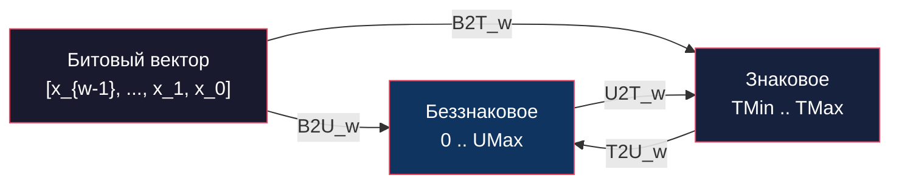
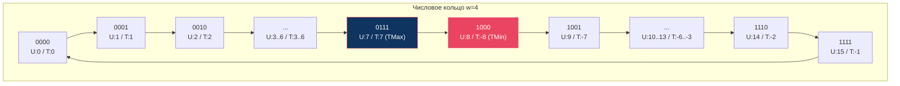

# Глава: CS:APP 2.2 --- Целочисленные представления

> [!info] Контекст
> Как компьютер хранит число `-1`, если в памяти есть только нули и единицы? Этот раздел отвечает на этот вопрос: мы разберём, как одна и та же последовательность битов может означать совершенно разные числа, почему отрицательные числа хранятся именно так, а не иначе, и какие ловушки ждут программиста на стыке signed и unsigned.
>
> **Пререквизиты:** [[2.1-overview|Глава 2.1 --- Хранение информации]] (двоичная система, побитовые операции, байтовое представление, порядок байтов).
>
> **Язык примеров:** Zig --- строго различает signed/unsigned, поддерживает произвольную битность типов (`i4`, `u7`), превращает ошибки C в ошибки компиляции.

---

## Введение: что значит хранить `-1` в компьютере?

В JavaScript все числа --- это IEEE 754 float64. Когда ты пишешь `-1`, рантайм хранит её как число с плавающей точкой. В Zig `i32` --- это честные 32 бита в памяти, и значение `-1` хранится как битовый паттерн `11111111 11111111 11111111 11111111`.

Но подождите --- этот же паттерн «все единицы» для `u32` означает число `4 294 967 295`. Два человека смотрят на одну комбинацию битов и называют **разные числа**. Кто прав? Оба --- просто они используют разные **правила интерпретации**.

> [!tip] JS vs Zig: одна и та же идея
> ```javascript
> // JS: unsigned reinterpretation через >>> 0
> (-1 >>> 0) // 4294967295
> ```
> ```zig
> // Zig: явная реинтерпретация битов
> const x: u32 = @bitCast(@as(i32, -1)); // 4294967295
> ```
> Результат одинаковый: биты `0xFFFFFFFF` --- это `-1` как signed и `4294967295` как unsigned.

Вся глава 2.2 --- это систематический разбор правил, по которым биты превращаются в числа и обратно. Этих правил четыре:

> [!info] Глоссарий: четыре функции преобразования
>
> | Обозначение | Расшифровка | Мнемоника |
> |---|---|---|
> | **B2U**_w | Bits to Unsigned | **Б**иты **в** **б**еззнаковое |
> | **B2T**_w | Bits to Two's complement | **Б**иты **в** знаковое (**д**ополнение **д**о **д**вух) |
> | **T2U**_w | Two's complement to Unsigned | Signed **в** unsigned (биты те же) |
> | **U2T**_w | Unsigned to Two's complement | Unsigned **в** signed (биты те же) |
>
> B2U и B2T --- это два способа **прочитать** биты. T2U и U2T --- это **смена точки зрения** на те же биты.



---

## Шаг 1: Unsigned --- простой случай

### Проблема

У нас есть 8 бит: `10110100`. Какое число они кодируют? Начнём с простого варианта --- **беззнакового** (unsigned).

### Формула B2U --- «вес каждого бита»

Каждый бит имеет **положительный вес**, равный степени двойки по его позиции:

```
B2U_w([x_{w-1}, ..., x_1, x_0]) = x_{w-1}*2^(w-1) + ... + x_1*2^1 + x_0*2^0
```

Это та же позиционная система счисления, что и десятичная, только с основанием 2.

### Ручной пример: `0b10110100`

```
Бит 7: 1 * 128 = 128
Бит 6: 0 *  64 =   0
Бит 5: 1 *  32 =  32
Бит 4: 1 *  16 =  16
Бит 3: 0 *   8 =   0
Бит 2: 1 *   4 =   4
Бит 1: 0 *   2 =   0
Бит 0: 0 *   1 =   0
                 -----
                 = 180
```

### Диапазоны

Минимум: все биты `0` = число `0`.
Максимум (**UMax**): все биты `1` = `2^w - 1`.

| w | UMax | Hex |
|---|---|---|
| 4 | 15 | 0xF |
| 8 | 255 | 0xFF |
| 16 | 65 535 | 0xFFFF |
| 32 | 4 294 967 295 | 0xFFFFFFFF |
| 64 | 18 446 744 073 709 551 615 | 0xFFFFFFFFFFFFFFFF |

### Проверка в Zig

```zig
const std = @import("std");

pub fn main() void {
    // Zig предоставляет comptime-функции для границ диапазонов
    std.debug.print("u8:  max = {}\n", .{std.math.maxInt(u8)});   // 255
    std.debug.print("u16: max = {}\n", .{std.math.maxInt(u16)});  // 65535
    std.debug.print("u32: max = {}\n", .{std.math.maxInt(u32)});  // 4294967295

    // Произвольная битность --- уникальная фича Zig
    std.debug.print("u4:  max = {}\n", .{std.math.maxInt(u4)});   // 15
    std.debug.print("u7:  max = {}\n", .{std.math.maxInt(u7)});   // 127

    // Проверяем наш ручной пример
    const val: u8 = 0b10110100;
    std.debug.print("0b10110100 = {}\n", .{val}); // 180
}
```

> [!tip] Ключевой вывод
> B2U --- это просто перевод из двоичной в десятичную систему. Каждый бит вносит положительный вклад `2^i`. Диапазон: от `0` до `2^w - 1`.

---

## Шаг 2: Signed --- добавляем «отрицательную гирю»

### Проблема

Unsigned прекрасно работает для неотрицательных чисел. Но как представить `-1`, `-42`, `-128`, если в нашем распоряжении только нули и единицы?

### Аналогия с весами

Представь чашечные весы с гирями. В unsigned все гири **положительные**: 1, 2, 4, 8, 16, ... --- ты складываешь их, чтобы получить нужное число. Все числа получаются неотрицательными.

Дополнение до двух (two's complement) меняет ровно одну вещь: **старшая гиря становится отрицательной**. Для 4-битного числа гири такие:

```
Позиция:   3      2    1    0
Unsigned:  +8     +4   +2   +1
Signed:    -8     +4   +2   +1
            ^
            единственное отличие!
```

Если старшая гиря «положена» (бит = 1), она тянет вниз на `-8`. Остальные гири компенсируют это вверх.

### Формула B2T

```
B2T_w([x_{w-1}, ..., x_1, x_0]) = -x_{w-1}*2^(w-1) + x_{w-2}*2^(w-2) + ... + x_1*2^1 + x_0*2^0
```

Единственное отличие от B2U: **знак минус у старшего бита**. Этот бит называется **знаковым** (sign bit):

- Знаковый бит = `0` --- число >= 0 (отрицательная гиря не задействована)
- Знаковый бит = `1` --- число < 0 (отрицательная гиря тянет вниз)

### Полная таблица для w = 4

Посмотрим, как одни и те же биты читаются по правилам B2U и B2T:

```
Биты  | B2U (unsigned) | B2T (signed) | Вычисление B2T
------|----------------|--------------|---------------------------
0000  |       0        |       0      |  -0 + 0 + 0 + 0 = 0
0001  |       1        |       1      |  -0 + 0 + 0 + 1 = 1
0010  |       2        |       2      |  -0 + 0 + 2 + 0 = 2
0011  |       3        |       3      |  -0 + 0 + 2 + 1 = 3
0100  |       4        |       4      |  -0 + 4 + 0 + 0 = 4
0101  |       5        |       5      |  -0 + 4 + 0 + 1 = 5
0110  |       6        |       6      |  -0 + 4 + 2 + 0 = 6
0111  |       7        |       7      |  -0 + 4 + 2 + 1 = 7
------|----------------|--------------|---------------------------
1000  |       8        |      -8      |  -8 + 0 + 0 + 0 = -8
1001  |       9        |      -7      |  -8 + 0 + 0 + 1 = -7
1010  |      10        |      -6      |  -8 + 0 + 2 + 0 = -6
1011  |      11        |      -5      |  -8 + 0 + 2 + 1 = -5
1100  |      12        |      -4      |  -8 + 4 + 0 + 0 = -4
1101  |      13        |      -3      |  -8 + 4 + 0 + 1 = -3
1110  |      14        |      -2      |  -8 + 4 + 2 + 0 = -2
1111  |      15        |      -1      |  -8 + 4 + 2 + 1 = -1
```

Обрати внимание: первые 8 строк (знаковый бит = 0) **совпадают**. Пути расходятся ровно в тот момент, когда «отрицательная гиря» вступает в игру.

### Особые паттерны --- запомни эти четыре числа

| Значение | Битовый паттерн | Почему? |
|---|---|---|
| **0** | `[0000...0]` | Все гири «сняты» |
| **-1** | `[1111...1]` | Отрицательная гиря + все положительные = `-2^(w-1) + (2^(w-1) - 1) = -1` |
| **TMin** | `[1000...0]` | Только отрицательная гиря = `-2^(w-1)` |
| **TMax** | `[0111...1]` | Все положительные гири без отрицательной = `2^(w-1) - 1` |

### Асимметрия: у TMin нет пары

Это самое коварное свойство two's complement:

```
|TMin| = TMax + 1
```

Для `i8`: `TMin = -128`, `TMax = 127`. Число `128` **не существует** в `i8`. Это значит, что `-TMin` невозможно представить в том же типе --- это переполнение!

| w | TMin | TMax | UMax |
|---|---|---|---|
| 4 | -8 | 7 | 15 |
| 8 | -128 | 127 | 255 |
| 16 | -32 768 | 32 767 | 65 535 |
| 32 | -2 147 483 648 | 2 147 483 647 | 4 294 967 295 |

Заметь соотношение: `UMax = 2 * TMax + 1`. Unsigned «тратит» весь диапазон на неотрицательные числа, а two's complement делит его пополам (с перевесом в сторону отрицательных на 1).

### Проверка в Zig

```zig
const std = @import("std");

pub fn main() void {
    // Диапазоны i4/u4 --- удобно для проверки таблицы выше
    std.debug.print("u4: 0 .. {}\n", .{std.math.maxInt(u4)});                   // 0 .. 15
    std.debug.print("i4: {} .. {}\n", .{ std.math.minInt(i4), std.math.maxInt(i4) }); // -8 .. 7

    // @bitCast: переинтерпретация битов u4 -> i4
    const bits: u4 = 0b1011;
    const as_signed: i4 = @bitCast(bits);
    std.debug.print("u4(0b1011) = {}, i4(0b1011) = {}\n", .{ bits, as_signed });
    // u4(0b1011) = 11, i4(0b1011) = -5

    // Асимметрия: -TMin невозможен
    const tmin: i8 = -128;
    _ = tmin;
    // const negated = -tmin; // ПАНИКА в debug: integer overflow!
}
```

> [!info] Историческая справка
> Существуют и другие способы кодирования знаковых чисел: **прямой код** (sign-magnitude) и **обратный код** (ones' complement). Но промышленность выбрала дополнение до двух, потому что оно позволяет использовать **одну и ту же схему сложения** для signed и unsigned чисел. Подробнее в [[2.3-overview]].

> [!tip] Ключевой вывод
> Дополнение до двух отличается от unsigned **ровно одним моментом**: старший бит имеет **отрицательный вес** `-2^(w-1)`. Всё остальное работает одинаково. Отсюда асимметрия: `|TMin| = TMax + 1`, и у TMin нет положительного аналога.

---

## Шаг 3: Два взгляда на одни биты --- T2U и U2T

### Аналогия: файл PNG

У тебя есть файл с байтами. Если открыть его в просмотрщике изображений --- увидишь картинку. Если открыть в hex-редакторе --- увидишь числа. **Данные не изменились**, изменилась программа-интерпретатор.

Точно так же работают T2U и U2T: это **смена интерпретации** одних и тех же битов. Биты в памяти не двигаются --- меняется только формула, по которой мы их читаем.

### Формулы

**T2U_w(x)** --- signed в unsigned (биты те же):

```
T2U_w(x) = x + 2^w,   если x < 0
            x,          если x >= 0
```

**U2T_w(u)** --- unsigned в signed (биты те же):

```
U2T_w(u) = u - 2^w,   если u > TMax_w
            u,          если u <= TMax_w
```

Интуиция: для неотрицательных чисел (верхняя половина таблицы) signed и unsigned совпадают. Для отрицательных (нижняя половина) разница составляет ровно `2^w`.

### Числовое кольцо для w = 4

Представь циферблат часов с 16 делениями. Unsigned считает: 0, 1, 2, ..., 15. Two's complement: 0, 1, 2, ..., 7, -8, -7, ..., -1. Одни и те же позиции --- разная нумерация:



Видно, что:
- `0` -- `7` (знаковый бит = 0): обе интерпретации **совпадают**
- `8` -- `15` (знаковый бит = 1): unsigned продолжает расти, signed «заворачивает» в отрицательные

### Пример: i16(-12345) и u16(53191)

```
Биты: 1100 1111 1100 0111   (hex: 0xCFC7)

Как i16 (B2T_16): -32768 + 20423 = -12345
Как u16 (B2U_16): 53191

Проверяем формулу: T2U_16(-12345) = -12345 + 65536 = 53191  ✓
Обратно:           U2T_16(53191)  =  53191 - 65536 = -12345  ✓
```

### Zig: `@bitCast` vs `@intCast`

Здесь мы впервые чётко разделяем два инструмента:

- **`@bitCast`** --- биты не меняются, тип меняется. Это T2U / U2T.
- **`@intCast`** --- проверяет, что **числовое значение** помещается в целевой тип. Если нет --- паника.

```zig
const std = @import("std");

pub fn main() void {
    const sx: i16 = -12345;

    // @bitCast: биты 0xCFC7 остаются, тип меняется i16 -> u16
    const ux: u16 = @bitCast(sx);
    std.debug.print("i16({}) -> u16 = {} (hex: 0x{x:0>4})\n", .{ sx, ux, ux });
    // i16(-12345) -> u16 = 53191 (hex: 0xcfc7)

    // Обратно: u16 -> i16
    const back: i16 = @bitCast(ux);
    std.debug.print("u16({}) -> i16 = {}\n", .{ ux, back });
    // u16(53191) -> i16 = -12345

    // А @intCast проверяет ЗНАЧЕНИЕ --- -12345 не вмещается в u16!
    // const fail: u16 = @intCast(sx); // ПАНИКА: -12345 не влезает в u16
}
```

> [!tip] Ключевой вывод
> T2U и U2T --- это **переименование**, не преобразование. Биты в памяти не меняются. Для отрицательных чисел разница в числовом значении --- ровно `2^w`. В Zig для этого используется `@bitCast`.

---

## Шаг 4: Опасная зона --- смешение signed и unsigned

### Аналогия с кассиром

Ты приходишь в банк и говоришь: «У меня долг минус один рубль». Кассир слышит только беззнаковые числа --- он записывает `4 294 967 295 рублей`. Вы оба смотрите на одни биты, но кассир интерпретирует их иначе. Именно это происходит в C при смешении signed и unsigned.

### Почему `-1 < 0U` = false в C?

Разберём пошагово:

1. Литерал `-1` имеет тип `int` (signed, 32 бита).
2. Литерал `0U` имеет тип `unsigned int`.
3. В C при сравнении signed с unsigned **signed молча приводится к unsigned**.
4. `(unsigned int)(-1)` = T2U_32(-1) = `-1 + 2^32` = `4 294 967 295`.
5. Сравнение: `4 294 967 295 < 0` = **false**.

Программист имел в виду «-1 меньше нуля?», а компилятор сравнил «4 миллиарда меньше нуля?».

### Таблица «сюрпризов» (w = 32)

| Выражение (C) | Тип сравнения | Результат | Ожидание |
|---|---|---|---|
| `-1 < 0` | signed | `true` | верно |
| `-1 < 0U` | **unsigned** | **`false`** | неверно! |
| `2147483647 > -2147483647-1` | signed | `true` | верно |
| `2147483647U > -2147483647-1` | **unsigned** | **`false`** | неверно! |
| `-1 > -2` | signed | `true` | верно |
| `(unsigned)-1 > -2` | **unsigned** | `true` | верно, но обе стороны огромны |

### Как Zig решает проблему

Zig **запрещает** сравнение signed и unsigned без явного каста. Вместо молчаливого «сюрприза» ты получаешь ошибку компиляции:

```zig
const std = @import("std");

pub fn main() void {
    const signed_val: i32 = -1;
    const unsigned_val: u32 = 0;

    // Zig НЕ ПОЗВОЛЯЕТ сравнивать signed и unsigned:
    // const result = (signed_val < unsigned_val);
    // error: operator '<' not allowed for 'i32' and 'u32'

    // Решение 1: привести unsigned к signed (безопасно, если вмещается)
    const cmp1 = signed_val < @as(i32, @intCast(unsigned_val));
    std.debug.print("-1 < 0 (через signed) = {}\n", .{cmp1}); // true

    // Решение 2: расширить оба до более широкого signed типа
    const a: i64 = signed_val;
    const b: i64 = @intCast(unsigned_val); // u32 -> i64 всегда безопасно
    std.debug.print("-1 < 0 (через i64)   = {}\n", .{a < b}); // true
}
```

> [!warning] Главная ловушка C
> При смешении signed и unsigned в одном выражении C **молча приводит signed к unsigned**. Это причина реальных уязвимостей в production-коде. Zig устраняет проблему на уровне компилятора: такое сравнение просто не скомпилируется.

> [!tip] Ключевой вывод
> Никогда не смешивай signed и unsigned без явного каста. В C это источник коварных багов. Zig делает невозможное смешение --- ошибкой компиляции.

---

## Шаг 5: Расширение --- переходим к большему типу

### Проблема

У тебя есть `u8(200)` и нужно передать его в функцию, которая принимает `u16`. Как добавить биты, чтобы значение не изменилось?

### Zero extension (беззнаковые)

Для unsigned всё просто --- **добавляем нули слева**:

```
u8(200)  = 0xC8     =          1100 1000
u16(200) = 0x00C8   = 00000000 1100 1000
                       ^^^^^^^^ добавленные нули
```

Значение не меняется, потому что добавленные биты имеют вес `0 * 2^k = 0`.

### Sign extension (знаковые)

Для signed --- **копируем знаковый бит** во все добавленные позиции:

```
i8(-56)  = 0xC8     =          1100 1000     (знаковый бит = 1)
i16(-56) = 0xFFC8   = 11111111 1100 1000
                       ^^^^^^^^ копии знакового бита

i8(56)   = 0x38     =          0011 1000     (знаковый бит = 0)
i16(56)  = 0x0038   = 00000000 0011 1000
                       ^^^^^^^^ копии знакового бита
```

### Аналогия: цвет переплёта книги

Представь, что у книги есть переплёт определённого цвета --- красный (отрицательное) или синий (положительное). Когда тебе нужна книга с большим количеством страниц, ты добавляешь чистые страницы **того же цвета**. Содержание книги не меняется --- ты просто дал ей больше места.

### Почему sign extension сохраняет значение?

Разберём на конкретном примере. Число `-4` в 4 битах:

```
B2T_4([1100]) = -1*8 + 1*4 + 0*2 + 0*1 = -8 + 4 = -4
```

Расширяем до 8 бит, копируя знаковый бит `1`:

```
B2T_8([11111100]) = -1*128 + 1*64 + 1*32 + 1*16 + 1*8 + 1*4 + 0*2 + 0*1
                  = -128 + 64 + 32 + 16 + 8 + 4
                  = -128 + 124
                  = -4
```

Каждый новый бит-копия одновременно:
- «сдвигает» отрицательную гирю дальше влево (делает её тяжелее)
- и добавляет положительную гирю на освободившееся место

Эти два эффекта **точно компенсируют** друг друга.

### Zig: неявное расширение

В Zig расширение к более широкому типу **всегда безопасно** и может быть неявным:

```zig
const std = @import("std");

pub fn main() void {
    // Zero extension: u8 -> u16 (неявно)
    const u_narrow: u8 = 200;
    const u_wide: u16 = u_narrow; // нули слева, значение 200
    std.debug.print("u8({}) -> u16 = {} (hex: 0x{x:0>4})\n", .{ u_narrow, u_wide, u_wide });
    // u8(200) -> u16 = 200 (hex: 0x00c8)

    // Sign extension: i8 -> i16 (неявно)
    const s_narrow: i8 = -56;
    const s_wide: i16 = s_narrow; // копии знакового бита слева, значение -56
    std.debug.print("i8({}) -> i16 = {} (hex: 0x{x:0>4})\n", .{ s_narrow, s_wide, @as(u16, @bitCast(s_wide)) });
    // i8(-56) -> i16 = -56 (hex: 0xffc8)
}
```

### Ловушка: порядок расширения и смены знаковости

Что произойдёт, если нужно преобразовать `i16(-12345)` в `u32`? Порядок шагов **критически важен**:

```
Шаг 1: sign extension  i16 -> i32:  0xCFC7 -> 0xFFFFCFC7  (значение -12345)
Шаг 2: reinterpret      i32 -> u32:  0xFFFFCFC7 = 4294954951
```

Если бы мы сначала сделали reinterpret (`i16 -> u16 = 53191`), а потом расширили (`u16 -> u32 = 53191`), результат был бы **другим**: `53191` вместо `4294954951`.

В Zig это требует явных шагов:

```zig
const std = @import("std");

pub fn main() void {
    const sx: i16 = -12345;

    // Шаг 1: sign extension i16 -> i32
    const extended: i32 = sx; // неявно, безопасно
    // Шаг 2: reinterpret i32 -> u32
    const result: u32 = @bitCast(extended);
    std.debug.print("i16({}) -> u32 = {} (hex: 0x{x:0>8})\n", .{ sx, result, result });
    // i16(-12345) -> u32 = 4294954951 (hex: 0xffffcfc7)
}
```

> [!tip] Ключевой вывод
> При расширении unsigned --- нули слева (zero extension). При расширении signed --- копия знакового бита (sign extension). В цепочке преобразований: **сначала расширение, потом смена знаковости**.

---

## Шаг 6: Усечение --- переходим к меньшему типу

### Принцип: отбрасываем старшие биты

Усечение --- это противоположность расширения. Мы **отбрасываем** старшие биты и оставляем только младшие `k` бит. Математически это эквивалентно:

```
результат = x mod 2^k
```

### Аналогия: обрезать строку

Представь строку `"Hello, World!"`. Если оставить первые 5 символов --- получишь `"Hello"`. Остальное потеряно безвозвратно. Точно так же усечение отбрасывает старшие биты --- информация теряется.

### Примеры

```
u32(53191) -> u16:  53191 mod 65536 = 53191   (вмещается, данные не теряются)
u32(53191) -> u8:   53191 mod 256   = 199     (0x0000CFC7 -> 0xC7 = 199)
u32(65540) -> u16:  65540 mod 65536 = 4       (потеря данных!)
```

Для signed: сначала отбрасываем биты (как для unsigned), потом интерпретируем результат через B2T_k:

```
i32(-12345) -> i16:  биты 0xFFFFCFC7 -> 0xCFC7, B2T_16 = -12345  (вмещается)
i32(-12345) -> i8:   биты 0xFFFFCFC7 -> 0xC7,   B2T_8 = -57      (значение изменилось!)
```

### Zig: три инструмента для сужения типа

```zig
const std = @import("std");

pub fn main() void {
    const wide: u32 = 53191; // 0x0000CFC7

    // 1. @truncate --- намеренное отсечение, НИКОГДА не паникует
    const t16: u16 = @truncate(wide); // 0xCFC7 = 53191
    const t8: u8 = @truncate(wide);   // 0xC7   = 199
    std.debug.print("@truncate u32({}) -> u16 = {}\n", .{ wide, t16 }); // 53191
    std.debug.print("@truncate u32({}) -> u8  = {}\n", .{ wide, t8 });  // 199

    // 2. @intCast --- проверяет значение, паника если не вмещается
    const safe: u16 = @intCast(wide); // OK: 53191 <= 65535
    std.debug.print("@intCast  u32({}) -> u16 = {}\n", .{ wide, safe }); // 53191
    // const fail: u8 = @intCast(wide); // ПАНИКА: 53191 > 255

    // 3. std.math.cast --- возвращает optional, nil если не вмещается
    const maybe_u8: ?u8 = std.math.cast(u8, wide);
    const maybe_u16: ?u16 = std.math.cast(u16, wide);
    std.debug.print("std.math.cast u8  = {?}\n", .{maybe_u8});  // null
    std.debug.print("std.math.cast u16 = {?}\n", .{maybe_u16}); // 53191
}
```

> [!important] Когда какой инструмент использовать
> | Инструмент | Поведение | Когда использовать |
> |---|---|---|
> | `@truncate` | Молча отбрасывает старшие биты | Усечение **намеренное**: младшие биты хеша, маскирование |
> | `@intCast` | Паника, если значение не вмещается | Уверен, что значение вмещается, хочешь **проверку** (assertion) |
> | `std.math.cast` | Возвращает `?T` (null при невмещении) | Хочешь обработать ошибку **без паники** |

> [!tip] Ключевой вывод
> Усечение --- это `x mod 2^k`. Старшие биты отбрасываются, информация может быть потеряна. В Zig три инструмента для разных ситуаций: `@truncate` (намеренно), `@intCast` (с проверкой), `std.math.cast` (optional).

---

## Шаг 7: Практика --- три ловушки unsigned

Теория позади. Теперь посмотрим, как unsigned-арифметика создаёт баги в реальном коде. Все три ловушки связаны с одним фактом: **результат вычитания unsigned не может быть отрицательным**.

### Ловушка 1: обратный цикл с usize

Хочешь пройти массив с конца к началу. Естественный подход --- `i -= 1` в цикле. Но `usize` --- беззнаковый, и `0 - 1` --- это не `-1`, а `usize.MAX`:

```zig
const std = @import("std");

pub fn main() void {
    const arr = [_]u32{ 10, 20, 30, 40, 50 };

    // НЕПРАВИЛЬНО: условие i >= 0 ВСЕГДА true для usize
    // var i: usize = arr.len - 1;
    // while (i >= 0) : (i -= 1) {  // бесконечный цикл!
    //     std.debug.print("{} ", .{arr[i]});
    // }

    // ПРАВИЛЬНО: идиома Zig для обратного цикла
    var i: usize = arr.len;
    while (i > 0) {
        i -= 1; // декремент ПЕРЕД использованием
        std.debug.print("{} ", .{arr[i]});
    }
    std.debug.print("\n", .{});
    // 50 40 30 20 10
}
```

Паттерн: начинаем с `len`, проверяем `i > 0`, уменьшаем **перед** использованием. Так `i` принимает значения `4, 3, 2, 1, 0` и цикл корректно завершается.

### Ловушка 2: `length - 1` при `length = 0`

```zig
const std = @import("std");

fn buggySum(arr: []const u32) u64 {
    var sum: u64 = 0;
    var i: usize = 0;
    // БАГ: при arr.len = 0 -> arr.len - 1 = usize.MAX -> паника в debug
    while (i <= arr.len - 1) : (i += 1) {
        sum += arr[i];
    }
    return sum;
}

fn correctSum(arr: []const u32) u64 {
    var sum: u64 = 0;
    // Идиоматично: for по срезу
    for (arr) |val| {
        sum += val;
    }
    return sum;
}

pub fn main() void {
    const empty: []const u32 = &.{};
    // buggySum(empty); // ПАНИКА: 0 - 1 = unsigned underflow
    std.debug.print("correctSum = {}\n", .{correctSum(empty)}); // 0
}
```

### Ловушка 3: вычитание длин

Классический пример из книги --- функция `strlonger` на C:

```c
// C: strlen возвращает size_t (unsigned)
int strlonger(char *s, char *t) {
    return strlen(s) - strlen(t) > 0; // ВСЕГДА >= 0 для unsigned!
}
```

Когда `s` короче `t`, вычитание unsigned даёт огромное положительное число вместо отрицательного. Эквивалент на Zig:

```zig
const std = @import("std");

// НЕПРАВИЛЬНО: вычитание длин
fn isLongerBug(s: []const u8, t: []const u8) bool {
    return s.len - t.len > 0; // При s.len < t.len -> паника в debug!
}

// ПРАВИЛЬНО: прямое сравнение
fn isLonger(s: []const u8, t: []const u8) bool {
    return s.len > t.len;
}

pub fn main() void {
    // isLongerBug("abc", "abcdef"); // ПАНИКА: 3 - 6 = underflow
    std.debug.print("{}\n", .{isLonger("abc", "abcdef")}); // false
    std.debug.print("{}\n", .{isLonger("abcdef", "abc")}); // true
}
```

> [!warning] Три правила работы с unsigned
> 1. **Не вычитай длины** --- сравнивай напрямую: `a.len > b.len` вместо `a.len - b.len > 0`.
> 2. **Используй `for` вместо `while` с индексом** --- `for (slice) |val|` безопаснее.
> 3. **Обратный цикл** --- паттерн `while (i > 0) { i -= 1; ... }`, начиная с `len`.

> [!tip] Ключевой вывод
> Unsigned-арифметика не знает отрицательных чисел. Вычитание, дающее «отрицательный» результат, оборачивается в огромное положительное число. Zig паникует при underflow в debug, но правильный код не должен полагаться на это.

---

## Упражнения

Подробные задания с тестами --- в [[2.2-exercises]].

---

## Anki Cards

> [!tip] Flashcards

**Q:** Формула B2U_w. Как вычислить B2U_8([10110100])?
**A:** B2U_w = сумма x_i * 2^i для i от 0 до w-1. Все биты имеют положительный вес. B2U_8([10110100]) = 128 + 32 + 16 + 4 = 180.

---

**Q:** Формула B2T_w. Чем отличается от B2U?
**A:** B2T_w = **-x_{w-1}** * 2^(w-1) + сумма x_i * 2^i для i от 0 до w-2. Единственное отличие: старший бит имеет **отрицательный** вес -2^(w-1). Остальные биты --- положительные, как в B2U.

---

**Q:** Чему равно B2T_4([1011])? Покажи вычисление.
**A:** -1*8 + 0*4 + 1*2 + 1*1 = -8 + 2 + 1 = **-5**.

---

**Q:** Формула T2U_w(x). Что происходит с отрицательными числами?
**A:** T2U_w(x) = x + 2^w, если x < 0; иначе x. Биты не меняются --- меняется интерпретация. Пример: T2U_16(-12345) = -12345 + 65536 = 53191.

---

**Q:** Формула U2T_w(u). Что происходит с числами больше TMax?
**A:** U2T_w(u) = u - 2^w, если u > TMax_w; иначе u. Пример: U2T_16(53191) = 53191 - 65536 = -12345.

---

**Q:** Какое битовое представление у -1 в two's complement?
**A:** Все единицы: [1111...1]. Для i8: 0xFF (255 как u8). Для i32: 0xFFFFFFFF. B2T: -2^(w-1) + (2^(w-1) - 1) = -1.

---

**Q:** Особые значения two's complement: TMin, TMax, -1, 0 --- какие битовые паттерны?
**A:** TMin = [1000...0] (только знаковый бит). TMax = [0111...1] (всё кроме знакового). -1 = [1111...1] (все единицы). 0 = [0000...0] (все нули).

---

**Q:** Почему |TMin| = TMax + 1? Чему равны TMin и TMax для i8?
**A:** TMin_8 = -128 = -2^7, TMax_8 = 127 = 2^7 - 1. |-128| = 128 > 127. У TMin **нет положительного аналога** в том же типе --- это источник бага при отрицании -TMin.

---

**Q:** UMax, TMin, TMax для w = 8, 16, 32 в hex?
**A:** w=8: UMax=0xFF, TMin=0x80, TMax=0x7F. w=16: UMax=0xFFFF, TMin=0x8000, TMax=0x7FFF. w=32: UMax=0xFFFFFFFF, TMin=0x80000000, TMax=0x7FFFFFFF.

---

**Q:** Чем @bitCast отличается от @intCast в Zig?
**A:** @bitCast --- биты не меняются, тип меняется (reinterpret cast, как T2U/U2T). @intCast --- проверяет, что числовое **значение** вмещается в целевой тип; паника если нет.

---

**Q:** Чем @truncate отличается от @intCast при сужении типа в Zig?
**A:** @truncate --- молча отбрасывает старшие биты (x mod 2^k), никогда не паникует. Для намеренного усечения. @intCast --- паникует, если значение не вмещается. Для безопасного сужения. Третий вариант: std.math.cast(T, x) возвращает ?T (null при невмещении).

---

**Q:** Что такое zero extension и sign extension?
**A:** Zero extension (unsigned): добавляем нули слева. u8(200) -> u16(200) = 0x00C8. Sign extension (signed): копируем знаковый бит влево. i8(-56) -> i16(-56) = 0xFFC8. Оба сохраняют числовое значение.

---

**Q:** Почему -1 < 0U возвращает false в C?
**A:** C молча приводит signed к unsigned: (unsigned)(-1) = 4294967295 (UMax_32). Сравнение 4294967295 < 0 = false. В Zig такое сравнение --- ошибка компиляции.

---

**Q:** Три ловушки unsigned: обратный цикл, length-1 при 0, вычитание длин. Как избежать?
**A:** 1) Обратный цикл: while (i > 0) { i -= 1; ... } начиная с len. 2) Вместо i <= len-1 писать i < len. 3) Вместо a.len - b.len > 0 писать a.len > b.len. Общее правило: не вычитать unsigned, сравнивать напрямую.

---

**Q:** Что произойдёт при преобразовании i16(-12345) в u32? Какие два шага?
**A:** Шаг 1: sign extension i16 -> i32: 0xCFC7 -> 0xFFFFCFC7 (-12345). Шаг 2: reinterpret i32 -> u32: 0xFFFFCFC7 = 4294954951. Порядок важен: сначала расширение, потом смена знаковости.

---

## Related Topics

- [[2.1-overview|Глава 2.1 --- Хранение информации]] --- двоичная система, побитовые операции, байтовое представление
- [[2.3-overview|Глава 2.3 --- Целочисленная арифметика]] --- сложение, умножение, переполнения

---

## Sources

- Bryant R., O'Hallaron D. --- *Computer Systems: A Programmer's Perspective*, 3rd Edition, Chapter 2.2
- Zig Language Reference --- Integers: https://ziglang.org/documentation/master/#Integers
- Zig `@bitCast`: https://ziglang.org/documentation/master/#@bitCast
- Zig `@intCast`: https://ziglang.org/documentation/master/#@intCast
- Zig `@truncate`: https://ziglang.org/documentation/master/#@truncate
- Zig `std.math.maxInt` / `minInt`: https://ziglang.org/documentation/master/std/#std.math.maxInt
- Two's Complement (Wikipedia): https://en.wikipedia.org/wiki/Two%27s_complement
