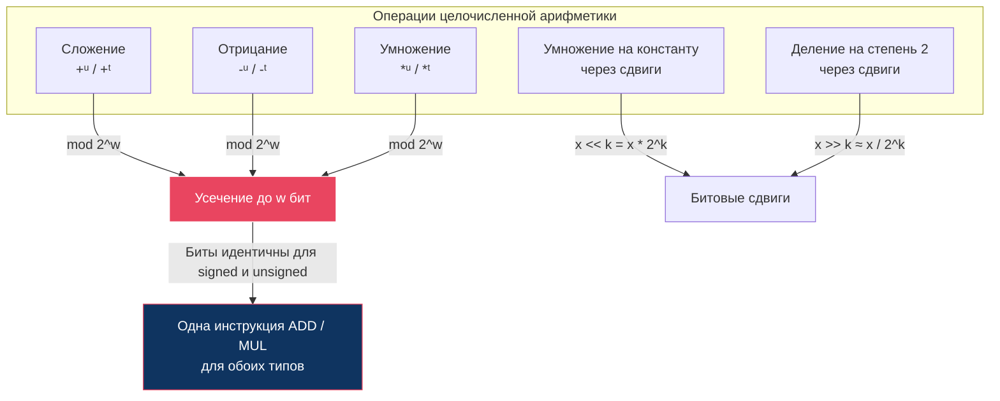
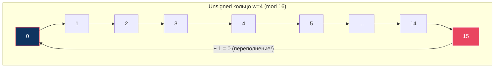

# Глава: CS:APP 2.3 --- Целочисленная арифметика

> [!info] Контекст
> Почему `200 + 100` может дать `44`? Почему `120 + 20` может дать `-116`? Почему хакеры эксплуатируют умножение, чтобы захватить сервер? Этот раздел объясняет, как компьютер **считает** с целыми числами: сложение, отрицание, умножение, деление --- и почему все эти операции работают по правилам модульной арифметики, а не обычной математики.
>
> **Пререквизиты:** [[2.1-overview|Глава 2.1 --- Хранение информации]] (двоичная система, побитовые операции), [[2.2-overview|Глава 2.2 --- Целочисленные представления]] (B2U, B2T, T2U, U2T, дополнительный код, unsigned/signed, расширение знака, усечение).
>
> **Язык примеров:** Zig --- строго различает signed/unsigned, паникует при переполнении в debug-режиме, предоставляет wrapping-операторы (`+%`, `-%`, `*%`) для явной модульной арифметики.

---

## Обзор: арифметика на конечных множествах

В математике сложение двух положительных чисел всегда даёт число **больше** каждого слагаемого. В компьютере --- не всегда. Причина проста: компьютер хранит числа в фиксированном количестве бит. Результат операции может не поместиться --- и тогда старшие биты **отбрасываются**.

Вся целочисленная арифметика --- это **арифметика по модулю 2^w**, где `w` --- ширина типа в битах. Это одна из самых важных идей главы.



> [!important] Главная идея раздела 2.3
> На уровне битов сложение, вычитание и умножение для signed и unsigned --- **одна и та же операция**. Процессор выполняет одну инструкцию ADD. Разница только в том, как мы **интерпретируем** результат и как **обнаруживаем** переполнение.

---

## Шаг 1: Unsigned сложение --- числовое кольцо

### Проблема

Складываем два 8-битных числа без знака: `200 + 100 = 300`. Но `300` в двоичном виде --- это `100101100`, а это **9 бит**. В `u8` помещается максимум 8. Куда девается лишний бит?

### Аналогия: одометр автомобиля

Представь одометр (счётчик пробега), который показывает от 000 до 999. Когда пробег достигает 999 и ты проезжаешь ещё один километр, одометр не показывает 1000 --- он **обнуляется** и показывает 000. Это и есть модульная арифметика: `999 + 1 = 0 (mod 1000)`.

Unsigned-арифметика работает точно так же, только основание не 1000, а `2^w`:

```
Для u8: «одометр» на 256 делений (0 .. 255)
200 + 100 = 300
300 mod 256 = 44
```

### Формула

```
x +ᵘ y = (x + y) mod 2^w
```

Два случая:
- **Нет переполнения:** `x + y < 2^w` --- результат обычный
- **Переполнение:** `x + y >= 2^w` --- результат = `x + y - 2^w`

### Числовой пример (w = 4, диапазон 0..15)

```
x = 9 (1001), y = 12 (1100)

Обычная сумма: 9 + 12 = 21
Двоичная сумма: 1001 + 1100 = 10101 (5 бит!)

Усечение до 4 бит: 10101 -> 0101 = 5
Проверка: 21 mod 16 = 5  ✓

Переполнение: 5 < 9 (и 5 < 12) --- результат МЕНЬШЕ каждого слагаемого!
```

### Визуализация: числовое кольцо для unsigned сложения (w = 4)



Сложение --- это движение **по часовой стрелке**. Когда проходишь 15 и двигаешься дальше --- попадаешь обратно на 0.

### Обнаружение переполнения

Как понять, произошло ли переполнение? Простое правило:

```
s = x +ᵘ y
Переполнение произошло ⟺ s < x  (или эквивалентно s < y)
```

Если сумма **меньше** одного из слагаемых --- мы «обернулись» через максимум. В нормальной математике сумма двух неотрицательных чисел всегда >= каждого из них.

### Zig: wrapping-сложение и обнаружение переполнения

```zig
const std = @import("std");

pub fn main() void {
    const x: u8 = 200;
    const y: u8 = 100;

    // Обычное сложение --- ПАНИКА в debug-режиме!
    // const sum = x + y;  // panic: integer overflow

    // Wrapping: явное "mod 2^8"
    const sum_wrap = x +% y;  // (200 + 100) mod 256 = 44
    std.debug.print("200 +% 100 = {}\n", .{sum_wrap}); // 44

    // Обнаружение переполнения через @addWithOverflow
    const result = @addWithOverflow(x, y);
    // result[0] --- значение, result[1] --- флаг переполнения (1 = overflow)
    std.debug.print("value: {}, overflow: {}\n", .{ result[0], result[1] });
    // value: 44, overflow: 1

    // Без переполнения
    const r2 = @addWithOverflow(@as(u8, 100), @as(u8, 50));
    std.debug.print("value: {}, overflow: {}\n", .{ r2[0], r2[1] });
    // value: 150, overflow: 0
}
```

> [!tip] Zig vs C
> В C unsigned-переполнение --- **определённое поведение** (mod 2^w). В Zig обычный `+` паникует при переполнении даже для unsigned. Для модульной арифметики используй `+%`. Это делает намерение программиста **явным**.

### Аналогия с TypeScript/JavaScript

```javascript
// В JS нет unsigned 8-bit, но есть Uint8Array
const buf = new Uint8Array(1);
buf[0] = 200 + 100;  // 300 mod 256 = 44
console.log(buf[0]);  // 44

// Для 32-bit unsigned: оператор >>> 0
((4294967295 + 1) >>> 0)  // 0  --- «одометр» обнулился
```

### Отрицание unsigned

Каждый элемент группы имеет обратный. Для unsigned:

```
-ᵘx = 0,        если x = 0
      2^w - x,   если x > 0
```

Пример (w = 4): `-ᵘ5 = 16 - 5 = 11`. Проверка: `5 +ᵘ 11 = 16 mod 16 = 0` --- действительно обратный элемент.

> [!important] Ключевой вывод
> Unsigned-сложение --- это сложение по модулю `2^w`. Результат может быть **меньше** каждого слагаемого --- это и есть переполнение. Обнаружение: `s < x`. В Zig используй `+%` для wrapping или `@addWithOverflow` для проверки.

---

## Шаг 2: Signed сложение --- термометр, который сходит с ума

### Проблема

Складываем два положительных 8-битных signed числа: `120 + 20 = 140`. Но `i8` может хранить максимум `127`. Что происходит с числом `140`?

### Аналогия: термометр

Представь ртутный термометр со шкалой от -128 до +127. Когда температура поднимается выше +127, ртуть «переливается» и оказывается на отметке -128. Термометр при сильном нагреве вдруг показывает лютый мороз.

```
120 + 20 = 140
140 - 256 = -116    (вычитаем 2^8, потому что переполнение)
```

### Связь с unsigned сложением

Вот ключевое открытие: на уровне битов signed и unsigned сложение --- **одна и та же операция**. Процессор выполняет одну инструкцию ADD. Формально:

```
x +ᵗ y = U2T_w( T2U_w(x) +ᵘ T2U_w(y) )
```

Переводим: «преобразуй оба числа в unsigned, сложи по модулю 2^w, интерпретируй результат как signed». Но поскольку биты при T2U/U2T **не меняются**, а сложение битов тоже **одинаковое** --- получается одна операция.

### Четыре случая

Для w-битного signed сложения диапазон истинной суммы: от `-2^w` до `2^(w+1) - 2`. После усечения до w бит:

```
Случай 1: Отрицательное переполнение
  x < 0, y < 0, но x + y < -2^(w-1)
  Результат: x + y + 2^w    (положительный! термометр «перепрыгнул»)
  
Случай 2: Отрицательная нормальная сумма
  -2^(w-1) <= x + y < 0
  Результат: x + y           (всё нормально)
  
Случай 3: Положительная нормальная сумма
  0 <= x + y < 2^(w-1)
  Результат: x + y           (всё нормально)

Случай 4: Положительное переполнение
  x > 0, y > 0, но x + y >= 2^(w-1)
  Результат: x + y - 2^w    (отрицательный! термометр показал мороз)
```

### Числовые примеры (w = 4, диапазон -8..7)

**Положительное переполнение:**
```
x = 5 (0101), y = 6 (0110)
Истинная сумма: 11
Результат: 11 - 16 = -5

Побитово: 0101 + 0110 = 1011
B2T_4(1011) = -8 + 2 + 1 = -5  ✓

Обнаружение: x > 0, y > 0, но s = -5 <= 0  → переполнение!
```

**Отрицательное переполнение:**
```
x = -7 (1001), y = -6 (1010)
Истинная сумма: -13
Результат: -13 + 16 = 3

Побитово: 1001 + 1010 = 10011, усечение до 4 бит: 0011
B2T_4(0011) = 2 + 1 = 3  ✓

Обнаружение: x < 0, y < 0, но s = 3 >= 0  → переполнение!
```

**Нормальная сумма:**
```
x = 5 (0101), y = -3 (1101)
Истинная сумма: 2
Побитово: 0101 + 1101 = 10010, усечение: 0010
B2T_4(0010) = 2  ✓  (числа разных знаков --- переполнения не бывает)
```

### Обнаружение переполнения

```
Положительное переполнение:  x > 0  и  y > 0  и  s <= 0
Отрицательное переполнение:  x < 0  и  y < 0  и  s >= 0
```

> [!tip] Когда переполнения точно нет
> Если слагаемые имеют **разные знаки** --- переполнение невозможно. Положительное число компенсирует отрицательное, и результат всегда остаётся в диапазоне.

### Zig: signed wrapping

```zig
const std = @import("std");

pub fn main() void {
    // Положительное переполнение
    const x: i8 = 120;
    const y: i8 = 20;
    // const s = x + y;  // panic: integer overflow

    const s_wrap = x +% y;  // 140 -> 140 - 256 = -116
    std.debug.print("120 +% 20 = {}\n", .{s_wrap}); // -116

    // Отрицательное переполнение
    const a: i8 = -100;
    const b: i8 = -50;
    const r_wrap = a +% b;  // -150 -> -150 + 256 = 106
    std.debug.print("-100 +% -50 = {}\n", .{r_wrap}); // 106

    // Нормальная сумма --- разные знаки
    const c: i8 = 100;
    const d: i8 = -50;
    const normal = c + d;  // 50, переполнения нет
    std.debug.print("100 + (-50) = {}\n", .{normal}); // 50
}
```

### Аналогия с TypeScript/JavaScript

```javascript
// JS: оператор | 0 усекает до signed 32-bit
(2147483647 + 1) | 0  // -2147483648 --- положительное переполнение!

// TypedArray
const arr = new Int8Array(1);
arr[0] = 120 + 20;  // 140 -> -116
console.log(arr[0]); // -116
```

> [!important] Ключевой вывод
> Signed-сложение на уровне битов --- то же самое, что unsigned. Результат: `(x + y) mod 2^w`, интерпретированный как signed. Положительное переполнение: два положительных дают отрицательный. Отрицательное: два отрицательных дают положительный. Числа разных знаков **никогда** не переполняются.

---

## Шаг 3: Отрицание в дополнительном коде

### Проблема

Как получить `-x` для signed числа? Казалось бы, просто поменяй знак. Но есть **одно число**, для которого это невозможно.

### Формула

```
-ᵗx = -x,     если x > TMin    (обычный случай)
       TMin,   если x = TMin    (особый случай!)
```

Для `i8`: `-(-128) = -128`. TMin --- своя собственная **инверсия**. Это прямое следствие асимметрии из [[2.2-overview]]: `|TMin| = TMax + 1`, а `TMax + 1` не помещается в тот же тип.

### Аналогия

Представь число -128 как дно ямы глубиной 128 метров. Чтобы «отразить» его, нужно подняться на 128 метров вверх. Но потолок на высоте 127 метров --- ты упираешься и падаешь обратно на дно.

### Метод 1: побитовое отрицание + 1

```
-x = ~x + 1
```

Это работает потому что `x + ~x = 1111...1 = -1` (все единицы). Значит `~x = -1 - x`, и `~x + 1 = -x`.

**Пример (w = 4):**
```
x = 5 = 0101
~x    = 1010  (инвертируем все биты)
~x + 1 = 1011

Проверка: B2T_4(1011) = -8 + 2 + 1 = -5  ✓
```

**Особый случай TMin (w = 4):**
```
x = -8 = 1000
~x     = 0111 = 7
~x + 1 = 1000 = -8

-TMin = TMin  ✓  (мы вернулись к тому же числу!)
```

### Метод 2: разделение по крайней правой единице

Находим самый правый бит `1`. Всё **правее** его (включая сам бит) --- оставляем без изменений. Всё **левее** --- инвертируем.

```
x = 1100 (десятичное -4)
         ^^     инвертируем
           ^^   оставляем (крайняя правая 1 и всё правее)

Результат: 0100 = 4  ✓
```

Ещё пример:
```
x = 1010 (десятичное -6)
         ^       инвертируем
          ^^^    оставляем (крайняя правая 1 на позиции 1)

Результат: 0110 = 6  ✓
```

### Zig: wrapping-отрицание

```zig
const std = @import("std");

pub fn main() void {
    // Обычное отрицание
    const x: i8 = 42;
    const neg_x: i8 = -x;  // -42
    std.debug.print("-42 -> {}\n", .{neg_x}); // -42

    // TMin: обычное отрицание --- паника!
    const tmin: i8 = -128;
    // const neg_tmin = -tmin;  // panic: integer overflow

    // Wrapping: -TMin = TMin
    const neg_tmin_wrap = -%tmin;
    std.debug.print("-(%TMin) = {}\n", .{neg_tmin_wrap}); // -128

    // Метод ~x + 1
    const y: i8 = 42;
    const manual_neg = ~y +% 1;
    std.debug.print("~42 + 1 = {}\n", .{manual_neg}); // -42
}
```

### Ноль --- тоже особый случай

```
x = 0 = 0000
~x    = 1111 = -1
~x + 1 = 10000, усечение до 4 бит: 0000 = 0

-0 = 0  ✓
```

У нуля, как и у TMin, отрицание даёт то же число. Но ноль --- это ожидаемо, а TMin --- ловушка.

> [!important] Ключевой вывод
> Отрицание signed числа: `-x = ~x + 1`. Работает для всех значений, кроме TMin: `-TMin = TMin` (число не меняется). Это единственный источник «ошибки» --- `abs(TMin)` невозможно представить в том же типе.

---

## Шаг 4: Unsigned умножение

### Проблема

Два w-битных числа при умножении могут дать результат до **2w бит**. Например, `u8 * u8` может дать число до `255 * 255 = 65025`, что требует 16 бит. Но результат должен поместиться в 8 бит.

### Формула

```
x *ᵘ y = (x * y) mod 2^w
```

Та же история, что и со сложением --- усечение до w бит.

### Числовой пример (w = 4)

```
x = 11 (1011), y = 9 (1001)
Полное произведение: 11 * 9 = 99
99 в двоичном: 1100011 (7 бит)

Усечение до 4 бит: 0011 = 3
Проверка: 99 mod 16 = 3  ✓
```

### Пример на Zig

```zig
const std = @import("std");

pub fn main() void {
    const a: u16 = 1000;
    const b: u16 = 100;

    // Wrapping: (100_000) mod 65536 = 34464
    const mul_wrap = a *% b;
    std.debug.print("1000 *% 100 = {}\n", .{mul_wrap}); // 34464

    // Безопасный вариант: расширить тип ПЕРЕД умножением
    const a32: u32 = a;
    const result32 = a32 * b;  // 100_000 --- помещается в u32
    std.debug.print("1000 * 100 (u32) = {}\n", .{result32}); // 100000
}
```

> [!tip] Ключевой вывод
> Unsigned-умножение --- это `(x * y) mod 2^w`. Чтобы избежать потери данных --- расширяй тип перед умножением.

---

## Шаг 5: Signed умножение --- те же биты, другая интерпретация

### Формула

```
x *ᵗ y = U2T_w( (x * y) mod 2^w )
```

Переводим: умножаем, берём остаток по модулю `2^w`, интерпретируем как signed.

### Ключевое свойство: биты идентичны

Пусть `x' = T2U(x)` и `y' = T2U(y)`. Тогда:

```
(x * y) mod 2^w  =  (x' * y') mod 2^w
```

**Битовые представления** усечённых произведений signed и unsigned **совпадают**. Это значит, что процессору нужна только **одна** инструкция MUL.

### Числовой пример (w = 4)

```
Signed:   x = -3 (1101), y = -5 (1011)
Unsigned: x' = 13,       y' = 11

Signed:   (-3) * (-5) = 15
Unsigned: 13 * 11 = 143

Signed mod 16:   15 mod 16 = 15  →  нет переполнения, результат 15?
Нет! Для i4 TMax = 7. Посчитаем правильно:
15 mod 16 = 15, U2T_4(15) = -1

Unsigned mod 16: 143 mod 16 = 15
B2U_4(15) = 15

Биты: оба дают 1111.
Но интерпретация: unsigned = 15, signed = -1.
```

Подождём --- `-3 * -5 = 15`, а результат `-1`? Да, потому что `15` не помещается в i4 (TMax = 7). Произошло **положительное переполнение**: `15 - 16 = -1`.

### Zig

```zig
const std = @import("std");

pub fn main() void {
    const x: i8 = -3;
    const y: i8 = -5;

    // Обычное умножение: -3 * -5 = 15, помещается в i8 (TMax = 127)
    const result = x * y;
    std.debug.print("-3 * -5 = {}\n", .{result}); // 15

    // А для i4 было бы переполнение:
    const a: i4 = -3;
    const b: i4 = -5;
    const wrap = a *% b;  // 15 mod 16 -> U2T_4(15) = -1
    std.debug.print("-3 *% -5 (i4) = {}\n", .{wrap}); // -1
}
```

### Аналогия с TypeScript/JavaScript

```javascript
// Math.imul --- 32-bit signed multiplication с усечением
Math.imul(100000, 100000)  // -1474836480  (не 10_000_000_000!)

// Полное произведение: 10^10 > 2^32
// 10^10 mod 2^32 = 1410065408
// U2T_32(1410065408) ... но подождите:
// Правильно: (10^10) mod 2^32 = 1410065408
// Нет, пересчитаем: 10^10 = 10_000_000_000
// 10_000_000_000 mod 4_294_967_296 = 1_410_065_408
// Это < TMax_32, значит U2T дало бы то же число...
// Но Math.imul даёт -1474836480. Дело в том, что Math.imul
// работает с SIGNED операндами: 100000 * 100000 signed =
// тот же результат через T2U -> multiply -> mod -> U2T.
```

> [!important] Ключевой вывод
> Signed и unsigned умножение дают **одинаковые биты** после усечения до w бит. Процессору нужна только одна инструкция MUL. Разница --- в интерпретации результата.

---

## Шаг 6: Уязвимости --- когда переполнение убивает

Прежде чем перейти к оптимизациям, разберём **зачем** нужно понимать переполнение. Вот три реальные уязвимости, порождённые целочисленной арифметикой.

### Уязвимость 1: XDR (CVE-2003-0028)

Библиотека Sun RPC использовалась практически во всех Unix-системах. Код выделения памяти для массива:

```
// Псевдокод уязвимой функции
void* read_array(int ele_cnt, int ele_size) {
    size_t buf_size = ele_cnt * ele_size;  // ПЕРЕПОЛНЕНИЕ!
    char* buf = malloc(buf_size);
    for (int i = 0; i < ele_cnt; i++) {
        read_element(&buf[i * ele_size]);
    }
}
```

Атака:
```
ele_cnt = 1_048_577  (2^20 + 1)
ele_size = 4096      (2^12)

Полное произведение: (2^20 + 1) * 2^12 = 2^32 + 4096
После mod 2^32:      4096

malloc(4096) --- крошечный буфер!
Но цикл пишет 1_048_577 * 4096 ≈ 4 GB данных → heap overflow
```

### Уязвимость 2: getpeername (FreeBSD, 2002)

```
// Упрощённый код ядра FreeBSD
void copy_from_kernel(void *user_dest, int maxlen) {
    int len = KSIZE < maxlen ? KSIZE : maxlen;
    memcpy(user_dest, kernel_buf, len);
}
```

Проблема: `maxlen` --- signed `int`. Злоумышленник передаёт **отрицательное** значение. `KSIZE < maxlen` ложно (положительное < отрицательное), поэтому `len = maxlen` (отрицательное число). При вызове `memcpy` параметр `len` приводится к `size_t` (unsigned) --- отрицательное число превращается в **огромное положительное**. Результат: чтение памяти ядра.

### Уязвимость 3: curl (CVE-2017-8816)

```
// На 32-битных системах
size_t buf_size = username_len + password_len + ...;
// Если username_len + password_len > 2^32 --- переполнение size_t
// Маленький буфер, но длинные данные → heap overflow
```

### Как защищаться

```zig
const std = @import("std");

fn safe_alloc_size(ele_cnt: u32, ele_size: u32) ?u64 {
    // Вариант 1: расширить тип перед умножением
    const cnt: u64 = ele_cnt;
    const size: u64 = ele_size;
    const total = cnt * size;

    // Вариант 2: проверить переполнение
    const result = @mulWithOverflow(ele_cnt, ele_size);
    if (result[1] != 0) return null;  // overflow!

    return total;
}

pub fn main() void {
    // Нормальный случай
    if (safe_alloc_size(100, 4096)) |size| {
        std.debug.print("Safe size: {}\n", .{size}); // 409600
    }

    // Опасный случай (для u32 переполнение)
    const result = @mulWithOverflow(@as(u32, 1_048_577), @as(u32, 4096));
    std.debug.print("Overflow: {}, value: {}\n", .{ result[1], result[0] });
    // Overflow: 1, value: 4096  --- именно это произошло в XDR!
}
```

> [!warning] Урок
> Никогда не доверяй пользовательскому вводу при вычислении размеров буферов. Всегда проверяй переполнение при умножении `count * size`. В Zig: `@mulWithOverflow` или расширение типа перед умножением.

> [!important] Ключевой вывод
> Переполнение при умножении --- причина реальных уязвимостей в критически важном ПО. Злоумышленник подбирает такие значения, что `count * size` переполняется до маленького числа, а цикл пишет данные за границы буфера.

---

## Шаг 7: Умножение на константу через сдвиги

### Проблема

Инструкция MUL на процессоре --- **дорогая**: от 3 до 10+ тактов. Инструкция сдвига (SHL) --- **дешёвая**: 1 такт. Компилятор знает это и заменяет умножение на константу комбинацией сдвигов и сложений/вычитаний.

### Аналогия: конвейер на заводе

Вместо одного сложного станка (MUL), который делает всё за 10 секунд, мы используем три простых станка (сдвиг, сдвиг, сложение), каждый за 1 секунду. Результат тот же, но быстрее.

### Базовое правило: сдвиг влево = умножение на степень двойки

```
x << k  =  x * 2^k
```

Примеры (w = 8):
```
5 << 1 = 10   (5 * 2)
5 << 2 = 20   (5 * 4)
5 << 3 = 40   (5 * 8)
```

### Умножение на произвольную константу

Любое число можно разложить в сумму степеней двойки. Компилятор использует два подхода:

**Форма A: сумма степеней двойки**
```
14 = 8 + 4 + 2 = 2^3 + 2^2 + 2^1

x * 14 = x * 8 + x * 4 + x * 2
       = (x << 3) + (x << 2) + (x << 1)
```

**Форма B: разность степеней двойки**
```
14 = 16 - 2 = 2^4 - 2^1

x * 14 = x * 16 - x * 2
       = (x << 4) - (x << 1)
```

Форма B часто **короче** --- два сдвига и одно вычитание вместо трёх сдвигов и двух сложений.

### Ещё примеры

```
x * 3  = (x << 1) + x             // 2x + x
x * 5  = (x << 2) + x             // 4x + x
x * 6  = (x << 2) + (x << 1)     // 4x + 2x
       = (x << 3) - (x << 1)     // 8x - 2x
x * 7  = (x << 3) - x             // 8x - x
x * 9  = (x << 3) + x             // 8x + x
x * 15 = (x << 4) - x             // 16x - x
x * 31 = (x << 5) - x             // 32x - x
x * 60 = (x << 6) - (x << 2)     // 64x - 4x
```

### Zig: проверяем оптимизации

```zig
const std = @import("std");

pub fn main() void {
    const x: i32 = 5;

    // Прямое умножение
    const direct = x * 14;

    // Форма A: 8x + 4x + 2x
    const form_a = (x << 3) + (x << 2) + (x << 1);

    // Форма B: 16x - 2x
    const form_b = (x << 4) - (x << 1);

    std.debug.print("direct: {}\n", .{direct});  // 70
    std.debug.print("form_a: {}\n", .{form_a});  // 70
    std.debug.print("form_b: {}\n", .{form_b});  // 70
}
```

> [!tip] На практике
> Тебе не нужно вручную заменять умножение на сдвиги --- компилятор делает это автоматически с включённой оптимизацией. Но **понимание** этого механизма важно: (1) при чтении ассемблерного кода, (2) при анализе производительности, (3) на собеседованиях по системному программированию.

> [!important] Ключевой вывод
> `x << k = x * 2^k`. Компилятор заменяет умножение на константу комбинацией сдвигов и сложений/вычитаний. Два подхода: разложение в сумму степеней двойки (форма A) или в разность (форма B).

---

## Шаг 8: Деление на степень двойки через сдвиги

### Проблема

Деление --- ещё **дороже** умножения: 10-30+ тактов. Сдвиг вправо заменяет деление на степень двойки. Но здесь есть ловушка: **направление округления** для отрицательных чисел.

### Unsigned деление: всё просто

```
x >> k  =  floor(x / 2^k)
```

Логический сдвиг вправо: старшие биты заполняются нулями. Результат --- целая часть от деления (округление вниз к 0, что для положительных совпадает с округлением к -infinity).

```
Пример: 7 >> 1  (деление на 2)
7 в двоичном: 0111
Сдвиг вправо на 1: 0011 = 3

Проверка: floor(7 / 2) = floor(3.5) = 3  ✓
```

### Signed деление: ловушка округления

Для положительных чисел всё работает как для unsigned. Проблема с **отрицательными**:

```
-7 >> 1  =  ?

-7 в двоичном (i8): 11111001
Арифметический сдвиг вправо на 1: 11111100 = -4

Но -7 / 2 = -3.5, и мы ожидаем округление к нулю: -3
Получили: -4 (округление к -infinity!)
```

Проблема: арифметический сдвиг вправо всегда округляет **вниз** (к минус бесконечности). А стандарт C (и большинство языков) требует округление **к нулю**.

```
  Число    | >> 1      | Ожидание (к нулю) | Разница
-----------|-----------|-------------------|--------
  7        |   3       |   3               | Нет
  -7       |  -4       |  -3               | Есть!
  -1       |  -1       |   0               | Есть!
  -8       |  -4       |  -4               | Нет (делится нацело)
```

Разница появляется, когда число отрицательное **и не делится нацело**.

### Коррекция: добавление смещения (bias)

Чтобы получить округление к нулю для отрицательных чисел, перед сдвигом добавляем **смещение** (bias):

```
bias = (1 << k) - 1 = 2^k - 1

Формула: (x + bias) >> k    (для x < 0)
```

Почему это работает? Смещение «подтягивает» отрицательное число ближе к нулю ровно настолько, чтобы компенсировать округление вниз.

### Числовой пример

```
x = -7, k = 1 (деление на 2)

Без коррекции:    -7 >> 1 = -4     (округление к -∞)

С коррекцией:
  bias = (1 << 1) - 1 = 1
  (-7 + 1) >> 1 = -6 >> 1 = -3     (округление к 0)  ✓

Проверка: trunc(-7 / 2) = trunc(-3.5) = -3  ✓
```

Ещё пример:
```
x = -1, k = 1
Без коррекции: -1 >> 1 = -1
С коррекцией:  (-1 + 1) >> 1 = 0 >> 1 = 0  ✓
```

Для чисел, которые делятся нацело, bias не влияет:
```
x = -8, k = 1
Без коррекции: -8 >> 1 = -4  ✓
С коррекцией:  (-8 + 1) >> 1 = -7 >> 1 = -4  ✓  (bias не повлиял)
```

### Zig: деление и сдвиги

```zig
const std = @import("std");

pub fn main() void {
    const pos: i32 = 7;
    const neg: i32 = -7;
    const k: u5 = 1; // сдвиг на 1 = деление на 2

    // Unsigned: просто работает
    const u_val: u32 = 7;
    std.debug.print("u32: 7 >> 1 = {}\n", .{u_val >> k}); // 3

    // Signed положительное: тоже работает
    std.debug.print("i32: 7 >> 1 = {}\n", .{pos >> k}); // 3

    // Signed отрицательное: округление к -∞
    std.debug.print("i32: -7 >> 1 = {}\n", .{neg >> k}); // -4

    // Коррекция для округления к нулю
    const bias: i32 = (@as(i32, 1) << k) - 1;  // = 1
    const corrected = @divTrunc(neg + bias, 2);
    // Или вручную:
    const corrected_shift = (neg + bias) >> k;
    std.debug.print("corrected: {}\n", .{corrected_shift}); // -3

    // В Zig проще использовать @divTrunc напрямую
    std.debug.print("@divTrunc(-7, 2) = {}\n", .{@divTrunc(neg, 2)}); // -3
    std.debug.print("@divFloor(-7, 2) = {}\n", .{@divFloor(neg, 2)}); // -4
}
```

> [!tip] Zig предоставляет выбор
> В Zig есть **три** вида деления:
> - `@divTrunc` --- округление к нулю (как в C)
> - `@divFloor` --- округление к -infinity (как арифметический сдвиг)
> - `@divExact` --- паника, если не делится нацело
>
> Компилятор сам выбирает оптимальную реализацию (сдвиг + bias при необходимости).

### Почему деление на произвольную константу не заменяют сдвигом?

Сдвиг вправо --- это деление только на **степень двойки**. Для произвольных констант компилятор использует другой трюк: **умножение на магическую константу** (reciprocal multiplication). Это выходит за рамки CS:APP 2.3, но суть та же --- заменить дорогую операцию дешёвой.

> [!important] Ключевой вывод
> `x >> k = floor(x / 2^k)`. Для unsigned это корректно. Для signed отрицательных --- округляет к `-infinity`, а не к нулю. Коррекция: `(x + (1 << k) - 1) >> k`. В Zig используй `@divTrunc` / `@divFloor` и не думай о bias вручную.

---

## Итоги: заключительные размышления

### Одна инструкция --- два смысла

Процессор выполняет **одну и ту же** инструкцию ADD для signed и unsigned сложения. Одну и ту же MUL для умножения. Разница:
- Как мы **интерпретируем** результат
- Как мы **обнаруживаем** переполнение
- Какие **флаги** процессор выставляет (CF для unsigned overflow, OF для signed overflow)

### Модульная арифметика --- единый принцип

```
Сложение:   (x + y)  mod 2^w
Умножение:  (x * y)  mod 2^w
Отрицание:  (-x)     mod 2^w
```

Все операции --- усечение до w бит. Это и есть модульная арифметика.

### Таблица операторов Zig

| Обычный | Wrapping | С проверкой | Описание |
|---------|----------|-------------|----------|
| `+` | `+%` | `@addWithOverflow` | Сложение |
| `-` | `-%` | `@subWithOverflow` | Вычитание / отрицание |
| `*` | `*%` | `@mulWithOverflow` | Умножение |
| `<<` | `<<` (всегда mod 2^w) | --- | Сдвиг влево |
| `>>` | `>>` (арифметический для signed) | --- | Сдвиг вправо |

### Таблица аналогий с JavaScript

| Что делаем | JavaScript | Аналог из CS:APP |
|---|---|---|
| `(2147483647 + 1) \| 0` | `-2147483648` | signed 32-bit положительное переполнение |
| `(4294967295 + 1) >>> 0` | `0` | unsigned 32-bit переполнение |
| `Math.imul(100000, 100000)` | `-1474836480` | 32-bit multiplication с усечением |
| `new Int8Array([140])[0]` | `-116` | signed 8-bit overflow (как 120 + 20) |
| `new Uint8Array([300])[0]` | `44` | unsigned 8-bit overflow (как 200 + 100) |

### Unsigned может появляться неожиданно

В C: `size_t`, `strlen()`, `sizeof` --- всё unsigned. В JavaScript: `.length` --- число, но TypedArray-индексы по сути unsigned. В Zig: `usize` для длин и индексов. Всегда помни о неявных преобразованиях signed <-> unsigned.

> [!warning] Главные ловушки целочисленной арифметики
> 1. **Переполнение при умножении** размеров буферов --- причина CVE
> 2. **TMin не имеет положительного аналога** --- `abs(TMin)` = переполнение
> 3. **Signed деление сдвигом** округляет не туда для отрицательных
> 4. **Unsigned вычитание** при `a - b` когда `a < b` --- огромное число
> 5. **Неявное signed -> unsigned** преобразование в C (в Zig --- ошибка компиляции)

---

## Упражнения

### Упражнение 1: Обнаружение переполнения unsigned сложения

Напиши функцию `u8_add_safe`, которая возвращает результат и флаг переполнения **без** использования `@addWithOverflow`:

```zig
fn u8_add_safe(x: u8, y: u8) struct { value: u8, overflow: bool } {
    // Подсказка: расширь до u16, сложи, проверь диапазон
    // ...
}

// Тесты:
// u8_add_safe(200, 100) → { .value = 44, .overflow = true }
// u8_add_safe(100, 50)  → { .value = 150, .overflow = false }
```

### Упражнение 2: Отрицание через ~x + 1

Проверь вручную (на бумаге, w = 8), что `~x + 1 = -x` для:
- x = 42
- x = 1
- x = -128 (TMin)
- x = 0

Напиши код на Zig, подтверждающий каждый случай.

### Упражнение 3: Умножение на константу

Разложи следующие умножения в сдвиги и сложения/вычитания. Дай обе формы (A и B), где возможно:
- x * 12
- x * 31
- x * 17
- x * 60

Проверь в Zig для x = 7.

### Упражнение 4: Деление с коррекцией

Для `x = -13` и `k = 2` (деление на 4):
1. Вычисли `x >> k` (без коррекции)
2. Вычисли `(x + bias) >> k` (с коррекцией)
3. Проверь, что результат совпадает с `trunc(-13 / 4)`

### Упражнение 5: Найди баг

Этот код на Zig содержит потенциальную уязвимость. Найди её и предложи исправление:

```zig
fn allocate_buffer(count: u32, elem_size: u32) []u8 {
    const total_size: u32 = count *% elem_size;
    const buf = allocator.alloc(u8, total_size) catch unreachable;
    return buf;
}
```

Подробные задания с тестами --- в [[2.3-exercises]].

---

## Anki Cards

> [!tip] Flashcards

**Q:** Формула unsigned-сложения. Что такое x +ᵘ y?
**A:** x +ᵘ y = (x + y) mod 2^w. Если x + y < 2^w --- обычная сумма. Если x + y >= 2^w --- переполнение, результат = x + y - 2^w.

---

**Q:** Как обнаружить unsigned-переполнение при сложении? (s = x +ᵘ y)
**A:** Переполнение произошло, если s < x (или s < y). В нормальной математике сумма двух неотрицательных >= каждого слагаемого.

---

**Q:** Формула отрицания unsigned: -ᵘx = ?
**A:** -ᵘx = 0, если x = 0; 2^w - x, если x > 0. Пример (u4): -ᵘ5 = 16 - 5 = 11. Проверка: 5 +ᵘ 11 = 16 mod 16 = 0.

---

**Q:** Формула signed-сложения в дополнительном коде. Как связана с unsigned?
**A:** x +ᵗ y = U2T_w(T2U_w(x) +ᵘ T2U_w(y)). На уровне битов --- та же операция, что unsigned. Процессор выполняет одну инструкцию ADD.

---

**Q:** Четыре случая signed-сложения. Когда какой?
**A:** 1) Отрицательное переполнение: x < 0, y < 0, сумма < TMin → результат = x + y + 2^w (положительный). 2-3) Нормальная сумма: TMin <= x+y <= TMax. 4) Положительное переполнение: x > 0, y > 0, сумма > TMax → результат = x + y - 2^w (отрицательный).

---

**Q:** Как обнаружить положительное переполнение signed-сложения?
**A:** x > 0 и y > 0, но s <= 0. Для отрицательного: x < 0 и y < 0, но s >= 0. Если знаки слагаемых разные --- переполнения не бывает.

---

**Q:** Два метода отрицания signed числа. Особый случай.
**A:** Метод 1: -x = ~x + 1 (инвертировать биты + 1). Метод 2: всё левее крайней правой 1 инвертировать, правее --- оставить. Особый случай: -TMin = TMin (TMin --- своя собственная инверсия, потому что |TMin| = TMax + 1 не помещается в тип).

---

**Q:** Почему -TMin = TMin? Пример для i8.
**A:** TMin_8 = -128. -(-128) = 128, но TMax_8 = 127. 128 не помещается в i8. Побитово: ~10000000 + 1 = 01111111 + 1 = 10000000 = -128. В Zig: -%(@as(i8, -128)) = -128.

---

**Q:** Формулы unsigned и signed умножения с усечением.
**A:** Unsigned: x *ᵘ y = (x * y) mod 2^w. Signed: x *ᵗ y = U2T_w((x * y) mod 2^w). Ключевое свойство: битовые представления усечённых произведений signed и unsigned идентичны.

---

**Q:** Почему процессору нужна только одна инструкция MUL для signed и unsigned?
**A:** Потому что (x * y) mod 2^w даёт одинаковые биты для signed и unsigned интерпретации. Разница только в интерпретации результата (B2U vs B2T).

---

**Q:** Как заменить x * 14 сдвигами? Две формы.
**A:** Форма A (сумма): 14 = 8 + 4 + 2 → (x << 3) + (x << 2) + (x << 1). Форма B (разность): 14 = 16 - 2 → (x << 4) - (x << 1). Форма B короче: 2 сдвига + 1 вычитание vs 3 сдвига + 2 сложения.

---

**Q:** x << k = ? Почему компилятор заменяет умножение сдвигами?
**A:** x << k = x * 2^k. MUL занимает 3-10+ тактов, сдвиг --- 1 такт. Компилятор разлагает константу в сумму/разность степеней двойки и заменяет одну дорогую инструкцию несколькими дешёвыми.

---

**Q:** Что не так с signed делением через арифметический сдвиг вправо? Пример.
**A:** x >> k = floor(x / 2^k) --- округление к -infinity, а не к нулю. Пример: -7 >> 1 = -4, а trunc(-7/2) = -3. Разница только для отрицательных, не делящихся нацело.

---

**Q:** Как исправить signed деление сдвигом для округления к нулю?
**A:** Добавить bias = (1 << k) - 1 перед сдвигом: (x + bias) >> k. Пример: x = -7, k = 1. bias = 1. (-7 + 1) >> 1 = -6 >> 1 = -3. Для неотрицательных bias не нужен.

---

**Q:** Уязвимость XDR (CVE-2003-0028): в чём суть?
**A:** malloc(ele_cnt * ele_size): при 32-bit умножении переполнение. Например, (2^20 + 1) * 4096 mod 2^32 = 4096. Выделяется 4KB, но цикл пишет ~4GB. Heap overflow. Защита: проверять переполнение при умножении размеров.

---

**Q:** Три wrapping-оператора в Zig для модульной арифметики.
**A:** +% (wrapping add), -% (wrapping sub/negate), *% (wrapping mul). Обычные +, -, * паникуют при переполнении в debug. Wrapping-операторы явно делают mod 2^w. Также есть @addWithOverflow, @subWithOverflow, @mulWithOverflow для обнаружения.

---

**Q:** Три вида деления в Zig: @divTrunc, @divFloor, @divExact. Разница?
**A:** @divTrunc --- округление к нулю (как C). @divFloor --- округление к -infinity (как арифметический сдвиг). @divExact --- паника, если не делится нацело. Пример: -7/2: divTrunc = -3, divFloor = -4, divExact = panic.

---

## Related Topics

- [[2.1-overview|Глава 2.1 --- Хранение информации]] --- двоичная система, побитовые операции, байтовое представление
- [[2.2-overview|Глава 2.2 --- Целочисленные представления]] --- B2U, B2T, T2U, U2T, дополнительный код, диапазоны, расширение и усечение
- [[2.4-overview|Глава 2.4 --- Числа с плавающей точкой]] --- IEEE 754, представление вещественных чисел

---

## Sources

- Bryant R., O'Hallaron D. --- *Computer Systems: A Programmer's Perspective*, 3rd Edition, Chapter 2.3 (pages 113--134)
- Zig Language Reference --- Integers: https://ziglang.org/documentation/master/#Integers
- Zig `@addWithOverflow`: https://ziglang.org/documentation/master/#@addWithOverflow
- Zig `@mulWithOverflow`: https://ziglang.org/documentation/master/#@mulWithOverflow
- Zig `@divTrunc` / `@divFloor`: https://ziglang.org/documentation/master/#@divTrunc
- CVE-2003-0028 (XDR integer overflow): https://nvd.nist.gov/vuln/detail/CVE-2003-0028
- CVE-2017-8816 (curl integer overflow): https://curl.se/docs/CVE-2017-8816.html
- Integer Overflow (Wikipedia): https://en.wikipedia.org/wiki/Integer_overflow
- Two's Complement Arithmetic: https://en.wikipedia.org/wiki/Two%27s_complement#Addition
