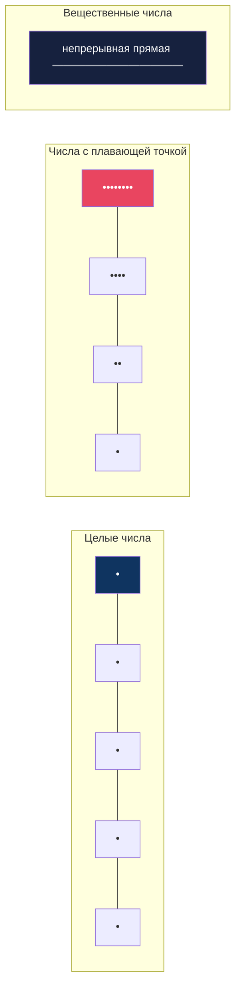
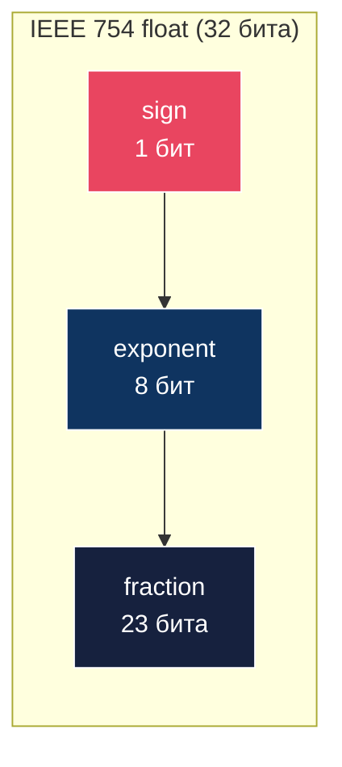
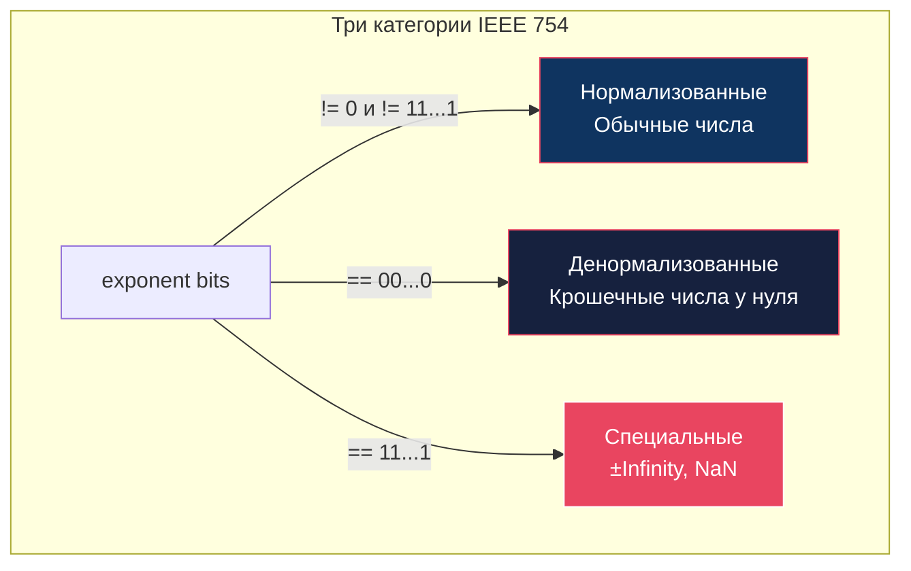

# Глава: CS:APP 2.4 --- Числа с плавающей точкой

> [!info] Контекст
> Почему `0.1 + 0.2 != 0.3`? Почему `16 777 216.0 + 1.0 == 16 777 216.0`? Почему `NaN != NaN`? Этот раздел объясняет, как компьютер хранит вещественные числа: формат IEEE 754, три категории чисел, правила округления и арифметики --- и почему плавающая точка работает не так, как школьная математика.
>
> **Пререквизиты:** [[2.1-overview|Глава 2.1 --- Хранение информации]] (двоичная система, побитовые операции), [[2.2-overview|Глава 2.2 --- Целочисленные представления]] (B2U, B2T, битовые интерпретации), [[2.3-overview|Глава 2.3 --- Целочисленная арифметика]] (переполнение, модульная арифметика).
>
> **Язык примеров:** Zig --- строго типизирован, поддерживает `f16`, `f32`, `f64`, `f80`, `f128`, предоставляет `@bitCast` для разбора битов float и `std.math` для специальных значений.

---

## Обзор: вещественные числа на конечном пространстве

Целые числа --- это точки на числовой прямой: каждая точка представлена ровно, без потерь. Вещественные числа --- это **непрерывная** прямая, а у нас конечное число бит. Мы не можем представить все точки --- только некоторое подмножество. Формат IEEE 754 определяет, **какие** точки мы можем представить и что происходит, когда нужное число не совпадает ни с одной из них.



Ключевая особенность: float-числа **не расставлены равномерно**. Вблизи нуля они стоят густо, вдали от нуля --- разреженно. Это осознанный выбор: **относительная** точность остаётся примерно одинаковой по всему диапазону.

> [!important] Главная идея раздела 2.4
> Числа с плавающей точкой --- это **не сломанная математика**. Они следуют точным, предсказуемым правилам. Но эти правила отличаются от школьной арифметики: сложение не ассоциативно, `0.1` не представимо точно, а `NaN` не равен самому себе.

---

## Шаг 1: Двоичные дроби --- что можно, а что нельзя представить

### Проблема

Ты умеешь переводить целые числа в двоичную систему: `13 = 1101₂`. А как перевести `5.75`?

### Аналогия: нарезка пирога

Представь пирог. Ты можешь разрезать его **только пополам**: половина, четверть, восьмая, шестнадцатая... Если нужно отмерить `0.75` пирога --- это `1/2 + 1/4`, два куска. Если нужно `0.875` --- это `1/2 + 1/4 + 1/8`, три куска. Всё складывается из степеней `1/2`.

Но попробуй отмерить ровно `0.1` пирога (одну десятую). Из кусков `1/2`, `1/4`, `1/8`, `1/16`... ты никогда не получишь ровно `0.1`. Получишь бесконечное приближение: `0.0001100110011...₂`.

### Биты справа от точки = отрицательные степени двойки

Двоичная точка работает так же, как десятичная, но с основанием 2:

```
Позиция:     2¹   2⁰  .  2⁻¹   2⁻²   2⁻³
Вес:          2    1   .  0.5   0.25  0.125

Пример: 101.11₂ = 4 + 0 + 1 + 0.5 + 0.25 = 5.75
```

### Примеры перевода

```
5.75   = 101.11₂    (4 + 1 + 0.5 + 0.25)
2.875  = 10.111₂    (2 + 0.5 + 0.25 + 0.125)
0.5    = 0.1₂       (1/2)
0.25   = 0.01₂      (1/4)
0.375  = 0.011₂     (1/4 + 1/8)
```

### Ключевое ограничение: только дроби вида x/2^k

Точно представимы **только** числа, знаменатель которых --- степень двойки. Всё остальное --- бесконечная периодическая дробь:

```
1/3  = 0.01010101...₂   (бесконечная)
1/5  = 0.00110011...₂   (бесконечная)
1/10 = 0.0001100110011...₂  (бесконечная!)
```

Число `0.1` в десятичной системе выглядит простым, но в двоичной это **бесконечная** дробь, как `1/3 = 0.333...` в десятичной.

### Zig: 0.1 + 0.2 != 0.3

```zig
const std = @import("std");

pub fn main() void {
    const a: f64 = 0.1;
    const b: f64 = 0.2;
    const c: f64 = 0.3;
    const sum = a + b;

    std.debug.print("0.1 + 0.2 = {d:.20}\n", .{sum});
    // 0.1 + 0.2 = 0.30000000000000004441

    std.debug.print("0.3       = {d:.20}\n", .{c});
    // 0.3       = 0.29999999999999998890

    std.debug.print("0.1 + 0.2 == 0.3? {}\n", .{sum == c});
    // false

    // Правильный способ: сравнение с допуском (epsilon)
    const eps = 1e-10;
    std.debug.print("|sum - 0.3| < eps? {}\n", .{@abs(sum - c) < eps});
    // true
}
```

> [!warning] Распространённое заблуждение: "0.1 хранится как 0.1"
> Нет. В памяти хранится **ближайшее** представимое значение: `0.1000000000000000055511151231257827021181583404541015625`. Это число отличается от `0.1` на ~5.5e-18, но ошибки накапливаются при вычислениях.

> [!tip] Ключевой вывод
> Двоичная дробь --- это сумма степеней `1/2`. Точно представимы только числа вида `x/2^k`. Число `0.1` --- бесконечная двоичная дробь, поэтому `0.1 + 0.2 != 0.3`.

---

## Шаг 2: Формат IEEE 754 --- анатомия float

### Проблема

Как уместить вещественное число в 32 бита? Нужно закодировать знак, порядок величины (число маленькое или большое?) и точные цифры.

### Три поля: sign, exponent, fraction

Каждое число с плавающей точкой хранится в трёх полях:



| Формат | Всего бит | sign | exponent (k) | fraction (n) |
|--------|-----------|------|--------------|--------------|
| float (f32) | 32 | 1 | 8 | 23 |
| double (f64) | 64 | 1 | 11 | 52 |
| half (f16) | 16 | 1 | 5 | 10 |

- **sign** --- бит знака: `0` = положительное, `1` = отрицательное
- **exponent** --- показатель степени (со сдвигом, bias)
- **fraction** --- дробная часть мантиссы

### Модель «окно и смещение» (Window and Offset)

Вместо формул с показателями степени и мантиссами используем интуитивную модель (предложенную Fabien Sanglard).

**Exponent = "окно"**: показатель степени определяет **интервал** (окно), в котором лежит число. Каждое окно --- это степень двойки:

```
Окно 0:    [0.5, 1)
Окно 1:    [1, 2)
Окно 2:    [2, 4)
Окно 3:    [4, 8)
Окно 4:    [8, 16)
...
Окно 10:   [512, 1024)
```

Каждое следующее окно **вдвое шире** предыдущего.

**Fraction = "смещение"**: 23-битная дробная часть делит окно на `2^23 = 8 388 608` равных корзин. Fraction говорит, в какую именно корзину попадает число --- как **процент от начала окна к его концу**.

### Пример: как хранится число 3.14

```
Шаг 1. Знак: 3.14 > 0 → sign = 0

Шаг 2. Окно: 3.14 лежит в интервале [2, 4) = [2¹, 2²)
       E = 1, exponent = E + bias = 1 + 127 = 128 = 10000000₂

Шаг 3. Смещение внутри окна [2, 4):
       Ширина окна = 4 - 2 = 2
       Позиция = (3.14 - 2) / 2 = 1.14 / 2 = 0.57  (57% от начала)
       fraction = 0.57 * 2^23 = 4 781 507 ≈ 10010001111010111000011₂
```

Итого: `0 | 10000000 | 10010001111010111000011`

### Zig: разбираем биты float через @bitCast

```zig
const std = @import("std");

pub fn main() void {
    const val: f32 = 3.14;

    // @bitCast: интерпретируем 32 бита float как u32
    const bits: u32 = @bitCast(val);

    // Извлекаем поля
    const sign: u1 = @truncate(bits >> 31);
    const exp: u8 = @truncate(bits >> 23);
    const frac: u23 = @truncate(bits);

    std.debug.print("3.14 as bits: 0x{x:0>8}\n", .{bits});
    std.debug.print("sign: {}, exponent: {} (biased), fraction: 0x{x:0>6}\n", .{
        sign, exp, @as(u32, frac),
    });
    // sign: 0, exponent: 128 (biased), fraction: 0x48f5c3

    // Обратно: собираем float из бит
    const reconstructed: f32 = @bitCast(bits);
    std.debug.print("reconstructed: {d:.6}\n", .{reconstructed});
    // reconstructed: 3.140000
}
```

> [!tip] Почему «окно и смещение», а не формула?
> Формула `(-1)^s * M * 2^E` математически точна, но не даёт интуиции. Модель «окно + смещение» сразу показывает: exponent выбирает **масштаб** (маленькие числа или большие), а fraction --- **позицию** внутри этого масштаба. Запоминается раз и навсегда.

> [!tip] Ключевой вывод
> IEEE 754 число = знак + окно (exponent) + позиция в окне (fraction). Exponent определяет интервал `[2^E, 2^(E+1))`, fraction делит этот интервал на `2^23` (или `2^52`) равных частей.

---

## Шаг 3: Три категории чисел

### Проблема

Не все комбинации бит exponent и fraction кодируют «обычные» числа. IEEE 754 выделяет три категории в зависимости от значения exponent.

### Обзор категорий



### Категория 1: Нормализованные числа (exponent != 0 и != все единицы)

Это основной режим работы. Подавляющее большинство чисел, с которыми работает программа, --- нормализованные.

```
E = exponent - bias          (bias = 2^(k-1) - 1 = 127 для f32, 1023 для f64)
M = 1.fraction               (неявная единица перед точкой!)
Значение = (-1)^sign * M * 2^E
```

**Неявная единица** --- гениальный трюк. Раз нормализованная мантисса всегда имеет вид `1.xxx...`, начальную единицу можно не хранить --- она подразумевается. Это даёт **бесплатный дополнительный бит** точности.

Пример: если fraction = `10010001111010111000011`, то мантисса = `1.10010001111010111000011`.

### Категория 2: Денормализованные числа (exponent = все нули)

Когда exponent равен нулю, число переходит в «режим супер-увеличения» для крошечных значений вблизи нуля.

```
E = 1 - bias                 (НЕ 0 - bias! Это обеспечивает плавный переход)
M = 0.fraction               (без неявной единицы!)
Значение = (-1)^sign * M * 2^E
```

Аналогия: **микроскоп с режимом «супер-зум»**. Обычный микроскоп (нормализованные числа) видит объекты до определённого размера. Когда объект слишком мал, включается специальный режим (денормализованные), который позволяет различать объекты ещё меньше --- ценой потери некоторых деталей (точности).

Зачем нужны денормализованные? Без них между нулём и наименьшим нормализованным числом был бы **разрыв** --- область, где числа невозможно различить. Денормализованные числа заполняют этот разрыв, обеспечивая **плавный переход к нулю** (gradual underflow).

**Два нуля:** fraction = 0, sign = 0 --- это `+0.0`. Fraction = 0, sign = 1 --- это `-0.0`. С точки зрения `==` они равны, но ведут себя по-разному:

```
1.0 / (+0.0) = +Infinity
1.0 / (-0.0) = -Infinity
```

### Категория 3: Специальные значения (exponent = все единицы)

- **fraction = 0** --- `+Infinity` или `-Infinity` (в зависимости от знака). Результат деления на ноль или переполнения.
- **fraction != 0** --- `NaN` (Not a Number). Результат бессмысленных операций: `0/0`, `sqrt(-1)`, `Infinity - Infinity`.

### Zig: специальные значения через std.math

```zig
const std = @import("std");
const math = std.math;

pub fn main() void {
    // Infinity
    const pos_inf: f32 = math.inf(f32);
    const neg_inf: f32 = -math.inf(f32);
    std.debug.print("+inf: {}, -inf: {}\n", .{ pos_inf, neg_inf });
    // +inf: inf, -inf: -inf

    // NaN
    const nan: f32 = math.nan(f32);
    std.debug.print("NaN: {}\n", .{nan}); // NaN: nan

    // NaN != NaN --- ВСЕГДА!
    std.debug.print("NaN == NaN? {}\n", .{nan == nan}); // false
    std.debug.print("isNan(NaN)? {}\n", .{math.isNan(nan)}); // true

    // +0 и -0
    const pos_zero: f32 = 0.0;
    const neg_zero: f32 = -0.0;
    std.debug.print("+0 == -0? {}\n", .{pos_zero == neg_zero}); // true
    std.debug.print("1/+0 = {}\n", .{@as(f32, 1.0) / pos_zero}); // inf
    std.debug.print("1/-0 = {}\n", .{@as(f32, 1.0) / neg_zero}); // -inf

    // Как получить NaN и Infinity
    const zero: f32 = 0.0;
    std.debug.print("0/0 = {}\n", .{zero / zero}); // nan
    std.debug.print("1/0 = {}\n", .{@as(f32, 1.0) / zero}); // inf
    std.debug.print("inf - inf = {}\n", .{pos_inf - pos_inf}); // nan
    std.debug.print("inf + inf = {}\n", .{pos_inf + pos_inf}); // inf

    // Денормализованные: наименьшие числа
    const min_denorm: f32 = math.floatMin(f32);
    const min_normal: f32 = @bitCast(@as(u32, 0x00800000)); // наименьшее нормализованное
    std.debug.print("min denorm f32: {e}\n", .{min_denorm});
    // min denorm f32: 1.17549435e-38
    std.debug.print("min normal f32: {e}\n", .{min_normal});
    // min normal f32: 1.17549435e-38
}
```

> [!warning] Распространённое заблуждение: "NaN == NaN"
> Нет. `NaN != NaN` --- это **не баг**, а часть стандарта IEEE 754. Для проверки на NaN используй `std.math.isNan()` в Zig или `Number.isNaN()` в JavaScript. Сравнение `x != x` --- тоже корректный способ проверить, что `x` --- NaN.

> [!warning] Распространённое заблуждение: "+0 и -0 --- это одно и то же"
> При сравнении через `==` --- да. Но они дают **разные результаты** при делении: `1/+0 = +Infinity`, `1/-0 = -Infinity`. Также `-0.0` может появиться неожиданно: например, `-1.0 * 0.0 = -0.0`.

> [!tip] Ключевой вывод
> Три категории: нормализованные (обычные числа, с неявной единицей в мантиссе), денормализованные (крошечные числа у нуля, без неявной единицы, заполняют разрыв), специальные (`+-Infinity` и `NaN`). Каждая категория определяется значением exponent.

---

## Шаг 4: Плотность чисел на числовой прямой

### Проблема

Если float-числа --- это «точки» на числовой прямой, как они расставлены?

### Аналогия: линейка с неравномерной шкалой

Представь линейку, где первый сантиметр разделён на 8 миллионов делений, второй --- тоже на 8 миллионов, четвёртый-пятый (от 4 до 8) --- тоже на 8 миллионов. Каждый интервал (окно) содержит **одинаковое** количество делений, но сами интервалы **растут экспоненциально**.

Для f32 это `2^23 = 8 388 608` делений на каждое окно:

```
Окно [1, 2):    8 388 608 чисел, шаг ≈ 0.000000119
Окно [2, 4):    8 388 608 чисел, шаг ≈ 0.000000238
Окно [4, 8):    8 388 608 чисел, шаг ≈ 0.000000477
...
Окно [2^23, 2^24):  8 388 608 чисел, шаг = 1.0  (!!!!)
Окно [2^24, 2^25):  8 388 608 чисел, шаг = 2.0
```

Когда окно дорастает до `[2^23, 2^24)` = `[8 388 608, 16 777 216)`, шаг между соседними числами достигает **ровно 1.0**. Это значит, что дальше float **не может различить** соседние целые числа.

### Zig: где float перестаёт различать целые

```zig
const std = @import("std");

pub fn main() void {
    // f32: 2^24 = 16_777_216 --- граница целочисленной точности
    const big: f32 = 16_777_216.0;

    std.debug.print("16777216.0 + 1.0 = {d:.1}\n", .{big + 1.0});
    // 16777216.0 + 1.0 = 16777216.0   ← единица ПОТЕРЯНА!

    std.debug.print("16777216.0 + 2.0 = {d:.1}\n", .{big + 2.0});
    // 16777216.0 + 2.0 = 16777218.0   ← нечётное число пропущено!

    // Для f64: граница --- 2^53 = 9_007_199_254_740_992
    const big64: f64 = 9_007_199_254_740_992.0;
    std.debug.print("2^53 + 1 = {d:.1}\n", .{big64 + 1.0});
    // 2^53 + 1 = 9007199254740992.0   ← единица потеряна!
}
```

### Точность: сколько десятичных цифр?

Поскольку точность **относительная**, удобно измерять её в значащих десятичных цифрах:

| Формат | Бит мантиссы | Десятичных цифр | Граница целых |
|--------|-------------|-----------------|---------------|
| f16    | 10          | ~3.3           | 2^11 = 2 048 |
| f32    | 23          | ~7.2           | 2^24 = 16 777 216 |
| f64    | 52          | ~15.9          | 2^53 = 9 007 199 254 740 992 |

> [!warning] Распространённое заблуждение: "double вдвое точнее float"
> Нет. f32 даёт ~7 десятичных цифр точности, f64 --- ~16. Это не «вдвое», а примерно в 2.2 раза. Название «double» происходит от удвоения **размера в битах** (32 -> 64), а не точности.

> [!tip] Ключевой вывод
> В каждом окне `[2^E, 2^(E+1))` --- одинаковое количество представимых чисел (8 388 608 для f32). Но окна растут экспоненциально, поэтому чем дальше от нуля --- тем больше шаг между соседними float. f32 даёт ~7 значащих десятичных цифр, f64 --- ~16.

---

## Шаг 5: Округление

### Проблема

Когда результат вычисления не совпадает ни с одним представимым float-числом, его нужно **округлить** до ближайшего. Но в какую сторону?

### Четыре режима округления IEEE 754

| Режим | Описание | 1.5 | 2.5 | -1.5 | -2.5 |
|-------|----------|-----|-----|------|------|
| **К ближайшему чётному** (default) | Если ровно посередине --- к чётному | 2 | 2 | -2 | -2 |
| К нулю (truncation) | Отбрасываем дробную часть | 1 | 2 | -1 | -2 |
| Вниз (floor) | Всегда к -infinity | 1 | 2 | -2 | -3 |
| Вверх (ceil) | Всегда к +infinity | 2 | 3 | -1 | -2 |

### Почему «к ближайшему чётному» --- режим по умолчанию?

Аналогия: **банковское округление**. Представь, что банк начисляет проценты на миллионы вкладов. Если при числе ровно посередине (например, `2.5` цента) всегда округлять вверх, за год банк переплатит миллионы. Если всегда вниз --- недоплатит. Округление «к чётному» чередует направление: `1.5 -> 2`, `2.5 -> 2`, `3.5 -> 4`, `4.5 -> 4`. В среднем ошибка **нулевая**.

Правило: когда число ровно посередине между двумя представимыми значениями, выбирается то, у которого **младший значащий бит = 0** (чётное).

### Применение в двоичной системе

Округление к ближайшему чётному работает и с двоичными числами. Тут «чётное» означает, что последний сохраняемый бит равен `0`.

```
Округление до целого (бит справа от точки отбрасывается):

10.00011₂ = 2.09375   → 10₂ = 2        (ближе к 2)
10.00110₂ = 2.1875    → 10₂ = 2        (ближе к 2)
10.11100₂ = 2.875     → 11₂ = 3        (ближе к 3)
10.10000₂ = 2.5       → 10₂ = 2        (ровно посередине → к чётному, 10₂)
11.10000₂ = 3.5       → 100₂ = 4       (ровно посередине → к чётному, 100₂)
```

> [!tip] Ключевой вывод
> IEEE 754 по умолчанию округляет «к ближайшему чётному» (round-to-nearest-even). Это устраняет статистическое смещение при массовых вычислениях. Особый случай: когда число ровно посередине, выбирается представимое значение с чётным младшим битом.

---

## Шаг 6: Арифметика с плавающей точкой

### Проблема

В целочисленной арифметике `(a + b) + c = a + (b + c)` --- всегда. Верно ли это для float?

### Коммутативность: ДА

```
a + b = b + a        ← всегда верно
a * b = b * a        ← всегда верно (даже для NaN и Infinity)
```

### Ассоциативность: НЕТ!

Это самое важное отличие float-арифметики от обычной. Перегруппировка слагаемых может изменить результат, потому что промежуточные округления происходят в **разные моменты**.

```
(a + b) + c   ≠   a + (b + c)      ← в общем случае!
(a * b) * c   ≠   a * (b * c)      ← в общем случае!
```

### Zig: нарушение ассоциативности

```zig
const std = @import("std");

pub fn main() void {
    const a: f64 = 1e20;
    const b: f64 = -1e20;
    const c: f64 = 3.14;

    // (a + b) + c
    const left = (a + b) + c;
    std.debug.print("(1e20 + -1e20) + 3.14 = {d:.2}\n", .{left});
    // = 0 + 3.14 = 3.14

    // a + (b + c)
    const right = a + (b + c);
    std.debug.print("1e20 + (-1e20 + 3.14) = {d:.2}\n", .{right});
    // = 1e20 + (-1e20) = 0.00
    // 3.14 поглощён: -1e20 + 3.14 округляется до -1e20

    std.debug.print("Равны? {}\n", .{left == right});
    // false
}
```

Что произошло: при вычислении `b + c = -1e20 + 3.14` число `3.14` слишком мало по сравнению с `1e20` и **поглощается** при округлении. Порядок операций решает всё.

### Дистрибутивность: НЕТ!

```
a * (b + c)   ≠   a * b + a * c     ← в общем случае!
```

### Монотонность: ДА (с оговоркой)

Если `a >= b`, то `a + c >= b + c` для любого `c` (кроме NaN). Это полезное свойство: сравнения сохраняются при сложении.

### Таблица свойств

| Свойство | Целые числа | Float |
|----------|-------------|-------|
| Коммутативность (+, *) | Да | Да |
| Ассоциативность (+, *) | Да | **НЕТ** |
| Дистрибутивность | Да | **НЕТ** |
| Монотонность | Да | Да (кроме NaN) |
| `x * 0 == 0` | Да | **Не всегда** (NaN * 0 = NaN) |

> [!warning] Распространённое заблуждение: "сложение float ассоциативно"
> Нет. Это причина реальных багов. Компилятор **не имеет права** переставлять слагаемые float-выражений (в отличие от целочисленных), если не включён режим fast-math. Порядок вычислений для float --- часть семантики программы.

> [!tip] Ключевой вывод
> Float-арифметика коммутативна, но **не** ассоциативна и **не** дистрибутивна. Перегруппировка слагаемых может изменить результат из-за промежуточных округлений. Компилятор не переставляет float-операции без явного разрешения.

---

## Шаг 7: Преобразования float <-> int

### Проблема

Как переводить числа между целочисленным и float-представлением? Что происходит с числами, которые не помещаются?

### Zig: встроенные функции преобразования

```zig
const std = @import("std");

pub fn main() void {
    // int → float: @floatFromInt
    const i: i32 = 42;
    const f: f32 = @floatFromInt(i);
    std.debug.print("i32(42) -> f32 = {d:.1}\n", .{f}); // 42.0

    // float → int: @intFromFloat
    const pi: f64 = 3.14;
    const truncated: i32 = @intFromFloat(pi); // усечение к нулю
    std.debug.print("f64(3.14) -> i32 = {}\n", .{truncated}); // 3

    // Отрицательные тоже усекаются к нулю
    const neg: f64 = -2.9;
    const neg_int: i32 = @intFromFloat(neg);
    std.debug.print("f64(-2.9) -> i32 = {}\n", .{neg_int}); // -2

    // ПАНИКА: NaN или Infinity в @intFromFloat
    // const bad: i32 = @intFromFloat(std.math.nan(f64)); // panic!
    // const bad2: i32 = @intFromFloat(std.math.inf(f64)); // panic!

    // ПАНИКА: значение за пределами диапазона i32
    // const huge: i32 = @intFromFloat(@as(f64, 3e10)); // panic!

    // Безопасный вариант: @floatCast для конверсии между float-типами
    const d: f64 = 3.14;
    const s: f32 = @floatCast(d); // f64 -> f32 (может потерять точность)
    std.debug.print("f64(3.14) -> f32 = {d:.10}\n", .{s});
    // f32 = 3.1400001049 (потеря точности!)

    // Большие целые теряют точность при преобразовании в f32
    const big_int: i32 = 123_456_789;
    const as_f32: f32 = @floatFromInt(big_int);
    const back: i32 = @intFromFloat(as_f32);
    std.debug.print("i32({}) -> f32 -> i32 = {}\n", .{ big_int, back });
    // i32(123456789) -> f32 -> i32 = 123456792  ← потеря точности!
}
```

### Сводка правил преобразования

| Преобразование | Что происходит | Zig-функция |
|----------------|---------------|-------------|
| int -> float | Округление к ближайшему чётному, если число не представимо точно | `@floatFromInt` |
| float -> int | Усечение к нулю. Паника при NaN, Infinity или выходе за диапазон | `@intFromFloat` |
| float -> float (сужение) | Округление к ближайшему чётному. Паника при Infinity, если не вмещается | `@floatCast` |

> [!tip] Zig vs C
> В C преобразование float -> int при переполнении --- **неопределённое поведение**. Компилятор может сделать что угодно. В Zig --- гарантированная паника в debug-режиме. Безопаснее и предсказуемее.

> [!tip] Ключевой вывод
> `@floatFromInt` округляет, если int-значение не представимо точно в float. `@intFromFloat` усекает к нулю и паникует при NaN/Infinity/переполнении. `@floatCast` меняет точность между float-типами.

---

## Шаг 8: Практические ловушки и реальные инциденты

### Ловушка 1: 0.1 + 0.2 != 0.3

Уже разобрана в Шаге 1. Решение --- сравнение с допуском (epsilon) или использование целочисленной арифметики для денежных вычислений.

### Ловушка 2: «замёрзший одометр»

Когда float-переменная накопила достаточно большое значение, добавление маленьких приращений перестаёт работать:

```zig
const std = @import("std");

pub fn main() void {
    var sum: f32 = 0.0;
    var i: u32 = 0;
    while (i < 20_000_000) : (i += 1) {
        sum += 1.0;
    }
    std.debug.print("Сумма 20M единиц (f32): {d:.1}\n", .{sum});
    // 16777216.0 --- «замёрз» на 2^24!

    // f64 справляется:
    var sum64: f64 = 0.0;
    i = 0;
    while (i < 20_000_000) : (i += 1) {
        sum64 += 1.0;
    }
    std.debug.print("Сумма 20M единиц (f64): {d:.1}\n", .{sum64});
    // 20000000.0 --- правильно
}
```

После `2^24 = 16 777 216` шаг между соседними f32 равен 2.0, и `+1.0` округляется до нуля. Счётчик «замерзает».

### Ловушка 3: ID Twitter (и другие большие числа в JSON)

Twitter ID --- 64-битное целое число. JavaScript `Number` (f64) точен только до `2^53`. Числа вроде `300795255846584321` теряют последние цифры:

```
Настоящий ID:  300795255846584321
В JavaScript:  300795255846584320   ← последняя цифра потеряна!
```

Решение: передавать большие ID как строки, а не числа.

### Ловушка 4: катастрофическая потеря точности (Catastrophic Cancellation)

При вычитании двух почти равных чисел значащие цифры **взаимно уничтожаются**, и результат состоит почти целиком из шума округления:

```zig
const std = @import("std");

pub fn main() void {
    const a: f64 = 1.0000000000000002;
    const b: f64 = 1.0000000000000001;

    const diff = a - b;
    std.debug.print("Разность: {e}\n", .{diff});
    // Ожидаем: 1e-16
    // Получаем: ненулевое, но с огромной относительной ошибкой
}
```

### Ловушка 5: float как счётчик цикла

```zig
const std = @import("std");

pub fn main() void {
    // ОПАСНО: бесконечный цикл возможен
    // var x: f32 = 0.0;
    // while (x != 1.0) {  // может НИКОГДА не стать ровно 1.0
    //     x += 0.1;
    // }

    // ПРАВИЛЬНО: целочисленный счётчик
    var i: u32 = 0;
    while (i < 10) : (i += 1) {
        const x: f32 = @as(f32, @floatFromInt(i)) * 0.1;
        std.debug.print("{d:.1} ", .{x});
    }
    std.debug.print("\n", .{});
}
```

### Ловушка 6: Minecraft Far Lands

В ранних версиях Minecraft координаты мира хранились как f32. На расстоянии ~12.5 миллионов блоков от центра карты точность f32 падала настолько, что игрок «дрожал», блоки деформировались, а физика ломалась. Это место назвали «Far Lands». Решение: переход на f64.

> [!warning] Распространённое заблуждение: "сравнивать float через == всегда плохо"
> Не всегда. Сравнение `x == 0.0`, `x == 1.0` или сравнение с infinity --- вполне корректно, если число получено точным вычислением (присвоением, а не арифметикой). Проблема возникает при сравнении **результатов вычислений**, где накапливается ошибка округления.

> [!warning] Распространённое заблуждение: "float --- это сломанная математика"
> Float работает по точным, детерминированным правилам IEEE 754. «Сломанными» кажутся только ожидания, основанные на школьной арифметике. Понимание правил --- ключ к корректному коду.

> [!tip] Ключевой вывод
> Основные ловушки: потеря точности при накоплении, «замёрзший одометр» у 2^24 для f32, потеря значащих цифр при вычитании близких чисел, float как счётчик цикла. Для денежных вычислений --- целочисленная арифметика. Для больших ID --- строки.

---

## Шаг 9: Zig-специфика: типы, режимы, стандартная библиотека

### Типы с плавающей точкой в Zig

Zig поддерживает больше float-типов, чем большинство языков:

| Тип | Бит | Exponent | Fraction | Десятичных цифр |
|-----|-----|----------|----------|-----------------|
| `f16` | 16 | 5 | 10 | ~3.3 |
| `f32` | 32 | 8 | 23 | ~7.2 |
| `f64` | 64 | 11 | 52 | ~15.9 |
| `f80` | 80 | 15 | 64 | ~18.5 |
| `f128` | 128 | 15 | 112 | ~34.0 |
| `comptime_float` | --- | --- | --- | произвольная |

`comptime_float` --- уникальная фича Zig. Во время компиляции float-вычисления выполняются с **произвольной точностью** (не ограничены IEEE 754). Ошибки округления в comptime-вычислениях минимальны:

```zig
const std = @import("std");

pub fn main() void {
    // comptime: произвольная точность
    const comptime_result = comptime blk: {
        const a = 0.1;
        const b = 0.2;
        break :blk a + b; // comptime: результат точный
    };
    // Но при приведении к f64 --- стандартные правила IEEE 754
    const runtime: f64 = comptime_result;
    std.debug.print("comptime 0.1 + 0.2 as f64: {d:.20}\n", .{runtime});
}
```

### Встроенные функции для float

```zig
const std = @import("std");

pub fn main() void {
    // Преобразования
    const i: i32 = 42;
    const f: f32 = @floatFromInt(i); // int -> float
    const back: i32 = @intFromFloat(f); // float -> int (к нулю)
    _ = back;

    // Сужение/расширение float
    const d: f64 = 3.14;
    const s: f32 = @floatCast(d); // f64 -> f32
    _ = s;

    // Битовая реинтерпретация
    const bits: u32 = @bitCast(@as(f32, 3.14)); // f32 -> u32 (те же биты)
    const restored: f32 = @bitCast(bits); // u32 -> f32
    std.debug.print("bits: 0x{x:0>8}, restored: {d:.2}\n", .{ bits, restored });
}
```

### Режимы оптимизации float

Zig предоставляет контроль над поведением float-арифметики через `@setFloatMode`:

```zig
const std = @import("std");

fn strictAdd(a: f32, b: f32, c: f32) f32 {
    @setFloatMode(.strict); // IEEE 754 гарантии
    return (a + b) + c;
}

fn optimizedAdd(a: f32, b: f32, c: f32) f32 {
    @setFloatMode(.optimized); // компилятор может переставлять операции
    return (a + b) + c; // может быть вычислено как a + (b + c)
}

pub fn main() void {
    const a: f32 = 1e20;
    const b: f32 = -1e20;
    const c: f32 = 3.14;

    std.debug.print("strict:    {d:.2}\n", .{strictAdd(a, b, c)});
    std.debug.print("optimized: {d:.2}\n", .{optimizedAdd(a, b, c)});
    // В strict-режиме результат гарантированно (1e20 + -1e20) + 3.14 = 3.14
    // В optimized-режиме компилятор может переставить --- результат может отличаться
}
```

- **`.strict`** (по умолчанию) --- строгое соответствие IEEE 754. Компилятор не переставляет операции, не объединяет multiply-add. Результат **детерминирован**.
- **`.optimized`** --- компилятор может переупорядочивать float-операции для производительности. Аналог `-ffast-math` в GCC. Результат может отличаться от строгого, но вычисления быстрее.

### std.math: полезные функции

```zig
const std = @import("std");
const math = std.math;

pub fn main() void {
    // Специальные значения
    std.debug.print("inf: {}\n", .{math.inf(f32)});
    std.debug.print("nan: {}\n", .{math.nan(f32)});
    std.debug.print("epsilon f32: {e}\n", .{math.floatEps(f32)});
    // epsilon --- разность между 1.0 и следующим представимым числом

    // Проверки
    std.debug.print("isNan: {}\n", .{math.isNan(math.nan(f32))}); // true
    std.debug.print("isInf: {}\n", .{math.isInf(math.inf(f32))}); // true
    std.debug.print("isNormal: {}\n", .{math.isNormal(@as(f32, 1.0))}); // true

    // Математические функции
    std.debug.print("sqrt(2): {d:.10}\n", .{@sqrt(@as(f64, 2.0))}); // 1.4142135624
    std.debug.print("floor(3.7): {d:.1}\n", .{@floor(@as(f64, 3.7))}); // 3.0
    std.debug.print("ceil(3.2): {d:.1}\n", .{@ceil(@as(f64, 3.2))}); // 4.0
}
```

> [!tip] Ключевой вывод
> Zig предоставляет типы от f16 до f128, comptime_float для точных вычислений в компиляции, `@setFloatMode` для выбора между строгостью и производительностью, и богатый набор функций в `std.math`. Встроенные `@floatFromInt`, `@intFromFloat`, `@floatCast` и `@bitCast` покрывают все преобразования.

---

## Итоги: ментальная модель float

### Девять фактов, которые нужно помнить

1. **Float --- это конечная аппроксимация** вещественных чисел. Точно представимы только числа вида `x/2^k`.
2. **Окно + смещение**: exponent выбирает масштаб (окно), fraction --- позицию внутри окна.
3. **Три категории**: нормализованные (обычные), денормализованные (крошечные, у нуля), специальные (Infinity, NaN).
4. **Неравномерное распределение**: чем дальше от нуля, тем реже стоят представимые числа.
5. **Округление к ближайшему чётному** --- режим по умолчанию, устраняет статистическое смещение.
6. **Ассоциативности нет**: `(a + b) + c != a + (b + c)` в общем случае.
7. **NaN != NaN**, `+0 == -0`, но `1/+0 != 1/-0`.
8. **f32: ~7 цифр**, f64: ~16 цифр. Граница целочисленной точности: 2^24 и 2^53.
9. **Для денег --- целые числа**. Для ID --- строки. Для float --- epsilon-сравнение.

### Сводка заблуждений

| Заблуждение | Реальность |
|-------------|-----------|
| «Float сломан» | Работает по точным правилам IEEE 754 |
| «0.1 хранится как 0.1» | Хранится ближайшее представимое значение |
| «Сложение ассоциативно» | Нет: промежуточные округления меняют результат |
| «NaN == NaN» | Нет: NaN не равен ничему, даже себе |
| «+0 и -0 одинаковы» | При `==` да, но `1/+0 = +inf`, `1/-0 = -inf` |
| «Float безопасен как счётчик цикла» | Опасно: может не достичь точного значения |
| «== для float всегда плох» | Не всегда: сравнение с литералом или с inf корректно |
| «double вдвое точнее float» | ~7 vs ~16 цифр (в 2.2 раза, а не в 2) |

---

## Related Topics

- [[2.1-overview|Глава 2.1 --- Хранение информации]] --- двоичная система, побитовые операции, байтовое представление
- [[2.2-overview|Глава 2.2 --- Целочисленные представления]] --- B2U, B2T, битовые интерпретации, `@bitCast`
- [[2.3-overview|Глава 2.3 --- Целочисленная арифметика]] --- переполнение, модульная арифметика, wrapping-операторы

---

## Sources

- Bryant R., O'Hallaron D. --- *Computer Systems: A Programmer's Perspective*, 3rd Edition, Chapter 2.4 (pages 134--156)
- Fabien Sanglard --- *Floating Point Visually Explained*: https://fabiensanglard.net/floating_point_visually_explained/
- Julia Evans --- *Examples of floating point problems*: https://jvns.ca/blog/2023/01/13/examples-of-floating-point-problems/
- Zig Language Reference --- Floats: https://ziglang.org/documentation/master/#Floats
- Zig `@bitCast`: https://ziglang.org/documentation/master/#@bitCast
- Zig `@floatFromInt` / `@intFromFloat`: https://ziglang.org/documentation/master/#@floatFromInt
- Zig `@setFloatMode`: https://ziglang.org/documentation/master/#@setFloatMode
- Zig `std.math`: https://ziglang.org/documentation/master/std/#std.math
- IEEE 754 (Wikipedia): https://en.wikipedia.org/wiki/IEEE_754
- *What Every Programmer Should Know About Floating-Point Arithmetic*: https://floating-point-gui.de/
