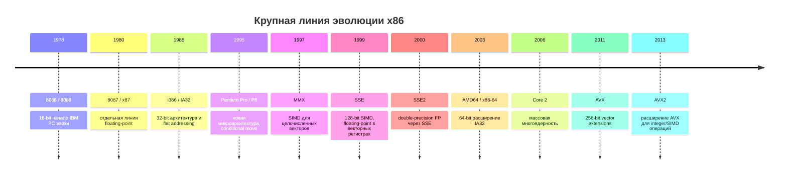
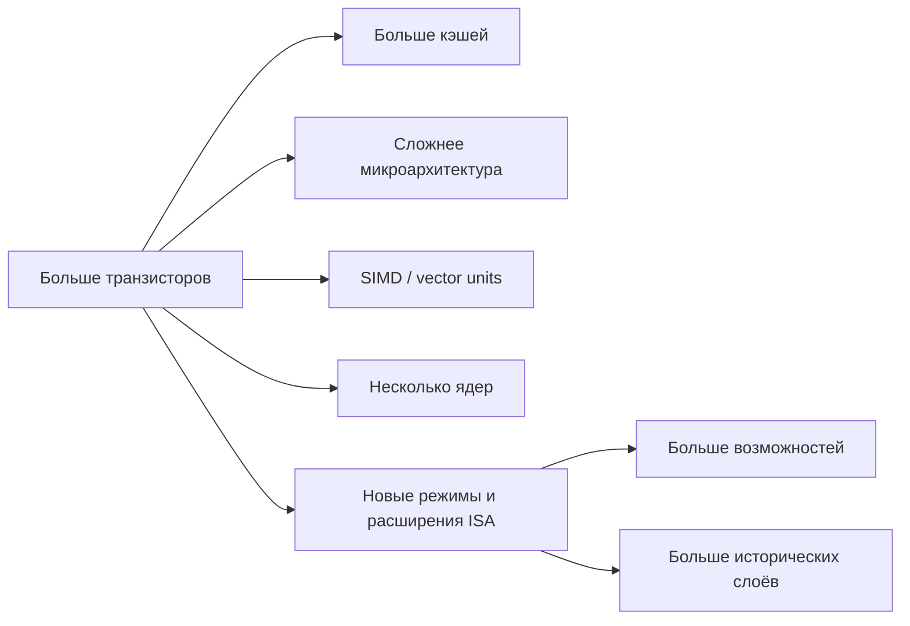

# Глава: CS:APP 3.1 --- Историческая перспектива x86

> [!info] Контекст
> Раздел 3.1 объясняет, почему современная `x86-64` выглядит не как чисто спроектированная архитектура, а как результат десятилетий совместимости. Это нужно перед изучением ассемблера: странные имена регистров, несколько поколений инструкций и старые режимы существуют не случайно, но для чтения кода, который генерирует GCC под Linux, нам понадобится только практическое подмножество.
>
> **Обязательные пререквизиты:** [[../../MOC|CS:APP MOC]], [[../../2.chapter/2.1/2.1-overview|2.1 --- Хранение информации]]: байт, адрес, word size, память как массив байтов.
>
> **Полезный optional-контекст:** [[../../2.chapter/2.4/2.4-overview|2.4 --- Числа с плавающей точкой]] для понимания `x87`/SSE2 и [[../../../../08-internals/jit-compilation|JIT-компиляция в V8]] для связи high-level runtime с machine code.
>
> **Фокус:** `x86`, `IA32`, `x86-64`, `AMD64`, обратная совместимость, закон Мура, почему старые особенности архитектуры можно держать на периферии внимания.

---

## Overview

Глава 3 переходит от представления данных к представлению программ. Программа в памяти --- это тоже байты, но теперь эти байты интерпретируются как инструкции процессора. Архитектура `x86-64` задаёт, какие инструкции существуют, какие регистры видит программа, как устроены адреса и какие соглашения использует машинный код.

История здесь важна по практической причине: `x86-64` не была создана как новая минималистичная ISA. Она выросла из 16-битной линии `8086`, прошла через 32-битную `IA32`, получила SIMD-расширения, затем 64-битное расширение `AMD64`/`Intel64`. Каждый этап должен был сохранять возможность запускать старый код. Поэтому в архитектуре есть слой за слоем: часть активно используется современными компиляторами, часть существует ради совместимости.

> [!important] Главная идея
> Для обучения не нужно сразу понимать всю историческую глубину x86. Нужно понимать, что она существует, отличать современное рабочее подмножество от legacy-слоя и читать ассемблер как результат работы компилятора, а не как язык, на котором обычно пишут вручную.

### Before You Start

Перед чтением проверь себя:

1. Что такое байт и адрес в памяти?
2. Что делает компилятор между source code и executable file?
3. Чем machine code отличается от assembly code?
4. Почему один и тот же исходный код может компилироваться в разный машинный код на разных CPU?

Если ответы расплывчатые, сначала вернись к [[../../2.chapter/2.1/2.1-overview|2.1 --- Хранение информации]] и общей схеме компиляции из главы 1.

**Ключевой вывод:** `x86-64` --- это современная ISA с тяжёлым историческим багажом. Мы изучаем не весь багаж, а ту часть, которую реально увидим в машинном коде C/Zig-подобных программ под Linux.

---

## Deep Dive

### Зачем программисту история процессоров

Когда ты пишешь на Zig, C, TypeScript или Go, компилятор и runtime скрывают машинный уровень. Но внизу всё равно есть конкретная ISA: набор инструкций, регистры, соглашения вызова, адресация памяти. Чем ниже ты спускаешься, тем больше начинает иметь значение не абстрактная “машина”, а конкретная `x86-64`, `ARM64` или другая архитектура.

В высокоуровневом коде можно мыслить типами, объектами и функциями. В машинном коде остаются байты, регистры, адреса, переходы и соглашения. История нужна, чтобы не воспринимать странности как произвол. Например, почему `x86-64` всё ещё связана с именами вроде `eax`, `rax`, `rip`; почему существуют старые floating-point инструкции `x87`, хотя современные компиляторы для обычных `float`/`double` в `x86-64` ABI чаще используют SSE/AVX; почему 64-битный процессор может запускать 32-битный код.

Есть ещё одна причина: в этой главе мы будем читать ассемблер, который сгенерировал компилятор. Это не то же самое, что писать ассемблер вручную. Компилятор оптимизирует, переставляет вычисления, выбирает инструкции и следует ABI. История помогает понять, какие части архитектуры компилятор использует потому, что они современны и удобны, а какие почти не трогает.

**Ключевой вывод:** история x86 нужна не ради дат. Она объясняет, почему архитектура выглядит сложной и почему в курсе можно ограничиться подмножеством, которое используют Linux, GCC и современные компиляторы.

### Словарь: x86, IA32, x86-64, AMD64, Intel64

Термины легко смешать, поэтому зафиксируем рабочие определения.

| Термин | Что означает | Как думать в курсе |
|---|---|---|
| `x86` | Общее семейство процессоров, выросшее из моделей Intel с именами `8086`, `80286`, `i386`, `i486` | Широкое семейство, не конкретный режим |
| `IA32` | 32-битная архитектура Intel, начатая с `i386` | Предшественник `x86-64`; важна для обратной совместимости |
| `x86-64` | 64-битное расширение x86/IA32 | Основная архитектура главы 3 |
| `AMD64` | Название 64-битного расширения, предложенного AMD | Практически то, что часто называют `x86-64` |
| `Intel64` | Intel-реализация совместимого 64-битного расширения | То же семейство для целей прикладного кода |
| `x87` | Историческая floating-point модель и набор инструкций вокруг сопроцессора 8087 | Важно знать как legacy; обычные `float`/`double` в современном `x86-64` чаще идут через SSE/AVX, но `long double` и старый код могут задействовать `x87` |

> [!tip] Рабочее упрощение
> В заметках по CS:APP можно считать `x86-64`, `AMD64` и `Intel64` близкими названиями одного практического мира: 64-битного x86, на котором работают современные Linux-программы.

**Ключевой вывод:** `x86` --- семейство, `IA32` --- 32-битный этап, `x86-64`/`AMD64`/`Intel64` --- современный 64-битный этап, на котором сосредоточена глава.

### Линия эволюции: от 8086 к x86-64

Ранний `8086` был 16-битным микропроцессором конца 1970-х. Его вариант `8088` стал основой первых IBM PC. Ограничения того времени были жёсткими: мало транзисторов, мало памяти, дорогие компоненты. Поэтому архитектура несла компромиссы, которые позже пришлось поддерживать ради совместимости.

`8087` добавил отдельную линию floating-point вычислений. Это был сопроцессор, а не просто несколько новых команд внутри основного CPU. Отсюда историческое имя `x87`. В современных программах под `x86-64` floating-point код чаще использует SSE/AVX-регистры, но `x87` объясняет, почему в архитектуре есть старые FP-следы.

`80286` добавил режимы адресации и защиты, которые теперь в основном относятся к legacy-контексту. Гораздо важнее для нашего курса `i386`: он ввёл 32-битную архитектуру `IA32` и сделал возможной более удобную модель плоского адресного пространства. Именно эта линия стала естественной базой для Unix/Linux-подобных систем на персональных компьютерах.

Дальше рост шёл в двух направлениях. С одной стороны, процессоры становились быстрее за счёт микроархитектуры: кэши, конвейеры, предсказание переходов, out-of-order execution. С другой стороны, ISA получала расширения: условные перемещения в эпоху P6, `MMX`, `SSE`, `SSE2`, затем `AVX` и `AVX2`.

64-битный переход произошёл не как чистая замена архитектуры. AMD предложила расширение `AMD64`, которое увеличило адресное пространство и регистры, сохранив совместимость с IA32. Intel позже реализовала совместимый вариант (`EM64T`, затем `Intel64`). Поэтому массовая 64-битная x86-архитектура называется по-разному, но для прикладного программиста это один практический объект изучения.

**Ключевой вывод:** x86 развивалась добавлением слоёв. Новые возможности не стирали старые полностью, потому что индустрии нужна была совместимость с уже существующим кодом.

### Обратная совместимость как источник странностей

Обратная совместимость означает: новая машина должна запускать программы, созданные для старых поколений. Это мощное экономическое преимущество. Пользователи и компании могли обновлять hardware, не переписывая весь software. Но цена этой стратегии --- архитектура накапливает исторические формы.

На уровне ISA это видно особенно хорошо. Старые имена, режимы, форматы инструкций и регистров не исчезают только потому, что появились более чистые идеи. Они остаются, потому что где-то есть код, который на них рассчитывает. Поэтому `x86-64` содержит возможности, которые современный компилятор почти не использует, но обязан уметь сосуществовать с ними.

Важно не путать две фразы:

- “эта возможность есть в архитектуре”;
- “эту возможность нужно понимать, чтобы читать GCC output под Linux”.

В главе 3 нас интересует второе. Мы будем изучать то, что регулярно встречается в ассемблере, сгенерированном из C/Zig-подобного кода: регистры общего назначения, память, арифметика, переходы, процедуры, стек, массивы, структуры, floating-point через современные регистры.

> [!warning] Ловушка изучения
> Если пытаться изучать x86 как справочник “от начала до конца”, можно утонуть в legacy-деталях до того, как появится польза. В CS:APP подход другой: читать конкретный машинный код, который генерирует компилятор, и постепенно расширять модель.

**Ключевой вывод:** обратная совместимость объясняет сложность x86, но не заставляет нас изучать каждую старую возможность перед чтением современного ассемблера.

### Закон Мура и рост сложности

Закон Мура --- это историческое наблюдение о быстром росте числа транзисторов на интегральных схемах. В учебном контексте он нужен не как строгий физический закон, а как объяснение фона: почему за десятилетия процессоры смогли получить больше кэшей, сложнее pipeline, SIMD-блоки, предсказатели переходов, несколько ядер и поддержку новых режимов.

В начале линии x86 транзисторный бюджет был маленьким, поэтому архитектурные решения были жёстко ограничены. Позже появилось место для встроенного floating-point блока, затем для SIMD, больших кэшей, многопоточности и многоядерности. Но новые ресурсы добавлялись поверх уже существующей программной совместимости.

CS:APP использует число транзисторов как простой индикатор роста сложности. Это не значит, что производительность всегда растёт автоматически вместе с числом транзисторов. Для программиста важнее другой вывод: современный CPU внутри очень сложен, но ISA остаётся контрактом, через который программа взаимодействует с машиной.

**Ключевой вывод:** рост транзисторного бюджета позволил добавлять возможности, но совместимость заставила добавлять их слоями, а не заменять архитектуру с нуля.

### AMD и 64-битный x86

Исторически Intel была главным именем в линии x86, но 64-битный переход важен именно из-за AMD. Вместо несовместимой замены AMD предложила расширение существующей IA32-модели: большее адресное пространство, 64-битные регистры и сохранение возможности запускать старый код. Этот подход оказался практичнее для рынка, чем резкий переход на полностью другую архитектуру.

Intel позже реализовала совместимый вариант. Поэтому в источниках можно встретить несколько имён: `AMD64`, `x86-64`, `Intel64`, иногда старое `EM64T`. Для следующих разделов главы это различие обычно несущественно: мы читаем 64-битный x86-код, который использует Linux ABI и генерируется современным компилятором.

С практической стороны главный эффект перехода --- не просто “числа стали 64-битными”. Выросло адресное пространство, изменились регистры и соглашения, появилась более удобная база для современных операционных систем и программ с большими объёмами памяти.

**Ключевой вывод:** `x86-64` стала массовой не потому, что была идеально чистой архитектурой, а потому что дала 64-битные возможности без разрыва с огромной базой x86-кода.

### Что можно временно игнорировать

Раздел 3.1 завершает важным учебным разрешением: не нужно нести всю историю x86 в оперативной памяти. Для программ под Linux, сгенерированных GCC/Clang/Zig на современной `x86-64`, многие старые детали почти не проявляются.

Можно отложить:

- сегментную модель памяти ранних `8086`/`80286`;
- большинство деталей `x87`;
- старые 16-битные режимы;
- ручное программирование под устаревшие расширения;
- полный справочник всех инструкций Intel/AMD.

Нужно оставить в фокусе:

- память как массив байтов;
- word size и адресное пространство;
- регистры общего назначения;
- инструкции пересылки данных, арифметики и логики;
- условные переходы и flags;
- стек и вызовы процедур;
- представление массивов, структур и указателей;
- связь исходного кода с ассемблером, который генерирует компилятор.

> [!important] Практическая рамка главы 3
> Мы изучаем `x86-64` не как историки железа и не как авторы hand-written assembly. Мы учимся читать машинный код как диагностический инструмент: понимать производительность, безопасность, ABI, память и то, что компилятор сделал с исходной программой.

**Ключевой вывод:** исторический слой объясняет происхождение сложности, но учебный маршрут должен идти через современное рабочее подмножество `x86-64`.

### Bridge to 3.2

Теперь рамка выбрана: не весь x86, а `x86-64` под современную ОС и компилятор. Следующий шаг --- увидеть сам pipeline: как исходный файл превращается в assembly, object code и executable file, и какие части этого процесса реально видит программист.

**Ключевой вывод:** история объяснила, почему фокус сужен; раздел 3.2 покажет, как этот фокус применяется к реальному compiler output.

---

## Related Topics

- [[../../MOC|CS:APP --- Map of Content]]
- [[../../2.chapter/2.1/2.1-overview|2.1 --- Хранение информации]]
- [[../../2.chapter/2.4/2.4-overview|2.4 --- Числа с плавающей точкой]]
- [[../../../../08-internals/jit-compilation|JIT-компиляция в V8]]

## Sources

- Bryant, R. E., O'Hallaron, D. R. *Computer Systems: A Programmer's Perspective*, 3rd Edition. Раздел 3.1, печатные стр. 187-190.
- [CS:APP Student Site](https://csapp.cs.cmu.edu/)
- [Intel 64 and IA-32 Architectures Software Developer Manuals](https://www.intel.com/content/www/us/en/developer/articles/technical/intel-sdm.html)
- [AMD64 Architecture Programmer's Manual Volume 1](https://docs.amd.com/v/u/en-US/24592_3.24)
- [Intel Newsroom: Moore's Law](https://newsroom.intel.com/press-kit/moores-law)
- [Computer History Museum: Moore's Law Predicts the Future of Integrated Circuits](https://www.computerhistory.org/siliconengine/moores-law-predicts-the-future-of-integrated-circuits/)
