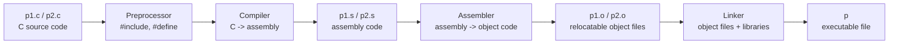
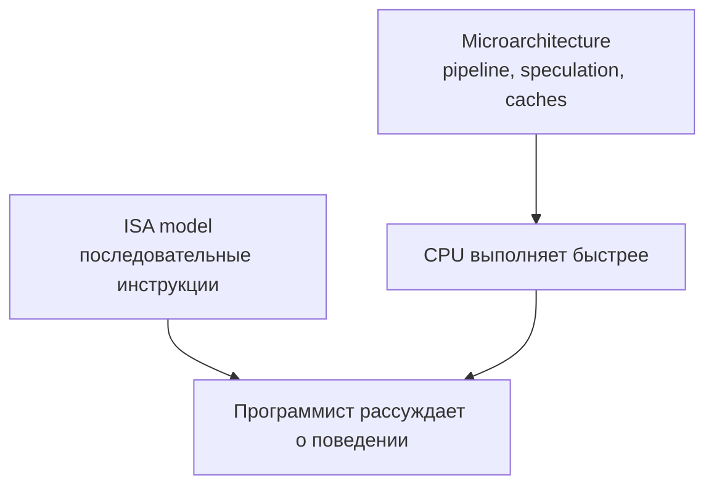

# Глава: CS:APP 3.2 --- Программный код

> [!info] Контекст
> Раздел 3.2 показывает, как C-программа превращается в код, который реально исполняет процессор: через preprocessing, compilation, assembly и linking. Это мост между историей `x86-64` из раздела 3.1 и практикой чтения compiler output.
>
> **Обязательные пререквизиты:** [[../../MOC|CS:APP MOC]], [[../../1.chapter/1.chapter|Глава 1 --- A Tour of Computer Systems]], [[../../2.chapter/2.1/2.1-overview|2.1 --- Хранение информации]], [[../3.1/3.1-overview|3.1 --- Историческая перспектива x86]].
>
> **Полезный optional-контекст:** [[../../2.chapter/2.3/2.3-overview|2.3 --- Integer Arithmetic]], [[../../../../08-internals/jit-compilation|JIT-компиляция в V8]].
>
> **Фокус:** GCC pipeline, `-Og`, assembly file, object file, executable file, машинное состояние `x86-64`, object bytes, `objdump`, `gdb x/...`, AT&T vs Intel syntax.

---

## Overview

В C-коде мы видим функции, переменные, типы, выражения и управляющие конструкции. На машинном уровне остаются байты, регистры, адреса, инструкции и соглашения. Раздел 3.2 учит смотреть на программу как на последовательность преобразований, которая заканчивается executable code.

Типичная команда из CS:APP:

```bash
gcc -Og -o p p1.c p2.c
```

Выглядит как один вызов `gcc`, но внутри запускается несколько стадий:



Команды для остановки на разных стадиях:

| Команда | Что получается | Зачем смотреть |
|---|---|---|
| `gcc -Og -S mstore.c` | `mstore.s` | Текстовый assembly output компилятора |
| `gcc -Og -c mstore.c` | `mstore.o` | Двоичный object code, еще не executable |
| `gcc -Og -o prog main.c mstore.c` | `prog` | Готовый executable file после linking |
| `objdump -d mstore.o` | disassembly | Assembly-представление байтов object file |
| `gdb` + `x/24xb multstore` | raw bytes в памяти | Непосредственно увидеть байты инструкций |

> [!important] Главная идея
> Assembly в этой главе не является исходным кодом низкого уровня, который CPU хранит и исполняет. Это удобочитаемое представление машинных байтов. Процессор исполняет байты, а не строки вроде `movq %rax, (%rbx)`.

### Before You Start

Перед чтением проверь обязательную базу:

1. Чем source code отличается от executable file?
2. Что делает compiler между `.c` файлом и executable?
3. Почему программа в памяти может быть просто набором байтов?

Если ответы расплывчатые, сначала вернись к [[../../1.chapter/1.chapter|главе 1]] и [[../../2.chapter/2.1/2.1-overview|2.1 --- Хранение информации]].

Вопросы про `virtual address`, исчезновение C-типов, `objdump` и оптимизации не обязаны быть ясны заранее. Они как раз станут рабочими понятиями этого раздела.

### Границы раздела 3.2

Core route этого раздела:

- pipeline `C source -> assembly -> object code -> executable`;
- `gcc -Og`, `-S`, `-c`, `-o`;
- пример `multstore`;
- различие `.s`, `.o`, executable;
- `objdump -d` и связь `bytes -> instructions`.

Optional lab, который полезен после core route:

- GDB memory inspection через `x/24xb`;
- сравнение object file и executable после linking;
- PIE, relocation и адреса;
- AT&T vs Intel syntax;
- краткое упоминание inline assembly.

В этом разделе мы не углубляемся в полный ABI, stack frames, ELF/linking internals, virtual memory implementation, форматы данных 3.3 и ручное assembly programming.

**Ключевой вывод:** раздел 3.2 задает рабочую модель: C-код проходит через toolchain, а результатом становятся байты инструкций, которые можно изучать через assembly и disassembly.

---

## Deep Dive

### Зачем смотреть на compiler output

Большую часть времени программист пишет не на assembly, а на C, TypeScript, Go, Rust или другом языке выше машинного уровня. Но compiler output полезен, когда нужно понять:

- почему код работает медленно;
- как функции получают аргументы и возвращают значения;
- как указатели превращаются в адреса;
- что происходит с локальными переменными;
- как `if`, `while`, массивы и структуры представлены на уровне инструкций;
- почему undefined behavior или ошибка с памятью проявляется странным образом;
- как high-level модель языка отличается от того, что реально видит процессор.

В CS:APP assembly изучается не ради ручного программирования на нем. Главная цель: научиться читать машинный код как диагностический слой между исходной программой и аппаратной ISA.

> [!tip] Рабочая привычка
> Сначала спрашивай не "какая строка C превратилась в эту строку assembly?", а "какое изменение состояния машины выполняет эта инструкция?". Связь с C-кодом часто не один-к-одному.

**Ключевой вывод:** чтение assembly помогает понять выполнение программы после работы компилятора, но не заменяет программирование на C.

### GCC как driver toolchain

Команда `gcc` обычно работает как driver: она не только компилирует C, но и вызывает другие инструменты. Для двух файлов:

```bash
gcc -Og -o p p1.c p2.c
```

происходит такая логика:

1. **Preprocessor** обрабатывает `#include`, `#define`, conditional compilation и создает расширенный C-текст.
2. **Compiler** преобразует C в assembly code, например `p1.s` и `p2.s`.
3. **Assembler** преобразует assembly в object code, например `p1.o` и `p2.o`.
4. **Linker** объединяет object files, startup code и library code в executable file `p`.

Расширения файлов важно не путать:

| Файл | Форма кода | Читается человеком? | Исполняется CPU напрямую? |
|---|---|---:|---:|
| `.c` | C source code | Да | Нет |
| `.s` | assembly code | Да, после тренировки | Нет, сначала нужен assembler |
| `.o` | relocatable object code | Нет, это binary format | Не как самостоятельная программа |
| executable | linked machine code + metadata | Нет, но можно disassemble | Да, через loader ОС |

Опция `-o p` задает имя выходного файла. Без нее GCC обычно создает `a.out`.

**Ключевой вывод:** `gcc` скрывает pipeline, но для изучения машинного уровня полезно уметь останавливать pipeline на `.s`, `.o` и executable.

### Почему используется `-Og`

Опция `-Og` включает оптимизации с учетом удобства debugging. Для CS:APP это полезный компромисс: код уже похож на реалистичный compiler output, но связь с исходным C еще не так сильно разрушена, как при `-O2` или `-O3`.

```bash
gcc -Og -S mstore.c
```

генерирует assembly file и останавливается до assembler.

```bash
gcc -Og -c mstore.c
```

генерирует object file и останавливается до linking.

На практике для production-сборок часто используют `-O2`, `-O3`, `-Os` или профильные настройки. Но для обучения `-Og` удобнее: меньше лишних трансформаций, проще сопоставлять C-конструкции с инструкциями.

> [!warning] Версии компилятора имеют значение
> Байты, assembly и даже выбор регистров могут отличаться на современной версии GCC, Clang или другой платформе. Примеры из книги фиксируют конкретный toolchain. Учись читать структуру сгенерированного кода, а не запоминать байты.

**Ключевой вывод:** `-Og` нужен не как самый быстрый режим, а как учебный режим, где compiler output еще достаточно близок к исходной программе.

### Machine Code Abstraction: ISA и последовательная модель

Машинный код определяется через ISA: `Instruction Set Architecture`. ISA описывает:

- какие инструкции существуют;
- какие регистры видит программа;
- как кодируются инструкции;
- как инструкции меняют состояние машины;
- как используются адреса памяти.

Для программиста ISA выглядит так, будто инструкции выполняются последовательно: одна завершилась, затем началась следующая. Реальный процессор устроен сложнее: pipeline, out-of-order execution, speculative execution, caches. Но CPU обязан сохранить наблюдаемое поведение, соответствующее ISA-модели, если программа не выходит за рамки правил архитектуры и языка.



ISA работает как контракт: программист и компилятор ориентируются на видимое поведение инструкций, а процессор внутри может использовать более сложную реализацию.

**Ключевой вывод:** ISA описывает не внутренности CPU, а абстрактный контракт машинного поведения.

### Virtual Address Space: память как массив байтов

Машинная программа обращается к памяти через virtual addresses. На уровне модели программы память выглядит как большой массив байтов. Операционная система и hardware затем отображают virtual addresses на physical memory, но это уже тема главы 9.

В C есть типы:

```c
long x;
int a[10];
struct Point { int x; int y; };
char *p;
```

В machine code типы почти исчезают. Остаются адреса, размеры операций и байты. Массив или структура становятся непрерывной областью памяти. Указатель становится числовым адресом. Различие между `signed` и `unsigned` часто проявляется не в самом хранении, а в выбранной инструкции: например, signed comparison и unsigned comparison используют разные интерпретации flags.

> [!important] Потеря C-типов
> Машинный код не хранит богатую C-модель типов. Он не знает, что "это указатель на `long`", "это поле структуры", "это signed integer". Эти смыслы задаются исходной программой, компилятором и соглашениями, а в байтах остаются операции над регистрами и памятью.

Память процесса обычно содержит несколько важных областей:

- машинный код программы;
- данные, нужные loader и runtime;
- stack для вызовов функций;
- heap для динамического выделения, например через `malloc`;
- memory-mapped области, библиотеки и служебные страницы ОС.

**Ключевой вывод:** на машинном уровне память состоит из адресуемых байтов; C-объекты и типы дают высокоуровневую интерпретацию этих байтов.

### Видимое состояние x86-64

Когда C-программа компилируется в `x86-64`, становятся видимыми элементы состояния, которые обычно скрыты в исходном коде.

| Состояние | Пример | Для чего нужно |
|---|---|---|
| Instruction pointer | `%rip` | Адрес следующей инструкции |
| General-purpose registers | `%rax`, `%rbx`, `%rcx`, `%rdx`, `%rsi`, `%rdi`, `%rsp`, `%rbp`, `%r8`-`%r15` | Целые числа, адреса, временные значения, аргументы, return value |
| Condition codes / flags | `ZF`, `SF`, `CF`, `OF` | Результаты сравнений и арифметики, условные переходы |
| Vector registers | `%xmm0`-..., `%ymm0`-..., `%zmm0`-... в зависимости от расширений | SIMD, floating-point, vector operations |
| Memory | virtual address space | Код, stack, heap, global data |

Особенно важен `%rip`: это instruction pointer. Он указывает, где находится следующая инструкция. Изменение `%rip` происходит обычным переходом к следующей инструкции, условным или безусловным jump, call или return.

Регистры общего назначения хранят 64-битные значения. Одни и те же биты могут быть адресом, `long`, временным результатом или частью реализации вызова функции. Смысл зависит от инструкции и контекста.

Condition codes обновляются многими арифметическими и логическими операциями. Потом conditional jumps и conditional moves используют эти flags для реализации `if`, `while`, сравнений и других control-flow конструкций.

**Ключевой вывод:** assembly делает явным то, что C скрывает: instruction pointer, регистры, flags и прямые обращения к памяти.

### Пример `multstore`

Возьмем короткий C-код:

```c
long mult2(long, long);

void multstore(long x, long y, long *dest) {
  long t = mult2(x, y);
  *dest = t;
}
```

Команда:

```bash
gcc -Og -S mstore.c
```

может сгенерировать assembly примерно такого вида в AT&T syntax:

```asm
multstore:
  pushq  %rbx
  movq   %rdx, %rbx
  call   mult2
  movq   %rax, (%rbx)
  popq   %rbx
  ret
```

В учебном чтении можно добавить контекст:

```asm
# void multstore(long x, long y, long *dest)
# x -> %rdi, y -> %rsi, dest -> %rdx

multstore:
  pushq  %rbx          # сохранить %rbx на stack
  movq   %rdx, %rbx    # сохранить адрес dest в %rbx
  call   mult2         # вызвать mult2(x, y)
  movq   %rax, (%rbx)  # записать return value по адресу dest
  popq   %rbx          # восстановить %rbx
  ret                  # вернуть управление caller
```

Здесь видно несколько идей сразу:

- `x`, `y`, `dest` не существуют как имена на машинном уровне;
- аргументы попадают в регистры согласно calling convention;
- результат функции возвращается через `%rax`;
- `(%rbx)` означает "память по адресу, который хранится в `%rbx`";
- `call` и `ret` меняют поток выполнения;
- stack используется для сохранения значения регистра.

> [!warning] Не учи пример как ABI целиком
> Здесь достаточно понять общий смысл регистров и вызова. Полная calling convention, stack frames, caller-saved/callee-saved registers и детали procedure discipline будут разбираться позже.

**Ключевой вывод:** `multstore` показывает, как маленькая C-функция превращается в операции над регистрами, stack, call и памятью.

### Object Code: программа как байты

Если выполнить:

```bash
gcc -Og -c mstore.c
```

получится `mstore.o`. Это binary object file. Его нельзя нормально читать как текст, но внутри есть байты машинных инструкций. В версии из CS:APP `multstore` занимает 14 байт:

```text
53 48 89 d3 e8 00 00 00 00 48 89 03 5b c3
```

Эти байты соответствуют инструкциям вроде `push`, `mov`, `call`, `mov`, `pop`, `ret`.

> [!tip] Почему у тебя может быть больше байтов
> На Ubuntu с GCC 13.3 перед функцией может появиться инструкция `endbr64` с байтами `f3 0f 1e fa`. Это связано с защитными механизмами платформы. Такой вывод не ломает идею раздела: меняется конкретная последовательность байтов, но связь `bytes -> instructions -> behavior` остается той же.

> [!important] Основной урок
> Исполняемая программа состоит из последовательности байтов, которые CPU декодирует как инструкции. Assembly listing дает удобный текстовый вид этих байтов, а не то, что процессор читает напрямую.

Инструкции `x86-64` имеют переменную длину: одна инструкция может занимать разное количество байтов. Частые и простые инструкции обычно кодируются короче, более сложные длиннее. Поэтому в disassembly слева часто видно группы байтов разной длины.

**Ключевой вывод:** object code не является сжатым C-кодом; это бинарное представление инструкций и связанных данных.

### `objdump`: disassembly object file

Чтобы посмотреть object code в читаемом виде, используют disassembler. В Linux для этого часто применяют `objdump`:

```bash
objdump -d mstore.o
```

Упрощенный вывод может выглядеть так:

```asm
0000000000000000 <multstore>:
   0: 53                    push   %rbx
   1: 48 89 d3              mov    %rdx,%rbx
   4: e8 00 00 00 00        call   9 <multstore+0x9>
   9: 48 89 03              mov    %rax,(%rbx)
   c: 5b                    pop    %rbx
   d: c3                    ret
```

Читать это нужно по колонкам:

| Колонка | Смысл |
|---|---|
| `0:`, `1:`, `4:` | смещение инструкции внутри секции кода |
| `53`, `48 89 d3` | байты инструкции |
| `push %rbx`, `mov %rdx,%rbx` | disassembled assembly |
| `<multstore>` | символическое имя функции, если оно доступно |

Disassembler не нуждается в C-source. Он берет байты из object file или executable file и декодирует их как инструкции. Если в binary есть symbol table, он может показать имена функций. Если символов нет, он все равно может показать инструкции, но человеку будет труднее понять смысл.

> [!tip] Как думать о disassembly
> `objdump` не восстанавливает исходник. Он делает более читаемое представление машинных байтов. Имена локальных переменных, C-типы и структура исходного кода в общем случае потеряны.

**Ключевой вывод:** `objdump -d` показывает, какие инструкции закодированы в binary, но не возвращает исходную C-программу.

### `gdb x/...`: просмотр байтов в памяти

GDB позволяет смотреть память программы напрямую. Команда `x` означает examine memory. Например:

```gdb
(gdb) x/24xb multstore
```

Разбор формы `x/24xb`:

| Часть | Значение |
|---|---|
| `x` | examine memory |
| `24` | показать 24 единицы, то есть взять байты с запасом |
| `x` | формат вывода: hexadecimal |
| `b` | размер единицы: byte |
| `multstore` | адрес, связанный с символом функции |

В книге для конкретной версии `multstore` достаточно `14` байт. На современных toolchains функция может быть длиннее, например из-за `endbr64`, поэтому в практической проверке удобнее взять больше байтов и сопоставить их с `objdump`.

Так можно увидеть не assembly, а сами байты, находящиеся по адресу функции. Это полезно, когда нужно связать три представления:

```text
C source -> assembly text -> machine bytes
```

**Ключевой вывод:** GDB помогает проверить, что машинный код действительно существует как байты в памяти процесса.

### Object File vs Executable File

Object file и executable file оба содержат машинный код, но находятся на разных стадиях.

`mstore.o` является relocatable object file. В нем есть код функции `multstore`, но некоторые адреса еще не финальные. Например, вызов `mult2` может быть представлен placeholder-байтами, потому что linker еще не решил, где будет находиться `mult2`.

Когда есть `main.c`:

```c
#include <stdio.h>

void multstore(long, long, long *);

int main(void) {
  long d;
  multstore(2, 3, &d);
  printf("2 * 3 --> %ld\n", d);
  return 0;
}

long mult2(long a, long b) {
  long s = a * b;
  return s;
}
```

можно собрать executable:

```bash
gcc -Og -o prog main.c mstore.c
```

Теперь linker объединяет код, библиотеки и служебную информацию. В executable у функции будут другие адреса, а вызов `mult2` получит конкретную цель:

```asm
0000000000400540 <multstore>:
  400540: 53                    push   %rbx
  400541: 48 89 d3              mov    %rdx,%rbx
  400544: e8 42 00 00 00        call   40058b <mult2>
  400549: 48 89 03              mov    %rax,(%rbx)
  40054c: 5b                    pop    %rbx
  40054d: c3                    ret
```

Отличия от object file:

- адреса стали похожи на реальные virtual addresses executable;
- linker подставил адрес или relocation для `mult2`;
- executable содержит не только код твоих функций, но и metadata, startup code, dynamic linking information и другую служебную информацию;
- могут появиться padding-инструкции вроде `nop` для выравнивания.

**Ключевой вывод:** object file является промежуточной формой для linker; executable является связанной программой, которую ОС может загрузить и запустить.

### Директивы в `.s` файле

Файл `.s`, созданный GCC, содержит не только инструкции:

```asm
.file   "mstore.c"
.text
.globl  multstore
.type   multstore, @function
multstore:
  pushq  %rbx
  movq   %rdx, %rbx
  call   mult2
  movq   %rax, (%rbx)
  popq   %rbx
  ret
.size   multstore, .-multstore
.section .note.GNU-stack,"",@progbits
```

Строки, начинающиеся с `.`, являются assembler directives. Они управляют assembler и linker: задают секции, символы, типы, размеры, metadata. Это не CPU-инструкции в прямом смысле.

В учебных фрагментах CS:APP часто убирает директивы и оставляет только инструкции, которые важны для обсуждения. Это нормально, потому что цель раздела: понять машинные операции, а не изучить весь формат assembler input.

> [!warning] Не удаляй директивы в реальном `.s` без понимания
> В учебном тексте их можно игнорировать. В настоящем assembly file директивы могут быть важны для symbol visibility, sections, debug info, stack notes и linking behavior.

**Ключевой вывод:** `.s` файл смешивает инструкции и assembler directives; для чтения поведения программы обычно начинают с инструкций.

### AT&T Syntax vs Intel Syntax

GCC и `objdump` в Unix/Linux-контексте часто используют AT&T syntax. Intel-документация и многие Windows-инструменты используют Intel syntax. Инструкции могут означать одно и то же, но выглядеть по-разному.

AT&T syntax:

```asm
movq %rax, (%rbx)
```

Intel syntax:

```asm
mov QWORD PTR [rbx], rax
```

Главные отличия:

| Отличие | AT&T | Intel |
|---|---|---|
| Регистры | `%rax` | `rax` |
| Размер операции | часто суффикс: `movq` | часто через operand: `QWORD PTR` |
| Memory operand | `(%rbx)` | `[rbx]` |
| Порядок операндов | source, destination | destination, source |
| Immediate values | `$5` | `5` |

Команда для Intel syntax через GCC:

```bash
gcc -Og -S -masm=intel mstore.c
```

> [!important] Самая частая ошибка
> При переключении между AT&T и Intel syntax легко перепутать направление `mov`. В AT&T `movq %rax, (%rbx)` означает "записать `%rax` в память по адресу `%rbx`". В Intel аналогичная инструкция записывается как `mov QWORD PTR [rbx], rax`.

**Ключевой вывод:** в этих заметках основной формат - AT&T, но Intel syntax нужно узнавать, потому что он часто встречается в документации и внешних материалах.

### Как читать assembly output прагматично

При чтении compiler output полезно идти в таком порядке:

1. Найти границы функции: label вроде `multstore:`.
2. Определить входные значения: какие аргументы в каких регистрах.
3. Отметить вызовы: `call`.
4. Найти writes в память: например `movq %rax, (%rbx)`.
5. Найти return value: часто `%rax` для integer/pointer result.
6. Отделить полезные инструкции от directives, alignment и служебных деталей.
7. Проверить, где compiler мог поменять структуру исходного C-кода.

Не нужно ожидать, что каждая строка C даст одну строку assembly. Компилятор может:

- удалить ненужные переменные;
- переиспользовать регистры;
- переставить вычисления;
- заменить умножение сдвигами или `lea`;
- inline-ить функцию;
- убрать ветку, если условие известно;
- изменить форму цикла.

С `-Og` таких трансформаций меньше, но они все равно возможны.

**Ключевой вывод:** assembly нужно читать как изменение машинного состояния, а не как построчный перевод C.

### Inline Assembly и отдельные `.s` файлы

C позволяет вставлять assembly прямо в исходный код через compiler-specific mechanism, например GCC inline assembly. Также можно писать отдельные `.s` файлы и связывать их с C-кодом через linker.

В этой главе это только граница темы. Нам не нужно глубоко писать assembly вручную. Важно понимать, что есть два разных режима работы:

| Режим | Что делает программист | Что изучаем сейчас |
|---|---|---|
| Читать compiler-generated assembly | C -> GCC -> assembly/object code | Да |
| Писать assembly вручную | Programmer -> `.s` или inline asm | Только упоминание |

Inline assembly требует понимания registers, constraints, clobbers, ABI и optimizer interaction. Это легко сделать неправильно. Поэтому для обучения CS:APP сначала важнее научиться читать сгенерированный код.

**Ключевой вывод:** ручной assembly существует, но раздел 3.2 готовит прежде всего к анализу output компилятора.

### Bridge to 3.3

Теперь у нас есть pipeline и базовая модель машинного кода. Следующий шаг: понять, какие размеры данных использует `x86-64`, как они отражаются в суффиксах инструкций и почему операции над `char`, `int`, `long`, pointer и floating-point values требуют разного машинного представления.

**Ключевой вывод:** 3.2 отвечает "как увидеть машинный код"; 3.3 начнет отвечать "какие данные этот код обрабатывает и какого они размера".

---

## Related Topics

- [[../../MOC|CS:APP --- Map of Content]]
- [[../../1.chapter/1.chapter|Глава 1 --- A Tour of Computer Systems]]
- [[../../2.chapter/2.1/2.1-overview|2.1 --- Хранение информации]]
- [[../../2.chapter/2.3/2.3-overview|2.3 --- Integer Arithmetic]]
- [[../3.1/3.1-overview|3.1 --- Историческая перспектива x86]]
- [[../../../../08-internals/jit-compilation|JIT-компиляция в V8]]

## Sources

- Bryant, R. E., O'Hallaron, D. R. *Computer Systems: A Programmer's Perspective*, 3rd Edition. Раздел 3.2, печатные стр. 190-197.
- Локальный извлеченный текст: `/tmp/csapp-3.2.txt`.
- [GCC Optimize Options](https://gcc.gnu.org/onlinedocs/gcc/Optimize-Options.html)
- [GCC Overall Options](https://gcc.gnu.org/onlinedocs/gcc/Overall-Options.html)
- [GNU Binutils: objdump](https://sourceware.org/binutils/docs/binutils/objdump.html)
- [GDB Manual: Examining Memory](https://sourceware.org/gdb/current/onlinedocs/gdb.html/Memory.html)
- [System V Application Binary Interface AMD64 Architecture Processor Supplement](https://refspecs.linuxbase.org/elf/x86_64-abi-0.99.pdf)
