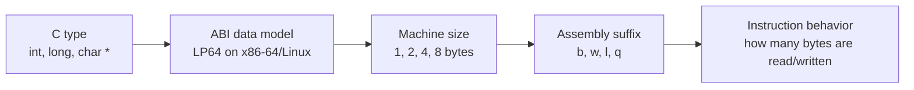

# Глава: CS:APP 3.3 --- Форматы данных

> [!info] Контекст
> Раздел 3.3 связывает C-типы с машинными размерами данных в `x86-64`: byte, word, double word, quad word. Это нужно, чтобы читать инструкции из [[../3.2/3.2-overview|3.2 --- Программный код]] и подготовиться к [[../3.4/3.4-overview|3.4 --- Доступ к информации]].
>
> **Нужно уверенно:** [[../../MOC|CS:APP MOC]], [[../../2.chapter/2.1/2.1-overview|2.1 --- Хранение информации]], [[../3.1/3.1-overview|3.1 --- Историческая перспектива x86]], [[../3.2/3.2-overview|3.2 --- Программный код]].
>
> **Полезно вспомнить:** [[../../2.chapter/2.2/2.2-overview|2.2 --- Целочисленные представления]] для signed/unsigned interpretation и [[../../2.chapter/2.4/2.4-overview|2.4 --- Числа с плавающей точкой]] для `float`/`double`.
>
> **Фокус:** C-типы, размеры данных, Intel terminology, суффиксы assembly-инструкций, `movb`/`movw`/`movl`/`movq`, указатели, `long`, floating-point caveats.

---

## Overview

В C мы пишем `char`, `short`, `int`, `long`, `float`, `double`, указатели и структуры. На машинном уровне процессор видит не C-типы, а байты, регистры, адреса и инструкции, которые явно или неявно задают размер операции.

Раздел 3.3 отвечает на простой, но важный вопрос: **сколько байтов берет конкретная инструкция и как это связано с типом в исходном C-коде?**

Например, имя инструкции часто уже содержит размер:

```asm
movb    (%rdi), %al     # move byte
movw    (%rdi), %ax     # move word, 2 bytes
movl    (%rdi), %eax    # move double word, 4 bytes
movq    (%rdi), %rax    # move quad word, 8 bytes
```



> [!important] Главная идея
> В assembly важен не только opcode вроде `mov`, но и размер операнда. Суффикс `b`, `w`, `l` или `q` помогает понять, работает инструкция с 1, 2, 4 или 8 байтами.

Core route раздела --- integer/pointer sizes. Floating-point здесь нужен как caveat: не перепутать значения суффиксов и не пытаться объяснять все инструкции через `movb`/`movw`/`movl`/`movq`.

### Before You Start

Перед чтением проверь себя:

1. Почему CPU может хранить и число, и указатель как просто набор байтов?
2. Чем C-тип отличается от размера машинной операции?
3. Что означает суффикс в инструкции `movq`?
4. Почему 64-битная архитектура не означает, что каждый C-тип занимает 64 бита?

Если ответы расплывчатые, сначала вернись к [[../../2.chapter/2.1/2.1-overview|2.1 --- Хранение информации]] и [[../3.2/3.2-overview|3.2 --- Программный код]].

**Ключевой вывод:** раздел 3.3 дает словарь размеров, без которого инструкции доступа к памяти в 3.4 будут выглядеть как набор похожих, но непонятно отличающихся команд.

---

## Deep Dive

### C-Type vs Machine-Level Size

C-тип задает намерение программиста: символ, целое число, указатель, число с плавающей точкой. Машинный код работает с размером: сколько байтов прочитать из памяти, сколько записать, какую часть регистра использовать.

На уровне `x86-64` данные можно грубо разделить так:

- integer-like данные: 1, 2, 4 или 8 байт;
- адреса и указатели: обычно 8 байт в 64-битной Linux-модели;
- floating-point данные: обычно 4 байта для `float` и 8 байт для `double`;
- aggregate-типы вроде arrays и structs: не отдельный машинный тип, а последовательность байтов с соглашением о layout.

> [!tip] Как читать assembly
> Когда видишь инструкцию, сначала спроси: "Какой размер операции?" Только потом связывай ее с C-типом.

**Ключевой вывод:** C-тип не переносится в машинный код буквально. В машинном коде остается размер операции и интерпретация байтов.

### Intel Names: Byte, Word, Double Word, Quad Word

В терминологии Intel слово `word` имеет исторический смысл. Оно не означает "естественное слово текущей 64-битной машины". В x86-семействе:

| Intel name | Bits | Bytes | Assembly suffix |
|---|---:|---:|---|
| byte | 8 | 1 | `b` |
| word | 16 | 2 | `w` |
| double word | 32 | 4 | `l` |
| quad word | 64 | 8 | `q` |

Название `word = 16 bits` осталось из ранней истории x86. Поэтому `double word` --- это 32 бита, а `quad word` --- 64 бита.

> [!warning] Не путай два "word"
> В архитектурной терминологии x86 `word` --- это 16 бит. В более общем разговоре о машинах "word size" может означать естественный размер адреса или регистра, например 64 бита на `x86-64`.

**Ключевой вывод:** для чтения `x86-64` assembly нужно принять исторические имена Intel: `word` здесь не равен 64-битному machine word.

### Таблица типов и суффиксов

Для модели, используемой в CS:APP на `x86-64`/Linux, соответствия такие:

| C type | Machine-level format | Suffix | Size |
|---|---|---:|---:|
| `char` | byte | `b` | 1 byte |
| `short` | word | `w` | 2 bytes |
| `int` | double word | `l` | 4 bytes |
| `long` | quad word | `q` | 8 bytes |
| `char *` / pointer | quad word | `q` | 8 bytes |
| `float` | single precision | `s` | 4 bytes |
| `double` | double precision | `l` | 8 bytes |

Эта таблица описывает учебную платформу CS:APP: `x86-64` с Linux-style data model. На других ABI размеры могут отличаться.

Для `float` и `double` строка `Suffix` относится к floating-point context. В современном GCC output ты часто увидишь SSE-инструкции вроде `movss`/`addss` для `float` и `movsd`/`addsd` для `double`, а не обычные integer `movl`/`movq`.

**Ключевой вывод:** таблица не является вечным законом C. Это конкретное соответствие для `x86-64`/Linux, на котором строится глава.

### Assembly Suffixes: `movb`, `movw`, `movl`, `movq`

Суффикс в integer-инструкциях показывает размер операнда:

```asm
movb    $0, (%rdi)      # записать 1 byte
movw    $0, (%rdi)      # записать 2 bytes
movl    $0, (%rdi)      # записать 4 bytes
movq    $0, (%rdi)      # записать 8 bytes
```

Одна и та же базовая операция `mov` может иметь разные формы. Разница не косметическая: она меняет, сколько байтов памяти будет затронуто.

Пример связи с C:

```c
void store_int(int *p, int x) {
  *p = x;
}

void store_long(long *p, long x) {
  *p = x;
}
```

Ожидаемая идея в assembly:

```asm
# store_int: записывает 4 bytes
movl    %esi, (%rdi)

# store_long: записывает 8 bytes
movq    %rsi, (%rdi)
```

Здесь `p` приходит как адрес в 64-битном регистре, но размер записи определяется типом объекта, на который указывает `p`.

> [!important] Размер указателя и размер объекта --- разные вещи
> `int *p` сам по себе занимает 8 байт как адрес. Но `*p` имеет тип `int`, поэтому запись `*p = x` затрагивает 4 байта.

**Ключевой вывод:** суффикс инструкции отвечает на вопрос "какой размер операции?", а не просто "какой C-тип был в исходнике?".

### Pointers and `long`: Why 8 Bytes Here

В CS:APP используется модель, где `long` и все указатели имеют размер 8 байт. Это соответствует распространенной Linux/Unix `LP64` model:

| Type family | Size in LP64 |
|---|---:|
| `int` | 4 bytes |
| `long` | 8 bytes |
| pointer | 8 bytes |

Поэтому в `x86-64` Linux assembly ты часто видишь `q`-суффикс для операций с адресами и `long`:

```asm
movq    %rax, (%rdi)    # 8-byte store
addq    $8, %rdi        # изменить 64-bit pointer/address
```

Но это не означает, что C всегда делает `long` 8-байтным. Например, в Windows x64 часто используется `LLP64` model: указатели 8 байт, но `long` остается 4 байта.

> [!warning] ABI caveat
> Размеры фундаментальных C-типов зависят от platform ABI. В этой главе держим в голове конкретную рамку: `x86-64`, Linux-style `LP64`, GCC-like output.

**Ключевой вывод:** в CS:APP `long` и pointer --- 8 байт, но это свойство выбранной платформенной модели, а не универсальное правило языка C.

### Floating Point: `float`, `double`, `long double`

Для floating-point данных таблица другая:

| C type | Format | Typical size |
|---|---|---:|
| `float` | single precision | 4 bytes |
| `double` | double precision | 8 bytes |
| `long double` | platform-specific extended precision | often 16 bytes of storage for 80-bit value + padding on x86-64 System V |

`float` и `double` связаны с [[../../2.chapter/2.4/2.4-overview|2.4 --- Числа с плавающей точкой]]. В современной `x86-64` практике обычные floating-point операции часто используют отдельные регистры и инструкции SSE/AVX, а не те же integer-инструкции `movl`/`movq`.

В таблицах CS:APP можно увидеть floating-point suffix `s` для single precision и `l` для double precision. Это важно читать в контексте: `l` в integer-инструкции вроде `movl` означает 32-bit double word, а `l` в floating-point контексте может относиться к double precision.

`long double` стоит держать как caveat. Исторически он связан с `x87` extended precision. На `x86-64 System V` значение часто использует 80-bit extended precision, но `sizeof(long double)` обычно равен 16 из-за storage/padding rules. На других ABI возможно другое поведение, включая 8-byte `long double`. Для раздела 3.3 это не центральная тема.

**Ключевой вывод:** `float` и `double` имеют свои форматы и часто свой набор инструкций. Не смешивай integer suffix `l` и floating-point usage of `l`.

### Common Pitfalls

| Ловушка | Почему это ошибка | Как думать правильно |
|---|---|---|
| `movl` значит C `long` | В integer-инструкциях `l` означает 32-bit double word | C `long` на CS:APP `x86-64` обычно идет через `q` |
| `word` значит 64 бита | В x86 terminology `word` = 16 bits | 64 bits = `quad word` |
| Указатель на `int` записывает 8 байт | Сам указатель 8 байт, но `*p` имеет размер `int` | Смотри на тип объекта, не только на тип адреса |
| Все 64-битные системы имеют одинаковые C-размеры | ABI может отличаться | Проверяй data model: `LP64`, `LLP64` |
| C-типы видны в машинном коде | Машинный код хранит операции над байтами, регистрами и адресами | Типы восстанавливаются из контекста |
| `l` всегда означает одно и то же | Значение зависит от instruction family | Разделяй integer и floating-point инструкции |

> [!tip] Мини-чек чтения инструкции
> 1. Найди базовую операцию: `mov`, `add`, `cmp`.
> 2. Найди суффикс: `b`, `w`, `l`, `q`.
> 3. Определи размер: 1, 2, 4 или 8 байт.
> 4. Только потом связывай это с C-типом и адресом.

Перед переходом к 3.4 объясни своими словами: почему для `movl (%rdi), %eax` нужно отдельно понимать адрес в `%rdi`, размер чтения `l` и тип исходного C-выражения?

**Ключевой вывод:** большинство ошибок в 3.3 возникают из-за смешения трех уровней: C type, ABI data model и assembly instruction suffix.

---

## Related Topics

- [[../../MOC|CS:APP MOC]]
- [[../../2.chapter/2.1/2.1-overview|2.1 --- Хранение информации]]
- [[../../2.chapter/2.2/2.2-overview|2.2 --- Целочисленные представления]]
- [[../../2.chapter/2.4/2.4-overview|2.4 --- Числа с плавающей точкой]]
- [[../3.1/3.1-overview|3.1 --- Историческая перспектива x86]]
- [[../3.2/3.2-overview|3.2 --- Программный код]]
- [[../3.4/3.4-overview|3.4 --- Доступ к информации]]

## Sources

- Bryant, R. E., O'Hallaron, D. R. *Computer Systems: A Programmer's Perspective*, 3rd Edition, Section 3.3.
- [CS:APP official site](https://csapp.cs.cmu.edu/)
- [Intel 64 and IA-32 Architectures Software Developer's Manual](https://www.intel.com/content/www/us/en/developer/articles/technical/intel-sdm.html)
- [System V Application Binary Interface: AMD64 Architecture Processor Supplement](https://gitlab.com/x86-psABIs/x86-64-ABI)
- [Microsoft Learn: x64 ABI conventions](https://learn.microsoft.com/en-us/cpp/build/x64-software-conventions)
