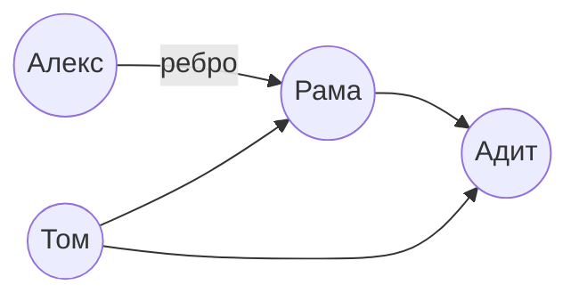
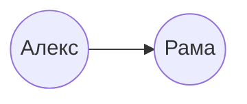
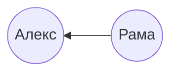
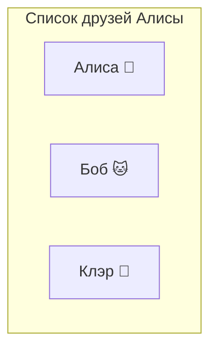
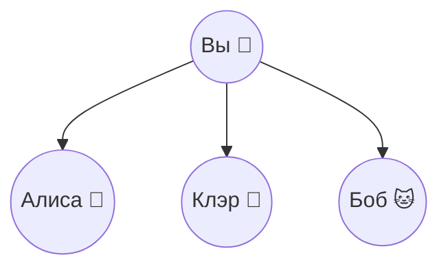
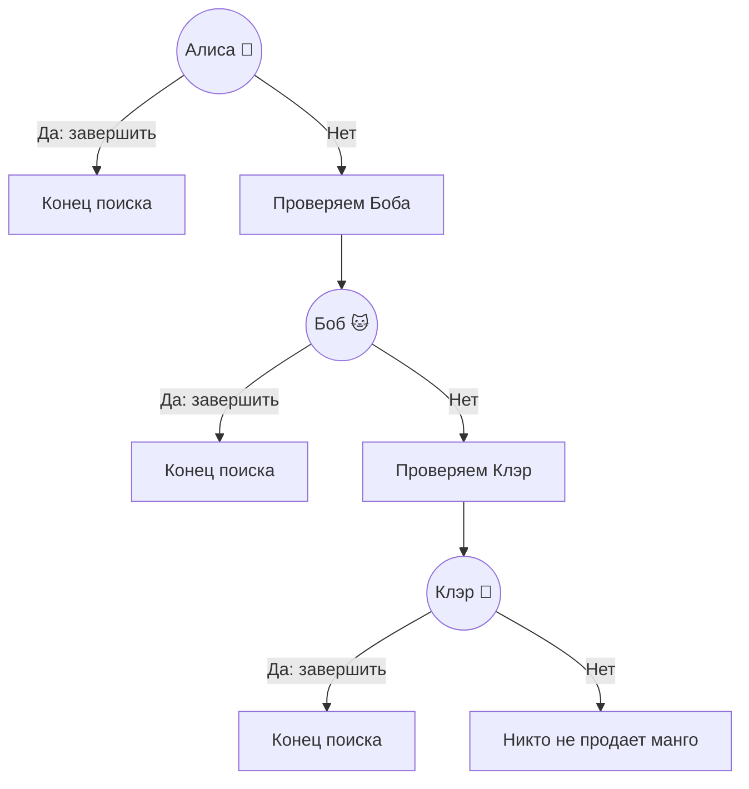

# Поиск в ширину

Алгоритм для решения задачи поиска кратчайшего пути называется **поиском в ширину**.

## Граф

Граф моделирует набор связей.
Граф состоит из узлов и ребер.

Узел может быть соединен напрямую с несколькими другими узлами. Эти узлы называются внутренними или внешними соседями.

Алекс - **внутренний сосед** Рамы

Алекс - **внутренний сосед** Рамы

Адит не является внешним или внутренним соседом Алекса, потому что не связаны напрямую.
Но он является внешним соседом Рамы и Тома.

Графы используются для моделирования связи между объектами.

## Поиск в ширину

Поиск в ширину - алгоритм обхода или поиска в графе, в котором исследуются все вершины на текущем уровне перед переходом к вершинам следующего уровня.
Поиск в ширину помогает ответить на вопросы двух типов:

- тип 1: существует ли путь от узла A до узла B?
- тип 2: существует ли путь от узла A до узла B, и если да, то какой путь кратчайший?

Представим что мы ищем продавца манго в соц.сети.
Сначала нужно построить список друзей для поиска:

