# Поиск в ширину

Алгоритм для решения задачи поиска кратчайшего пути называется **поиском в ширину**.

## Граф

Граф моделирует набор связей.
Граф состоит из узлов и ребер.

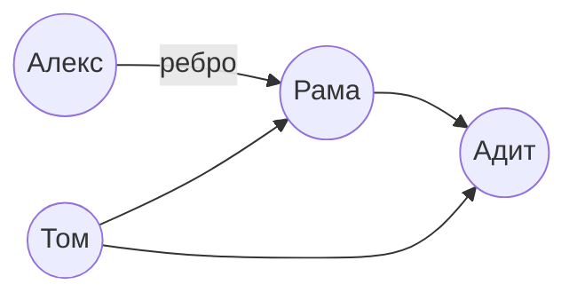

Узел может быть соединен напрямую с несколькими другими узлами. Эти узлы называются внутренними или внешними соседями.

Алекс - **внутренний сосед** Рамы

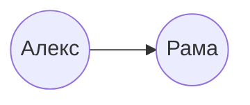

Алекс - **внутренний сосед** Рамы

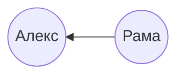

Адит не является внешним или внутренним соседом Алекса, потому что не связаны напрямую.
Но он является внешним соседом Рамы и Тома.

Графы используются для моделирования связи между объектами.

## Поиск в ширину

Поиск в ширину - алгоритм обхода или поиска в графе, в котором исследуются все вершины на текущем уровне перед переходом к вершинам следующего уровня.
Поиск в ширину помогает ответить на вопросы двух типов:

- тип 1: существует ли путь от узла A до узла B?
- тип 2: существует ли путь от узла A до узла B, и если да, то какой путь кратчайший?

Представим что мы ищем продавца манго в соц.сети.

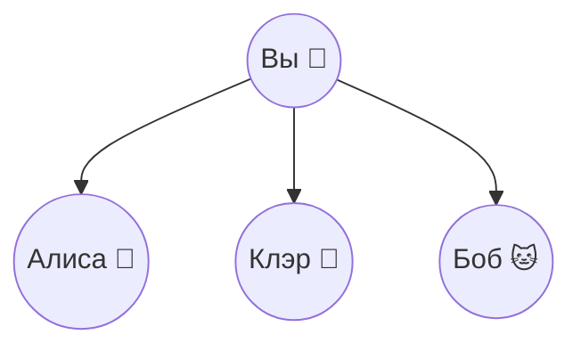

Сначала нужно построить список друзей для поиска:

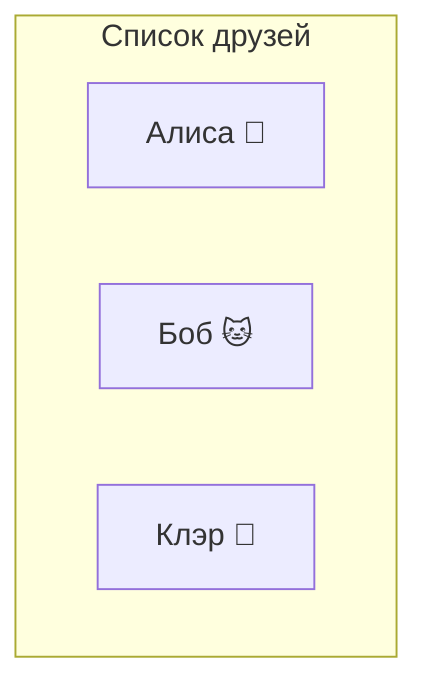

Теперь нужно обратиться к каждому человеку в списке и проверить продаёт ли этот человек манго

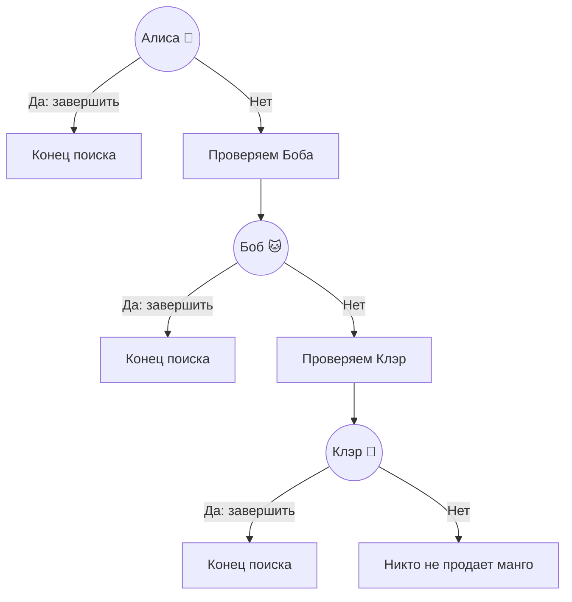

Предположим, ни один из друзей не продаёт манго, теперь поиск продолжается среди друзей ваших друзей.

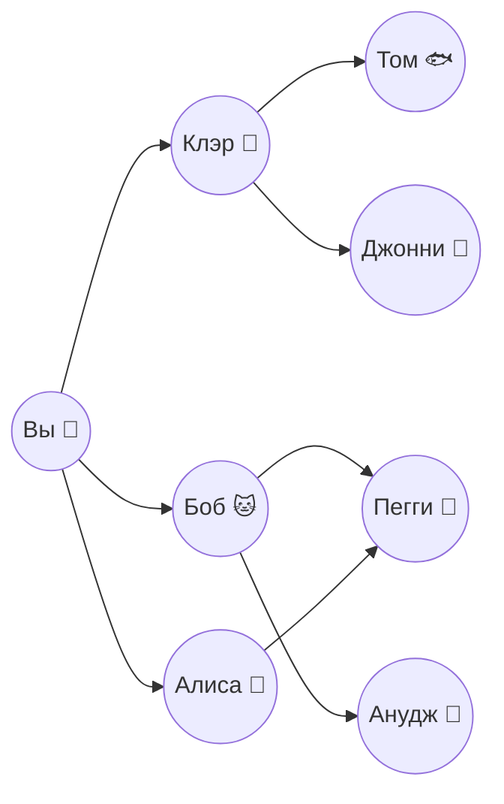

Каждый раз, когда вы проверяете кого-то из списка, вы добавляете список всех его друзей.

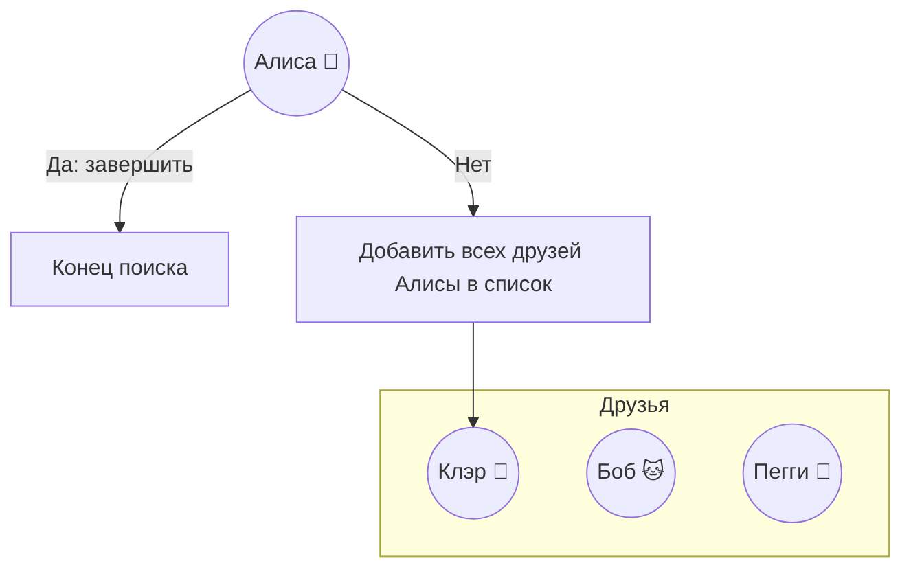

Поиск ведется среди друзей и среди друзей друзей, если Алиса не продает манго, то в список добавляются все её друзья и со временем все ее друзья будут проверены.
С этим алгоритмом поиск рано или поздно пройдет по всей сети, пока не наткнемся на продавца манго.

Ответим на 2 вопрос: как выглядит кратчайший путь от узла А к узлу В?
Будем считать что ваши друзья - связи первого уровня, друзья друзей - второго

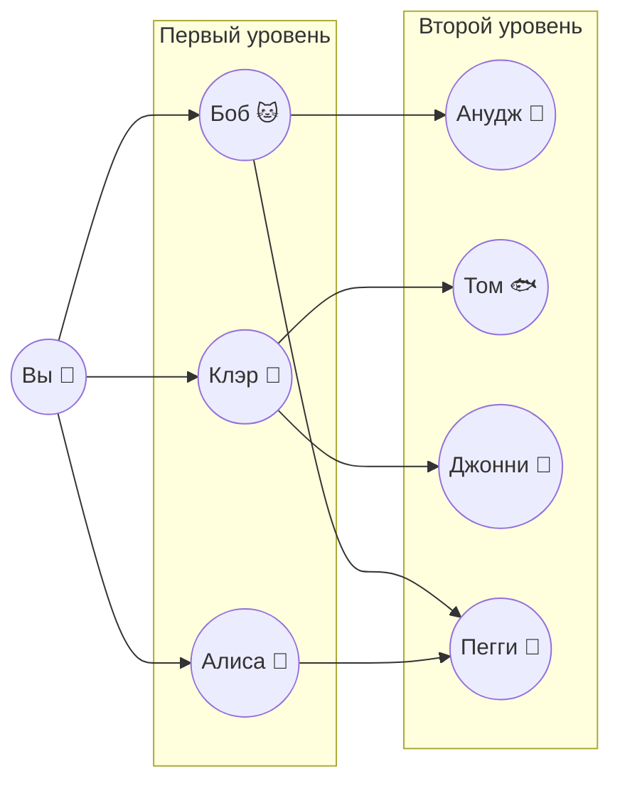

Связи первого уровня предпочтительнее связей второго уровня, связи второго уровня предпочтительнее связи третьего уровня и т.д.
Из этого следует, что поиск по контактам второго уровня, должен производиться только после полного поиска по контактам первого уровня.

Алгоритм поиска в ширину выполняется от начальной точки, это обеспечивает проверку связей второго уровня только после проверки связей первого уровня.
Поиск в ширину найдет не только путь из А в В, но и кратчайший, если поиск осуществляется в порядке добавления людей.
Иначе будет найден продавец манго не ближайший к вам сети.
Связи нужно проверять в порядке их добавления, для этого используется структура данных - **очередь**

## Реализация графа

```js
const graph = {
  you: ["alice", "bob", "claire"],
  bob: ["anuj", "peggy"],
  alice: ["peggy"],
  claire: ["thom", "jonny"],
  anuj: [],
  peggy: [],
  thom: [],
  jonny: [],
};
```

У Ануджа, Пегги, Тома, Джонни нет внешних соседей. У них есть внутренние соседи, по сколько линии со стрелками указывают на них, но не существует стрелок от них к другим узлам.
Такой граф называется **направленным** - отношения действуют в одну сторону. В ненаправленных графах стрелок нет, в них нет деления на соседей внешних и внутренних - это просто соседи.

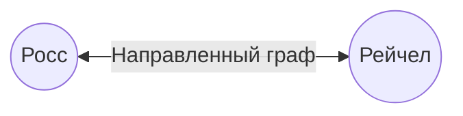

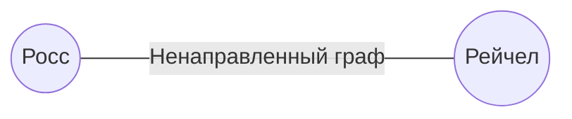

```js
const breadthFirst = (graph, source) => {
  const queue = [source];

  while (queue.length) {
    const current = queue.shift();

    console.log(current);

    for (let neighbour of graph[current]) {
      queue.push(neighbour);
    }
  }
};
```

Будем считать что продавец манго тот человек, у которого в имени есть буква "m".

```js
const findMangoSeller = (graph, source) => {
  const queue = [source];

  while (queue.length) {
    const current = queue.shift();

    if (current.includes("m")) {
      console.log(current + " is mango seller");
      break;
    }

    for (let neighbour of graph[current]) {
      queue.push(neighbour);
    }
  }
};
findMangoSeller(graph, "you");
```

**Но есть проблема**
Пегги будет добавлена в очередь дважды т.к. она друг Алисы и Боба. Алгоритм будет проверять ее дважды, что может повлечь за собой бесконечный цикл.
Для этого нужно добавить проверку на то, что человек уже был добавлен в очередь.

```js
const findMangoSeller = (graph, source) => {
  const queue = [source];
  const checked = new Set();

  while (queue.length) {
    const current = queue.shift();
    checked.add(current);

    if (current.includes("m")) {
      console.log(current + " is mango seller");
      break;
    }

    for (let neigbour of graph[current]) {
      if (!checked.has(neigbour)) {
        queue.push(neigbour);
      }
    }
  }
};
```

## Время выполнения
