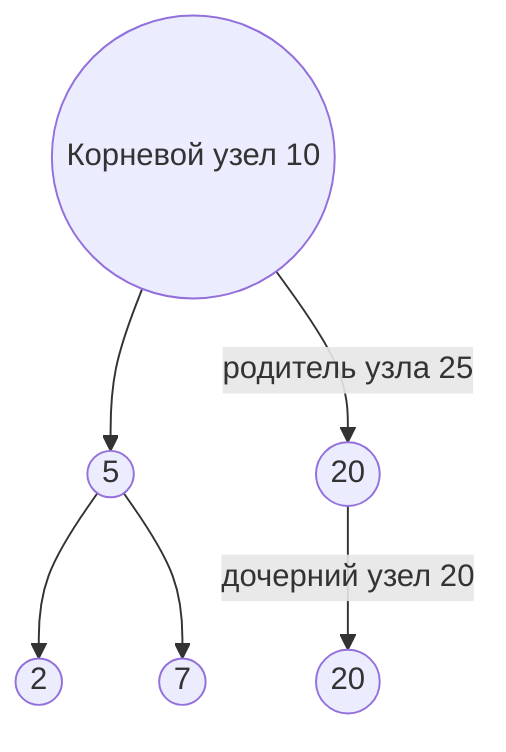
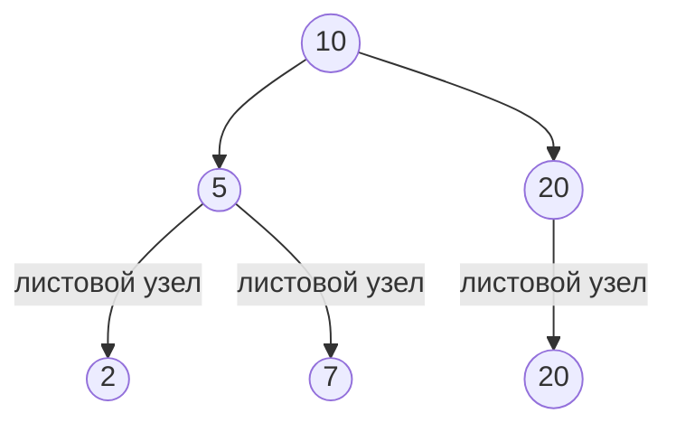
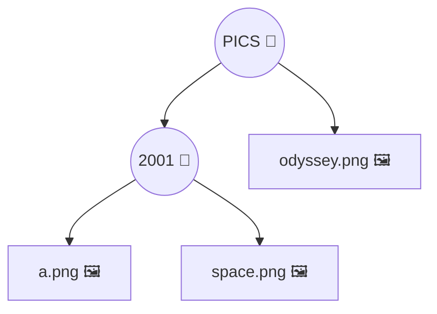
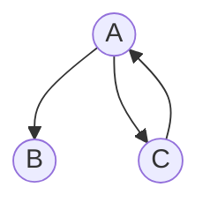
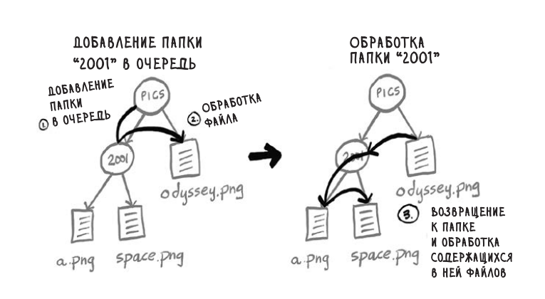
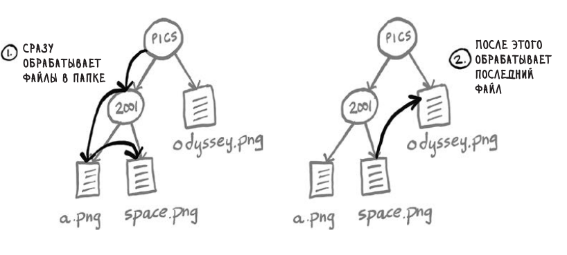
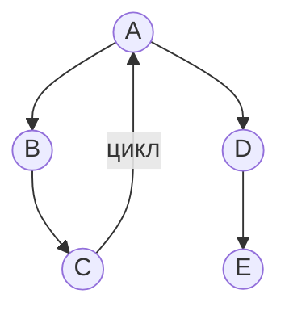
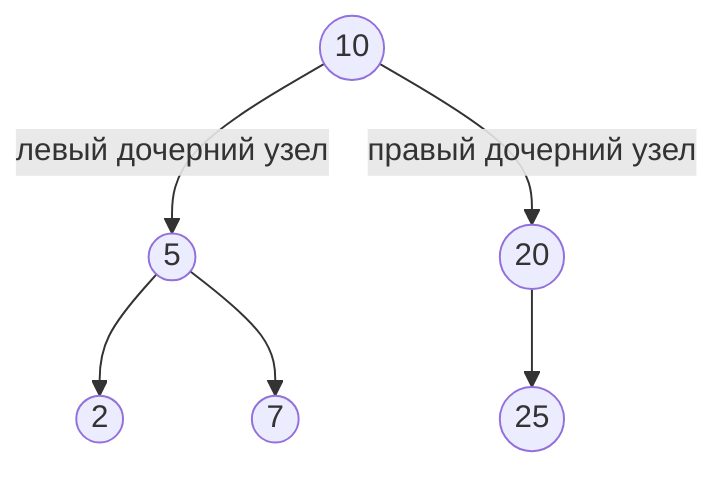
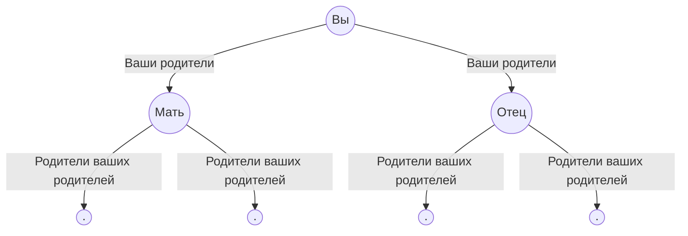

# Деревья

(В этой главе речь идёт **исключительно** о корневых деревьях)

Дерево это разновидность графа, они так же состоят из узлов и рёбер.
У корневого дерева имеется один узел, от которого можно перейти к любому другому узлу.
У узлов могут быть дочерние узлы, а у дочерних узлов может быть родительский узел.



Все узлы имеют минимум одного родителя, **кроме корневого** узла.

Узлы, не имеющие дочерних узлов, называются **листовыми узлами**.



## Каталоги файлов

Т.к.дерево является разновидностью графа и поиск в ширину является алгоритмом обхода, к нему можно применить поиск в ширину.

Представим что у нас есть каталог файлов, и нам нужно вывести имена всех файлов в каталоге pics и во всех его подкаталогах.



Логика обхода выглядит так:

1. Посетить каждый узел в дереве
2. Если узел является файлом, вывести его имя
3. Если узел является папкой, добавить его в очередь папок, чтобы найти находящиеся в нем файлы.

```js
function printNames(startDir) {
  const queue = [startDir];

  while (queue.length) {
    const dir = queue.shift(); // достаем первую папку
    const files = fs.readdirSync(dir).sort(); // читаем содержимое (отсортировано)

    for (const file of dir) {
      const fullPath = path.join(dir, file);
      if (fs.statSync(fullPath).isFile) {
        console.log(file);
      } else {
        queue.push(fullPath);
      }
    }
  }
}
```

#### Важно

В главе 6, в примере с продавцом манго, мы останавливались как только нашли продавца и нам нужно было следить проводился ли уже поиск этого человека.

В данном случае делать этого не нужно. В деревьях нет цикла, и у каждого узла только один родитель.
Мы никогда не сможем произвести поиск в одной папке несколько раз или ввести программу в бесконечный цикл.

**X Нет циклов**



**X Нет множественных родителей**

**В деревьях не бывает циклов**

## Космическая одиссея: поиск в глубину

Ещё раз обойдем каталог файлов рекурсивно.

```js
function printNames(dir) {
  const files = fs.readdirSync(dir).sort();

  for (const file of dir) {
    const fullPath = path.join(dir, file);

    if (fs.statSync(fullPath).isFile()) {
      console.log(fullPath);
    } else {
      printNames(fullPath);
    }
  }
}
```

В этот раз очередь не используется, вместо этого при обнаружении папки мы сразу заходим в неё, чтобы найти файлы и папки.

Первое решение - поиск в ширину. Результат вызова функции

```
odyssey.png
a.png
space.png
```

Алгоритм идёт находит папку `2001` и добавляет её в очередь, дальше в папке `pics` он находит файл `odyssey.png` и обрабатывает его.
Дальше он достаёт папку `2001` из очереди, проходит по ней и находит файлы `a.png` и `space.png`

Второе решение - поиск в глубину. Результат вызова функции

```
a.png
space.png
odyssey.png
```

Алгоритм при обнаружении папки переходит сразу в нее и обрабатывает файлы.


**НО** поиск в глубину не может использоваться для нахождения кратчайшего пути.
Поиск в глубину сразу заходит на максимально возможную глубину.
У поиска в глубину есть другие применения, например, топологическая сортировка.

Дерево представляем собой **связный ациклический граф** Т.е. в нём нет циклов.



**Х НЕ ДЕРЕВО**

## Бинарные деревья

Бинарное дерево - дерево, узлы которого могут иметь не более двух дочерних узлов.
Дочерние узлы называются _левыми_ и _правыми_.



Пример бинарного дерева - генеалогическое древо, так как у каждого узла имеются два биологических родителя


