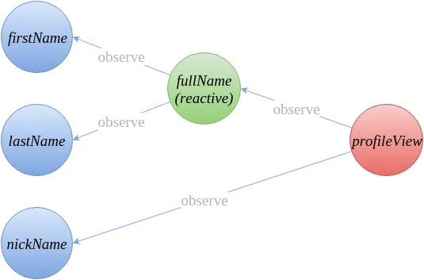
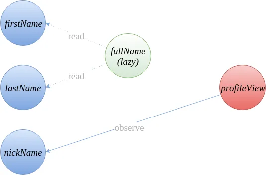
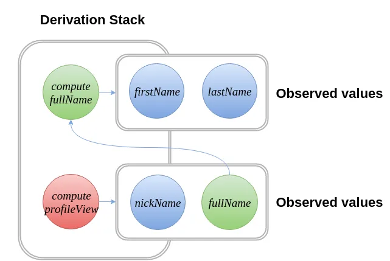

# Becoming fully reactive: an in-depth explanation of MobX

[original](https://medium.com/hackernoon/becoming-fully-reactive-an-in-depth-explanation-of-mobservable-55995262a254)

## Core concepts of mobx

1) _Observable state_ - all values that can be mutated and might be served as source for computed values.
2) _Computed values_ - any value than can be computed by using a function that purely operates on other observable
   values.
   They are like *formulas* - they don't hold their own state, they just return a value based on other data.
    - They are derived from observables
      For example, a full name derived from `firstname` and `lastname`
    - They are reactive
      If observables change, the computed value updates *automatically*
    - They are observable too
    - They are cached and lazy
      Mobx only recalculates them if needed - when their dependencies change. Otherwise, it reuses the last result.
      Mobx *does not recalculate* computed values unless you use them, and *some observable they depend on has changed*.

3) _Reactions_ - a bit similar to computed value, but instead of producing a new value it produces a side effect. Common
   type `reaction`, `when`, `autorun`.
    - Reactions track *observable values*
    - Automatically run again when observables they depend on change.
      Side effect means:
    - Logging something to the console
    - Fetching data from API
    - Showing an alert etc
4) _Actions_ - actions are the primary means to modify the state. Actions are not reactions to state changes, but take
   source of change, like user events or incoming web-socket connections, to modify observable state.

_Computed values and reactions are both referred to as *derivations*._

*Tip*
To understand we can say about derivations such explanation:
In spreadsheet all data cells that have values would form the `observable` state.
Formulas and charts are computed `values` that can be derived from the data cells and other formulas.
Drawing the output of a data call or a formula on the screen is a `reaction`.
Changing a data cell or formula is an `action`.

```typescript
import {makeObservable} from "mobx";

class Person {
   firstName = "Michel"; //observable
   lastName = "Weststrate"; // observable
   nickName; // observable

   constructor() {
      makeAutoObservable(this)
   }

    get fullName() { // computed
      return this.firstName + " " + this.lastName;
   }
}

const michel = new Person();

// Reaction: log the profile info whenever it changes
autorun(() => console.log(person.nickName ? person.nickName : person.fullName));

// Example React component that observes state
const profileView = observer(props => {
   if (props.person.nickName)
      return <div>{props.person.nickName} < /div>
   else
      return <div>{props.person.fullName} < /div>
});

// Action:
setTimeout(() => michel.nickName = "mweststrate", 5000)

```



Figure 1: Dependency tree of profileView component. FullName is in reactive mode, actively observing firstName and lastName.

The `state` of this app is in the `observable` properties(blue).
The green `computed value` `fullName` can be derived from the state automatically by observing the firstName and the lastName.
Similarly the rendering of the `profileView` can be derived from the nickName and the `fullName`.
The `profileView` will react to state changes by producing a side effect: it updates the React component tree.

_When using MobX the dependency tree is minimally defined._
*Mobx tracks what your code actually uses - nothing more*
For example, as soon as rendered person has a nickname, the rendering will no longer be affected by output of the fullName value.
All observer relations between those values can be cleaned up.

Let’s say you’re rendering a person:

```typescript
const PersonView = observer(() => {
  return <div>{person.fullName}</div>;
});
```

So far:

- MobX sees that PersonView uses person.fullName

- fullName uses firstName and lastName

- So MobX tracks:
```
PersonView → fullName → firstName, lastName
```

Now imagine you change your UI:
```typescript
const PersonView = observer(() => {
  return <div>{person.nickname}</div>;
});

```

Now:
- Mobx noticed that `fullName`, `firstName`, and `lastName` are no longer used.
- It automatically removes them from the dependency tree.
- The reaction (UI) is now only watching `person.nickname`


_Figure 2: Dependency tree of the profileView component if the user has a nickname (see listing 1). In contrast to figure 1, fullName is now in lazy mode and does not observe firstName and lastName_

## Principle behind MobX

### Reacting to state changes is always better than acting on state changes.

Meaning
- Instead of manually checking or responding to changes, let the system automatically react to them.
- Reacting means "This value changed? Then I run this function now - no setup required".
- Acting means: "I'll write logic to watch for changes and run this function if needed - manually"

Problems with traditional state management (like Redux, Flux, etc.):
1) Manual subscriptions
   - You must manually subscribe to state changes (useEffect, selectors, connectors, etc.)
   - Easy to make mistakes:
   - Oversubscribe: watching values you no longer need 
   - Undersubscribe: forgetting to watch values → leads to stale data and UI bugs
2) Local caches everywhere
   - UI, derived values, API triggers — all act like local caches
   - You have to keep them in sync with state manually
3) Normalized trees
   - State is stored in flat structures (usersById, postsById)
   - This leads to data duplication and inconsistency (e.g., same user has different data in different places)

_So an important principle behind the design MobX is:_

*A minimal, consistent set of subscriptions can only be achieved if subscriptions are determined at run-time.*


## How MobX keeps all derivations(вычисления) efficiently in a consistent state

The solution: don't cache, derive instead.
Mobx doesn't run all derivations, but ensures that only `computed values` that are involved in some reactions are kept in sync with the observable state.
Those derivations are called to be `reactive`.
Parallel with spreadsheet:
only those formulas that are currently visible or that are used undirectly by a visible formula, need to re-compute when on of the observed data cells change.

### Lazy versus reactive evaluation

What about computations that aren't used directly or indirectly by a reaction?
The solution is simple: if a computed value is not reactive, it will be evaluated on demand(lazily), just like a normal getter function.
Lazy derivations (which never observe anything) can simply be garbage collected if they run out of scope.
Remember that computed values should always be _pure functions_ of the observable app state?
This is reason why: for pure functions it doesn't matter whether they are evaluated lazily or eagerly; 
the evaluation of the function always yields the same result given the same observable state.

### Running computations
Reactions and computed values are both run by mobx in same manner.
1) Mobx starts running a computed value or reaction function
   → It pushes function onto derivation stack
2) While that function is running
   → Every observable that gets accessed (like `this.firstName`)
   → Registers itself as a dependency of the function on top of the stack

If a `computed` value is accessed: 
- If it's already in reactive mode (being tracked), mobx just returns the _last known(cached) value_.
- If not, it pushes that computed value onto the derivation stack, enable reactive mode and starts tracking it too.

  Figure 4: During the execution of the profileView reaction some observable state and some computed values are being observed. Computed values might recompute, this results in the the dependency tree as shown in figure 1.

*When a computation or reaction finishes running, mobx:* 
1) Collects a list of all observables it accessed during that run
Example: `provileView` might use:
   - only `nickName` or
   - both `nickName` and `fullName`
2) It then compares that list to previous one. This is called "diffing" the dependencies.

*What happened after comparison?*
 - Any observables that were removed from list - mobx stops watching them
 - Any new observables that were added - mobx starts watching them

*Chain reactions*
If firstName changes in the future:
→ MobX knows it affects fullName
→ And fullName affects profileView
→ So MobX will re-run that whole chain, automatically

### How MobX propagates state changes

1) *"Stale" notification is sent*
   - The observable sends a `stale notification` all its observers (`computed` values and `reactions`) that it stale
   - If those observers are also computed values, they forward the `stale notification` signal to their own observers.
   - This way, a whole part of dependency tree is marked as stale - but not recomputed yet.
2) After sending the `stale notification` and storing the new value, a `ready notification` will be sent.
This message also indicates whether the value did actually change.
3) As soon as derivation has received a `ready notification` for every stale notification received in step 1, it knows that all the observed values are
stable, and it will start to recompute
4) If none of the ready messages indicate that a value was changed, the derivation will simply tell its own observers that it is ready again, but without changing its value.
Otherwise, the computation will recompute and send ready messages to its own observers.

Conclusions
1) At this point you might also realize that a reaction is basically a computed value that is always in reactive mode.
   - Reactions (like autorun, observer, etc.) are similar to computed values
   - But unlike computed, which can be lazy, a reaction is always active
   - MobX always watches its dependencies and reruns it when they change
2) It is important to realize that this algorithm can be implemented very efficiently without closures and just with a bunch of pointer arrays.”
   - MobX's reactivity system is very lightweight and fast
   - It doesn’t use expensive constructs like closures or deep trees
   - Instead, it uses simple, efficient data structures (e.g., arrays of pointers)
   - That’s part of why MobX is so fast — even with thousands of observables

### Synchronous execution
Mobx runs everything synchronously.
This has two big advantages:
1) It becomes simply impossible to evert observe stale derivations. So a derived value can be used immediately after changing value that influences it.
2) It makes stack-traces and debugging easier.

*BUT*
If you make several changes in a row, this can lead to unnecessary recomputations after each one.
f several mutations are applied in immediate succession, it is preferable to re-evaluate all derivations after all changes have been applied

Example
```typescript
person.firstName = "John";
person.lastName = "Smith";
```
Without a transaction:
MobX might recompute fullName twice — once after each update

With a transaction:
MobX waits until both changes are done, then recomputes once

Wrapping an action in a transaction block achieves this

```typescript
runInAction(() => {
  person.firstName = "John";
  person.lastName = "Smith";
});
```
- runInAction acts like a transaction
- It delays updates (notifications) until the block is finished
- This avoids unnecessary recomputation or re-renders
- MobX still tracks all changes immediately
- But it waits to trigger reactions/computed updates until the end

Note that transactions still run and update everything synchronously.
- MobX does not batch updates asynchronously
- Everything still happens in the same tick (no setTimeout, no delays)
- Just delayed within the synchronous block