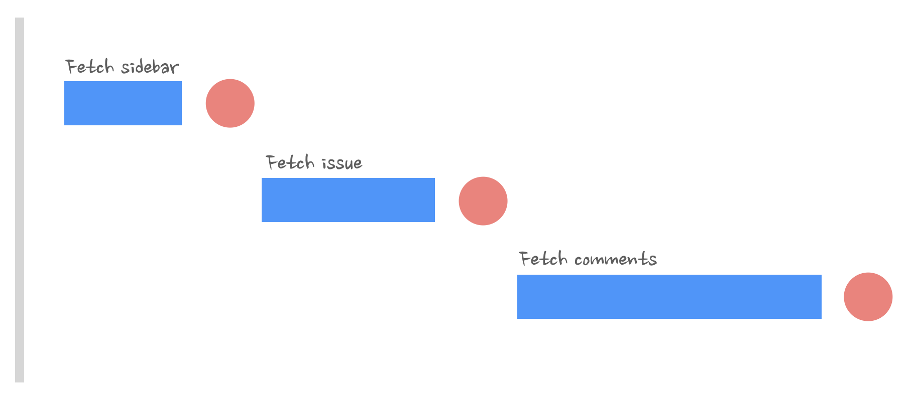
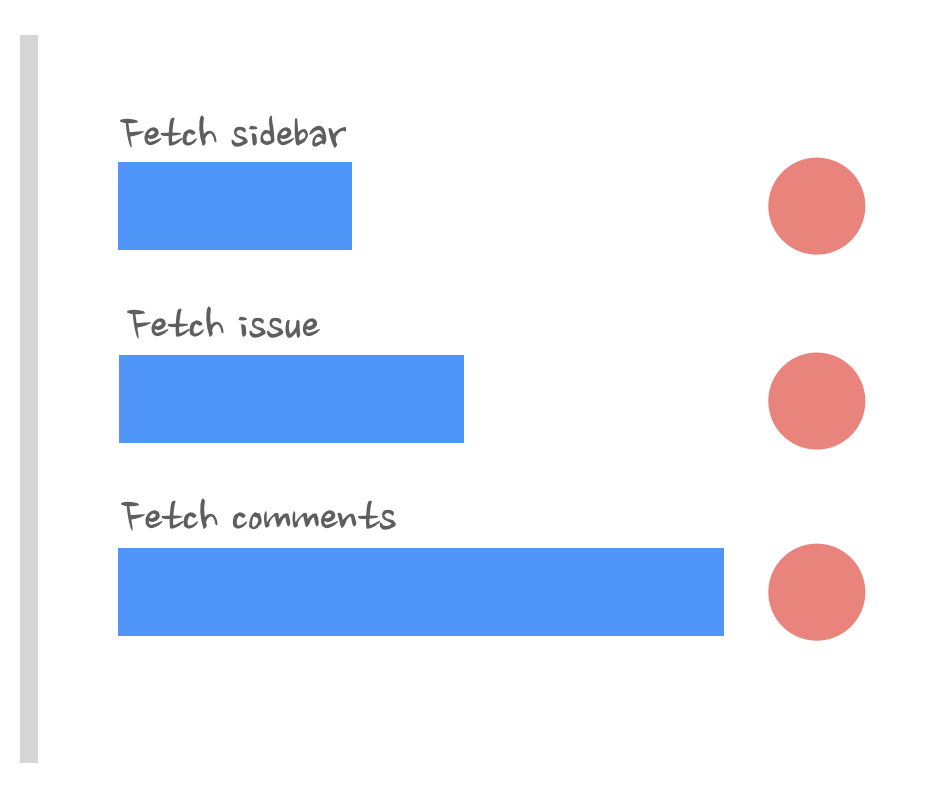
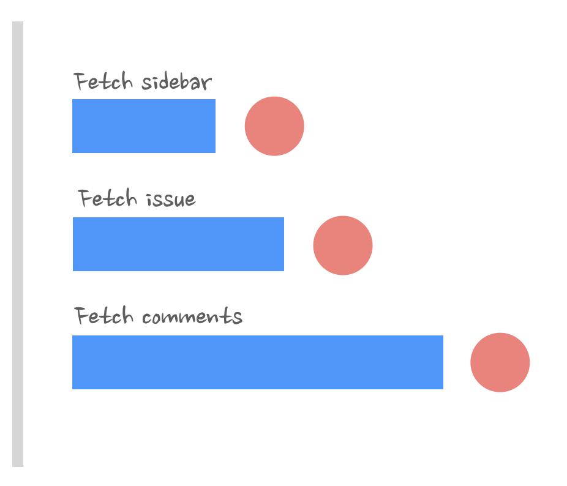
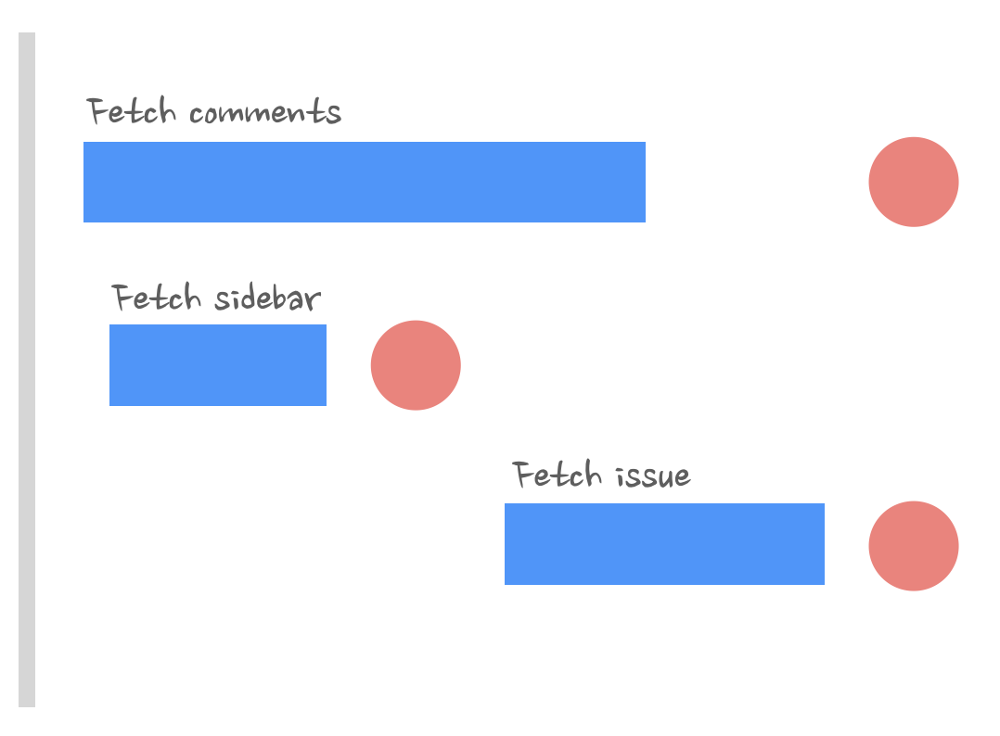

## Data fetching on the client and performance

### Requests waterfalls: how they appear

```tsx
const LoadingSidebar = () => (
  <>
    <div className="sidebar-base">
      <div className="loading sidebar-loading" />
      <div className="loading sidebar-loading" />
      <div className="loading sidebar-loading" />
      <div className="loading sidebar-loading" />
    </div>
  </>
);

const LoadingIssue = () => (
  <>
    <div className="issue">
      <div className="loading issue-loading" style={{ height: '20rem' }} />
      <div className="loading issue-loading" />
    </div>
  </>
);

const LoadingScreen = () => {
  return (
    <div className="layout">
      <LoadingSidebar />
      <LoadingIssue />
    </div>
  );
};

const Sidebar = ({ data }: { data: SidebarType[] }) => {
  return (
    <div className="sidebar sidebar-base">
      <ul>
        {data.map(({ name, id }) => (
          <li key={id}>{name}</li>
        ))}
      </ul>
    </div>
  );
};

const Comments = () => {
  const { data } = useData<CommentType[]>(`${commentsUrl}`);

  if (!data) return <div className="loading issue-loading" />;

  return (
    <div className="comments">
      <ul>
        {data.map(({ id, comment }) => (
          <li key={id}>{comment}</li>
        ))}
      </ul>
    </div>
  );
};

const Issue = () => {
  const { data } = useData<IssueType>(`${issueUrl}`);

  if (!data) return <LoadingIssue />;

  return (
    <div className="issue">
      <h3>{data.author}</h3>
      <p>{data.description}</p>
      <Comments />
    </div>
  );
};

const App = () => {
  const { data: sidebar } = useData<SidebarType[]>(`${sidebarUrl}`);

  if (!sidebar) return <LoadingScreen />;

  return (
    <div className="layout">
      <Sidebar data={sidebar} />
      <Issue />
    </div>
  );
};

export default App;
```

In code above there are problem.
What we did here is implement a classic waterfall of requests.
Only components that are actually
returned will be mounted, rendered, and as a result, will trigger
useEffect and data fetching in it. In our case, every single component
returns a "loading" state while it waits for data. And only when data is
loaded does it switch to a component next in the render tree, triggers its
own data fetching, returns a "loading" state, and the cycle repeats itself.



### How to solve requests waterfall

#### Promise.all solution

The first and easiest solution is to pull all of those data-fetching requests
as high in the render tree as possible. In our case, it's our root
component App . But there is a catch: you can't just "move" them and
leave it as is. We can't just do something like this:

```jsx
useEffect(async () => {
  const sidebar = await fetch("/get-sidebar");
  const issue = await fetch("/get-issue");
  const comments = await fetch("/get-comments");
}, []);
```

This is just yet **another waterfall**, only co-located in a single component.
We fetch sidebar data, await for it, then fetch the issue, await , fetch
comments, await.

**Instead**, we need to fire them _all at the same time_, so that they
are sent in **parallel**.

One way to do it is to use `Promise.all`

```js
const useAllData = () => {
  const [sidebar, setSidebar] = useState();
  const [comments, setComments] = useState();
  const [issue, setIssue] = useState();
  useEffect(() => {
    const dataFetch = async () => {
      // waiting for all that things in parallel
      const result = (
        await Promise.all([
          fetch(sidebarUrl),
          fetch(issueUrl),
          fetch(commentsUrl),
        ])
      ).map((r) => r.json());
      // and waiting a bit more - fetch API is cumbersome
      const [sidebarResult, issueResult, commentsResult] =
        await Promise.all(result);
      // when the data is ready, save it to state
      setSidebar(sidebarResult);
      setIssue(issueResult);
      setComments(commentsResult);
    };
    dataFetch();
  }, []);
  return { sidebar, comments, issue };
};
```

```js
const result = (
  await Promise.all([fetch(sidebarUrl), fetch(issueUrl), fetch(commentsUrl)])
).map((r) => r.json());
```

- This part fetches data from three different URLs in parallel using `fetch()`.
- `fetch()` returns a Response object, not the actual JSON data.
- `.map((r) => r.json())` transforms the array of Response objects into an array of promises that resolve to JSON.

```js
const [sidebarResult, issueResult, commentsResult] = await Promise.all(result);
```

- result is an array of promises (json() calls return promises).
- The second `Promise.all` waits for all these promises to resolve and extracts the JSON data.



#### Parallel promises solution

But what if we don't want to wait for them all? Our comments are the
slowest and the least important part of the page. It doesn't make much
sense to block the rendering of the sidebar while we're waiting for them.
Can we fire all requests in parallel, but wait for them independently?

We just need to transform those `fetch` from
`async/await` syntax to proper promises and save
the data inside the then callback:

```js
fetch("/get-sidebar")
  .then((data) => data.json())
  .then((data) => setSidebar(data));
fetch("/get-issue")
  .then((data) => data.json())
  .then((data) => setIssue(data));
fetch("/get-comments")
  .then((data) => data.json())
  .then((data) => setComments(data));
```

Now, **every** `fetch` request is fired in **parallel** but resolved **independently**.
And now in the App's render, we can do pretty cool things, like render
`Sidebar` and `Issue` as soon as their data ends up in the state:

```jsx
const App = () => {
  const { sidebar, issue, comments } = useAllData();
  // show loading state while waiting for sidebar
  if (!sidebar) return "loading";
  // render sidebar as soon as its data is available
  // but show loading state instead of issue and comments while we're waiting for them
  return (
    <>
      <Sidebar data={sidebar} />
      {/*render local loading state for issue here if its data not
available*/}
      {/*inside Issue component we'd have to render 'loading' for
empty comments as well*/}
      {issue ? <Issue comments={comments} issue={issue} /> : "loading"}
    </>
  );
};
```

Here, we render Sidebar , Issue , and Comments components as
soon as their data becomes available - exactly the same behavior as the
initial waterfall. But since we fired those requests in parallel, the overall
waiting time will drop from 6 seconds to just 3 seconds



### Data providers to abstract away fetching

Lifting data loading up like in the examples above, although good for
performance, is terrible for app architecture and code readability.

Instead of nicely co-located data fetching requests and their components, we have one giant component
that fetches everything and massive props drilling throughout the entire app.

**_Solution_**

"Data provider" here would be
just an abstraction around data fetching that gives us the ability to fetch
data in one place of the app and access that data in another, bypassing
all components in between. Essentially, it's like a mini-caching layer per
request. In "raw" React, it's just a simple context:

```jsx
const Context = React.createContext();
export const CommentsDataProvider = ({ children }) => {
  const [comments, setComments] = useState();
  useEffect(async () => {
    fetch("/get-comments")
      .then((data) => data.json())
      .then((data) => setComments(data));
  }, []);
  return <Context.Provider value={comments}>{children}</Context.Provider>;
};
export const useComments = () => useContext(Context);
```

And then our
monster App component turns into something as simple as this:

```jsx
const App = () => {
  const sidebar = useSidebar();
  const issue = useIssue();

  // show loading state while waiting for sidebar
  if (!sidebar) return "loading";
  // no more props drilling for any of those
  return (
    <>
      <Sidebar />
      {issue ? <Issue /> : "loading"}
    </>
  );
};
```

Our three providers will wrap the App component and will fire fetching
requests as soon as they are mounted in parallel:

```jsx
export const VeryRootApp = () => {
  return (
    <SidebarDataProvider>
      <IssueDataProvider>
        <CommentsDataProvider>
          <App />
        </CommentsDataProvider>
      </IssueDataProvider>
    </SidebarDataProvider>
  );
};
```

And then in something like `Comments` we'll just access that data from "data provider":

```jsx
const Comments = () => {
  const comments = useComments();
};
```

# 🚀 Optimized MobX Solution: Single Store & Parallel Loading

This solution eliminates multiple React Context providers while maintaining **parallel data fetching** using MobX.

---

## 📦 1️⃣ Create a Single Store (`AppStore.js`)

This store:

- **Fetches all data independently in parallel**.
- **Tracks loading states separately**.
- **Eliminates extra context providers**.

```js
class AppStore {
  sidebar = null;
  issue = null;
  comments = null;
  loading = {
    sidebar: true,
    issue: true,
    comments: true,
  };

  constructor() {
    makeAutoObservable(this);
    this.fetchAllData();
  }

  async fetchAllData() {
    this.fetchSidebar();
    this.fetchIssue();
    this.fetchComments();
  }

  async fetchSidebar() {
    try {
      const response = await fetch("/get-sidebar");
      this.sidebar = await response.json();
    } catch (error) {
      console.error("Failed to load sidebar:", error);
    } finally {
      this.loading.sidebar = false;
    }
  }

  async fetchIssue() {
    try {
      const response = await fetch("/get-issue");
      this.issue = await response.json();
    } catch (error) {
      console.error("Failed to load issue:", error);
    } finally {
      this.loading.issue = false;
    }
  }

  async fetchComments() {
    try {
      const response = await fetch("/get-comments");
      this.comments = await response.json();
    } catch (error) {
      console.error("Failed to load comments:", error);
    } finally {
      this.loading.comments = false;
    }
  }
}
```

Since we now have only one store, we only need one React Context.

```jsx
const AppContext = createContext(appStore);
export const useAppStore = () => useContext(AppContext);

export const AppProvider = ({ children }) => (
  <AppContext.Provider value={appStore}>{children}</AppContext.Provider>
);
```

Now, we can use useAppStore and only consume the parts we need.

```jsx
const App = observer(() => {
  const { sidebar, loading } = useAppStore();

  if (loading.sidebar) return <div>Loading Sidebar...</div>;

  return (
    <>
      <Sidebar data={sidebar} />
      <Issue />
      <Comments />
    </>
  );
});
```

Since comments are less important, they load in the background.

```jsx
const Issue = observer(() => {
  const { issue, loading } = useAppStore();

  if (loading.issue) return <div>Loading Issue...</div>;

  return (
    <div>
      <h2>{issue.title}</h2>
      <p>{issue.description}</p>
    </div>
  );
});
```

```jsx
const Comments = observer(() => {
  const { comments } = useAppStore();

  return (
    <ul>
      {comments.map((comment) => (
        <li key={comment.id}>{comment.text}</li>
      ))}
    </ul>
  );
});
```

### Fetch data before React

One final trick to learn about fighting waterfalls. That one is very
important to know so you can stop your colleagues from using it during
PR reviews. What I'm trying to say is that it's a very dangerous thing to
do, so use it wisely.
Comments component from when we
implemented the very first waterfall, the one that was fetching data by
itself

```jsx
const Comments = () => {
  const [data, setData] = useState();
  useEffect(() => {
    const dataFetch = async () => {
      const data = await (await fetch("/get-comments")).json();
      setData(data);
    };
    dataFetch();
  }, [url]);
  if (!data) return "loading";
  return data.map((comment) => <div>{comment.title}</div>);
};
```

Pay special attention to the 6th line there. What is f```etch('/get-
comments')``` ? It's nothing more than just a promise that we await
inside our useEffect . It doesn't depend on anything of React in this
case - no props, state, or internal variable dependencies. So, what will
happen if I move it to the very top, before I even declare the Comments
component? And then just await that promise inside the useEffect
hook?

```jsx
const commentsPromise = fetch("/get-comments");
const Comments = () => {
  useEffect(() => {
    const dataFetch = async () => {
      // just await the variable here
      const data = await (await commentsPromise).json();
      setState(data);
    };
    dataFetch();
  }, [url]);
};
```
A really fancy thing: our fetch call essentially "escapes" all React lifecycle
and will be fired as soon as JavaScript is loaded on the page, before any
of the ```useEffect``` anywhere is called. Even before the very first request
in the root ```App``` component is called. It will be fired, JavaScript will
move on to other things to process, and the data will just sit there quietly
until someone actually resolves it. Which is what we're doing in our
```useEffect``` in ```Comments```.

Just moving the fetch call outside of Comments resulted in this instead:



Technically speaking, we could've just moved all of our promises outside
of components, and that would've solved the waterfalls, and we wouldn't
have to deal with lifting fetching up or data providers.
So why didn't we? And why it's not a very common pattern?

**Browsers limitation**
Only 6 requests in
parallel, the next one will queue. And fetches like these will be fired
immediately and completely uncontrollably. A component that fetches
heavy data and is rendered once in a blue moon, in your app with a
"traditional" waterfall approach, won't bother anyone until it's actually
rendered. But with this hack, it has the potential to steal the most
valuable milliseconds of initial fetching of critical data.

There are only two "legit" use cases that I can think of for this pattern:
pre-fetching of some critical resources at the router level and pre-fetching
data in lazy-loaded components.
In the first case, you actually need to fetch data as soon as possible, and
you know for sure that the data is critical and required immediately. And
lazy-loaded components' JavaScript will be downloaded and executed
only when they end up in the render tree, so by definition, after all the
critical data is fetched and rendered. So, it's safe.

