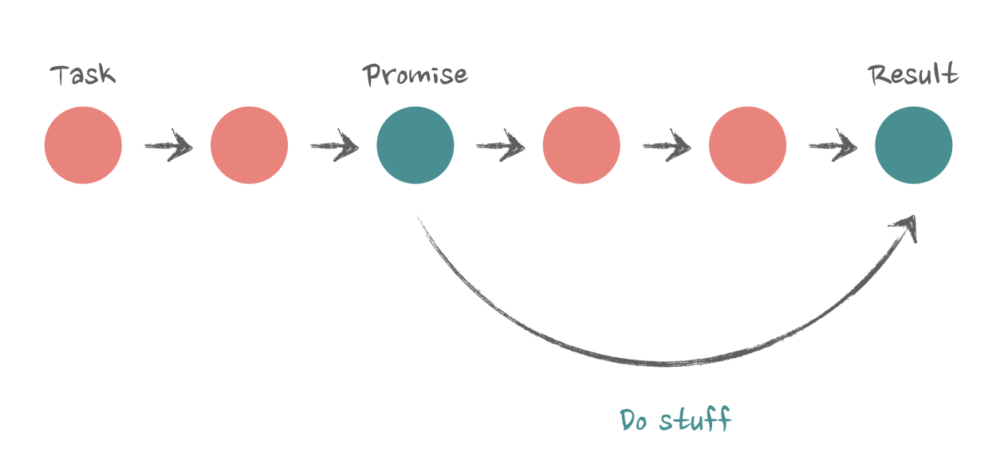

## Data fetching and race conditions

When JavaScript executes the
code, it usually does so synchronously: step by step. A Promise is one of
the very few available ways to execute something asynchronously. With
Promises, we can just trigger a task and move on to the next step
immediately, without waiting for the task to be done. And the task _promises_ that it will notify us when it's completed. And it does! It's very
trustworthy.

From the code perspective, it's just this:

```js
console.log("first step"); // will log FIRST
fetch("/some-url") // create promise here
  .then(() => {
    // wait for Promise to be done
    // log stuff after the promise is done
    console.log("second step"); // will log THIRD (if successful)
  })
  .catch(() => {
    console.log("something bad happened"); // will log THIRD (if error happens)
  });
console.log("third step"); // will log SECOND
```



### Promises and race conditions

```tsx
type Issue = {
  id: string;
  title: string;
  description: string;
  author: string;
};

const url1 = "https://api-sage-two-60.vercel.app/mocks/issues/1?delay=2000";
const url2 = "https://api-sage-two-60.vercel.app/mocks/issues/2?delay=1000";

const Page = ({ id }: { id: string }) => {
  const [data, setData] = useState<Issue>({} as Issue);
  const [loading, setLoading] = useState(false);
  const url = id === "1" ? url1 : url2;

  useEffect(() => {
    setLoading(true);
    fetch(url)
      .then((r) => r.json())
      .then((r) => {
        setData(r);
        console.log(r);
        setLoading(false);
      });
  }, [url]);

  if (!data.id || loading) return <>loading issue {id}</>;

  return (
    <div>
      <h1>My issue number {data.id}</h1>
      <h2>{data.title}</h2>
      <p>{data.description}</p>
    </div>
  );
};

const App = () => {
  const [page, setPage] = useState("1");

  return (
    <div className="App">
      <div className="container">
        <ul className="column">
          <li>
            <button
              className="button"
              onClick={() => setPage("1")}
              disabled={page === "1"}
            >
              Issue 1
            </button>
          </li>
          <li>
            <button
              className="button"
              onClick={() => setPage("2")}
              disabled={page === "2"}
            >
              Issue 2
            </button>
          </li>
        </ul>

        <Page id={page} />
      </div>
    </div>
  );
};
```


It has a tabs column on the left, navigating between tabs sends a fetch
request, and the data from the request is rendered on the right. If we try
to navigate between tabs quickly, the experience is bad: the content is
blinking and data appears seemingly at random: sometimes the content
of the first tab appears, and then quickly replaced by the second tab,
sometimes they create some sort of carousel. The whole thing just
behaves weird.

We have two
components. One is the root ```App``` component, which manages the state
of the active "page" and renders the navigation buttons and the actual
```Page``` component.

```jsx
const App = () => {
  const [page, setPage] = useState("1");
  return (
    <>
      {/*left column buttons*/}
      <button onClick={() => setPage("1")}>Issue 1</button>
      <button onClick={() => setPage("2")}>Issue 2</button>
      {/*the actual content*/}
      <Page id={page} />
    </>
  );
};
```

The ```Page``` component accepts the id of the active page as a prop,
sends a fetch request to get the data, and then renders it. The simplified
implementation (without the loading state) looks like this:

```tsx
const Page = ({ id }: { id: string }) => {
  const [data, setData] = useState({});
  // pass id to fetch relevant data
  const url = `/some-url/${id}`;
  useEffect(() => {
    fetch(url)
      .then((r) => r.json())
      .then((r) => {
        // save data from fetch request to state
        setData(r);
      });
  }, [url]);
  // render data
  return (
    <>
      <h2>{data.title}</h2>
      <p>{data.description}</p>
    </>
  );
};
```

With ```id``` , we determine the ```url``` from where to fetch data. Then we're
sending the fetch request in ```useEffect``` , and storing the result data
in the state - everything is pretty standard. So, where does the race
condition and that weird behavior come from?

### Race condition reasons

From the lifecycle perspective, what happens is this:

- The `App` component is mounted
- The `Page` component is mounted with the default prop value "1"
- `useEffect` in the Page component kicks in for the first time

Then the nature of Promises comes into effect: fetch within
```useEffect``` is a promise, an asynchronous operation. It sends the
actual request, and then React just moves on with its life without waiting
for the result. After ~2 seconds, the request is done, .then of the
promise kicks in, within it, we call setData to preserve the data in the
state, the ```Page``` component is updated with the new data, and we see it
on the screen.

If, after everything is rendered and done, I click on the navigation
button, we'll have this flow of events:

- The ```App``` component changes its state to another pag
- The state change triggers a re-render of the ```App``` component
- Because of that, the Page component will re-render as well
- ```useEffect``` in the ```Page``` component has a dependency on id ,
  id has changed, ```useEffect``` is triggered again
- fetch in ```useEffect``` will be triggered with the new id , after
  ~2 seconds ```setData``` will be called again, the ```Page``` component
  updates, and we'll see the new data on the screen

But what will happen if I click on a navigation button and the id
changes while the first fetch is in progress and hasn't finished yet?

- The `App` component will trigger a re-render of the Page again.
- `useEffect` will be triggered again (the id has changed!).
- `fetch` will be triggered again, and React will continue with its
  business as usual.
- Then, _the first fetch will finish_. It still has the reference to
  `setData` of the exact same `Page` component (remember - it
  just updated, so the component is still the same).
- `setData` after the first fetch will be triggered, the `Page`
  component will update itself with the data from the first fetch.
- Then, the second fetch finishes. It was still there, hanging out in
  the background, as any promise would do. That one also has the
  reference to exactly the same `setData` of the same `Page`
  component, it will be triggered, Page will again update itself,
  only this time with the data from the **second** fetch.

Race condition! After navigating to the new page, we see a flash of
content: the content from the first finished fetch is rendered, then it's
replaced by the content from the second finished fetch.

This effect is even more interesting if the second fetch finishes before the
first fetch. Then we'll see the correct content of the next page first, and
then it will be replaced by the incorrect content of the previous page.

### Fixing race conditions: force re-mounting

The first solution is not even a solution per se, it's more of an
explanation of why these race conditions don't actually happen that
often and why we usually don't see them during regular page navigation.
Imagine instead of the implementation above, we had something like
this:

```jsx
const App = () => {
  const [page, setPage] = useState("issue");
  return (
    <>
      {page === "issue" && <Issue />}
      {page === "about" && <About />}
    </>
  );
};
```

Data fetching happens in the `useEffect` hook, exactly the same as before:

```jsx
const About = () => {
  const [about, setAbout] = useState();
  useEffect(() => {
    fetch("/some-url-for-about-page")
      .then((r) => r.json())
      .then((r) => setAbout(r));
  }, []);
};
```

This time there is no race condition in the app while navigating. Navigate
as many times and as fast as you want: it behaves normally.

Why?
The answer is here: `{page === ‘issue' && <Issue />}` . `Issue`
and `About` pages are not re-rendered when the page value changes,
they are _re-mounted_. When the value changes from `issue` to `about` ,
the `Issue` component unmounts itself, and the `About` component is
mounted in its place.

What is happening from the fetching perspective is this:

- The `App` component renders first, mounts the Issue
  component, data fetching there kicks in.

- When I navigate to the next page while the fetch is still in
  progress, the `App` component unmounts the `Issue` page and
  mounts the `About` component instead, it kicks off its own data
  fetching.

And when React unmounts a component, it means it's gone. Gone
completely, disappears from the screen, no one has access to it,
everything that was happening within, including its state, is lost.
Compare this with the previous code, where we wrote `<Page id=
{page} />` . This `Page` component was never unmounted. We were
simply reusing it and its state when navigating.

So, back to the unmounting situation. When the `Issue` 's fetch request
finishes while I'm on the `About` page, the .then callback of the
`Issue` component will try to call its `setIssue` state. But the
component is gone. From React's perspective, it doesn't exist anymore.
So the promise will just die out, and the data it got will just disappear
into the void.

In theory, this behavior can be applied to solve the race
condition in the original app: all we need is to force the Page
component to re-mount on navigation. We can use the "key" attribute for
this

```jsx
<Page id={page} key={page} />
```

Changing the "key" on an element will force React to remove the one with
the "old" key and mount the one with the new "key", even if they are the
same type.
However, this is not a solution. There are better ways to deal with race conditions.

### Fixing race conditions: drop incorrect result

We can solve race condition just to make sure that the result
coming in the .then callback matches the `id` that is currently
"active".

If the result returns the `id` that was used to generate the `url` , we can
just compare them. And if they don't match, ignore them. The trick here
is to escape the React lifecycle and locally scoped data in functions and
get access to the "latest" id inside all iterations of `useEffect` , even the
"stale" ones. Yet another use case for Refs

```jsx
const Page = ({ id }) => {
  // create ref
  const ref = useRef(id);
  useEffect(() => {
    // update ref value with the latest id
    ref.current = id;
    fetch(`/some-data-url/${id}`)
      .then((r) => r.json())
      .then((r) => {
        // compare the latest id with the result
        // only update state if the result actually belongs to that id
        if (ref.current === r.id) {
          setData(r);
        }
      });
  }, [id]);
};
```

Your results don't return anything that identifies them reliably? No
problem, we can just compare the url instead:

```jsx
const Page = ({ id }) => {
  // create ref
  const ref = useRef(id);
  useEffect(() => {
    // update ref value with the latest url
    ref.current = url;
    fetch(`/some-data-url/${id}`).then((result) => {
      // compare the latest url with the result's url
      // only update state if the result actually belongs to that
      url;
      if (result.url === ref.current) {
        result.json().then((r) => {
          setData(r);
        });
      }
    });
  }, [url]);
};
```

### Fixing race conditions: drop all previous results

There is another way. `useEffect` has
something called a "cleanup" function, where we can clean up stuff like
subscriptions. Or in our case, it's active fetch requests.
The syntax for it looks like this:
The cleanup function is run after a component is unmounted, or
_before every re-render with changed dependencies_. So the order of operations during re-render will look like this:

- url changes
- "cleanup" function is triggered
- actual content of useEffect is triggered

This, along with the nature of JavaScript's functions and closures,
allows us to do this:

```js
useEffect(() => {
  // local variable for useEffect's run
  let isActive = true;
  // do fetch here
  return () => {
    // local variable from above
    isActive = false;
  };
}, [url]);
```

We're introducing a local boolean variable `isActive` and setting it to
true on `useEffect` run and to false on cleanup.
The function in
`useEffect` is re-created on every re-render, so the `isActive` for the
latest `useEffect` run will always reset to true . But! The "cleanup"
function, which runs before it, still has access to the scope of the
previous function, and it will reset it to false.

The `fetch` Promise, although async, still exists only within that closure
and has access only to the local variables of the `useEffect` run that
started it. So when we check the `isActive` boolean in the .then
callback, only the latest run, the one that hasn't been cleaned up yet, will
have the variable set to true . So all we need now is to check whether
we're in the active closure, and if yes - set state. If no - do nothing. The
data will simply disappear into the void again.

```js
useEffect(() => {
  // set this closure to "active"
  let isActive = true;
  fetch(`/some-data-url/${id}`)
    .then((r) => r.json())
    .then((r) => {
      // if the closure is active - update state
      if (isActive) {
        setData(r);
      }
    });
  return () => {
    // set this closure to not active before next re-render
    isActive = false;
  };
}, [id]);
```

### Fixing race conditions: cancel all previous requests

Instead of cleaning up or comparing results, we can simply cancel all the
previous requests. If they never finish, the state update with obsolete
data will never happen, and the problem won't exist. We can use the
`AbortController` interface for this.

It's as simple as creating an `AbortController` in `useEffect` and
calling `.abort()` in the cleanup function.

```jsx
useEffect(() => {
  // create controller here
  const controller = new AbortController();
  // pass controller as signal to fetch
  fetch(url, { signal: controller.signal })
    .then((r) => r.json())
    .then((r) => {
      setData(r);
    });
  return () => {
    // abort the request here
    controller.abort();
  };
}, [url]);
```

Aborting a request in progress will cause the promise to reject, so you'd
want to catch errors to get rid of the scary warnings in the console. But
handling Promise rejections properly is a good idea regardless of
`AbortController` , so it's something you'd want to do with any
strategy. Rejecting because of `AbortController` will give a specific
type of error, making it easy to exclude it from regular error handling.

```jsx
fetch(url, { signal: controller.signal })
  .then((r) => r.json())
  .then((r) => {
    setData(r);
  })
  .catch((error) => {
    // error because of AbortController
    if (error.name === "AbortError") {
      // do nothing
    } else {
      // do something, it's a real error!
    }
  });
```

