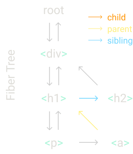

# [Build your own react](https://pomb.us/build-your-own-react/)

**Steps**

* **Step 1**: The `createElement` Function
* **Step 2**: The `render` Function
* **Step 3**: Concurrent Mode
* **Step 4**: Fibers
* **Step 5**: Render and Commit Phases
* **Step 6**: Reconcilation
* **Step 7**: Function Components
* **Step 8**: Hooks

## Step Zero: Review

Default react app code

```jsx
const element = <h1 title={'foo'}>Hello</h1>;
const root = createRoot(document.getElementById('root'));
root.render(element)
```

**Let's remove all react specific code and replace it with vanilla js**

JSX is transformed by build tools, and tags replaced with a call to `createElement`, passing the tag name, the props and
the children as parameters

```js
const element = createElement('h1', {title: 'foo'}, "Hello");
const container = document.getElementById('root');
const root = createRoot(container);
root.render(element)
```

So, element is an object that has properties: type and props(it has more, but we interested im these two).

```js
const element = {
    type: 'h1',
    props: {
        title: 'foo',
        children: 'Hello'
    }
}
```

`render` is where React changes DOM

```js
const node = document.createElement(element.type);
node['title'] = element.props.title;

const text = document.createTextNode();
text['nodeValue'] = element.props.children;
node.appendChild(text);
container.appendChild(node)
```

## Step 1: The `createElement` Function

Transform JSX to JS so we can see the `createElement` calls.

```js
const element = (
    <div id='foo'>
        <a>bar</a>
        <b/>
    </div>
)

const container = document.getElementById('root');
const root = createRoot(container);
root.render(element)
```

As we saw previously, an element is an object with `type` and `props`. The only thing that our function needs to do is
create that object.

```js
function createElement(type, props, ...children) {
    return {
        type: type,
        props: {
            ...props,
            children
        }
    }
}
```

We use _spread operator_ for the `props` and _rest parameter syntax_ for the `children`, this way the `children` prop
will always be an array.

The `children` array could also contain primitive values like string or number. So anything that isn't an object we'll
wrap in special element  `TEXT_ELEMENT`
_React doesn't wrap like this, we do it to simplify or code_.

```js
function createElement(type, props, ...children) {
    return {
        type,
        props: {
            ...props,
            children: children.map((child) => typeof child === "object" ? child : createTextElement(child))
        }
    }
}

function createTextElement(text) {
    return {
        type: 'TEXT_ELEMENT',
        props: {
            nodeValue: text,
            children: []
        }
    }
}
```

Let's call our library Didact.

```js
const Didact = {
    createElement
};

const element = Didact.createElement("div", {id: 'foo'},
    Didact.createElement("a", null, "bar"),
    Didact.createElement("b")
)
```

But we still want to use JSX here. How do we tell babel to use Didact's `createElement` instead of React's?

```js
/** @jsx Didact.createElement */
const element = (
        <div id='foo'>
            <a>bar</a>
            <b/>
        </div>
    )
```

If we have comment like this, when babel transpiles the JSX it will use function we define.

## Step II: The `render` Function

We start by creating the DOM node using the element type, and then append the new node to the container.
We recursively do the same for each child.

```js
function render(element, container) {
    const dom = document.createElement(element.type);

    element.props.children.forEach((child) => render(child, dom));

    container.appendChild(dom)
}
```

We also need to handle text element.

```js
function render(element, container) {
    const dom = element.type === 'TEXT_ELEMENT' ? document.createTextNode('') : document.createElement(element.type);

    element.props.children.forEach((child) => render(child, dom));

    container.appendChild(dom)
}
```

We need to assign the element props to the node.

```js
function render(element, container) {
    const dom = element.type === 'TEXT_ELEMENT' ? document.createTextNode('') : document.createElement(element.type);

    const isProperty = (key) => key !== 'children';

    Object.keys(element.props).filter(isProperty).forEach((name) => {
        dom[name] = element.props[name]
    })

    element.props.children.forEach((child) => render(child, dom));

    container.appendChild(dom)
}
```

## Step 3: Concurrent Mode

There's a problem with the recursive call.

Once we start rendering, we won't stop untile we have rendered the complete element tree.
If the element tree is big, it may block the main thread for too long.
And if browser needs to do high priority stuff like handling user input or keeping an animation smooth, it will have to
wait until render finishes.

So we are going to break the work into small units, and after we finish each unit we'll let the browser interrupt the
rendering if there's anything else that needs to be done.

```js
let nextUnitOfWork = null;

function workLoop(deadline) {
    let shouldYield = false;
    while (nextUnitOfWork && !shouldYield) {
        nextUnitOfWork = performUnitOfWork(nextUnitOfWork);
        shouldYield = deadline.timeRemaining() < 1;
    }
}

requestIdleCallback(workLoop);
```

We use `requestIdleCallback` to make a loop. You can think `requestIdleCallback` as a `setTimeout`, but instead of us
telling it when to run,
thquick sort with random pivote browser will run the callback when the main thread is idle.
_React doesn't suse `requestIdleCallback` anymore.Now it uses the scheduler package. But for this use case it's
conceptually the same._

`requestIdleCallback` also gives us a deadline parameter. We can use it to check how much time we have until the browser
needs to take control again.

To start using the loop we'll need to set the first unit of work, and then write a `performUnitOfWork` function that not
only performs the work, but also returns the next unit of work.

```js
function performUnitOfWork(nextUnitOfWork) {
//     TODO:
}
```

## Step 4: Fibers

```js
Didact.render(
    <div>
        <h1>
            <p/>
            <a/>
        </h1>
        <h2/>
    </div>,
    container
)
```

To organize the units of work we'll need a data structure: a fiber tree.

We'll have one fiber for each element and each fiber will be a unit of work.

If fiber has a `child` it will be next unit of work.
From example, when we finish working on the `div` fiber the next unit of work will be `h1` fiber.

If fiber doesn't have a `child`, we use the `sibling` as next unit of work.
For example, the `p` doesn't have a child, so we move to `a` fiber and finishing it.

If fiber doesn't have a `child` and a sibling `sibling` we go to the "uncle": the `sibling` of the parent.
Like `a` and `h2` from our example.

If `parent` doesn't have a sibling, we keep going up through the parents until we find one with a `sibling` or until we
reach the root.
If we have reached the root, it means we finished performing all the work on this `render`.



First, let's remove code from render function
We keep the part that creates a DOM node in its own function

In the `render` function we set `nextUnitOfWork` to the root of the fiber tree.

```js
function createDom(fiber) {
    const dom = fiber.type === 'TEXT_ELEMENT' ? document.createTextNode("") : document.createElement(fiber.type);
    const isProperty = (key) => key !== 'children';
    Object.keys(fiber.props).filter(isProperty).forEach((name) => dom[name] = fiber.props[name])

    return dom;

}


function render(element, container) {
    nextUnitOfWork = {
        dom: container,
        props: {
            children: [element],
        },
    }
}

let nextUnitOfWork = null;
```

Then, when the browser is ready, it will call our `workLoop` and we'll start working on the root.

```js
let nextUnitOfWork = null;

function workLoop(deadline) {
    let shouldYield = false;

    while (nextUnitOfWork && !shouldYield) {
        nextUnitOfWork = performUnitOfWork(nextUnitOfWork);
        shouldYield = deadline.timeRemaining() < 1;
    }
}

requestIdleCallback(workLoop);

function performUnitOfWork(fiber) {
//     TODO: add dom node
//     TODO create new fibers
//     TODO return next unit of work
}
```

Fist, we create a new node and append it to the DOM

```js
function performUnitOfWork(fiber) {
    if (!fiber.dom) {
        fiber.dom = createDom(fiber)
    }

    if (fiber.parent) {
        fiber.parent.dom.appendChild(fiber.dom);
    }
}
```

Then for each child we create a new fiber.
And we add it to the fiber tree setting it either as a child or as sibling, depending on whether it's the first child or
not.

```js
function performUnitOfWork(fiber) {
    if (!fiber.dom) {
        fiber.dom = createDom(fiber);
    }

    if (fiber.parent) {
        fiber.parent.dom.appendChild(fiber.dom);
    }

    const elements = fiber.props.children;
    let index = 0;
    let prevSibling = null;

    while (index < elements.length) {
        const element = elements[index];

        const newFiber = {
            type: element.type,
            props: element.props,
            parent: fiber,
            dom: null
        };

        if (index === 0) {
            fiber.child = newFiber;
        } else {
            prevSibling.sibling = newFiber;
        }

        prevSibling = newFiber;
        index++;

    }
}
```

Finally we search for the next unit of work.
We first try with the child, then with sibling, then with uncle and so on.

```js
function performUnitOfWork(fiber) {
    if (!fiber.dom) {
        fiber.dom = createDom(fiber);
    }

    if (fiber.parent) {
        fiber.parent.dom.appendChild(fiber.dom);
    }

    let index = 0;
    let prevSibling = null;
    const elements = fiber.props.children;

    while (index < elements.length) {
        const element = elements[index];

        const newFiber = {
            parent: fiber,
            props: element.props,
            type: element.type,
            dom: null
        }

        if (index === 0) {
            fiber.child = newFiber;
        } else {
            prevSibling.sibling = newFiber
        }

        prevSibling = newFiber;
        index++
    }

    if (fiber.child) {
        return fiber.child
    }

    let nextFiber = fiber;

    while (nextFiber) {
        if (nextFiber.sibling) {
            return nextFiber.sibling;
        }
        nextFiber = nextFiber.parent;
    }
}
```

## Step 5: Render and Commit Phases

**Problem**

We are adding a new node to the DOM each time we work on an element. Browser could interrupt our work before we finish
rendering the whole tree.
User will se an incomplete UI.

We need to remove the part that mutates the DOM from here

```js
function performUnitOfWork(fiber) {
}
```

Instead, we'll keep track of the root of the fiber tree.
We call it the work in progress rot or `wipRoot`

```js
function render(element, container) {
    wipRoot = {
        dom: container,
        props: {
            children: [element]
        }
    }

    nextUnitOfWork = wipRoot
}

let nextUnitOfWork = null;
let wipRoot = null;
```

When we finish all the work, we commit the whole fiber tree to the DOM and recursively append all the nodes to the dom.

```js
function commitWork(fiber) {
    if (!fiber) {
        return;
    }

    const domParent = fiber.dom.parent;
    domParent.appendChild(fiber.dom);
    commitWork(fiber.child);
    commitWork(fiber.sibling);
}

function commitRoot() {
    commitWork(wipRoot.child);
    wipRoot = null;
}

function workLoop(deadline) {
    let shouldYield = false;
    while (nextUnitOfWork && !shouldYield) {
        nextUnitOfWork = performUnitOfWork(nextUnitOfWork);
        shouldYield = deadline.timeRemaining() < 1;
    }

    if (!nextUnitOfWork && wipRoot) {
        commitRoot();
    }

    requestIdleCallback(workLoop)
}
```

## Step VI: Reconciliation

For updating or deleting nodes, we need to compare elements we receive on the render function to the last fiber tree we
committed to the DOM

We need to save a reference to that "last fiber tree we committed to the DOM" after we finish commit. We call it
`currentRoot`.

We also add property `alternate` to every fiber - it is a link to the old fiber, the fiber that we committed to the DOM
in previous commit phase.

```js
function commitRoot() {
    commitWork(wipRoot.child);
    currentRoot = wipRoot;
    wipRoot = null;
}

function render(element, container) {
    wipRoot = {
        dom: container,
        props: {
            children: [element]
        },
        alternate: currentRoot,
    }
    nextUnitOfWork = wipRoot;
}

let nextUnitOfWork = null;
let currentRoot = null;
let wipRoot = null;
```

Now let's extract code from `performUnitOfWork` that creates new fibers to a new `reconcileChildren` function.

```js

function reconcileChildren(wipFiber, elements) {
    let index = 0;
    let oldFiber = wipFiber.alternate && wipFiber.alternate.child;
    let prevSibling = null;

    while (index < elements.length || oldFiber != null) {
        const element = elements[index];
        // TODO compare oldFiber to element
    }
}

function performUnitOfWork(fiber) {
    if (!fiber.dom) {
        fiber.dom = createDom(fiber);
    }

    const elements = fiber.props.children;
    reconcileChildren(fiber, elements);

    if (fiber.child) {
        return fiber.child;
    }
    let nextFiber = fiber;
    while (nextFiber) {
        if (nextFiber.sibling) {
            return nextFiber.sibling;
        }
        nextFiber = nextFiber.parent;
    }
}
```

We iterate at the same time over the children of the oldFiber(`wipFiber.alternate`) and the array of elements we want to
reconcile.
If we ignore all iteration's boilerplate, we left with what matters: `oldFiber` and `element`.

**The `element` is the thing we want render, `oldFiber` - rendered the last time**.

We need to compare them:

* If the old fiber and the new element have the same type, we can keep the DOM node and just update it with the new
  props.

  We create a new fiber keeping the DOM node from the old fiber and the props from element. And also add new property
  `effectTag`
* If the type is different and there is a new element, we need to create a new DOM node;
* If types are different and there is an old fiber, we need to remove the old node.
  So we need an array to keep track of the nodes we want to remove. And then, when we are commiting the changes to the
  DOM,
  we also use the fibers from that array.

_Also for this React uses keys_

```js
function commitRoot() {
    deletions.forEach(commitWork)
    commitWork(wipRoot.child)
    currentRoot = wipRoot
    wipRoot = null
}

function render(element, container) {
    wipRoot = {
        dom: container,
        props: {
            children: [element],
        },
        alternate: currentRoot,
    }
    deletions = []
    nextUnitOfWork = wipRoot
}

let nextUnitOfWork = null
let currentRoot = null
let wipRoot = null
let deletions = null

function reconcileChildren(wipFiber, elements) {
    let index = 0;
    let oldFiber = wipFiber.alternate && wipFiber.alternate.child;
    let prevSibling = null;

    while (index < elements.length || oldFiber != null) {
        const element = elements[index];
        let newFiber = null;

        const sameType = oldFiber && element && element.type == oldFiber.type

        if (sameType) {
            newFiber = {
                type: oldFiber.type,
                props: element.props,
                dom: oldFiber.dom,
                parent: wipFiber,
                alternate: oldFiber,
                effectTag: 'UPDATE',
            }
        }

        if (element && !sameType) {
            newFiber = {
                type: element.type,
                props: element.props,
                dom: null,
                parent: wipFiber,
                alternate: null,
                effectTag: "PLACEMENT"
            }
        }

        if (oldFiber && !sameType) {
            oldFiber.effectTag = "DELETION"
        }

        if (oldFiber) {
            oldFiber = oldFiber.sibling;
        }

    }
}
```

Let's change `commitWork` to handle new `effectTags`.

If `PLACEMENT` - append the DOM node to the node from parent fiber.
If `DELETION` - remove the child
If `UPDATE` - update existing DOM node with new props that changed

```js
function commitWork(fiber) {
    if (!fiber) {
        return
    }

    const domParent = fiber.parent.dom;

    if (fiber.effectTag === 'PLACEMENT' && fiber.dom != null) {
        domParent.appendChild(fiber.dom);
    } else if (fiber.effectTag === 'UPDATE' && fiber.dom != null) {
        updateDom(fiber.dom, fiber.alternate.props, fiber.props)
    } else if (fiber.effectTag === 'DELETION') {
        domParent.removeChild(fiber.dom)
    }
}
```

`updateFunction`

And one special kind of prop we need to update - event listeners, if prop name starts with the "on" prefix, we'll handle
them differently.

```js
const isProperty = (key) => key !== 'children';
const isGone = (prev, next) => key => !(key in next);
const isNew = (prev, next) => key => prev[key] != next[key];
const isEvent = (key) => key.startsWith("on");


function updateDom(dom, prevProps, nextProps) {

    // Remove old event listeners
    Object.keys(prevProps)
        .filter(isEvent)
        .filter((key) => !(key in nextProps) || isNew(prevProps, nextProps)(key))
        .forEach((name) => {
            const eventType = name.toLowerCase().substring(2);
            dom.removeEventListener(eventType, prevProps[name])
        });


    // Remove old properties

    Object.keys(prevProps)
        .filter(isProperty)
        .filter(isGone(prev, nextProps))
        .forEach((name) => dom[name] = '');


    // Set new or changed properties
    Object.keys(nextProps)
        .filter(isProperty)
        .filter(isNew(prevProps, nextProps))
        .forEach((name) => dom[name] = nextProps[name])

    // Add event listeners

    Object.keys(nextProps).filter(isEvent).filter(isNew(prevProps, nextProps)).forEach(() => {
        const eventType = name.toLowerCase().substring(2);
        dom.addEventListener(eventType, nextProps[name]);
    })
}
```

## Step 7: Function Components

Function components are different in two ways, from `createElement`

* the fiber from a function component doesn't have a DOM node;
* and the children come from running function instead of getting them directly from the props.

In `updateFunctionComponent` we run the function to get children.
For example, here the `fiber.type` is the `App` function and when we run it, it returns `h1` element

```js
function performUnitOfWork(fiber) {
    const isFunctionComponent = fiber.type instanceof Function;

    if (isFunctionComponent) {
        updateFunctionComponent(fiber)
    } else {
        updateHostComponent(fiber)
    }

    if (fiber.child) {
        return fiber.child
    }
    let nextFiber = fiber
    while (nextFiber) {
        if (nextFiber.sibling) {
            return nextFiber.sibling
        }
        nextFiber = nextFiber.parent
    }
}

function updateHostComponent(fiber) {
    if (!fiber.dom) {
        fiber.dom = createDom(fiber)
    }
    reconcileChildren(fiber, fiber.props.children)
}

function updateFunctionComponent(fiber) {
    const children = [fiber.type(fiber.props)]
    reconcileChildren(fiber, children);
}
```

What we need to change is the `commitWork`
Now that we have fibers without DOM nodes we need to change two things.

First, to find the parent of a DOM node we'll need to go up the fiber tree until we find a fiber with a DOM node.
And when removing a node we also need to keep going until we find a child with a DOM node.

```js
function commitWork(fiber) {
    if (!fiber) {
        return;
    }

    let domParentFiber = fiber.parent;

    while (!domParentFiber.dom) {
        domParentFiber = domParentFiber.parent;
    }

    const domParent = domParentFiber.dom

    if (
        fiber.effectTag === "PLACEMENT" &&
        fiber.dom != null
    ) {
        domParent.appendChild(fiber.dom)
    } else if (fiber.effectTag === "UPDATE" && fiber.dom != null) {
        updateDom(fiber.dom, fiber.alternate.props, fiber.props)
    } else if (fiber.effectTag === "DELETION") {
        commitDeletion(fiber, domParent)
    }

    commitWork(fiber.child);
    commitWork(fiber.sibling);
}

function commitDeletion(fiber, domParent) {
    if (fiber.dom) {
        domParent.removeChild(fiber.dom);
    } else {
        commitDeletion(fiber.child, domParent)
    }
}
```

## Step 7: Hooks

We need to initialize some global variables before calling the function component so we can use them inside `useState`
function.

First we set work in progress fiber.
Also add `hooks` array to fiber to support calling `useState` several times in the same component. And week track of
current hook index

```js
let wipFiber = null;
let hookIndex = null;

function updateFunctionComponent(fiber) {
    wipFiber = fiber;
    hookIndex = 0;
    wipFiber.hooks = [];

    const children = [fiber.type(fiber.props)];
    reconcileChildren(fiber, children);
}
```

When function component calls `useState` we

1) Check if we have an old hook. We check in `alternate` of the fiber using the hook index.
2) If we have oldHook - copy state from old hook to new hook. If we don't have - initialize the state.
3) Then add the new hook to fiber, increment hook index by one and return the state.

We define `setState` function to update the state, that receives an action.
We push that action to a queue we added to the hook. And then set a new work in progress root as the next unit of work,
so the work loop can start a new render phase.

```js
function useState(initial) {
    const oldHook = wipFiber.alternate && wipFiber.alternate.hooks && wipFiber.alternate.hooks[hookIndex];

    const hook = {
        state: oldHook ? oldHook.state : initial,
        queue: []
    }
    const actions = oldHook ? oldHook.queue : [];
    actions.forEach((action) => hook.state = action(hook.state));

    const setState = (action) => {
        hook.queue.push(action);
        wipRoot = {
            dom: currentRoot.dom,
            props: currentRoot.props,
            alternate: currentRoot
        }
        nextUnitOfWork = wipRoot;
        deletions = [];
    }


    wipFiber.hooks.push(hook);
    hookIndex++;
    return [hook.state]

}
```

We did not include a lot of React features. There are thing that react does differently. For example:

* React doesn't walk the whole tree during the render phase.It follows some skip entire sub-trees where nothing changed.
* React doesn't wal the whole tree in the commit phase. React keeps a linked list with just the fibers that have effect
  and only visit those;
  ...and many more