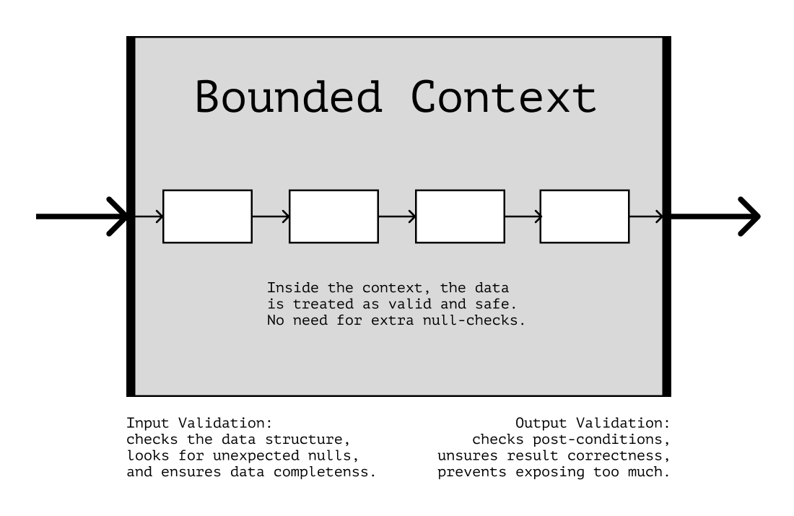

## Functional Pipeline

In user applications, one of such levels describes the business logic—the domain processes that make the application
unique and gain profit. Those, in other words, are the problems that business wants the developers to solve.

Business logic speaks in the language of the domain. It describes workflows as sequences of events and consequences:
“When a user inputs a discount coupon, the application checks its validity and reduces the order price.”

Functional pipeline, which we’ll discuss in this chapter, helps to describe business workflows in code more precisely
and closer to reality.

`
For an online store, the business logic would be creating orders and checking out. For transport company—route and traffic load optimization.
`

### Data Transformations

Business workflows are data transformations. For example, applying a discount to an order can be expressed as a
transition from one data state to another:

```
“Selecting Product Recommendations”:

[Product Cart] + [Shopping History] ->
[Product Categories] + [Recommendation Weights] ->
[Recommendation List]
```

In poorly organized code, business workflows don’t resemble such chains. They are complicated, non-obvious, and often
don’t speak the language of the domain. As a result, instead of a clear workflow description, we end up with something
like:

```
“Selecting Product Recommendations”:

[Product Cart] + ... + [Magic 🔮] -> [Recommendation List]
```

In *well-organized* code, the workflows look linear, and the data in them go through several steps one at a time.

This kind of code organization is called a _functional pipeline_.

---

### Data States

The suggestion is to represent the workflow steps as separate functions. We can use this idea as a basis for
refactoring.

To do this, we first need to highlight all the stages that data passes through. These stages will help us understand how
to divide the workflow and what should consider in the code.

```javascript
function makeOrder(user, products, coupon) {
    if (!user || !products.length) throw new InvalidOrderDataError();
    const data = {
        createdAt: Date.now(),
        products,
        total: totalPrice(products),
        discount: selectDiscount(data, coupon),
    };

    if (!selectDiscount(data, coupon)) data.discount = 0;
    if (data.total >= 2000 && isPromoParticipant(user)) {
        data.products.push(FREE_PRODUCT_OF_THE_DAY);
    }

    data.id = generateId();
    data.user = user.id;
    return data;
}
```

The function isn’t big, but it does quite a lot:

- It validates the input data;
- Creates an order object;
- Applies a discount from the passed coupon;
- Adds promo products under certain conditions.

Let’s highlight the workflow steps and data states that appear in them:

```
“Show order in UI”:

- “Validate Input Data”:
  [Raw Unvalidated Input] -> [Validated User] + [Validated Product List]

- “Create Order”:
  [User] + [Product List] -> [Created Order]

- “Apply Discount Coupon”:
  [Order] + [Coupon] -> [Discounted Order]

- “Apply Promo”:
  [Order] + [User] -> [Order with Promo Products]
```

We aim to make the function code look like this list during refactoring. We can start by grouping the code into
“sections,” each of which will represent a different workflow step:

```javascript
function makeOrder(user, products, coupon) {
    // Validate Input:
    if (!user || !products.length) throw new InvalidOrderDataError();

    // Create Order:
    const data = {
        createdAt: Date.now(),
        products,
        total: totalPrice(products),
    };
    data.id = generateId();
    data.user = user.id;

    // Apply Discount:
    const discount = selectDiscount(data, coupon);
    data.discount = discount ?? 0;

    // Apply Promos:
    if (data.total >= 2000 && isPromoParticipant(user)) {
        data.products.push(FREE_PRODUCT_OF_THE_DAY);
    }

    return data;
}
```

Grouping the steps will help find abstraction problems in the code: if we can think of a meaningful name for a step, we
can probably extract its code into a function. In the example above, the comments with the step names fully reflect
their intent. Let’s extract the steps into separate functions:

```javascript
// Create Order:
function createOrder(user, products) {
    return {
        id: generateId(),
        createdAt: Date.now(),
        user: user.id,

        products,
        total: totalPrice(products),
    };
}

// Apply Discount:
function applyCoupon(order, coupon) {
    const discount = selectDiscount(order, coupon) ?? 0;
    return {...order, discount};
}

// Apply Promos:
function applyPromo(order, user) {
    if (!isPromoParticipant(user) || order.total < 2000) return order;

    const products = [...order.products, FREE_PRODUCT_OF_THE_DAY];
    return {...order, products};
}
```

```javascript
function makeOrder(user, products, coupon) {
    if (!user || !products.length) throw new InvalidOrderDataError();

    const created = createOrder(user, products);
    const withDiscount = applyCoupon(created, coupon);
    const order = applyPromo(withDiscount, user);

    return order;
}
```

The `makeOrder` function doesn’t change data uncontrollably anymore but only calls those functions. It makes invalid
orders less likely and the testing of data transformations easier.

The code of `makeOrder` now resembles the list of workflow steps we’ve started with. The details of each step are hidden
behind the name of the corresponding function. The name describes the entire step, which makes the code easier to read.

Also, when adding a new step to the workflow, we now only have to insert a new function in the right place. The other
conversions remain unchanged:

```javascript
function makeOrder(user, products, coupon, shipDate) {
    if (!user || !products.length) throw new InvalidOrderDataError();

    const created = createOrder(user, products);
    const withDiscount = applyCoupon(created, coupon);
    const withPromo = applyPromo(withDiscount, user);
    const order = addShipment(withPromo, shipDate); // New workflow step.

    return order;
}
```

---

### Data Validation

The functional pipeline relies on linear code execution.
Steps within a workflow execute one after the other and pass data down through the chain of transformations/

For this idea to work, data within the workflow must be safe and not break the pipeline.
However, we can't guarantee that any "external" data is safe.
So in the code, we want to separate zones where data can be trusted and where it can't.

_Business workflows ideally should become “islands” where the data is verified and secure._

DDD has an analog for such islands — _bounded contexts_. Simply put, a bounded context is a set of functions that refer
to some part of an application.

According to DDD, validating data is more convenient at the boundaries of context, for example, at the context input.
In this case, "inside" the context, we don't need additional checks because the data is already validated and safe.


_All validation occurs at the boundaries; the data inside the context is considered valid and safe_

We can use this rule in our code to get rid of unnecessary data checks at runtime.
By validating the data at the beginning of the workflow, we can assume later that it meets to our requirements.

Then, for example in the CardProducts component, instead of ad hoc checks for the existence of products ant their
properties inside the render function:

```jsx

function CartProducts({items}) {
    return (
        !!items && (
            <ul>
                {items.map((item) =>
                    item ? <li key={item.id}>{item.name ?? "—"}</li> : null
                )}
            </ul>
        )
    );
}
```

We would check the data once at the beginning of the workflow:

```javascript
function validateCart(cart) {
    if (!exists(cart)) return [];
    if (hasInvalidItem(cart)) return [];

    return cart;
}

// ...

const validCart = validateCart(serverCart);
```

And later would use it without any additional checks:

```jsx
function CartProducts({items}) {
    return (
        <ul>
            {items.map((item) => (
                <li key={item.id}>{item.name}</li>
            ))}
        </ul>
    );
}
```

#### Missing States

Often input validation helps us discover data states we did not notice earlier.
For example, the code of CardProducts component in the previous snippet has become simpler, and the flaws in it have
become easier to spot:

```jsx
// If we render a valid but empty cart,
// the component will render an empty list:

const validEmptyCart = [];
<CartProducts items={validEmptyCart}/>;

// Results in <ul></ul>
```

The "Empty cart" state is valid but represents and edge case. Together with input validation, the functional pipeline
makes such cases more noticeable because the fall out of "regular" code execution.
And the more prominent the edge cases are, the sooner we can detect and handle them:

```jsx
// To fix the problem with the empty list, we can split
// the “Empty cart” and “Cart with products” states
// into different components:

const EmptyCart = () => <p>The cart is empty</p>;
const CartProducts = ({items}) => {
};

// Then, when rendering, we can first handle all the edge cases,
// and then proceed to Happy Path:

function Cart({serverCart}) {
    const cart = validateCart(serverCart);

    if (isEmpty(cart)) return <EmptyCart/>;
    return <CartProducts items={cart}/>;
}
```

Such edge case handling, as in the `Cart` component, helps us detect more potential edge cases in the earlier stages of
development.
Considering these edge cases makes the program more reliable and accurate in describing the business workflows.

---

### Data Mapping and Selectors

We might need the same data for different purposes. For example, the UI may render a shopping cart differently
depending.

The functional pipeline suggests "preparing" data for such situations in advance. For example, we might want to select
the required fragments from the original data in advance, transform some data sets into others or even merge several
data sets in one.

Data selectors help to decouple modules that use similar but slightly different data.
For example, let's look at the CartProducts component, which renders a shopping cart:

```jsx
function CartProducts({serverCart}) {
    return (
        <ul>
            {serverCart.map((item) => (
                <li key={item.id}>
                    {item.product.name}: {item.product.price} × {item.count}
                </li>
            ))}
        </ul>
    );
}
```

Right now, it relies on the cart data structure, which comes from the server.
If the structure changes, we'll have to change the component too:

```jsx
// If products start to arrive separately, we'll have to search
// for a particular product during the rendering.

function CartProducts({serverCart, serverProducts}) {
    return (
        <ul>
            {serverCart.map((item) => {
                const product = serverProducts.find(
                    (product) => item.productId === product.id
                );

                return (
                    <li key={item.id}>
                        {product.name}:{product.price} × {item.count}
                    </li>
                );
            })}
        </ul>
    );
}
```

Data selectors can help us decouple the server response and the data structure we use for rendering.

```js
// The `toClientCart` function “converts” the data into a structure,
// which the application components will use.

function toClientCart(cart, products) {
    return cart.map(({productId, ...item}) => {
        const product = products.find(({id}) => productId === id);
        return {...item, product};
    });
}
```

Then, we will convert the data using this function before rendering the component:

```jsx
const serverCart = await fetchCart(userId);
const cart = toClientCart(serverCart, serverProducts);

// ...

<CartProducts items={cart}/>
```

The component then will rely on the data structure that is defined by us, not a third-party:

```jsx
function CartProducts({items}) {
    return (
        <ul>
            {items.map(({id, count, product}) => (
                <li key={id}>
                    {product.name} {product.price} × {count}
                </li>
            ))}
        </ul>
    );
}
```

So if the API response changes, we won’t need to update all the components that use that data. We would only need to
update the selector function.

It's also convenient to use selectors if the UI has different representations for the same data.
For example, in addition to the cart, the store can have a list of all available products with some of them marked as "
In Cart".

To render such a list, we can reuse already existing data but "prepare" them in a slightly different way:

in a slightly different way:

```js
// We use the existing server data,
// but create a different structure:

function toClientShowcase(products, cart) {
    return products.map((product) => ({
        ...product,
        inCart: cart.some(({productId}) => productId === product.id),
    }));
}
```

The `Showcase` component doesn’t need to know anything about the server response. It only works with the selector’s
result:

```js
function Showcase({items}) {
    return (
        <ul>
            {items.map(({product, inCart}) => {
                <li key={product.id}>
                    {product.name}
                    <input type="checkbox" checked={inCart} disabled/>
                </li>;
            })}
        </ul>
    );
}
```

This approach helps to separate the responsibility between the code:
components only care about the render, and selectors "convert" the data.

Components become less coupled to the rest of the code because they rely on structures we fully control.
It makes it easier, for example to replace once component with another if we need to update the UI.

Testing data transformations becomes easier because any selector is a regular function.
We don't need a complex infrastructure to test it. Testing transformations within a component, for example, would
require it's rendering.

We have more control over the data we want (or don't want) to include in the selector's result.
We can keep only the fields that a particular component uses and filter out everything else.

It's usually best to apply selection right after the data is validated. At that point, we already know that the data is
safe, but don't rely on its structure anywhere in the code yet.
This gives us the ability to convert the data for a particular task.

```
The data in this example goes through the chain of states: “Raw Server Data” → “Valid Data” → “Prepared for a Task” → “Displayed in the UI.”

Functional pipeline helps to describe any task as a similar chain. It makes the decomposition easier because chains help build a clear mental model of the workflow we express in code.
```