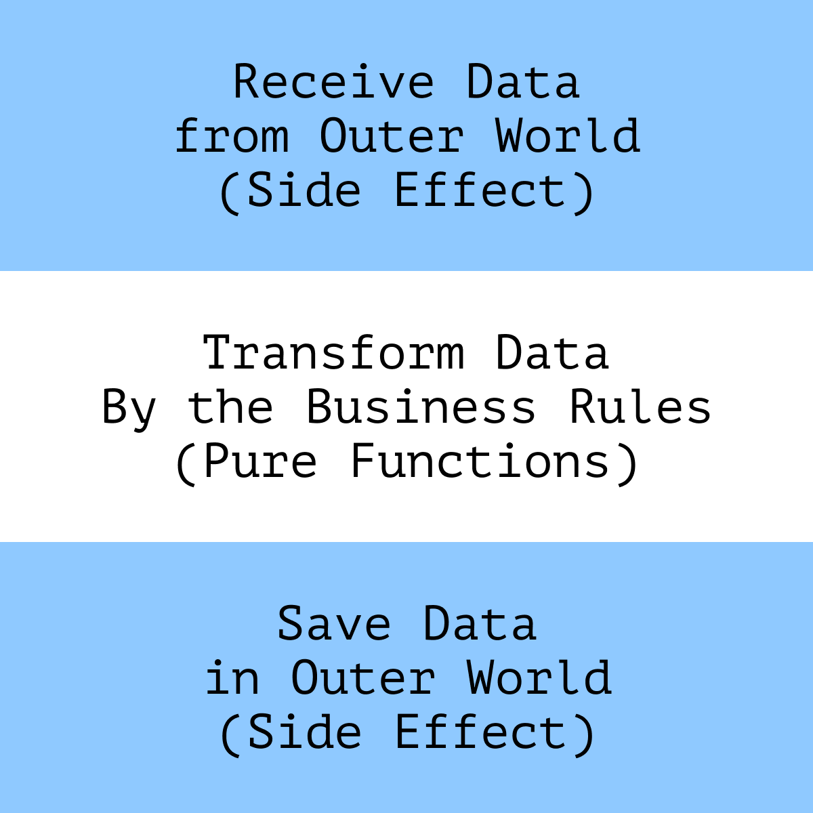

## Side Effects

### Functional Core in Imperative Shell

Immutability and pure functions are nice, but as we mentioned, we can’t create a helpful app without any effects.
Interactions with the outside world—receiving and saving data or rendering it in the UI—are always effects. Without
these interactions, the application is useless.

Since the problem with effects is that they’re unpredictable, our main concern with them is to:

> ********************
> **Minimize the number of effects and isolate them from other code**
> ********************

There’s a technique for managing effects called the _functional core in an imperative shell_ or _Impureim Sandwich_.
Using
this approach, we describe the application logic as pure functions and “push” all interaction with the outside world to
the edges of the application.



_An “impureim sandwich”: impure effect for reading the data, pure logic, impure effect for saving the data_

The `updateUserInfo` function mixes transforming data with saving and reading it in the DOM.

```js
function updateUserInfo(event) {
    const {email, birthYear, password} = event.target;
    const root = document.querySelector(".userInfo");

    root.querySelector(".age").innerText = new Date().getFullYear() - birthYear;
    root.querySelector(".password").innerText = password.replace(/./g, "*");
    root.querySelector(".login").innerText = email.slice(
        0,
        email.lastIndexOf("@")
    );
}
```

Let’s try to separate logic from effects. First, we can do this right inside the function by grouping the code into
“sections”:

```javascript
function updateUserInfo(event) {
    // Read data:
    const {email, birthYear, password} = event.target;

    // Transform data:
    const age = new Date().getFullYear() - birthYear;
    const username = email.slice(0, email.lastIndexOf("@"));
    const hiddenPassword = password.replace(/./g, "*");

    // “Save” data, in our case, render it in the UI:
    const root = document.querySelector(".userInfo");
    root.querySelector(".age").innerText = age;
    root.querySelector(".password").innerText = hiddenPassword;
    root.querySelector(".login").innerText = username;
}
```

Then we can extract the data transformation into a separate function. It would know nothing about reading and saving
data and would only deal with the logic of transformation:

```javascript
    const toPublicAccount = ({email, birthYear, password, currentYear}) => {
    return {
        age: currentYear - birthYear,
        username: email.slice(0, email.lastIndexOf("@")),
        hiddenPassword: password.replace(/./g, "*")
    }
}
```

Then we can use the `toPublicAccount` function inside `updateUserInfo` like this:

```javascript
    export const updateUserInfo
(event)
{
    // Read data: 
    const {email, birthYear, password} = event.targer;
    const currentYear = new Date.getFullYear();

    // Transform:
    const {age, username, hiddenPassword} = toPublicAccount({
        email,
        birthYear,
        password,
        currentYear,
    });

    // Save: 
    const root = document.querySelector('.userInfo');
    root.querySelector(".age").innerText = age;
    root.querySelector(".password").innerText = hiddenPassword;
    root.querySelector(".login").innerText = username;
}
```

To check if the code gotten better, we can try and write tests for data transformation logic. In the first version of
code, the test would look like this

```javascript
// 1. In the case of `updateUserInfo`,
//    we need to create mocks for DOM and Event:
const dom = jsdom(/*...*/);
const event = {
    target: {
        email: "test@test.com",
        password: "strong-password-1234",
        birthYear: 1994,
    },
};
// We also need to mock the current date,
// so that the test results are reproducible:
jest.useFakeTimers().setSystemTime(new Date("2022-01-01"));

// Mocks and timers need to be reset after each test,
// so not to affect other tests:
afterAll(() => jest.useRealTimers());

describe("when given a user info object", () => {
    it("should calculate the user age", () => {
        updateUserInfo(event);

        // The result is checked by the DOM-node contents:
        const node = dom.document.querySelector(".userInfo .age");

        // It loses the data type
        // because DOM nodes contain only strings:
        expect(node.innerText).toEqual("28");
    });
});
```

In first case, the `updateUserInfo` handles different tasks:
transforming data and interacting with the UI. Its tests confirm this - they check how the data has changed and use DOM
mocks.

If another similar function appears in its tests, we’ll have to mock the DOM again to check for changes in the data. It
should become a concern because there’s obvious duplication with no additional benefits.

The test is much easier in the second case because we don't need to create mocks.
We only need the input data and the expected result to test pure functions.
(This is why it’s often said that pure functions are intrinsically testable.)

Interacting with DOM becomes a separate tasks. The mocks for the DOM will appear in the tests for the module that deals
with UI interactions and nowhere else.

After refactoring, we can see that the task of the updateUserInfo function has turned into a “composition” of other
functions’ functionality. It now brings together reading data, transforming it, and saving it in storage.

### Commands and Queries

* Some effects only read information and don’t change the state of the world.
* Other effects change (add, update, and delete) the state.

The principle that divides the code responsible for these tasks is called _Command-Query Separation (CQS)_.

According to CQS, _queries_ only return data and don’t change the state, while _commands_ change the state and return
nothing. The purpose of CQS is to:

*Keep reading and changing data separate*

Mixing commands and queries makes the code complicated and unsafe.
It's difficult to predict the result of a function if it can change the data during its call.
For this reason, when refactoring, whe should pay attention to the effects that violate CQS.

For example, let’s look at the signature of the `getLogEntry` function:

```typescript
function getLogEntry(id: Id<LogEntry>): LogEntry {
}
```

From the types, we can assume that this function somehow gets data from the logs. It can become a surprise if, in the
implementation, we see:

```typescript
function getLogEntry(id: Id<LogEntry>): LogEntry {
    const entry =
        logger.getById(id) ?? logger.createEntry(id, Date.now(), "Access");

    return entry;
}
```

_The problem with the function is its unpredictability._
Also, unpredictable effects are much harder to test
It will require quite a lot of mocks, so we can assume that function does "too much".

And finally, creation and reading data are conceptually different operations. Their reasons to change are different, so
they better be kept separate.

Let’s split this function into two:

```typescript
function readLogEntry(id: Id<LogEntry>): MaybeNull<LogEntry> {
}

function createLogEntry(id: Id<LogEntry>): void {
}
```

```typescript
function readLogEntry(id: Id<LogEntry>): MaybeNull<LogEntry> {
    return logger.getById(id) ?? null;
}

function createLogEntry(id: Id<LogEntry>): void {
    logger.createEntry(id, Date.now(), "Access");
}
```

The code has become more predictable because the function signature no longer deceives us. On the contrary, it now helps
us predict behavior before considering the implementation.The tests for both functions now are independent.

#### CQRS

Speaking of the backend, it’s worth mentioning the CRUD operations and CQRS. When designing an API, we may want to use
the same data types for reading and writing data:

```typescript
type UserModel = {
    id: Id<User>;
    name: FullName;
    birthDate: DateTime;
    role: UserRole;
};

function readUser(id: Id<User>): UserModel {
}

function updateUser(user: UserModel): void {
}
```

In most cases, such a solution is sufficient and will not cause problems. However, it can become a problem if we read
and write data differently. For example, if we want to update the user data only partially.

If a project encounters such a problem, the Command-Query Responsibility Segregation, CQRS might help. This principle
extends the idea of CQS by suggesting using different types (also called “models”) for reading and writing data.

Independent models make it explicit what data to provide when writing and what data to expect when reading. For example,
we can describe the ReadUserModel type as a set of mandatory fields that are guaranteed to exist in the data when
reading:

```typescript
type ReadUserModel = {
    id: Id<User>;
    name: FullName;
    birthDate: DateTime;
    role: UserRole;
};
```

For updates, we can use a different type:

```typescript
type UpdateUserModel = {
    // ID is mandatory to make it clear,
    // which user's data to update:
    id: Id<User>;

    // Everything else is optional,
    // to update only what we need:
    name?: FullName;
    birthDate?: DateTime;

    // The role, for example, cannot be updated at all,
    // that is why this field doesn't exist here.
};
```