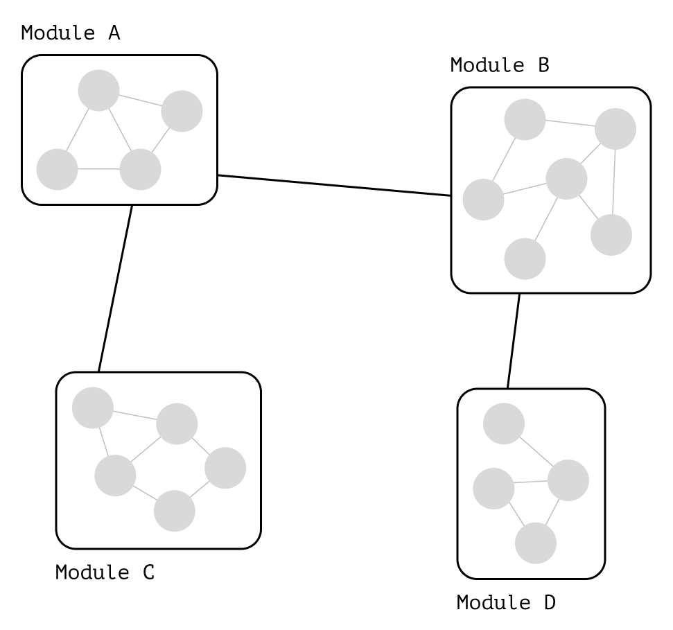

## Module integration

The first and foremost thing we should check when analyzing the interaction of modules during refactoring is the
integration rule:

> ********************
> **Low coupling and high cohesion**
> Зацепление должно быть низким, а связность — высокой
> ********************

Program composed to this rule looks like islands connected by the bridges of public API,messages, events.



### Coupling and Cohesion

#### Task decomposition

The `purchase` module is heavily coupled with `cart` module.
It uses internal details of the cart object.
(object structure and `products` field type)

```typescript
// purchase.ts
const makePurchase = async (user, cart) => {
    if (!cart.products.length) {
        throw new Error('Cart is empty')
    }

    const order = createOrder(user, cart);
    await sendOrder();
}
```

The problem in this code is the encapsulation violation.
The `purchase` module _doesn't and shouldn't_ to know how to check is cart empty properly.

The details of checking the cart aren’t part of the “making a purchase” task.
The fact if cart is empty or not important to it, but it doesn't matter how that _fact_ is determined.
Implementing validation is task of `cart` module because it's the one that creates that object and knows how to keep it
valid.

```typescript
// carts.ts

export const isCartEmpty = (cart) => {
    return !cart.products.length
}

// purchase.ts
const makePurchase = async (cart, user) => {
    if (isCartEmpty(cart)) {
        throw new Error('cart is empty')
    }

    const order = createOrder(user, cart);
    await sendOrder();
}

```

Now if internal structure of `cart` module will change for some reason, the changes will be limited to the cart module.

```typescript
// cart.ts
type Cart = {
    // Was 'products' became 'items'
    items: ProductList;
}

export function isEmpty(cart) {
    // The only place that requires updates:
    return !cart.items.length;
}

// purchase.ts
const makePurchase = async (cart, user) => {
    if (isCartEmpty(cart)) {
        throw new Error('cart is empty')
    }
    // Other places in the code stay intact.
    // We've limited the changes propagation.
}
```

Modules that use the `isEmptyCart` function from public API, will remain unchanged.
If modules were to use the cart's internal structure directly, they would all be updated when property change.

#### Search for Cohesion

It's often not clear whether a task belong to a specific module or not.
To determine it, we can look at the data the module or function uses.

The "data" is the _input and output parameters_, and the _dependencies and context_ that module uses.
The more data of one module is different from data of other module, the more likely they relate to different tasks.
If, for example, a function often works with data from neighboring module, it most likely should be a part of that
module.

> ********************
> **We may know this problem as the Feature Envy code smell. **
> ********************
>

Let's imagine refactoring a finance management application that can track user expenses.
Suppose we see code like this in the module responsible for the budget:

```js
// budget.js

// Create a new budget: 

function createBudget(amount, days) {
    const daily = Math.floor(amount / days);
    return {amount, days, daily};
}

// Calculates how much was spent in total:
function totalSpent(history) {
    return history.reduce((tally, record) => tally + record.amount, 0);
}

// Adds a new expense, decreasing the current money amount
// and adding a new spending record in the history:
function addSpending(record, {budget, history}) {
    const newBudget = {...budget, amount: budget.amount - record.amount};
    const newHistory = [...history, record];

    return {
        budget: newBudget,
        history: newHistory,
    };
}
```

The `budget` module responsible for data transformation of the budget.
However, we see functions that don't work only with it:

- The `totalSpent` function doesn't work with budget, but it works with history.
- The `addSpending` function works with the budget, but also works with history.

From the data that these functions work with, we can conclude that they aren't so much about budget.
`totalSpent` more related to history,
while addSpending is more like an “Add Spending” use case functionality.( больше похожа на целый пользовательский
сценарий приложения.)

Let's try to break up the code.

```js
// budget.js
// Here's only the code realted to the budget:

const createBudget = (amount, days) => {
    const daily = Math.floor(amount / days);

    return {amount, days, daily};
}

const decreaseBy = (budget, record) => {
    const updated = budget.amount - recordl.amount;
    return {...budget, amount: updated};
}

// history.ts
// Here's only the code related to the expense history:

const totalSpent = (history) => {
    return history.reduce((tally, record) => tally + record.amount, 0);
}

const appendRecord = (history, record) => {
    return [...history, record];
}

// addSpending.js
// Here's the "Add spending" use case:
// - decrese the budget amount,
// - add the new history record.

const addSpending = (spending, appState) => {
    const budget = decreaseBy(state.budget, spending);
    const history = appendRecord(state.history, soending);

    return {budget, history}
}
```

---

### Contracts