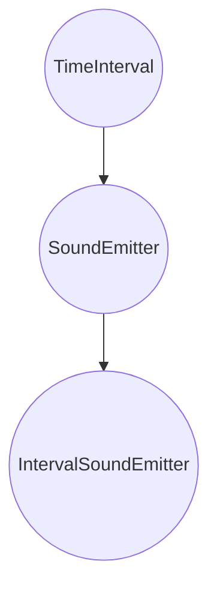
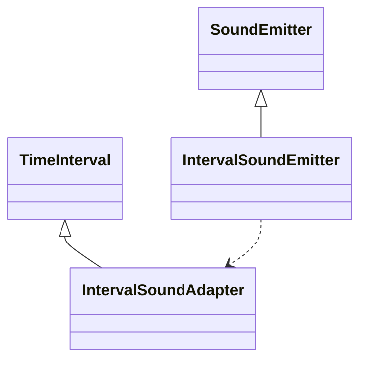
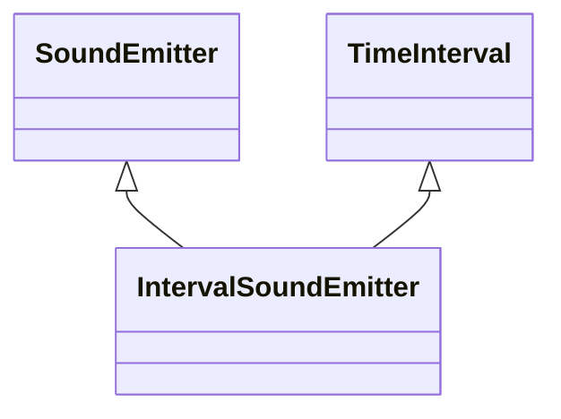

# [Принцип разделения интерфейса](https://solidbook.vercel.app/isp)

**Сущности не должны зависеть от интерфейсов, которые они не используют**

Когда принцип нарушается, модули подвержены **всем** изменениям в интерфейсах, от которых они зависят.
Это приводит к высокой связанности модулей друг с другом.

Допустим, требуется сделать программу, которая будет играть определенную ноту каждые несколько секунд.
В наивном подходе с наследованием нам придется построить нечто подобное 


Проблема в том, что класс `SoundEmitter` является потомком класса `TimeInterval`, хотя они друг с другом не связаны.
Отсюда и возникает "необходимость" тащить ненужный код всем потомкам класса `TimeInterval`

ISP предлагает два подхода для решения этой проблемы с помощью разделения интерфейсов: через делегирование и через множественное наследование

## Разделение через делегирование 
Этот подход подразумевает использование шаблона проектирования под названием Адаптер

Мы не будет связывать `SoundEmitter` и `TimeInterval` непосредственно друг с другом.
Мы будем связывать их через дополнительный слой (адаптер), который будет транслировать сообщения от одной сущности другой.



## Разделение через множественное наследование

Второй вариант предполагает, что `IntervalSoundEmitter` будет наследоваться одновременно от `TimeInterval` и от `SoundEmitter` 



# В идеальном мире

В идеально спроектированной системе сущности зависят только от тех интерфейсов, функциональность которых реализуют. Чаще всего это приводит к дроблению интерфейсов на меньшие. Рассмотрим на примерах.

## «Пустая» реализация

Допустим, у нас есть класс `Programmer`

```ts
interface Programmer {
    writeCode(): void;
    eatPizza(slicesCount: number): void;
}

class RegularProgrammer implements Programmer {
    constructor() {/*...*/}
    writeCode(): void {/*...*/}
    eatPizza(slicesCount: number): void {/*...*/}
}
```

Через какое-то время компания нанимает фрилансеров, которые пиццу не едят.
Если мы будем использовать тот же интерфейс, то класс `Freelancer` должен реализовать `eatPizza`, но этот метод ему не нужен, и это будет пустой реализацией интерфейса.

## Разделение интерфейса

Мы можем избежать проблемы, если разделим интерфейс `Programmer`. Мы можем разделить его на две роли `CodeProducer` и `PizzaConsumer`.

```ts
interface CodeProducer {
    writeCode(): void;
}

interface PizzaConsumer {
    eatPizze(slicesCount: number): void;
}
```

Теперь и `RegularProgrammer` и `Freelancer` будут реализовывать только те интерфейсы, которые им действительно нужны:


```ts
class RegularProgrammer implements CodeProducer, PizzaConsumer {
  constructor() {/*...*/}
  writeCode(): void {/*...*/}
  eatPizza(slicesCount: number): void {/*...*/}
}

class Freelancer implements CodeProducer {
  constructor() {/*...*/}
  writeCode(): void {/*...*/}
  // Метод `eatPizza` уже не нужен.
}
```

ISP можно представлять как принцип единой ответственности (SRP) для интерфейсов. 
Дробление интерфейсов действительно заставляет делить ответственность между ними.

Если мы применяем ISP, получаем больше интерфейсов с меньшим количеством методов в каждом. 
Если мы применяем SRP, получаем больше модулей с меньшим количество методов в каждом. 
Применение обоих принципов разом заставляет делать контракты между модулями проще, что снижает вероятность нарушения принципа подстановки Лисков (LSP).

# В реальной жизни

ISP можно рассматривать как SRP для интерфейсов.
Его главная задача - помочь спроектировать интерфейсы так, чтобы в них не было ничего лишнего.
Принцип помогает выявлять более высокие абстракции и находить неочевидные связи между сущностями.


В приложении есть возможность записывать траты и доходы. Разработчики использовали ISP, чтобы сделать работу с этими двумя сущностями более удобной.

Сперва в приложении были только траты, поэтому в истории хранились только объекты типа `Spend`.

```ts
interface Spend {
  amount: number
  date: Timestamp
  type: 'helpful' | 'harmful' | null
}

type History = Spend[]
```
Когда в приложении добавились доходы, в истории стали храниться не только траты. 
У трат и доходов были общие поля, поэтому было логично вынести их в общий интерфейс `Record`, а интерфейс траты расширить от него:


```ts
type RecordTypes = 'spend' | 'income'
type SpendTypes = 'helpful' | 'harmful' | null

// Общие поля описаны в общем интерфейсе.
// ISP помогает выявить скрытые связи
// между сущностями и зависимости в их поведении:

interface Record {
  amount: number
  date: Timestamp
  is: RecordTypes

  // Поля `type` здесь уже нет,
  // для доходов оно не нужно.
}

// Интерфейс траты расширяет интерфейс записи:

interface Spend extends Record {
  type: SpendTypes
}
```

Траты и доходы стали реализовать эти интерфейсы так, чтобы базовая запись описывала общее поведение, а трата и доход — только специфичное для них:

```ts
class RecordItem implements Record {
  amount: number
  date: Timestamp
  is: RecordTypes

  constructor(amount: number) {
    this.amount = amount
    this.date = Date.now()
  }
}

class SpendItem extends RecordItem implements Spend {
  type: SpendTypes

  constructor(amount: number, type: SpendTypes = null) {
    super(amount)
    this.is = 'spend'
    this.type = type
  }
}

class IncomeItem extends RecordItem {
  constructor(amount: number) {
    super(amount)
    this.is = 'income'
  }
}
```

## Уведомления в Задачнике

Для напоминания о подходящих сроках задачи в Задачнике используются уведомления. Уведомления бывают разных типов: push, SMS и почтовые.

Согласно ISP, общие для всех типов поля и методы разработчики хранят в общем интерфейсе `Message`:

```ts
interface Message {
  title: string
  body: string
  send(to: string[]): void
}
```

Детали же — описывают конкретно под каждый тип уведомлений:

```ts
interface SmsMessage extends Message {
  smsService: SmsService
  // ...
}

interface PushMessage extends Message {
  pushService: PushService
  // ...
}

interface EmailMessage extends Message {
  emailService: EmailService
  // ...
}
```

# Шаблоны проектирования и приёмы рефакторинга

## Адаптер

Адаптер - шаблон проектирования, который позволяет объектам с несовместимыми интерфейсами работать вместе.

С точки зрения ISP этот шаблон помогает держать интерфейсы чистыми и понятными, а при необходимости совместить несовместимые модули через специальную прослойку (адаптер).

Приложение Курсовик показывает курс доллара к рублю. Оно берёт данные курсов с сайта банка. Банк отдаёт их в формате XML, а приложение работает с JSON

Адаптер помогает подружить модули, которые работают с XML, и модули, которые работают с JSON.

```ts
const ApiClient = {
    async getXml(url: string): Promise<XmlString> {
        const response = await fetch(url);
        const data = await resposne.text();
        return data;
    }
}

const xmlJSonAdapter = (xml: XmlString): JsonString => {
    // Конвертируем xml в json:  
    return json
}

const parseCourse = (data: JsonString): CourseDict => {
    // ...
    return course
}

(async () => {
    const data = await ApiClient.getXml('api_endpoint')
    const course = parseCourse(xmlJsonAdapter(data))
})()
```

Также адаптер помогает справляться со «сломанным» API от бекенда и преобразованием одних структур данных в другие.

Из минусов можно назвать:
* добавление ещё одной абстракции в кодовую базу проекта;
* при создании нового адаптера нужно найти все места, где требуется его использовать.

## Множественное наследование

Множественное наследование используется, например, чтобы реализовать функциональность нескольких интерфейсов:

```ts
class Horse implements Animal, Transport {
    
}
```
В TypeScript такое наследование реализуется через миксины.
```ts
function applyMixins(derivedCtor: any, baseCtors: any[]) {
  baseCtors.forEach(baseCtor => {
    Object.getOwnPropertyNames(baseCtor.prototype).forEach(name => {
      Object.defineProperty(derivedCtor.prototype, name, Object.getOwnPropertyDescriptor(baseCtor.prototype, name))
    })
  })
}
```
Чтобы пример с классом Horse выше сработал, нам необходимо использовать applyMixins следующим образом:
```ts
applyMixins(Horse, [Animal, Transport])
```


